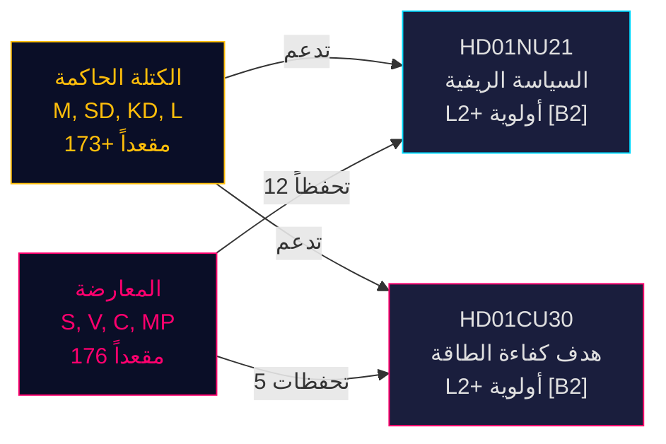

---
title: "إعادة هيكلة السياسة الريفية السويدية وإعادة توجيه كفاءة الطاقة: تقريران للجنة يشيران إلى سباق تشريعي قبل الانتخابات"
date: 2026-05-13
author: James Pether Sörling
classification: PUBLIC
confidence: HIGH [B2]
pass: 2
article_type: committee-reports
subfolder: committeeReports
---

# إعادة هيكلة السياسة الريفية السويدية وإعادة توجيه كفاءة الطاقة: تقريران للجنة يشيران إلى سباق تشريعي قبل الانتخابات

**الخلاصة**: في 12 مايو 2026، تلقى البرلمان السويدي (Riksdag) betänkandanين ذوي أهمية سياسية عالية: Betänkande 2025/26:NU21 بشأن السياسة الريفية الشاملة (prop. 2025/26:158) و Betänkande 2025/26:CU30 بشأن هدف جديد لكفاءة الطاقة يحل محل الهدف الكمي لعام 2030 (prop. 2025/26:159). يكشف كلا التقريرين أن الكتلة الحاكمة (M, SD, KD, L) تمضي قدماً في برنامجها التشريعي قبل الانتخابات في مواجهة معارضة مستمرة (S, V, C, MP) تقدم تحفظات متعددة النقاط لكنها تفتقر إلى الأرقام البرلمانية اللازمة لعرقلة المقترحات. تقرير الطاقة مؤثر بشكل خاص: تتخلى السويد عن هدف كمي لكفاءة الطاقة بنسبة 50٪ لصالح هدف نوعي يستوعب صراحةً توسيع الطاقة النووية والكهربة — تحول جذري في حوكمة الطاقة قبيل انتخابات سبتمبر 2026.

## القرارات الرئيسية المدعومة

1. **التصويت على HD01NU21**: من المرجح أن يتبنى Riksdagen مع تحفظات من S, V, C, MP — تملك الائتلاف الحاكم الأغلبية
2. **التصويت على HD01CU30**: سيتم إقرار الهدف النوعي الجديد لكفاءة الطاقة؛ المعارضة الحادة من S/V/MP تشير إلى موضوع حملة انتخابية قوي
3. **ديناميكيات الانتخابات في سبتمبر 2026**: السياسة الريفية والتحول الطاقوي كلاهما موضوع تعبئة من الدرجة الأولى لجميع الأحزاب الكبرى

## نقاط استخباراتية في 60 ثانية

- **HD01NU21** ينفذ تعديلاً قانونياً على Lagen om regionalt utvecklingsansvar (2010:630): يجب على المناطق التشاور مع منظمات المجتمع المدني ومؤسسات التعليم العالي الخاصة؛ وافق Lagrådet دون اعتراضات؛ تاريخ النفاذ TBC
- **HD01CU30** يستبدل هدف كفاءة الطاقة السويدي البالغ 50٪ بحلول 2030 بهدف نوعي يؤكد على المرونة والقدرة على تحمل التكاليف والكهربة والاستيعاب النووي؛ ينفذ توجيه EU EPBD المُعاد صياغته عبر تعديلات على Lagen (2006:985) om energideklaration för byggnader و Plan- och bygglagen (2010:900)
- **كتلة المعارضة** (S, V, MP) قدمت 12 تحفظاً على NU21 و5 تحفظات على CU30 — كثافة عالية من التحفظات تشير إلى خلاف برنامجي عميق
- **مضاعف ما قبل الانتخابات نشط** (≤ 6 أشهر حتى سبتمبر 2026): درجات DIW تصاعدت بمقدار 1.5×؛ كلا التقريرين في الأولوية L2+
- **Andreas Lennkvist Manriquez (V)** يترأس CU مع التصويت ضد هدف الطاقة الحكومي — إشارة متناقضة مؤسسياً؛ إجراءات اللجنة صالحة رسمياً وفق القواعد البرلمانية

## المحفز الأمامي الرئيسي

**يوم التصويت على CU30** (~أواخر مايو 2026): إذا حافظت SD, M, KD, L على الانضباط الائتلافي يُقرّ الهدف النوعي للطاقة — لكن إن انشق حزب ما (لا سيما KD أو L تحت ضغط تأطير الطاقة النووية)، يكون التأخير الإجرائي محتملاً. مراقبة المنسقين الحزبيين.

## تقييم الثقة

**HIGH [B2]** — استناداً إلى الوثائق الأولية لـ Riksdag (dok_id HD01NU21, HD01CU30)، واقتباس مباشر من نص اللجنة، وتوزيع المقاعد البرلمانية المعروف (أغلبية Tidökoalitionen)، وyttrande لـ Lagrådet (لا اعتراضات على NU21)، والسياق الاقتصادي الكلي IMF WEO أبريل 2026.

<!-- source-sha: 024711d152b3357ca699b043a50b4b7600683400 -->
