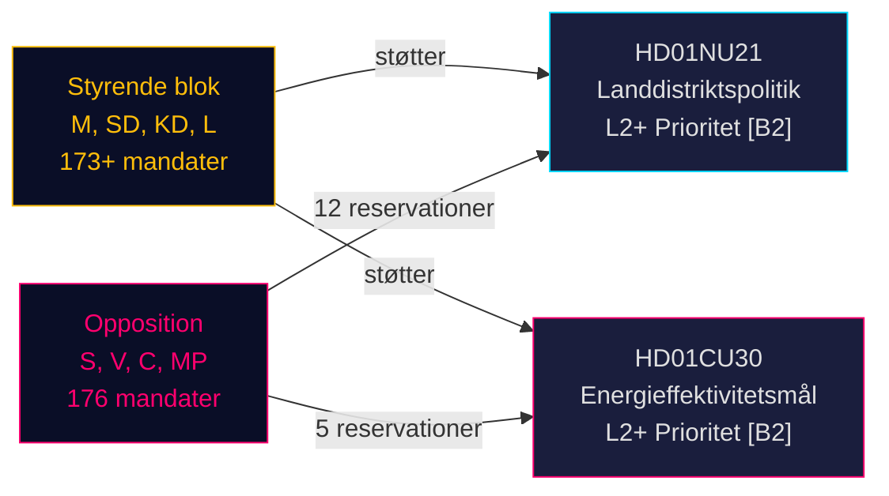

# Sveriges landdistrikts-politiske omlægning og energieffektivitetsomkalibrering: To udvalgsrapporter signalerer lovgivningssprint forud for valget

**BLUF**: Den 12. maj 2026 modtog Sveriges Riksdag to politisk vigtige betänkanden: Betänkande 2025/26:NU21 om omfattende landdistriktspolitik (prop. 2025/26:158) og Betänkande 2025/26:CU30 om et nyt energieffektivitetsmål, der afløser det kvantitative 2030-mål (prop. 2025/26:159). Begge rapporter afslører, at det styrende blok (M, SD, KD, L) fremrykker sit valgprogramme mod en vedholdende opposition (S, V, C, MP), der indgiver flerepunktsreservationer men mangler parlamentarisk flertal til at blokere forslagene. Energirapporten er særlig betydningsfuld: Sverige opgiver et 50% kvantitativt energieffektivitetsmål til fordel for et kvalitativt mål, der eksplicit rummer kernekraftudvidelse og elektrificering — et seismisk skift i energistyring inden valget i september 2026.

## Understøttede nøglebeslutninger

1. **Afstemning om HD01NU21**: Riksdagen ventes at vedtage med reservation fra S, V, C, MP — den styrende koalition har flertal
2. **Afstemning om HD01CU30**: Nyt kvalitativt energieffektivitetsmål vil blive vedtaget; skarp S/V/MP-opposition signalerer et stærkt valgkampstema
3. **Valgdynamik september 2026**: Landdistriktspolitik og energiomstilling er begge topprioritet-mobiliseringsspørgsmål for alle store partier

## 60-sekunders efterretningspunkter

- **HD01NU21** gennemfører lovændring i Lagen om regionalt utvecklingsansvar (2010:630): regioner skal høre civilsamfundsorganisationer og private videregående uddannelsesinstitutioner; Lagrådet godkendte uden indvendinger; ikrafttrædelsesdato TBC
- **HD01CU30** erstatter Sveriges 50%-energieffektivitetsmål for 2030 med et kvalitativt mål, der betoner fleksibilitet, overkommelighed, elektrificering og kernekraftaccommodering; gennemfører EU's EPBD-genbehandlede direktiv via ændringer i Lagen (2006:985) om energideklaration för byggnader og Plan- och bygglagen (2010:900)
- **Oppositionsblokken** (S, V, MP) indgav 12 reservationer på NU21 og 5 reservationer på CU30 — høj reservationstæthed signalerer dyb programmatisk uenighed
- **Forvalgsmultiplikator aktiv** (≤ 6 måneder til september 2026): DIW-scorer eskaleret med 1,5×; begge rapporter er L2+-prioritet
- **Andreas Lennkvist Manriquez (V)** leder CU, mens han stemmer imod regeringens energimål — institutionelt paradokst signal; udvalgets procedure er formelt gyldig i henhold til parlamentariske regler

## Vigtigste fremadrettede udløser

**CU30-afstemningsdag** (~slutningen af maj 2026): Hvis SD, M, KD, L opretholder koalitionsdisciplin, vedtages det kvalitative energimål — men hvis et parti defekterer (særligt KD eller L under pres om kernekraftsframing), er en proceduremæssig forsinkelse mulig. Overvåg partipisker.

## Konfidensvurdering

**HIGH [B2]** — baseret på primære Riksdag-dokumenter (dok_id HD01NU21, HD01CU30), direkte citat fra udvalgtekst, kendt parlamentarisk mandatfordeling (Tidökoalitionens flertal), Lagrådets yttrande (ingen indvendinger til NU21) og IMF WEO april 2026 makroøkonomisk kontekst.

<!-- source-sha: 024711d152b3357ca699b043a50b4b7600683400 -->
