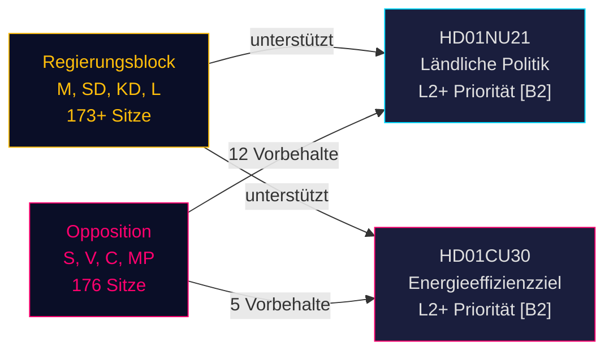

# Schwedens Umgestaltung der ländlichen Politik und Neuausrichtung der Energieeffizienz: Zwei Ausschussberichte signalisieren Gesetzgebungssprint vor der Wahl

**BLUF**: Am 12. Mai 2026 erhielt Schwedens Riksdag zwei politisch bedeutende Betänkanden: Betänkande 2025/26:NU21 zur umfassenden ländlichen Politik (prop. 2025/26:158) und Betänkande 2025/26:CU30 zu einem neuen Energieeffizienzziel, das das quantitative 2030-Ziel ersetzt (prop. 2025/26:159). Beide Berichte zeigen, dass der regierende Block (M, SD, KD, L) sein Vorwahlgesetzgebungsprogramm gegen eine anhaltende Opposition (S, V, C, MP) vorantreibt, die Mehrpunkte-Vorbehalte einlegt, aber die parlamentarische Arithmetik fehlt, um die Vorschläge zu blockieren. Der Energiebericht ist besonders folgenreich: Schweden gibt ein quantitatives Energieeffizienzziel von 50% zugunsten eines qualitativen Ziels auf, das Kernkraftausbau und Elektrifizierung explizit berücksichtigt — ein tektonischer Wandel in der Energiesteuerung vor der Wahl im September 2026.

## Unterstützte Schlüsselentscheidungen

1. **Abstimmung über HD01NU21**: Riksdagen wird voraussichtlich mit Vorbehalt von S, V, C, MP verabschiedet — die regierende Koalition hat die Mehrheit
2. **Abstimmung über HD01CU30**: Neues qualitatives Energieeffizienzziel wird verabschiedet; scharfe S/V/MP-Opposition signalisiert ein starkes Wahlkampfthema
3. **Wahldynamik September 2026**: Ländliche Politik und Energiewende sind für alle großen Parteien erstrangige Mobilisierungsthemen

## 60-Sekunden-Geheimdienstpunkte

- **HD01NU21** setzt Gesetzesänderung in Lagen om regionalt utvecklingsansvar (2010:630) um: Regionen müssen Zivilgesellschaftsorganisationen und private Hochschulen konsultieren; Lagrådet genehmigte ohne Einwände; Inkrafttretungsdatum TBC
- **HD01CU30** ersetzt Schwedens 50%-Energieeffizienzziel bis 2030 durch ein qualitatives Ziel, das Flexibilität, Erschwinglichkeit, Elektrifizierung und Kernkraftkompatibilität betont; setzt EU-EPBD-Neubearbeitung durch Änderungen an Lagen (2006:985) om energideklaration för byggnader und Plan- och bygglagen (2010:900) um
- **Oppositionsblock** (S, V, MP) legte 12 Vorbehalte bei NU21 und 5 Vorbehalte bei CU30 ein — hohe Vorbehaltsdichte signalisiert tiefe programmatische Meinungsverschiedenheit
- **Vorwahl-Multiplikator aktiv** (≤ 6 Monate bis September 2026): DIW-Punkte um 1,5× eskaliert; beide Berichte sind L2+-Priorität
- **Andreas Lennkvist Manriquez (V)** leitet CU und stimmt gleichzeitig gegen das Energieziel der Regierung — institutionell paradoxes Signal; das Ausschussverfahren ist nach parlamentarischen Regeln formal gültig

## Wichtigster Vorwärts-Auslöser

**CU30-Abstimmungstag** (~Ende Mai 2026): Wenn SD, M, KD, L Koalitionsdisziplin wahren, wird das qualitative Energieziel verabschiedet — falls jedoch eine Partei abtrünnig wird (insbesondere KD oder L unter Kernkraft-Framingdruck), ist eine Verfahrensverzögerung möglich. Parteibeauftragten beobachten.

## Konfidenzbewertung

**HIGH [B2]** — basiert auf primären Riksdag-Dokumenten (dok_id HD01NU21, HD01CU30), direktem Zitat aus dem Ausschusstext, bekannter parlamentarischer Mandatsverteilung (Mehrheit der Tidökoalition), Lagrådets yttrande (keine Einwände zu NU21) und IMF WEO April 2026 makroökonomischer Kontext.

<!-- source-sha: 024711d152b3357ca699b043a50b4b7600683400 -->
