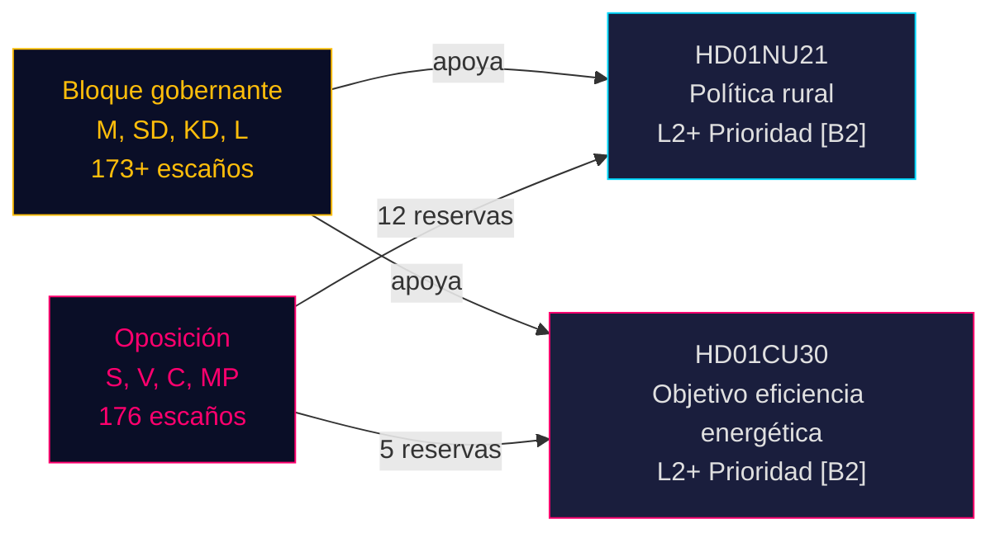

# Revisión de la política rural sueca y reorientación de la eficiencia energética: Dos informes de comité señalan un sprint legislativo preelectoral

**BLUF**: El 12 de mayo de 2026, el Riksdag sueco recibió dos betänkanden de alta relevancia política: el Betänkande 2025/26:NU21 sobre política rural integral (prop. 2025/26:158) y el Betänkande 2025/26:CU30 sobre un nuevo objetivo de eficiencia energética que reemplaza el objetivo cuantitativo de 2030 (prop. 2025/26:159). Ambos informes revelan que el bloque gobernante (M, SD, KD, L) avanza su programa legislativo preelectoral contra una oposición persistente (S, V, C, MP) que presenta reservas multipunto pero carece de la aritmética parlamentaria para bloquear las propuestas. El informe energético es especialmente trascendente: Suecia abandona un objetivo cuantitativo de eficiencia energética del 50% en favor de un objetivo cualitativo que acomoda explícitamente la expansión nuclear y la electrificación — un cambio sísmico en la gobernanza energética antes de las elecciones de septiembre de 2026.

## Decisiones clave respaldadas

1. **Votación sobre HD01NU21**: Es probable que el Riksdagen adopte con reserva de S, V, C, MP — la coalición gobernante tiene mayoría
2. **Votación sobre HD01CU30**: El nuevo objetivo cualitativo de eficiencia energética será aprobado; la fuerte oposición de S/V/MP señala un tema de campaña significativo
3. **Dinámica electoral septiembre 2026**: La política rural y la transición energética son ambas temas de movilización de primer nivel para todos los partidos principales

## Puntos de inteligencia en 60 segundos

- **HD01NU21** implementa cambio legislativo en la Lagen om regionalt utvecklingsansvar (2010:630): las regiones deben consultar a organizaciones de la sociedad civil e instituciones privadas de educación superior; Lagrådet aprobó sin objeciones; fecha de entrada en vigor TBC
- **HD01CU30** reemplaza el objetivo sueco de eficiencia energética del 50% para 2030 con un objetivo cualitativo que enfatiza flexibilidad, asequibilidad, electrificación y acomodación nuclear; implementa la directiva EPBD revisada de la UE mediante enmiendas a la Lagen (2006:985) om energideklaration för byggnader y la Plan- och bygglagen (2010:900)
- **Bloque de oposición** (S, V, MP) presentó 12 reservas sobre NU21 y 5 reservas sobre CU30 — alta densidad de reservas señala profundo desacuerdo programático
- **Multiplicador preelectoral activo** (≤ 6 meses hasta septiembre de 2026): puntuaciones DIW escaladas 1,5×; ambos informes son prioridad L2+
- **Andreas Lennkvist Manriquez (V)** preside la CU mientras vota en contra del objetivo energético del gobierno — señal institucionalmente paradójica; el procedimiento del comité es formalmente válido según las reglas parlamentarias

## Principal desencadenante prospectivo

**Día de votación de CU30** (~finales de mayo de 2026): Si SD, M, KD, L mantienen la disciplina de coalición, el objetivo energético cualitativo es aprobado — pero si algún partido deserta (especialmente KD o L bajo presión de encuadre nuclear), es posible un retraso procedimental. Vigilar los coordinadores de partido.

## Evaluación de confianza

**HIGH [B2]** — basado en documentos primarios del Riksdag (dok_id HD01NU21, HD01CU30), cita directa del texto del comité, distribución conocida de mandatos parlamentarios (mayoría de la Tidökoalitionen), yttrande del Lagrådet (sin objeciones sobre NU21) y contexto macroeconómico IMF WEO abril de 2026.

<!-- source-sha: 024711d152b3357ca699b043a50b4b7600683400 -->
