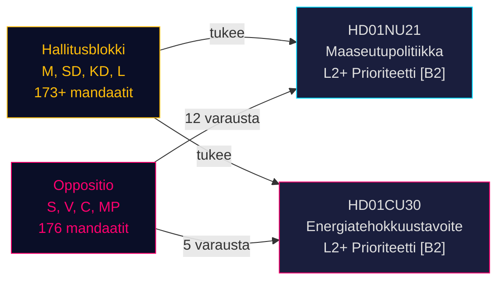

# Ruotsin maaseutupolitiikan uudistus ja energiatehokkuuden uudelleensuuntaus: Kaksi valiokuntaraporttia merkitsee esivaalilakiesityssprint

**BLUF**: Ruotsin Riksdag vastaanotti 12. toukokuuta 2026 kaksi poliittisesti merkittävää betänkandea: Betänkande 2025/26:NU21 kattavasta maaseutupolitiikasta (prop. 2025/26:158) ja Betänkande 2025/26:CU30 uudesta energiatehokkuustavoitteesta, joka korvaa kvantitatiivisen 2030-tavoitteen (prop. 2025/26:159). Molemmat raportit paljastavat, että hallitusblokki (M, SD, KD, L) edistää esivaaliohjelmaansa vahvaa oppositiota (S, V, C, MP) vastaan, joka tekee monipisteiset varaumat mutta joilta puuttuu parlamentaarinen enemmistö estää esitykset. Energiaraportti on erityisen merkittävä: Ruotsi luopuu 50%:n kvantitatiivisesta energiatehokkuustavoitteesta laadullisen tavoitteen hyväksi, joka nimenomaisesti sallii ydinvoimakapasiteetin laajentamisen ja sähköistymisen — maanjäristyksenomainen muutos energiahallinnossa ennen syyskuun 2026 vaaleja.

## Tuetut avainpäätökset

1. **Äänestys HD01NU21:stä**: Riksdagen hyväksyy todennäköisesti varauksilla S, V, C, MP:ltä — hallituskoalitiolla on enemmistö
2. **Äänestys HD01CU30:stä**: Uusi laadullinen energiatehokkuustavoite hyväksytään; terävä S/V/MP-vastustus merkitsee voimakasta vaalikampanjateemaa
3. **Vaaliajan dynamiikka syyskuussa 2026**: Maaseutupolitiikka ja energiasiirtymä ovat molemmille kaikille suurille puolueille huipputason mobilisaatiokysymyksiä

## 60 sekunnin tiedustelupisteet

- **HD01NU21** toteuttaa lakimuutoksen Lagen om regionalt utvecklingsansvar (2010:630): alueiden on kuultava kansalaisyhteiskunnan järjestöjä ja yksityisiä korkeakouluja; Lagrådet hyväksyi ilman huomautuksia; voimaantulopäivä TBC
- **HD01CU30** korvaa Ruotsin 50% energiatehokkuustavoitteen vuoteen 2030 laadullisella tavoitteella, joka korostaa joustavuutta, kohtuuhintaisuutta, sähköistymistä ja ydinvoimamahdollisuutta; toteuttaa EU:n uudistetun EPBD-direktiivin muutosten kautta Lagen (2006:985) om energideklaration för byggnader ja Plan- och bygglagen (2010:900)
- **Oppositioblokki** (S, V, MP) teki 12 varausta NU21:een ja 5 varausta CU30:een — korkea varaumatiheys merkitsee syvää ohjelmalista erimielisyyttä
- **Esivaalimultiplier aktiivinen** (≤ 6 kuukautta syyskuuhun 2026): DIW-pisteet eskaloitu 1,5-kertaiseksi; molemmat raportit ovat L2+-prioriteetti
- **Andreas Lennkvist Manriquez (V)** johtaa CU:ta äänestäen hallituksen energiatavoitetta vastaan — institutionaalisesti paradoksaalinen signaali; valiokunnan menettely on muodollisesti pätevä parlamentaaristen sääntöjen mukaisesti

## Tärkein tulevaisuuden laukaisija

**CU30:n äänestyspäivä** (~toukokuun loppu 2026): Jos SD, M, KD, L ylläpitävät koalitiokuria, laadullinen energiatavoite hyväksytään — mutta jos jokin puolue luopuu (erityisesti KD tai L ydinvoimakehystämispaineen alaisena), menettelyllinen viive on mahdollinen. Seuraa puoluepisteitä.

## Luottamuksellisuusarvio

**HIGH [B2]** — perustuu ensisijaisiin Riksdag-asiakirjoihin (dok_id HD01NU21, HD01CU30), suoraan lainaukseen valiokuntien teksteistä, tunnettuun parlamentaariseen mandaattijakaumaan (Tidökoalitionin enemmistö), Lagrådets yttranden (ei huomautuksia NU21:een) ja IMF WEO huhtikuu 2026 makrotaloudelliseen kontekstiin.

<!-- source-sha: 024711d152b3357ca699b043a50b4b7600683400 -->
