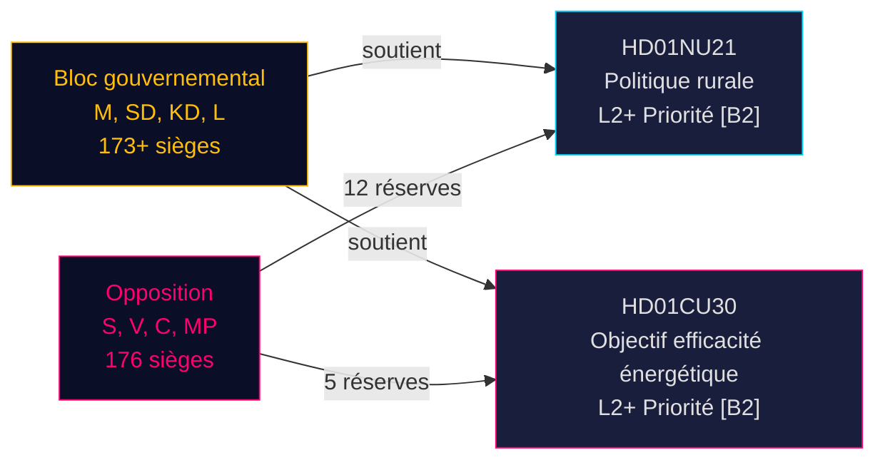

# Refonte de la politique rurale suédoise et réorientation de l'efficacité énergétique : Deux rapports de commission signalent un sprint législatif pré-électoral

**BLUF** : Le 12 mai 2026, le Riksdag suédois a reçu deux betänkanden d'importance politique majeure : le Betänkande 2025/26:NU21 sur la politique rurale globale (prop. 2025/26:158) et le Betänkande 2025/26:CU30 sur un nouvel objectif d'efficacité énergétique remplaçant l'objectif quantitatif 2030 (prop. 2025/26:159). Les deux rapports révèlent un bloc gouvernemental (M, SD, KD, L) faisant avancer son programme législatif pré-électoral contre une opposition persistante (S, V, C, MP) qui dépose des réserves à points multiples mais manque de l'arithmétique parlementaire pour bloquer les propositions. Le rapport sur l'énergie est particulièrement conséquent : la Suède abandonne un objectif quantitatif d'efficacité énergétique de 50% au profit d'un objectif qualitatif qui accommode explicitement l'expansion nucléaire et l'électrification — un changement sismique dans la gouvernance énergétique avant les élections de septembre 2026.

## Décisions clés soutenues

1. **Vote sur HD01NU21** : Le Riksdagen devrait adopter avec réserve de S, V, C, MP — la coalition au pouvoir dispose de la majorité
2. **Vote sur HD01CU30** : Le nouvel objectif qualitatif d'efficacité énergétique sera adopté ; la vive opposition S/V/MP signale un thème de campagne fort
3. **Dynamique électorale septembre 2026** : La politique rurale et la transition énergétique sont toutes deux des enjeux de mobilisation de premier plan pour tous les grands partis

## Points de renseignement en 60 secondes

- **HD01NU21** met en œuvre une modification législative de la Lagen om regionalt utvecklingsansvar (2010:630) : les régions doivent consulter les organisations de la société civile et les établissements d'enseignement supérieur privés ; Lagrådet a approuvé sans objections ; date d'entrée en vigueur TBC
- **HD01CU30** remplace l'objectif suédois d'efficacité énergétique de 50% d'ici 2030 par un objectif qualitatif soulignant la flexibilité, l'accessibilité financière, l'électrification et l'accommodation nucléaire ; met en œuvre la directive EPBD refondue de l'UE par des modifications à la Lagen (2006:985) om energideklaration för byggnader et la Plan- och bygglagen (2010:900)
- **Le bloc d'opposition** (S, V, MP) a déposé 12 réserves sur NU21 et 5 réserves sur CU30 — haute densité de réserves signalant un désaccord programmatique profond
- **Multiplicateur pré-électoral actif** (≤ 6 mois jusqu'en septembre 2026) : scores DIW escaladés de 1,5× ; les deux rapports sont de priorité L2+
- **Andreas Lennkvist Manriquez (V)** préside la CU tout en votant contre l'objectif énergétique du gouvernement — signal institutionnellement paradoxal ; la procédure du comité est formellement valide selon les règles parlementaires

## Principal déclencheur prospectif

**Jour du vote CU30** (~fin mai 2026) : Si SD, M, KD, L maintiennent la discipline de coalition, l'objectif énergétique qualitatif est adopté — mais si un parti fait défection (en particulier KD ou L sous pression de cadrage nucléaire), un retard procédural est possible. Surveiller les chefs de groupe.

## Évaluation de la confiance

**HIGH [B2]** — basé sur les documents primaires du Riksdag (dok_id HD01NU21, HD01CU30), citation directe du texte de commission, répartition connue des mandats parlementaires (majorité de la Tidökoalitionen), yttrande du Lagrådet (pas d'objections sur NU21) et contexte macroéconomique IMF WEO avril 2026.

<!-- source-sha: 024711d152b3357ca699b043a50b4b7600683400 -->
