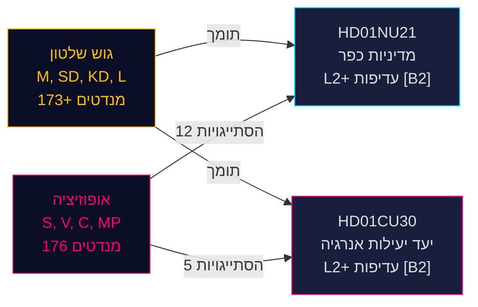

---
title: "שיפוץ מדיניות הכפר השוודית וכיוון מחדש של יעילות האנרגיה: שני דוחות ועדה מסמנים ספרינט חקיקתי לקראת הבחירות"
date: 2026-05-13
author: James Pether Sörling
classification: PUBLIC
confidence: HIGH [B2]
pass: 2
article_type: committee-reports
subfolder: committeeReports
---

# שיפוץ מדיניות הכפר השוודית וכיוון מחדש של יעילות האנרגיה: שני דוחות ועדה מסמנים ספרינט חקיקתי לקראת הבחירות

**תמצית**: ב-12 במאי 2026, קיבל הפרלמנט השוודי (Riksdag) שני betänkanden בעלי משמעות פוליטית גבוהה: Betänkande 2025/26:NU21 בנושא מדיניות כפר מקיפה (prop. 2025/26:158) ו-Betänkande 2025/26:CU30 בנושא יעד חדש ליעילות אנרגיה שמחליף את היעד הכמותי ל-2030 (prop. 2025/26:159). שני הדוחות מגלים שגוש השלטון (M, SD, KD, L) מקדם את תכנית החקיקה הפרה-בחירותית שלו מול אופוזיציה מתמשכת (S, V, C, MP) המגישה הסתייגויות רב-נקודתיות אך חסרה את האריתמטיקה הפרלמנטרית לחסימת ההצעות. דוח האנרגיה מעורר השלכות מיוחדות: שוודיה נוטשת יעד כמותי של 50% ליעילות אנרגיה לטובת יעד איכותי המאפשר במפורש הרחבה גרעינית ואלקטריפיקציה — שינוי סייסמי בממשל האנרגיה לקראת בחירות ספטמבר 2026.

## החלטות מפתח נתמכות

1. **הצבעה על HD01NU21**: סביר שה-Riksdagen יאמץ עם הסתייגות מ-S, V, C, MP — לקואליציה השלטת יש רוב
2. **הצבעה על HD01CU30**: יעד יעילות אנרגיה איכותי חדש יאושר; אופוזיציה חדה מ-S/V/MP מסמנת נושא קמפיין בחירות חזק
3. **דינמיקות בחירות ספטמבר 2026**: מדיניות כפר ומעבר אנרגיה הם שניהם נושאי גיוס ברמה עליונה עבור כל המפלגות הגדולות

## נקודות מודיעין ב-60 שניות

- **HD01NU21** מיישם שינוי חוקי ב-Lagen om regionalt utvecklingsansvar (2010:630): אזורים חייבים להתייעץ עם ארגוני החברה האזרחית ומוסדות השכלה גבוהה פרטיים; Lagrådet אישר ללא הסתייגויות; תאריך כניסה לתוקף TBC
- **HD01CU30** מחליף את יעד יעילות האנרגיה השוודי של 50% עד 2030 ביעד איכותי המדגיש גמישות, נגישות כלכלית, אלקטריפיקציה ואירוח גרעיני; מיישם את ההנחיה המעודכנת EPBD של האיחוד האירופי באמצעות תיקונים ל-Lagen (2006:985) om energideklaration för byggnader ו-Plan- och bygglagen (2010:900)
- **גוש האופוזיציה** (S, V, MP) הגיש 12 הסתייגויות על NU21 ו-5 הסתייגויות על CU30 — צפיפות הסתייגויות גבוהה מסמנת מחלוקת תכנית עמוקה
- **מכפיל פרה-בחירות פעיל** (≤ 6 חודשים עד ספטמבר 2026): ציוני DIW הוסלמו פי 1.5; שני הדוחות הם עדיפות L2+
- **Andreas Lennkvist Manriquez (V)** מוביל את CU תוך הצבעה נגד יעד האנרגיה של הממשלה — אות מוסדי פרדוקסלי; הליך הוועדה תקף פורמלית לפי כללים פרלמנטריים

## הטריגר העתידי המרכזי

**יום הצבעת CU30** (~סוף מאי 2026): אם SD, M, KD, L שומרות על משמעת קואליציה, היעד האיכותי לאנרגיה עובר — אך אם מפלגה כלשהי עוזבת (במיוחד KD או L תחת לחץ ניסוח גרעיני), עיכוב פרוצדורלי אפשרי. לעקוב אחר מפקחי מפלגות.

## הערכת ביטחון

**HIGH [B2]** — מבוסס על מסמכים ראשיים של Riksdag (dok_id HD01NU21, HD01CU30), ציטוט ישיר מטקסט הוועדה, התפלגות מנדטים פרלמנטרית ידועה (רוב ה-Tidökoalitionen), yttrande של Lagrådet (אין הסתייגויות ל-NU21) והקשר מאקרו-כלכלי IMF WEO אפריל 2026.

<!-- source-sha: 024711d152b3357ca699b043a50b4b7600683400 -->
