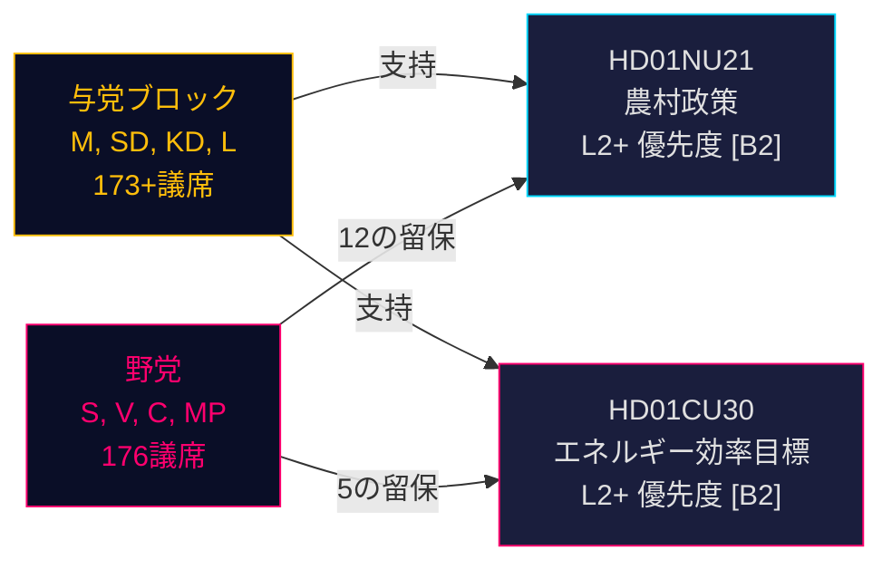

# スウェーデンの農村政策改革とエネルギー効率の再方向付け：2つの委員会報告が選挙前の立法スプリントを示す

**要約**: 2026年5月12日、スウェーデンのRiksdagは政治的に重要な2つのbetänkandanを受理した：農村政策に関する包括的なBetänkande 2025/26:NU21（prop. 2025/26:158）と、2030年の定量的目標に代わる新たなエネルギー効率目標に関するBetänkande 2025/26:CU30（prop. 2025/26:159）である。両報告書は、与党ブロック（M, SD, KD, L）が複数の留保事項を提出しながらも議会で阻止するだけの多数派を持たない野党（S, V, C, MP）に対し、選挙前の立法プログラムを推進していることを示している。エネルギー報告書は特に重大だ：スウェーデンは50%の定量的エネルギー効率目標を放棄し、核エネルギーの拡大と電化を明示的に受け入れる定性的目標を採用する——2026年9月の選挙を前にしたエネルギーガバナンスにおける地殻変動的な転換だ。

## 支持された主要決定

1. **HD01NU21の採決**: RiksdagenはS、V、C、MPの留保付きで採択見込み——与党連合が多数派を占める
2. **HD01CU30の採決**: 新たな定性的エネルギー効率目標が可決される見込み；S/V/MPの鋭い反対は強力な選挙キャンペーンテーマを示す
3. **2026年9月選挙の力学**: 農村政策とエネルギー転換はいずれも全主要政党にとって最優先の動員テーマ

## 60秒のインテリジェンスポイント

- **HD01NU21** はLagen om regionalt utvecklingsansvar（2010:630）の法改正を実施：地域は市民社会組織および私立高等教育機関と協議する必要がある；Lagrådは異議なく承認；施行日はTBC
- **HD01CU30** はスウェーデンの2030年エネルギー効率50%目標を、柔軟性・手頃な価格・電化・核エネルギー受容を強調した定性的目標に置き換える；Lagen（2006:985）om energideklaration för byggnaderおよびPlan- och bygglagen（2010:900）の改正を通じてEU EPBD改定指令を実施
- **野党ブロック**（S, V, MP）はNU21に12の留保、CU30に5の留保を提出——高い留保密度は深い政策的意見の相違を示す
- **選挙前乗数が有効**（2026年9月まで≤6か月）：DIWスコアが1.5倍に上昇；両報告書はL2+優先レベル
- **Andreas Lennkvist Manriquez（V）** は政府のエネルギー目標に反対票を投じながらCUを率いる——制度的に逆説的なシグナル；委員会手続きは議会規則上形式的に有効

## 主要な先行トリガー

**CU30の採決日**（2026年5月下旬頃）：SD、M、KD、Lが連立の規律を維持すれば定性的エネルギー目標が可決される——しかし何らかの党が離脱した場合（特に核エネルギーのフレーミング圧力下でKDまたはL）、手続き上の遅延が起きる可能性がある。党のホイップを監視すること。

## 信頼度評価

**HIGH [B2]** — 一次Riksdag文書（dok_id HD01NU21, HD01CU30）、委員会テキストからの直接引用、既知の議会議席配分（Tidökoalitionenの過半数）、Lagrådets yttrande（NU21に異議なし）、およびIMF WEO 2026年4月のマクロ経済的文脈に基づく。

<!-- source-sha: 024711d152b3357ca699b043a50b4b7600683400 -->
