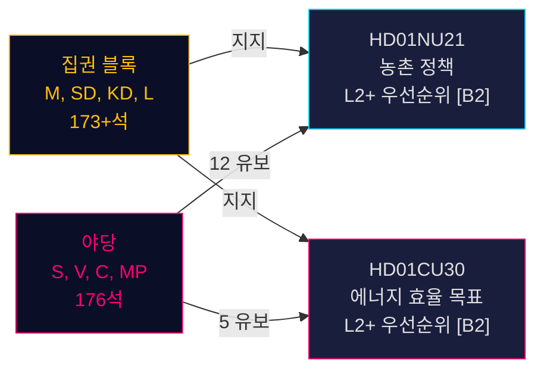

# 스웨덴 농촌 정책 개혁과 에너지 효율 재방향: 두 위원회 보고서가 선거 전 입법 스프린트 신호

**요약**: 2026년 5월 12일, 스웨덴 Riksdag는 정치적으로 중요한 두 개의 betänkandan을 접수했다: 농촌 정책에 관한 포괄적 Betänkande 2025/26:NU21(prop. 2025/26:158)과 2030년 정량적 목표를 대체하는 새로운 에너지 효율 목표에 관한 Betänkande 2025/26:CU30(prop. 2025/26:159). 두 보고서는 집권 블록(M, SD, KD, L)이 다점 유보를 제출하지만 제안을 막을 의회 과반수가 없는 야당(S, V, C, MP)에 맞서 선거 전 입법 프로그램을 밀어붙이고 있음을 보여준다. 에너지 보고서는 특히 중대하다: 스웨덴은 50% 정량적 에너지 효율 목표를 포기하고 원전 확대와 전기화를 명시적으로 수용하는 정성적 목표를 채택한다 — 2026년 9월 선거를 앞두고 에너지 거버넌스에서의 지각 변동적 전환.

## 지지된 핵심 결정

1. **HD01NU21 표결**: Riksdagen이 S, V, C, MP의 유보와 함께 채택할 가능성 높음 — 집권 연립이 과반수 보유
2. **HD01CU30 표결**: 새로운 정성적 에너지 효율 목표 통과; 날카로운 S/V/MP 반대는 강력한 선거 캠페인 이슈를 시사
3. **2026년 9월 선거 역학**: 농촌 정책과 에너지 전환은 모든 주요 정당에게 최우선 동원 이슈

## 60초 인텔리전스 포인트

- **HD01NU21**은 Lagen om regionalt utvecklingsansvar(2010:630) 법 개정 시행: 지역은 시민사회 단체 및 사립 고등교육기관과 협의해야 함; Lagrådet 이의 없이 승인; 시행일 TBC
- **HD01CU30**은 스웨덴의 2030년 50% 에너지 효율 목표를 유연성, 저렴성, 전기화 및 원전 수용을 강조하는 정성적 목표로 대체; Lagen(2006:985) om energideklaration för byggnader 및 Plan- och bygglagen(2010:900) 개정을 통해 EU EPBD 개정 지침 시행
- **야당 블록**(S, V, MP)은 NU21에 12개, CU30에 5개 유보 제출 — 높은 유보 밀도는 깊은 정책적 불일치 시사
- **선거 전 승수 활성화**(2026년 9월까지 ≤6개월): DIW 점수 1.5배 상승; 두 보고서 모두 L2+ 우선순위
- **Andreas Lennkvist Manriquez(V)**는 정부 에너지 목표에 반대표를 던지면서 CU를 이끔 — 제도적으로 역설적 신호; 위원회 절차는 의회 규칙상 형식적으로 유효

## 주요 미래 촉발 요인

**CU30 표결일**(2026년 5월 말경): SD, M, KD, L이 연립 규율을 유지하면 정성적 에너지 목표 통과 — 하지만 어느 당이 이탈할 경우(특히 원전 프레이밍 압박 하의 KD 또는 L), 절차적 지연 가능. 정당 원내총무 모니터링.

## 신뢰도 평가

**HIGH [B2]** — 1차 Riksdag 문서(dok_id HD01NU21, HD01CU30), 위원회 텍스트에서의 직접 인용, 알려진 의회 의석 배분(Tidökoalitionen 과반수), Lagrådets yttrande(NU21 이의 없음), 그리고 IMF WEO 2026년 4월 거시경제 맥락에 기반.

<!-- source-sha: 024711d152b3357ca699b043a50b4b7600683400 -->
