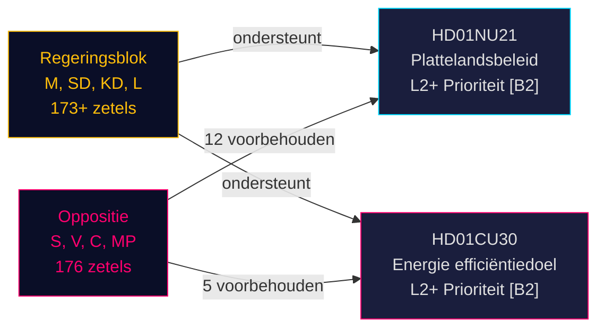

# Herziening van het Zweedse plattelandsbeleid en heroriëntatie energieëfficiëntie: Twee commissierapporten signaleren wetgevingssprint voor de verkiezingen

**BLUF**: Op 12 mei 2026 ontving het Zweedse Riksdag twee politiek significante betänkanden: Betänkande 2025/26:NU21 over uitgebreid plattelandsbeleid (prop. 2025/26:158) en Betänkande 2025/26:CU30 over een nieuw energieëfficiëntiedoel ter vervanging van het kwantitatieve 2030-doel (prop. 2025/26:159). Beide rapporten onthullen een regeringsblok (M, SD, KD, L) dat zijn pre-electorale wetgevingsprogramma voortdrijft tegen een aanhoudende oppositie (S, V, C, MP) die meerpuntsvoorbehouden indient maar de parlementaire rekenkunde mist om de voorstellen te blokkeren. Het energierapport is bijzonder verstrekkend: Zweden verlaat een kwantitatief energieëfficiëntiedoel van 50% ten gunste van een kwalitatief doel dat kernenergie-uitbreiding en elektrificatie expliciet accommodeert — een seismische verschuiving in energiegovernance voor de verkiezingen van september 2026.

## Ondersteunde kernbeslissingen

1. **Stemming over HD01NU21**: Riksdagen zal naar verwachting aannemen met voorbehoud van S, V, C, MP — de regerende coalitie heeft de meerderheid
2. **Stemming over HD01CU30**: Nieuw kwalitatief energieëfficiëntiedoel wordt aangenomen; scherpe S/V/MP-oppositie signaleert een sterk verkiezingsthema
3. **Verkiezingsdynamiek september 2026**: Plattelandsbeleid en energietransitie zijn beide topprioriteit mobilisatiethema's voor alle grote partijen

## 60-seconden inlichtingenpunten

- **HD01NU21** implementeert wetswijziging in Lagen om regionalt utvecklingsansvar (2010:630): regio's moeten maatschappelijke organisaties en private hogeronderwijsinstellingen raadplegen; Lagrådet keurde goed zonder bezwaren; inwerkingtreding datum TBC
- **HD01CU30** vervangt Zweden's 50%-energieëfficiëntiedoel voor 2030 door een kwalitatief doel met nadruk op flexibiliteit, betaalbaarheid, elektrificatie en kernenergieaccommodatie; implementeert herschreven EU EPBD-richtlijn via wijzigingen aan Lagen (2006:985) om energideklaration för byggnader en Plan- och bygglagen (2010:900)
- **Oppositieblok** (S, V, MP) diende 12 voorbehouden in over NU21 en 5 voorbehouden over CU30 — hoge voorbehoudsdichtheid signaleert diep programmatisch meningsverschil
- **Pre-electorale multiplicator actief** (≤ 6 maanden tot september 2026): DIW-scores geëscaleerd met 1,5×; beide rapporten zijn L2+-prioriteit
- **Andreas Lennkvist Manriquez (V)** voorzit CU terwijl hij tegen het energiedoel van de regering stemt — institutioneel paradoxaal signaal; de commissieprocedure is formeel geldig onder parlementaire regels

## Belangrijkste toekomstige trigger

**CU30-stemdag** (~einde mei 2026): Als SD, M, KD, L coalitiediscipline handhaven, wordt het kwalitatieve energiedoel aangenomen — maar als een partij afvallig wordt (met name KD of L onder kernenergieframingdruk), is een procedurele vertraging mogelijk. Partijwhips volgen.

## Betrouwbaarheidsbeoordeling

**HIGH [B2]** — gebaseerd op primaire Riksdag-documenten (dok_id HD01NU21, HD01CU30), directe aanhalingstekens uit commissietekst, bekende parlementaire mandaatverdeling (meerderheid Tidökoalitionen), yttrande van Lagrådet (geen bezwaren op NU21) en IMF WEO april 2026 macro-economische context.

<!-- source-sha: 024711d152b3357ca699b043a50b4b7600683400 -->
