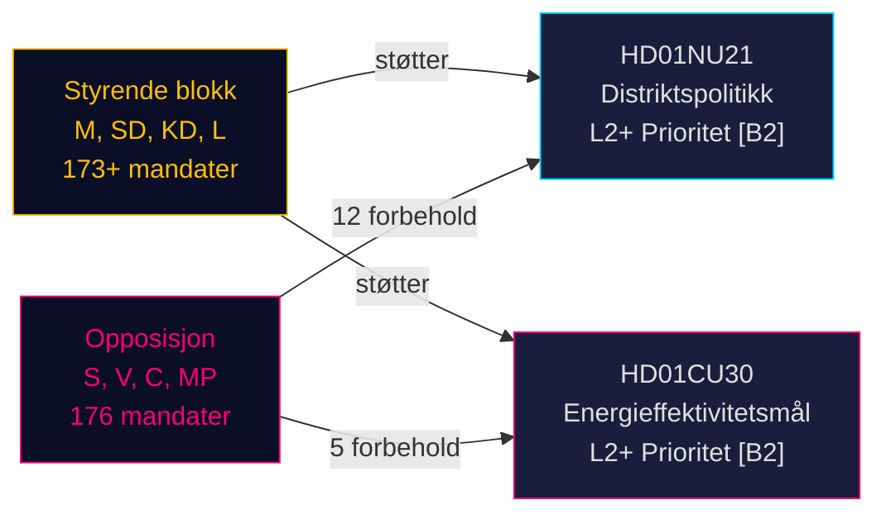

# Sveriges omlegging av distriktspolitikk og energieffektivitetsreorientering: To komitérapporter signalerer lovgivningssprint før valget

**BLUF**: Den 12. mai 2026 mottok Sveriges Riksdag to politisk viktige betänkanden: Betänkande 2025/26:NU21 om helhetlig distriktspolitikk (prop. 2025/26:158) og Betänkande 2025/26:CU30 om et nytt energieffektivitetsmål som erstatter det kvantitative 2030-målet (prop. 2025/26:159). Begge rapporter avslører at den styrende blokken (M, SD, KD, L) fremmer sin valgprogramfremgang mot en vedvarende opposisjon (S, V, C, MP) som leverer flerpoengsforbeholder men mangler parlamentarisk flertall til å blokkere forslagene. Energirapporten er særlig viktig: Sverige forlater et 50% kvantitativt energieffektivitetsmål til fordel for et kvalitativt mål som eksplisitt rommer kjernekraftutvidelse og elektrifisering — et seismisk skifte i energistyring foran valget i september 2026.

## Støttede nøkkelbeslutninger

1. **Avstemning om HD01NU21**: Riksdagen vil trolig vedta med forbehold fra S, V, C, MP — den styrende koalisjonen har flertall
2. **Avstemning om HD01CU30**: Nytt kvalitativt energieffektivitetsmål vil vedtas; skarp S/V/MP-opposisjon signalerer en sterk valgkampsak
3. **Valgdynamikk september 2026**: Distriktspolitikk og energiomstilling er begge toppnivå mobiliseringsspørsmål for alle store partier

## 60-sekunders etterretningspunkter

- **HD01NU21** gjennomfører lovendring i Lagen om regionalt utvecklingsansvar (2010:630): regioner må konsultere sivilsamfunnsorganisasjoner og private høyskoler; Lagrådet godkjente uten innvendinger; ikrafttredelsesdato TBC
- **HD01CU30** erstatter Sveriges 50%-energieffektivitetsmål for 2030 med et kvalitativt mål som vektlegger fleksibilitet, rimelig pris, elektrifisering og kjernekraftaccommodering; gjennomfører EUs omarbeidede EPBD-direktiv via endringer i Lagen (2006:985) om energideklaration för byggnader og Plan- och bygglagen (2010:900)
- **Opposisjonsblokken** (S, V, MP) leverte 12 forbehold på NU21 og 5 forbehold på CU30 — høy forbeholdstetthet signalerer dyp programmatisk uenighet
- **Forvalsmultiplikator aktiv** (≤ 6 måneder til september 2026): DIW-scorer eskalert med 1,5×; begge rapporter er L2+-prioritet
- **Andreas Lennkvist Manriquez (V)** leder CU mens han stemmer mot regjeringens energimål — institusjonelt paradoksalt signal; komitéprosedyren er formelt gyldig i henhold til parlamentariske regler

## Viktigste fremtidige utløser

**CU30-avstemningsdag** (~slutten av mai 2026): Hvis SD, M, KD, L opprettholder koalisjondisiplin vedtas det kvalitative energimålet — men hvis et parti defekterer (spesielt KD eller L under kjernekrafts-innrammingspress), er en prosedyremessig forsinkelse mulig. Følg med på partipisker.

## Konfidensvurdering

**HIGH [B2]** — basert på primære Riksdag-dokumenter (dok_id HD01NU21, HD01CU30), direkte sitat fra komitétext, kjent parlamentarisk mandatfordeling (Tidökoalitionens flertall), Lagrådets yttrande (ingen innvendinger til NU21) og IMF WEO april 2026 makroøkonomisk kontekst.

<!-- source-sha: 024711d152b3357ca699b043a50b4b7600683400 -->
