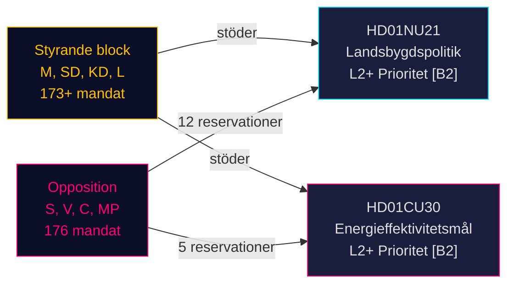

# Sveriges landsbygdspolitiska omstöpning och energieffektivitetsomlokalisering: Två utskottsbetänkanden signalerar förvalsprättslig lagstiftningssprint

**BLUF**: Den 12 maj 2026 mottog Sveriges riksdag två politiskt viktiga betänkanden: Betänkande 2025/26:NU21 om övergripande landsbygdspolitik (prop. 2025/26:158) och Betänkande 2025/26:CU30 om ett nytt energieffektivitetsmål som ersätter det kvantitativa 2030-målet (prop. 2025/26:159). Båda betänkandena visar att det styrande blocket (M, SD, KD, L) driver sitt valrörelseprogram mot ett ihållande motstånd (S, V, C, MP) som lämnar reservationer med flera punkter men saknar parlamentarisk majoritet för att blockera förslagen. Energirapporten är särskilt viktig: Sverige överger ett 50-procentigt kvantitativt energieffektivitetsmål till förmån för ett kvalitativt mål som uttryckligen rymmer kärnkraftsexpansion och elektrifiering — ett omvälvande skifte i energistyrning inför valet i september 2026.

## Stödda nyckelbeslut

1. **Omröstning om HD01NU21**: Riksdagen väntas anta med reservation från S, V, C, MP — den styrande koalitionen har majoritet
2. **Omröstning om HD01CU30**: Nytt kvalitativt energieffektivitetsmål kommer att antas; skarp opposition från S/V/MP signalerar en stark valfråga
3. **Valdynamik september 2026**: Landsbygdspolitik och energiomställning är båda toppfrågor för mobilisering bland alla stora partier

## 60-sekunders underrättelsekulor

- **HD01NU21** genomför lagändring i Lagen om regionalt utvecklingsansvar (2010:630): regioner måste samråda med civilsamhällesorganisationer och privata högskolor; Lagrådet godkände utan anmärkningar; ikraftträdandedatum TBC
- **HD01CU30** ersätter Sveriges 50%-mål för energieffektivitet till 2030 med ett kvalitativt mål som betonar flexibilitet, prisvärdhet, elektrifiering och kärnkraftsutrymme; genomför EU:s EPBD-omarbetade direktiv via ändringar i Lagen (2006:985) om energideklaration för byggnader och Plan- och bygglagen (2010:900)
- **Oppositionsblocket** (S, V, MP) lämnade 12 reservationer på NU21 och 5 reservationer på CU30 — hög reservationstäthet signalerar djup programmatisk oenighet
- **Förvalsmultiplikator aktiv** (≤ 6 månader till september 2026): DIW-poäng eskalerade med 1,5×; båda betänkandena är L2+-prioritet
- **Andreas Lennkvist Manriquez (V)** leder CU men röstar mot regeringens energimål — institutionellt paradoxalt signal; utskottsförfarandet är formellt giltigt enligt parlamentariska regler

## Viktigaste framåtblickande trigger

**CU30:s omröstningsdag** (~slutet av maj 2026): Om SD, M, KD, L upprätthåller koalitionsdisciplin antas det kvalitativa energimålet — men om något parti defekterar (särskilt KD eller L under kärnkrafts-framningstryck) är en procedurell försening möjlig. Bevaka partipiskor.

## Konfidensbedömning

**HIGH [B2]** — baserat på primära riksdagsdokument (dok_id HD01NU21, HD01CU30), direkt citat från utskottstext, känd parlamentarisk mandatfördelning (Tidökoalitionens majoritet), Lagrådets yttrande (inga anmärkningar på NU21) och IMF WEO april 2026 makroekonomisk kontext.

<!-- source-sha: 024711d152b3357ca699b043a50b4b7600683400 -->
