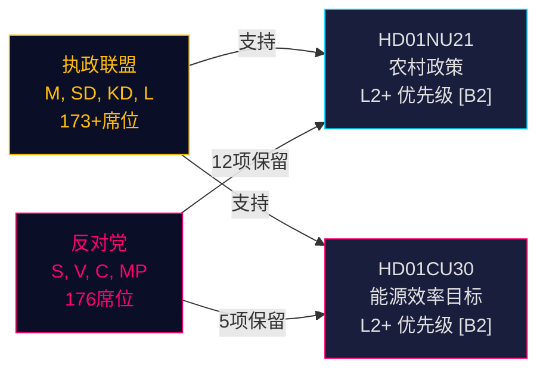

# 瑞典农村政策改革与能源效率重新定向：两份委员会报告预示选举前立法冲刺

**摘要**：2026年5月12日，瑞典Riksdag收到两份具有重要政治意义的betänkandan：关于全面农村政策的Betänkande 2025/26:NU21（prop. 2025/26:158）和关于取代2030年量化目标的新能源效率目标的Betänkande 2025/26:CU30（prop. 2025/26:159）。两份报告均显示，执政联盟（M, SD, KD, L）正在推进其选前立法议程，面对提出多点保留意见但缺乏阻止提案的议会多数的持续反对党（S, V, C, MP）。能源报告尤为重要：瑞典正在放弃50%的量化能源效率目标，转而采用明确容纳核能扩张和电气化的定性目标——这是2026年9月选举前能源治理中的地震性转变。

## 支持的关键决策

1. **HD01NU21表决**：Riksdagen可能在S、V、C、MP的保留下通过——执政联盟拥有多数
2. **HD01CU30表决**：新的定性能源效率目标将获通过；S/V/MP的强烈反对预示着强大的竞选议题
3. **2026年9月选举动态**：农村政策和能源转型都是所有主要政党的顶级动员议题

## 60秒情报要点

- **HD01NU21**实施Lagen om regionalt utvecklingsansvar（2010:630）法律修订：各地区必须与公民社会组织和私立高等教育机构协商；Lagrådet无异议通过；生效日期TBC
- **HD01CU30**用强调灵活性、可负担性、电气化和核能适应的定性目标取代瑞典2030年50%能源效率目标；通过对Lagen（2006:985）om energideklaration för byggnader和Plan- och bygglagen（2010:900）的修订实施欧盟EPBD修订指令
- **反对派集团**（S, V, MP）对NU21提出12项保留，对CU30提出5项保留——高密度保留意见表明深层政策分歧
- **选前倍增系数激活**（距2026年9月≤6个月）：DIW分数上升1.5倍；两份报告均为L2+优先级
- **Andreas Lennkvist Manriquez（V）**在投票反对政府能源目标的同时领导CU——制度上自相矛盾的信号；委员会程序在议会规则下形式上有效

## 主要前瞻触发因素

**CU30表决日**（2026年5月底）：如果SD、M、KD、L维持联合纪律，定性能源目标通过——但若有政党离脱（尤其是核能框架压力下的KD或L），程序性延迟成为可能。监视政党督导人。

## 置信度评估

**HIGH [B2]** — 基于Riksdag主要文件（dok_id HD01NU21, HD01CU30）、委员会文本的直接引用、已知议会席位分配（Tidökoalitionen多数）、Lagrådets yttrande（对NU21无异议）和IMF WEO 2026年4月宏观经济背景。

<!-- source-sha: 024711d152b3357ca699b043a50b4b7600683400 -->
