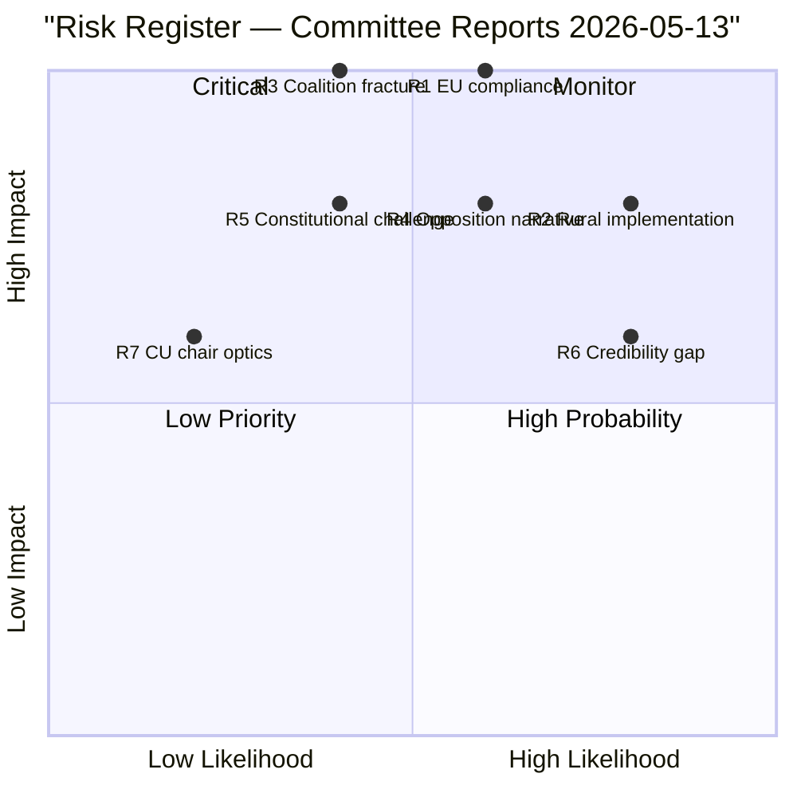

# Risk Assessment — Committee Reports 2026-05-13

## 5-Dimension Risk Register

| Risk ID | Description | Likelihood (1-5) | Impact (1-5) | L×I Score | Mitigation | Owner |
|---------|-------------|:---:|:---:|:---:|---|---|
| R1 | EU Commission challenges qualitative energy goal (CU30) as insufficient EPBD transposition | 3 | 5 | **15** | Ensure implementing regulations maintain quantitative sub-targets for buildings EPC classes | Government/Klimat- och miljödep. |
| R2 | Rural service decline continues despite NU21 signals (implementation gap) | 4 | 4 | **16** | Fund regional programmes; mandate specific rural service indicators | Regeringskansliet / regions |
| R3 | Coalition fracture on energy ambition before Riksdag vote | 2 | 5 | **10** | L and KD maintain party discipline given election proximity | M (coalition manager) |
| R4 | Opposition unifies "rural + climate" counter-narrative before election | 3 | 4 | **12** | Government must differentiate "economic realism" from "rural abandonment" | M, SD, KD, L campaign HQs |
| R5 | CU30 constitutional challenge on EU law primacy | 2 | 4 | **8** | Lagrådet review (none cited for CU30 in published betänkande); ensure EU compliance opinion | Konstitutionsutskottet |
| R6 | NU21 over-promises vs. narrow law change: media credibility gap | 4 | 3 | **12** | Supplement law change with concrete regional investment decisions before election | Näringsdep. / Tillväxtverket |
| R7 | V chairs CU creates procedural optics risk (resignation demand) | 1 | 3 | **3** | Constitutionally unambiguous; no formal risk, monitor media framing | CU secretariat |

## Priority Risks (L×I ≥ 12)

1. **R2 (16)** — Implementation gap on rural services is the highest-probability risk. The law change creates consultation obligations but not service delivery guarantees.
2. **R1 (15)** — EU compliance risk on energy goal is the highest-impact risk. EPBD transposition inadequacy could trigger infringement proceedings (6–18 month timeline — potentially landing during next government).
3. **R4 (12)** — Unified opposition counter-narrative. S has 19 yrkanden on NU21 alone; combined with CU30 climate opposition, a "rural + green" platform could crystallise.
4. **R6 (12)** — Credibility gap risk. If media coverage benchmarks "Hela Sverige ska fungera" against actual rural school closures, clinic reductions, and transport gaps, the government narrative collapses.

## Risk Trend

IMF WEO Apr-2026 projects Sweden GDP growth at ~2.3% for 2026, public debt ~31% GDP. Fiscal capacity to fund rural investment exists, reducing R2 probability slightly. However, government has not announced new rural investment in NU21, leaving R2 intact.

