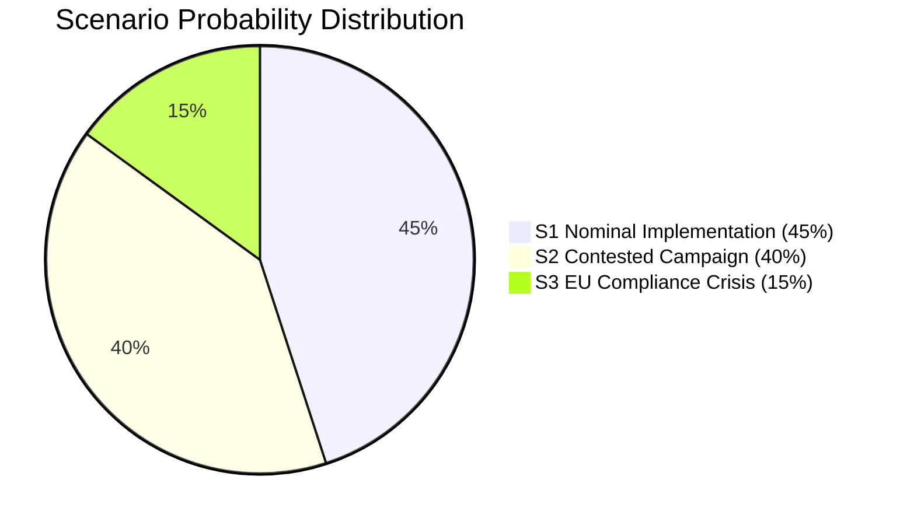

# Scenario Analysis — Committee Reports 2026-05-13

## Analytical Frame

Three scenarios are assessed for the political trajectory of today's committee reports over the period T+0 to T+120d (Riksdag vote → Swedish election, September 2026). Probabilities sum to 100%.

## Scenario 1: Nominal Implementation — Coalition Wins Narrative (Probability: 45%)

**Description**: Both betänkanden pass Riksdag vote without incident. "Hela Sverige ska fungera" becomes a recognisable coalition banner. CU30's qualitative energy goal is adopted; EU Commission does not act before September 2026. Governing coalition successfully frames energy policy as "pro-nuclear competitiveness" and rural policy as "national solidarity." Rural swing voters in SD/M strongholds consolidate behind coalition. S and MP fail to crystallise a unified counter-narrative.

**Conditions required**:
- No EU Commission action on EPBD before September 2026
- No major rural service deterioration story (hospital, school closure) in national media before election
- L and KD maintain party discipline on CU30

**Electoral impact**: Governing coalition gains 1–3 seat-equivalent advantage in rural/semi-rural constituencies. S remains largest single party but cannot form majority government without C and/or V.

**Key indicator**: Government announces concrete rural investment package (≥2 Bkr) to accompany NU21 before Riksdag summer recess.

## Scenario 2: Opposition Narrative Gains — Contested Campaign (Probability: 40%)

**Description**: Both betänkanden pass, but opposition successfully frames CU30 as "abandonment of climate ambition" and NU21 as "empty symbolism." S, V, MP run coordinated climate-plus-rural messaging. C's reservation on quantitative targets creates media friction within coalition narrative. EU Commission signals EPBD compliance questions in September 2026 communication.

**Conditions required**:
- Media coverage frames "Sweden exits climate targets" prominently
- C maintains public distance on CU30 through summer
- At least one major rural service closure story reaches national broadcast

**Electoral impact**: MP recovers from 4% → 6% on climate mobilisation. S closes gap with M. Coalition still plausibly largest bloc but majority uncertain. C becomes genuine kingmaker.

**Key indicator**: Aftonbladet/DN editorial board criticism of CU30 within 2 weeks of Riksdag vote.

## Scenario 3: EU Compliance Crisis — Government Liability (Probability: 15%)

**Description**: EU Commission issues formal EPBD compliance query to Sweden during summer 2026. Media reframes CU30 from "pro-nuclear pragmatism" to "Sweden breaks EU climate commitment." C publicly demands quantitative energy targets be reintroduced. L faces internal pressure from pro-EU wing. Government is forced to announce corrective regulation, undermining the core "qualitative goal" framing.

**Conditions required**:
- EU Commission EPBD compliance letter to Swedish government before August 2026
- C withdraws from coalition narrative on CU30 (public dissent beyond reservation)
- V chairs CU and publicly calls for emergency session

**Electoral impact**: Coalition loses credibility advantage on EU-related issues. Green and pro-EU voters shift to MP and C. S potential gain of 2–4% in late August polls.

**Key indicator**: EU Commission spokesperson comments on Swedish EPBD national plan by June 2026.

## Probability Summary

## Intelligence Value

Scenario 2 is the most actionable for intelligence monitoring. It requires no external trigger (EU Commission) and is driven entirely by domestic political dynamics observable in media framing and C party signalling. A forward-indicators watch on C party statements and Aftonbladet editorial coverage provides early warning.
