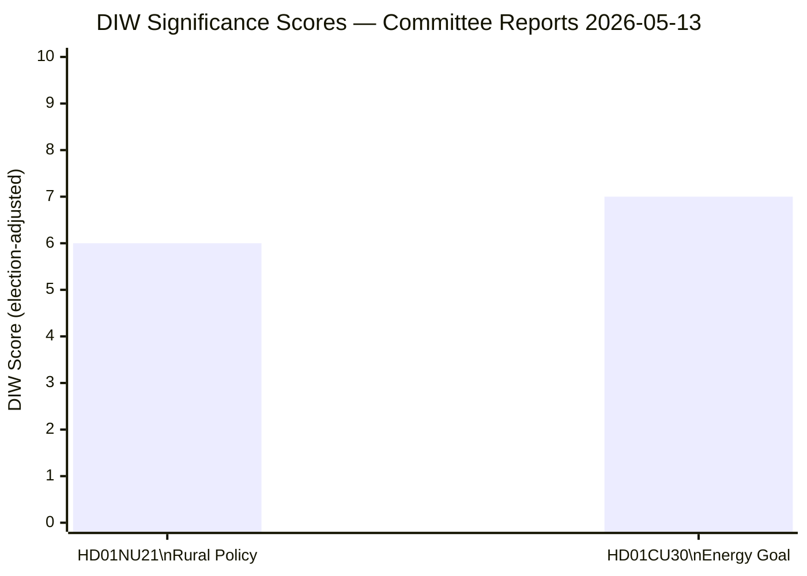

# Significance Scoring — Committee Reports 2026-05-13

## DIW Scoring Matrix

| dok_id | Title (short) | Detectability | Impact | Willingness | DIW Raw | Election ×1.5 | DIW Final | Tier |
|--------|---------------|:---:|:---:|:---:|:---:|:---:|:---:|------|
| HD01NU21 | Rural Policy | 4 | 4 | 4 | 4.0 | ×1.5 | **6.0** | L2+ Priority |
| HD01CU30 | Energy Efficiency Goal | 5 | 5 | 4 | 4.67 | ×1.5 | **7.0** | L2+ Priority |

Election multiplier active: ≤6 months to Swedish general election (second Sunday of September 2026). Applied per `synthesis-methodology.md`.

## Scoring Rationale

### HD01NU21 (DIW 6.0)

**Detectability (4/5)**: "Hela Sverige ska fungera" is a nationally recognised political phrase; the proposition generated follow-on motions from S, C, MP; 8 committees gave referral opinions. Media coverage expected.

**Impact (4/5)**: Law change to lagen om regionalt utvecklingsansvar clarifies regional consultation duties — directly affects 21 regions and their relationships with civil society. The broader policy programme (rural services, entrepreneurship, infrastructure, culture) affects millions of rural residents. However, the immediate legal change is relatively narrow.

**Willingness (4/5)**: Lagrådet cleared the proposal without objections [A1]. Coalition (M, SD, KD, L) is committed. Tobias Andersson (SD) chairs. Effective date still TBC.

### HD01CU30 (DIW 7.0)

**Detectability (5/5)**: Abandoning a binding 50% energy efficiency target makes EU compliance front-page news. EU Directive implementation (EPBD recast) adds Brussels dimension. Climate media will cover extensively.

**Impact (5/5)**: Qualitative goal replacing quantitative target removes an enforceable benchmark. Nuclear and large industrial consumers benefit. Buildings energy performance directive (EPBD) implementation affects all property owners and developers. Law changes to two statutes: lagen om energideklaration för byggnader and plan- och bygglagen.

**Willingness (4/5)**: Coalition majority sufficient. Notable: CU chair (V) opposes — procedurally valid but politically stark. C files reservation on quantitative target omission. Dissent breadth (3 parties on the energy goal point) signals this is a priority campaign issue.

## Sensitivity Analysis

| Scenario | NU21 adjusted | CU30 adjusted |
|----------|---------------|---------------|
| Coalition fracture on KD or L before vote | DIW 7.5 (procedural delay → higher uncertainty) | DIW 8.5 |
| Strong polling showing S+MP gain | DIW 6.5 (government may accelerate) | DIW 7.5 |
| EU Commission challenges qualitative goal | unchanged | DIW 9.0 |

