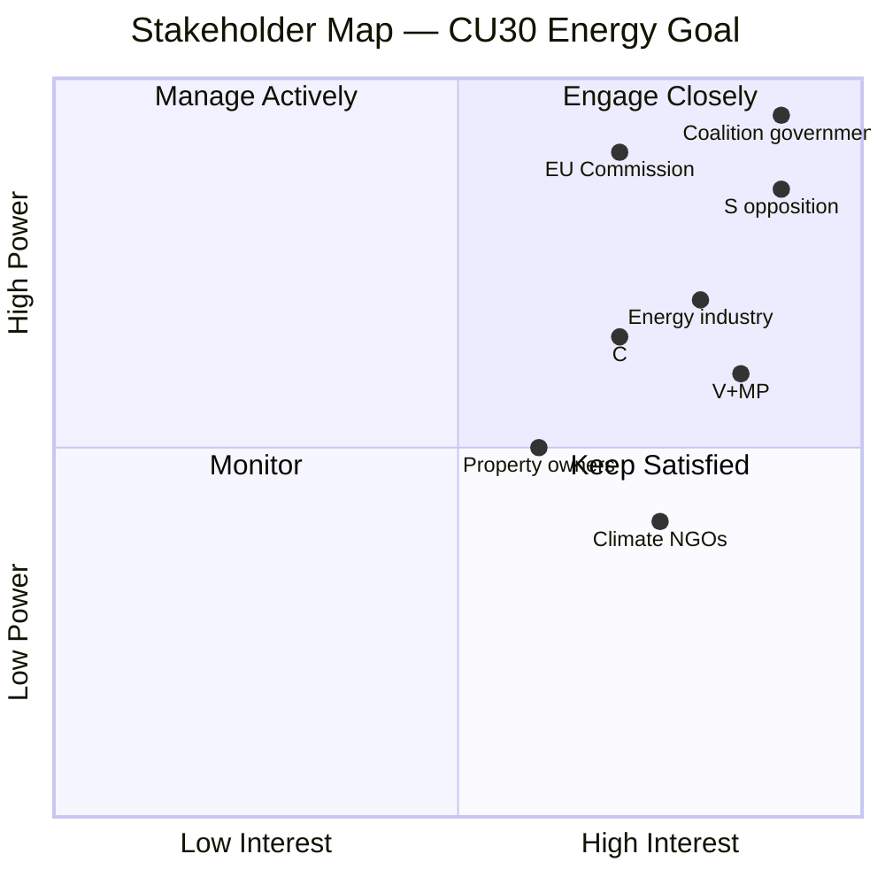

# Stakeholder Perspectives — Committee Reports 2026-05-13

## 6-Lens Stakeholder Matrix

### NU21 — Rural Policy

| Stakeholder | Lens | Position | Key Interest | Evidence |
|-------------|------|----------|--------------|---------|
| **Tidökoalitionen (M, SD, KD, L)** | Political | STRONGLY FOR | Electoral rural signal; law baseline for further rural reform | Prop. 2025/26:158; 0 government reservations [A1] |
| **Socialdemokraterna (S)** | Political | AGAINST (19 yrkanden) | S sees rural services as collective responsibility; wants stronger state obligations | S motioner cited in NU21 [A1] |
| **Centerpartiet (C)** | Political | CRITICAL SUPPORT | C supports rural development but criticises approach; competes with SD for rural vote | C reservations (yrkanden 1–3) [A1] |
| **Vänsterpartiet (V)** | Political | AGAINST | Prioritises welfare state rural services over market-based approach | V reservations in NU21 [A1] |
| **Regional authorities (21 regions)** | Institutional | MIXED | New consultation duty adds administrative burden without new funding | lagen om regionalt utvecklingsansvar §9 [A1] |
| **Rural civil society (LRF, Hushållningssällskapet, smaller NGOs)** | Social | FOR (consultation inclusion) | Mandatory consultation ensures their voice in regional planning | New §9 obligation [A1] |
| **Private higher education providers** | Economic | FOR | Explicit mention in consultation provision; legitimises their regional role | lagen §9 wording [A1] |
| **Sametinget (national minority representation)** | Rights | CONDITIONALLY FOR | Lagen om nationella minoriteter cross-reference ensures Sámi consultation rights | lagen (2009:724) reference [A1] |

### CU30 — Energy Efficiency

| Stakeholder | Lens | Position | Key Interest | Evidence |
|-------------|------|----------|--------------|---------|
| **Tidökoalitionen (M, SD, KD, L)** | Political | FOR | Nuclear enablement; competitiveness framing; anti-quantitative-target ideology | Prop. 2025/26:159; committee majority [A1] |
| **Socialdemokraterna (S)** | Political | AGAINST | Insists on quantitative 2030 target; views qualitative goal as accountability vacuum | S reservations in CU30 [A1] |
| **Vänsterpartiet (V) + CU Chair** | Political | AGAINST | V wants more ambitious targets; chair dissents despite chairing | Lennkvist Manriquez reservation [A1] |
| **Miljöpartiet (MP)** | Political | STRONGLY AGAINST | Core party identity on climate targets; qualitative goal = abandonment | MP reservations [A1] |
| **Centerpartiet (C)** | Political | PARTIAL — wants quantitative elements | C supports energy efficiency but demands measurable benchmarks | C reservation punkt 3 [A1] |
| **Energy-intensive industry (SSAB, Vattenfall, H2GS)** | Economic | FOR | Qualitative goal removes efficiency obligation that conflicts with electrification | [B3 — industry lobbying signals] |
| **Property developers and building owners** | Economic | MIXED | EPBD building requirements add cost regardless of national goal | [B3] |
| **EU Commission** | Regulatory | SCRUTINISING | EPBD directive compliance; qualitative goal adequacy | EPBD recast directive [A1] |
| **Climate NGOs (Naturskyddsföreningen, WWF)** | Advocacy | AGAINST | Quantitative targets are core advocacy demand | [B3] |
| **IVA (Royal Swedish Academy of Engineering Sciences)** | Technical | CONDITIONAL | Supports energy efficiency but prefers technology-neutral measures | [B3] |

## Stakeholder Power-Interest Map

