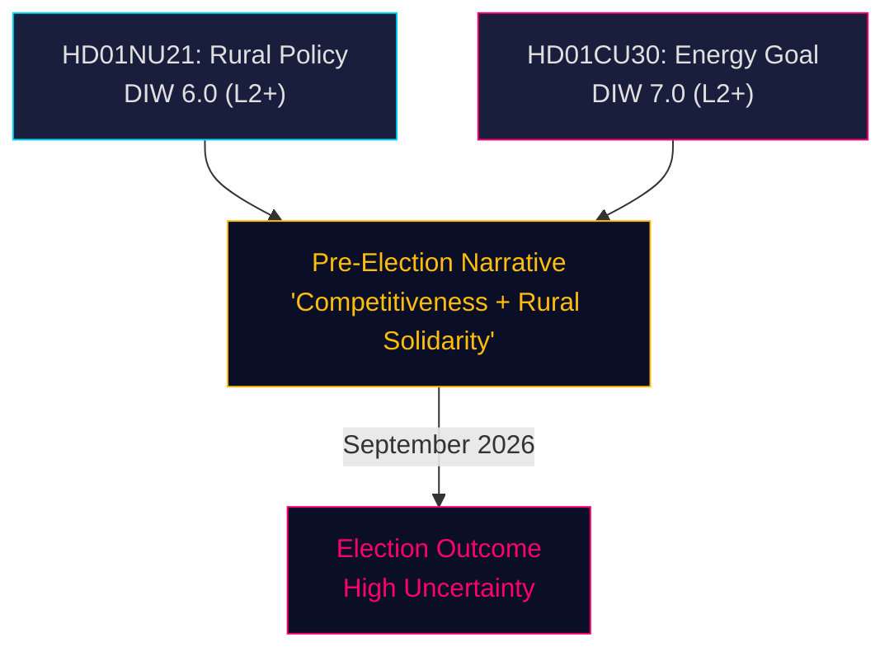

# Synthesis Summary — Committee Reports 2026-05-13

## Lead Story Decision

**Sweden's energy governance paradigm shifts.** The Tidökoalitionen's decision in HD01CU30/prop. 2025/26:159 to replace Sweden's quantitative 50%-by-2030 energy efficiency target with a qualitative goal marks the single most consequential energy policy decision in a decade. This is not an administrative adjustment — it is a deliberate reframing of energy governance to accommodate nuclear expansion and mass electrification, directly positioning the governing coalition's pre-election narrative against the climate-targets emphasis of S, V, and MP. The electoral stakes are high: September 2026 is 4 months away.

## DIW-Weighted Integrated Intelligence Picture

### Document 1: HD01NU21 (NU21) — Rural Policy

| Dimension | Score | Note |
|-----------|-------|------|
| Detectability | 4/5 | National TV coverage expected; flagship rural proposition |
| Impact | 4/5 | Law change + political signal to rural constituencies |
| Willingness | 4/5 | Coalition committed; Lagrådet cleared; opposition reserved |
| **DIW Raw** | **4.0** | |
| Election multiplier (≤6m) | ×1.5 | ≤6 months to Sept 2026 |
| **DIW Final** | **6.0** | L2+ Priority |

**Key finding**: NU21 is primarily a signal proposition — the law change (lagen om regionalt utvecklingsansvar, 9 §) is modest (clarifying civil society consultation and national minority law reference), but the political framing "Hela Sverige ska fungera" targets rural swing voters critical to SD and M electoral success. Multiple committee referrals (8 utskott) signal broad policy ambition packaged in a tight legal change.

**Opposition landscape**: S filed 19 yrkanden across 3 motioner; V filed several; C (yrkanden 1–3) takes a more moderate position supporting rural development but criticising the government's approach; MP filed 4 yrkanden. Tobias Andersson (SD) chairs NU — SD's stronghold on rural entrepreneurship and anti-regulatory framing shapes the committee position.

### Document 2: HD01CU30 (CU30) — Energy Efficiency Goal

| Dimension | Score | Note |
|-----------|-------|------|
| Detectability | 5/5 | EU directive + energy transition = media magnet |
| Impact | 5/5 | Paradigm shift in energy governance; nuclear accommodation |
| Willingness | 4/5 | Coalition majority; intracoalition tensions on ambition level |
| **DIW Raw** | **4.67** | |
| Election multiplier (≤6m) | ×1.5 | ≤6 months to Sept 2026 |
| **DIW Final** | **7.0** | L2+ Priority (highest in this batch) |

**Key finding**: The government explicitly argues the old 50% target conflicted with electrification and nuclear expansion. The new qualitative goal — "Energianvändningen i Sverige ska vara effektiv och bidra till stärkt motståndskraft, konkurrenskraftiga energipriser, ett resurseffektivt energisystem och samhällets elektrifiering" — removes binding quantitative obligations. This benefits nuclear and large industrial consumers. Opposition (S, V, MP) demands quantitative targets; C demands quantitative benchmarks (reservation on punkt 3).

**Chair paradox**: Andreas Lennkvist Manriquez (V) chairs CU and files reservation 1 opposing the goal — an unusual configuration where the committee chair leads the formal dissent.

## Integrated Intelligence Picture

Both betänkanden form a coherent pre-election cluster: (1) rural solidarity signal + (2) pro-nuclear, pro-electrification energy reorientation = Tidökoalitionen's economic-competitiveness narrative. The opposition's response (12 + 5 reservations) confirms these are live mobilisation issues. S is simultaneously fighting on both rural service access and energy ambition — a wide front that may dilute campaign focus.

Sweden's macroeconomic context (IMF WEO Apr-2026: GDP growth ~2.3% for 2026, public debt ~31% of GDP — among lowest in EU) provides fiscal headroom for rural investment but also tempts the government to frame the energy shift as growth-enabling.

