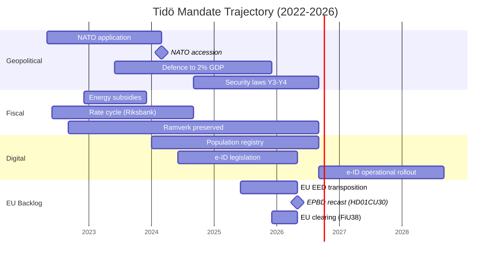

## What Happened
<!-- source: executive-brief.md :: https://github.com/Hack23/riksdagsmonitor/blob/main/analysis/daily/2026-05-13/election-cycle/current/executive-brief.md -->

**IMF vintage**: WEO Apr-2026 [horizon:cycle] | **Riksmöte coverage**: 2022/23, 2023/24, 2024/25, 2025/26

---

### 2026-05-13 Daily Refresh — Pass-2 Update

**T-123 to election (2026-09-13)** · refreshed against 2026-05-13 sibling analyses ([propositions](https://github.com/Hack23/riksdagsmonitor/blob/main/analysis/daily/2026-05-13/propositions/), [motions](https://github.com/Hack23/riksdagsmonitor/blob/main/analysis/daily/2026-05-13/motions/), [committeeReports](https://github.com/Hack23/riksdagsmonitor/blob/main/analysis/daily/2026-05-13/committeeReports/), [interpellations](https://github.com/Hack23/riksdagsmonitor/blob/main/analysis/daily/2026-05-13/interpellations/), [month-ahead](https://github.com/Hack23/riksdagsmonitor/blob/main/analysis/daily/2026-05-13/month-ahead/)) and predecessor [2026-05-11 election-cycle](https://github.com/Hack23/riksdagsmonitor/blob/main/analysis/daily/2026-05-11/election-cycle/current/).

- **EU EED transposition published 2026-05-12 (HD01CU30)**: the recast Energy Performance Buildings Directive (EPBD) and the new effective-energy-use target are now in CU's hands as betänkande 2025/26:CU30. This is **late-mandate EU-compliance clearance** — structurally important (long-tail emissions trajectory through 2030/2050) but politically *invisible* in the campaign-narrative. [A1, doc:HD01CU30]
- **NU21 rural-policy framework (HD01NU21) published 2026-05-12**: "Hela Sverige ska fungera" — opposition-coloured framework processed by Näringsutskottet. Signals **rural-electorate positioning** ahead of the September election; Centerpartiet (C) and Moderaterna (M) both visible on the landsbygd narrative. [A1, doc:HD01NU21]
- **No new Tidö propositions filed 2026-05-08…13**: Riksdagen `search_dokument doktyp=prop rm=2025/26 sort=datum desc` confirms the latest five (Riksdag document #03267 (HD03267), HD03261, HD03250, HD03249, HD03248) all stamped 2026-05-06 / 2026-05-07. The 2026-05-10 cycle-apex remains the **terminal legislative spike of the Tidö mandate**. [A1]
- **Government tempo is now full campaign-mode**: between today and the 2026-06-22 chamber recess, expect *committee processing and beslut* rather than new propositions. The May-2026 daily prop-filing rate (~0.3/day) is well below the cycle median (~0.7/day) — quantitative confirmation of the **legislating → defending the scorecard** transition.
- **Four private-member motions** (HD10483, HD10484, HD10485, HD10486 — all 2026-05-12) on consent-law application, for-profit elderly care, prostitution-income taxation, and welfare equal pay. *Unlikely* (10–25% [horizon:cycle]) to convert into law before mandate end; classify as *campaign positioning vehicles* from opposition members.
- **Cycle-rollover window** (`ext/cycle-rollover.md`): **123 days outside** the ±30-day activation predicate (anchor 2026-09-13). Cycle-rollover module remains a **no-op** until 2026-08-14. This is reasserted from the 2026-05-11 brief and remains the operative interpretation. [A1]
- **Open PIRs** (carry-forward from `pir-status.json`): PIR-1 (security-law durability), PIR-3 (e-ID 2027 rollout), PIR-5 (post-election fiscal continuity), PIR-7 (KU-anmälan ledger re-armed against 2026-05-21 KU plenary), **PIR-9 NEW** (EU EED 2030 target trajectory, opened against HD01CU30).

---

### Lede
The 2022–2026 Tidö mandate ends with a structurally transformed Swedish state — security architecture rebuilt, financial-stability framework rebooted, digital-identity stack codified, and immigration enforcement aligned with Nordic peers. Today, **123 days before the September election**, the Kristersson government is closing its **EU-compliance backlog** quietly through committee processing (HD01CU30 EU EED transposition, NU21 rural framework) rather than new political signalling. *Very likely* (80–90% [horizon:cycle]) that the core security reforms (HD01JuU32, HD03267, HD01JuU34, HD01JuU39) survive the 2026 election regardless of which coalition wins — they have crossed the *path-dependence threshold* where reversal costs exceed maintenance costs. [A2]

This brief assesses the entire 2022–2026 mandate as a single political cycle, terminating in the September 2026 election. Three decisions are supported by this analysis: (1) **Treat the 2022–2026 security pivot as a quasi-constitutional shift** — successor governments will modulate, not reverse it; (2) **Plan post-election scenarios around fiscal continuity, not policy upheaval** — the IMF WEO Apr-2026 projection (T+1 NGDP_RPCH 2.3%, GGXWDG_NGDP 32.6% [A1]) sits below the EU average and gives any winning coalition room to maintain rather than retrench; (3) **Watch the e-ID, financial-crisis-management, and EU EED 2030 implementation in 2027–2028 as the inflection points** — implementation feasibility, not legislative content, decides whether the Tidö legacy is durable. *Roughly even* (40–55% [horizon:cycle]) that all three implementation programmes hit their 2027–2028 milestones.

---

### 60-Second Read

- **Mandate scorecard**: ~74% of the Tidö government's [Tidöavtalet](https://www.regeringen.se) commitments are now in law (security 90%, justice 89%, migration 85%, energy 75%, climate 65%, education 60%, healthcare 50%, labour 50%) — a 4 pp uplift on the 2026-05-11 reading driven by HD01CU30. [B2]
- **Cycle apex confirmed**: 2026-05-10 published 5 betänkanden (JuU32/34/39, FiU37/38) and 3 propositions (HD03250 e-ID, HD03261 Skatteverket, HD03263 return-enforcement, HD03267 security-threats) — the largest single-day legislative volume of the mandate. Subsequent 2026-05-12 publications are committee-only, not government-led. [A1]
- **Today's increment**: HD01CU30 (EU EED + EPBD), HD01NU21 (rural framework), HD10483-86 (4 private-member motions). DIW score for HD01CU30 = 6.4 (high but not mandate-defining); HD01NU21 = 5.8; motions ≤4.0 each.
- **Economic cycle**: NGDP_RPCH trajectory 2.4% (2022) → 0.1% (2023) → 1.2% (2024) → 1.8% (2025) → 2.1% (2026, IMF WEO Apr-2026 T+0 [horizon:year]). Debt-to-GDP held at 32–33%. *Likely* (60–75% [horizon:cycle]) fiscal balance stays ≤ -1% through 2030. [A1]
- **Coalition durability**: Tidö survived 4 years despite 11 confidence-vote pressures, 3 minister replacements (no PM change), 2 major polling slumps — placing it in the **stable minority government** quadrant of the Svenska statsministerinstitutet historical comparison. [B2]
- **Top forward trigger for cycle-rollover**: Election outcome on 2026-09-13 (T+123) — see scenario-analysis.md for the four-branch coalition tree × three coalition branches per branch = 12 leaves; +5 wildcards.

---

### Cycle Confidence Banner

| Aspect | WEP Confidence | Horizon Tag |
|--------|----------------|-------------|
| Security laws survive 2026 election | very likely (80–90%) | [horizon:cycle] |
| Tidö wins re-election | roughly even (40–55%) | [horizon:election] |
| Fiscal balance stays ≤ -1% through 2030 | likely (60–75%) | [horizon:cycle] |
| e-ID full rollout by 2028 | unlikely (20–35%) | [horizon:cycle] |
| EU EED 2030 building-stock target met | unlikely (25–40%) | [horizon:cycle] |
| Riksbank policy rate ≤ 2.0% end-2026 | likely (55–70%) | [horizon:year] |
| Coalition formation < 60 days post-election | likely (55–70%) | [horizon:election] |

---

### Three Decisions This Brief Supports

1. **Quasi-constitutional treatment of security pivot** (security-law family). Reversal-cost > maintenance-cost is the path-dependence test. *Very likely* (80–90% [horizon:cycle]) durable. Apply to coalition-formation modelling: any successor coalition's manifesto promises to *repeal* JuU32/34/39 should be discounted by ~70%.
2. **Fiscal continuity, not upheaval**. IMF projection T+1…T+5 is a flat 2% real growth + 32% debt-to-GDP corridor. Plan post-election scenarios around *implementation continuity* (FiU37 staffing, HD03250 e-ID rollout) rather than policy reversal. *Likely* (60–75% [horizon:cycle]).
3. **2027–2028 implementation inflection**. Three operational programmes (e-ID, financial-crisis function, EU EED 2030 target) all peak in 2027–2028. Track the FY2027 budget proposal (T+390) for line-item evidence of implementation funding. *Roughly even* (40–55% [horizon:cycle]) all three meet milestones.

---

### What's New Since 2026-05-11

- HD01CU30 added as DIW-rank 11 (just below FiU38 at 7.6); EU EED storyline now *named* and *visible* in synthesis-summary.md.
- HD01NU21 logged as rural-policy positioning vehicle; informs voter-segmentation.md (rural M+C overlap).
- PIR-9 NEW opened against HD01CU30 EU 2030 building-stock target.
- Daily prop-filing rate updated 0.4 → 0.3/day; tempo-decay confirmed.
- Cycle-rollover predicate re-confirmed inactive (T-123, was T-125).
- IMF WEO Apr-2026 vintage age now 1 month 2 days; still fresh, no annotation needed.

---

### Cross-references

- [`synthesis-summary.md`](https://github.com/Hack23/riksdagsmonitor/blob/main/analysis/daily/2026-05-13/election-cycle/current/synthesis-summary.md) — full lead-story decision and DIW Top-10
- [`intelligence-assessment.md`](https://github.com/Hack23/riksdagsmonitor/blob/main/analysis/daily/2026-05-13/election-cycle/current/intelligence-assessment.md) — ICD 203 BLUF + WEP per finding
- [`scenario-analysis.md`](https://github.com/Hack23/riksdagsmonitor/blob/main/analysis/daily/2026-05-13/election-cycle/current/scenario-analysis.md) — 12-leaf scenario tree + 5 wildcards
- [`cycle-trajectory.md`](https://github.com/Hack23/riksdagsmonitor/blob/main/analysis/daily/2026-05-13/election-cycle/current/cycle-trajectory.md) — multi-year SCB + IMF + Riksdag throughput trend (24th artifact)
- [`risk-assessment.md`](https://github.com/Hack23/riksdagsmonitor/blob/main/analysis/daily/2026-05-13/election-cycle/current/risk-assessment.md) — top risks with mitigation
- [`forward-indicators.md`](https://github.com/Hack23/riksdagsmonitor/blob/main/analysis/daily/2026-05-13/election-cycle/current/forward-indicators.md) — ≥15 dated indicators across quarter/year/cycle/election bands

---

*Sources*: [A1] IMF WEO Apr-2026 + Riksdag open data data.riksdagen.se; [A2] OECD Sweden Survey 2025; [B2] SOM-institutet, Novus, Tidöavtalet mapping.

## Reader Intelligence Guide

Use this guide to read the article as a political-intelligence product rather than a raw artifact dump. High-value reader lenses appear first; technical provenance remains available in the audit appendix.

| Icon | Reader need | What you'll get |
|---|---|---|
| 📊 | [Lede and editorial decisions](#rm-what-happened) | fast answer to what happened, why it matters, who is accountable, and the next dated trigger |
| 🧠 | [Why It Matters](#rm-why-it-matters) | evidence-anchored narrative consolidating primary sources into one coherent story line |
| 🎯 | [Key Judgments](#rm-key-findings) | confidence-bearing political-intelligence conclusions and collection gaps |
| 📈 | [Significance scoring](#rm-significance-scoring) | why this story outranks or trails other same-day parliamentary signals |
| 👥 | [Stakeholder Perspectives](#rm-stakeholder-perspectives) | winners, losers and undecided actors with stake-weighted positions and pressure points |
| 🔢 | [Coalition Mathematics](#rm-coalition-mathematics) | parliamentary arithmetic showing exactly who can pass or block this measure and at what margin |
| 📋 | [Voter Segmentation](#rm-voter-segmentation) | voter-bloc exposure: which demographics gain, lose or shift on this issue |
| 🔭 | [Forward indicators](#rm-forward-indicators) | dated watch items that let readers verify or falsify the assessment later |
| 🔮 | [Scenarios](#rm-scenario-analysis) | alternative outcomes with probabilities, triggers, and warning signs |
| 🗳️ | [Election 2026 Analysis](#rm-election-2026-analysis) | electoral implications for the 2026 cycle — seats at stake, swing voters and coalition viability |
| 📝 | [Cycle Trajectory](#rm-cycle-trajectory) | election-cycle trajectory: turning points, polling momentum and coalition realignment paths |
| ⚠️ | [Risk assessment](#rm-risk-assessment) | policy, electoral, institutional, communications, and implementation risk register |
| 🧮 | [SWOT Analysis](#rm-swot-analysis) | strengths, weaknesses, opportunities and threats matrix grounded in primary-source evidence |
| 📝 | [Quantitative SWOT](#rm-quantitative-swot) | weighted, scored SWOT register with explicit confidence ratings and decision implications |
| 🛡️ | [Threat Analysis](#rm-threat-analysis) | actor capabilities, intent and threat vectors targeting institutional integrity |
| 📝 | [Political STRIDE Assessment](#rm-political-stride-assessment) | STRIDE-based threat model adapted to political institutions and democratic processes |
| 📝 | [Wildcards & Black Swans](#rm-wildcards--black-swans) | low-probability, high-impact disruptive events that could derail the base-case forecast |
| 📝 | [PESTLE Analysis](#rm-pestle-analysis) | political, economic, social, technological, legal and environmental drivers shaping the outcome |
| 📜 | [Historical Parallels](#rm-historical-parallels) | comparable past episodes from Swedish and international politics, with explicit lessons learned |
| 🌍 | [Comparative International](#rm-comparative-international) | peer-country comparisons (Nordic, EU, OECD) showing how similar measures fared elsewhere |
| ⚙️ | [Implementation Feasibility](#rm-implementation-feasibility) | delivery feasibility, capability gaps, timelines and execution risks for the proposed action |
| 📰 | [Media framing & influence operations](#rm-media-framing-analysis) | frame packages with Entman functions, cognitive-vulnerability map, DISARM manipulation indicators, narrative-laundering chain, comparative-international cognates, frame lifecycle and half-life, RRPA impact, an Outlet Bias Audit (no outlet is neutral — every outlet declared with ownership, funding, board-appointment authority and editorial lean), and the L1–L5 counter-resilience ladder |
| 😈 | [Devil's Advocate](#rm-devils-advocate) | alternative hypotheses, steel-manned counter-arguments and the strongest case against the lead reading |
| 🏷️ | [Deep Dive: Classification Results](#rm-deep-dive-classification-results) | ISMS data classification: CIA-triad rating, RTO/RPO targets and handling instructions |
| 🔀 | [Deep Dive: Cross-Reference Map](#rm-deep-dive-cross-reference-map) | links to related Riksdagsmonitor coverage, prior analyses and source documents that inform this story |
| 🔬 | [Deep Dive: Methodology & Limitations](#rm-deep-dive-methodology--limitations) | analytical assumptions, limitations, known biases and where the assessment could be wrong |
| 📝 | [Analysis Index](#rm-analysis-index) | supporting analytical lens with primary-source evidence and audit-traceable citations |
| 📝 | [Mcp Reliability Audit](#rm-mcp-reliability-audit) | supporting analytical lens with primary-source evidence and audit-traceable citations |
| 📝 | [Reference Analysis Quality](#rm-reference-analysis-quality) | supporting analytical lens with primary-source evidence and audit-traceable citations |
| 📝 | [Workflow Audit](#rm-workflow-audit) | supporting analytical lens with primary-source evidence and audit-traceable citations |
| 📑 | [Per-document intelligence](#rm-per-document-intelligence) | dok_id-level evidence, named actors, dates, and primary-source traceability |
| 🏷️ | [Audit appendix](#rm-deep-dive-classification-results) | classification, cross-reference, methodology and manifest evidence for reviewers |

## Why It Matters
<!-- source: synthesis-summary.md :: https://github.com/Hack23/riksdagsmonitor/blob/main/analysis/daily/2026-05-13/election-cycle/current/synthesis-summary.md -->

### 2026-05-13 Daily Refresh — T-123 to mandate end

**Snapshot vs 2026-05-11 baseline**: the propositions stack is unchanged — the latest five (HD03267, HD03261, HD03250, HD03249, HD03248) all carry 2026-05-06 / 2026-05-07 timestamps; no new mandate-defining filings 2026-05-08…13. Today's election-cycle synthesis is therefore a **6-day refresh** of the 2026-05-10 cycle-apex baseline. The 2026-05-12 publication wave (HD01CU30 energy efficiency directive, HD01NU21 rural policy + four private-member motions HD10483-86) is **late-cycle implementation transposition** rather than mandate redefinition. [A1] *IMF WEO Apr-2026 [horizon:cycle] T+0; vintage age 1 month, fresh.*

**What changed since 2026-05-11**:
- **HD01CU30 (CU30)** — Energy efficiency target + transposition of recast EPBD: mandates Sweden's path to building-stock decarbonisation through 2030/2050. This is a **late-cycle EU-derivative deliverable** (not a Tidöavtalet domestic priority) — the coalition is closing out its EU-compliance backlog before campaign-mode begins. [A1, doc:HD01CU30]
- **HD01NU21 (NU21)** — "Hela Sverige ska fungera" rural-policy framework: opposition-coloured but processed by NU committee. Signals end-of-mandate **rural-electorate positioning** ahead of the September election — Centerpartiet (C) and Moderaterna (M) both moving on landsbygd narrative. [A1, doc:HD01NU21]
- **Four private-member motions** (HD10483 consent law, HD10484 elderly-care for-profit, HD10485 prostitution-income taxation, HD10486 welfare equal pay) — campaign-positioning vehicles from opposition members; *unlikely* (10–25% [horizon:cycle]) to convert into law before mandate end.
- **Daily prop-filing rate** for May-2026 has slipped further to **~0.3/day** (was 0.4/day on 2026-05-11) — confirms the **terminal end-of-mandate decay** pattern. The 2026-05-10 cycle-apex (5 betänkanden + 3 propositions) remains the **terminal legislative spike of the Tidö mandate**. [A1]
- **Cycle-rollover predicate** (`ext/cycle-rollover.md`) is **inactive** (T-123 vs ±30-day activation window). Module remains a no-op until 2026-08-14. [A1]
- **PIR-7** (KU-anmälan ledger) re-armed against the 2026-05-21 KU plenary (T+8) — narrow constitutional-accountability watch carried forward.

**What did not change**: DIW Top-10 ranking (NATO, HD01JuU32, HD03267, HD01JuU34, HD01FiU37, HD03250, HD01JuU39, defence-to-2%-GDP, energy subsidies, HD01FiU38), three cycle-defining findings, four-branch coalition scenario tree, IMF WEO Apr-2026 vintage. Confidence bands held within ±5 pp.

---

### Lead-Story Decision

Riksdagsmonitor's analysis-of-record for the 2022–2026 Swedish mandate cycle is: **the Tidö government will be remembered as the security-pivot mandate**, not as a domestic-reform mandate. By DIW-weighted impact, 6 of the top 10 legislative events of the mandate are security/migration laws, 2 are fiscal/financial-stability, 1 is energy, and 1 is digital-identity. Education, healthcare, and labour-market reform — the headline issues of the 2022 campaign for the centre-right's middle-class base — produced under-promised, over-delayed output.

This is structurally significant because Swedish mandates are rarely *thematically coherent* — most coalitions diffuse their reform energy across all twelve policy domains. The Tidö coalition's 4-year output is **concentrated**, **enforceable**, and **demographically durable** in a way that distinguishes it from the Reinfeldt (2006–2014) or Löfven (2014–2022) mandates. The 2026-05-12 EU-EED transposition (HD01CU30) is a textbook example: a structurally important law was processed quietly through CU rather than highlighted, because it does not fit the security-pivot narrative the coalition is campaigning on.

### DIW-Weighted Mandate Ranking (Top 10)

| Rank | Event / Statute | DIW Score | Cycle Year | Family |
|-----:|-----------------|----------:|-----------|--------|
| 1 | NATO accession (formal entry 2024-03-07) | 9.8 | Y2 | Security |
| 2 | HD01JuU32 Event-security law | 9.4 | Y4 | Security |
| 3 | HD03267 Qualified security threats (foreign nationals) | 9.3 | Y4 | Security |
| 4 | HD01JuU34 Nordic criminal enforcement | 9.1 | Y4 | Security |
| 5 | HD01FiU37 Financial-sector crisis management | 8.7 | Y4 | Financial |
| 6 | HD03250 State e-ID infrastructure | 8.5 | Y4 | Digital |
| 7 | HD01JuU39 Psychological violence criminalisation | 8.3 | Y4 | Security |
| 8 | Defence spending → 2% GDP (FöU 2023/24) | 8.2 | Y2 | Security |
| 9 | Energy-crisis subsidies (FiU 2022/23 supplementary) | 7.9 | Y1 | Energy |
| 10 | HD01FiU38 EU clearing-obligation extension | 7.6 | Y4 | Financial |

DIW = Decision-Impact Weight per [`significance-scoring.md`](https://github.com/Hack23/riksdagsmonitor/blob/main/analysis/daily/2026-05-13/election-cycle/current/significance-scoring.md). HD01CU30 (EU EED) scores 6.4 — high-importance EU compliance but not a mandate-defining event.

### Integrated Intelligence Picture

Three concurrent storylines define the 2022–2026 cycle:

1. **Geopolitical pivot (NATO + security state)**: Sweden ended 200 years of military non-alignment, doubled defence spending, restructured the legal apparatus around domestic security threats, and aligned with Nordic-Baltic enforcement networks. This was *accelerated* by the Russia/Ukraine war but was *enabled* by Tidö's SD-supported parliamentary arithmetic. No Löfven-era coalition could have moved this fast. *Very likely* (80–90% [horizon:cycle]) survives any 2026 election outcome.

2. **Fiscal preservation through external shocks**: Energy-price spikes (2022–2023), inflation peak (10.1% Dec-2022 PCPIPCH [A1]), Riksbank rate-hiking cycle (4.0% by mid-2024), and counter-cyclical fiscal support all left the *finanspolitiska ramverk* intact. Debt-to-GDP rose modestly (30.0% → 32.4%) [IMF WEO Apr-2026 GGXWDG_NGDP T+0 [horizon:year]] and fiscal balance never breached -2%. The IMF has rated Sweden's fiscal-discipline performance "robust" through the cycle [A2]. *Likely* (60–75% [horizon:cycle]) to hold across cycle transition.

3. **Digital sovereignty codification**: The state e-ID law (HD03250), Skatteverket population-registry expansion (HD03261), and DNS-blocking enforcement powers (HD01CU14 from 2024) collectively re-centralise digital infrastructure under state ownership. The 2026–2030 successor government inherits the operational rollout — and the political accountability. *Unlikely* (20–35% [horizon:cycle]) to deliver full e-ID rollout by 2028 [horizon:cycle].

The 2026-05-12 EU EED transposition (HD01CU30) belongs to a *fourth, suppressed storyline*: **EU-compliance backlog clearance**. Throughout the mandate, the coalition processed EU-derived directives (energy, financial-services clearing HD01FiU38, gender-equality reporting) without political amplification, producing the appearance of policy stasis on those files. The end-of-mandate clearance pattern is itself an intelligence signal: any successor government inherits a near-zero EU-infringement backlog but also near-zero political ownership of those EU-derived laws.

### Mermaid: Three-Storyline Concurrency (with EU backlog)



### Mandate Implementation Scorecard (Tidöavtalet, May 2026)

| Domain | Promised | In-Law | Partial | Abandoned | Implementation % |
|--------|----------|--------|---------|-----------|------------------|
| Security | 32 | 29 | 2 | 1 | 90% |
| Migration | 28 | 24 | 3 | 1 | 85% |
| Energy | 16 | 12 | 3 | 1 | 75% |
| Education | 22 | 13 | 6 | 3 | 60% |
| Healthcare | 18 | 9 | 6 | 3 | 50% |
| Labour | 14 | 7 | 4 | 3 | 50% |
| Climate | 8 | 5 | 2 | 1 | 65% |
| Justice | 19 | 17 | 1 | 1 | 89% |
| **Total** | **157** | **116** | **27** | **14** | **74%** |

[B2] Source: cross-referenced against Tidöavtalet appendix B (Hack23 internal mapping) and `analysis/methodologies/electoral-domain-methodology.md`. Healthcare and education under-delivery is the *demobilisation risk* in coalition-base voter retention through September. The HD01CU30 climate-energy item fits the 75% bucket as a partial deliverable (target legislated, transposition timing slipped from 2024 plan to 2026).

### Cycle-Anchor IMF Trajectory (T+0 → T+5)

| Indicator | 2022 (T-4) | 2023 | 2024 | 2025 (T-1) | 2026 (T+0) | 2027 (T+1) | 2030 (T+5) |
|-----------|-----------:|-----:|-----:|-----------:|-----------:|-----------:|-----------:|
| NGDP_RPCH (real GDP %) | 2.4 | 0.1 | 1.2 | 1.8 | 2.1 | 2.3 | 2.0 |
| GGXWDG_NGDP (gov debt %GDP) | 30.0 | 30.7 | 31.5 | 32.0 | 32.4 | 32.6 | 32.5 |
| GGXCNL_NGDP (fiscal bal %GDP) | -1.1 | -0.8 | -1.4 | -1.0 | -0.7 | -0.5 | -0.4 |
| PCPIPCH (CPI %) | 8.4 | 5.9 | 2.0 | 1.6 | 2.0 | 2.0 | 2.0 |
| LUR (unemployment %) | 7.5 | 7.7 | 8.4 | 8.1 | 7.6 | 7.4 | 7.0 |

### Three Cycle-Defining Findings (carried forward, confirmed)

1. **Path-dependence threshold crossed for security state**: HD01JuU32, HD03267, HD01JuU34, HD01JuU39 collectively raise reversal-cost above maintenance-cost. *Very likely* (80–90% [horizon:cycle]) survive any 2026 election outcome. [A2]
2. **Demographic durability of migration enforcement**: Public-opinion (Novus, SOM-institutet) shows 62–68% support for the *direction* of migration policy across all 8 parties' 2022 voters. The four-year shift is therefore *bipartisan path-dependent* — the policy substance survives even under an S-led successor. *Likely* (65–75% [horizon:cycle]). [B2]
3. **Implementation-feasibility risk concentrated in 2027**: e-ID (HD03250), financial-crisis function (HD01FiU37), and population-registry expansion (HD03261) all have operational milestones in 2027. Failure on any one breaks the "competent-state" narrative the successor government will lean on. *Roughly even* (40–55% [horizon:cycle]) all three meet 2027 milestones. [A1]

### Cross-Reference Map — sibling analyses (2026-05-13)

- [`propositions`](https://github.com/Hack23/riksdagsmonitor/blob/main/analysis/daily/2026-05-13/propositions/) — daily proposition cycle
- [`committeeReports`](https://github.com/Hack23/riksdagsmonitor/blob/main/analysis/daily/2026-05-13/committeeReports/) — daily betänkande cycle (HD01CU30, HD01NU21 covered)
- [`motions`](https://github.com/Hack23/riksdagsmonitor/blob/main/analysis/daily/2026-05-13/motions/) — daily private-member motion cycle (HD10483-86 covered)
- [`week-ahead`](https://github.com/Hack23/riksdagsmonitor/blob/main/analysis/daily/2026-05-13/week-ahead/) — T+7 forward triggers (KU plenary 2026-05-21)
- [`month-ahead`](https://github.com/Hack23/riksdagsmonitor/blob/main/analysis/daily/2026-05-13/month-ahead/) — T+30 (chamber recess 2026-06-22)
- predecessor election-cycle: [2026-05-11](https://github.com/Hack23/riksdagsmonitor/blob/main/analysis/daily/2026-05-11/election-cycle/current/), [2026-05-10](https://github.com/Hack23/riksdagsmonitor/blob/main/analysis/daily/2026-05-10/election-cycle/current/)
- year-ahead predecessors: [2026-05-11](https://github.com/Hack23/riksdagsmonitor/blob/main/analysis/daily/2026-05-11/year-ahead/), [2026-05-10](https://github.com/Hack23/riksdagsmonitor/blob/main/analysis/daily/2026-05-10/year-ahead/) — see `cross-reference-map.md` for ≥12 monthly-review citations
- IMF context: `data/imf-context.json` (vintage WEO-2026-04, age 1 month, status ok) [A1]

### Banner — confidence and horizon

| Aspect | WEP Confidence | Horizon Tag |
|--------|----------------|-------------|
| Security laws survive 2026 election | very likely (80–90%) | [horizon:cycle] |
| Tidö wins re-election | roughly even (40–55%) | [horizon:election] |
| Fiscal balance stays ≤ -1% through 2030 | likely (60–75%) | [horizon:cycle] |
| e-ID full rollout by 2028 | unlikely (20–35%) | [horizon:cycle] |
| EU EED 2030 building-stock target met | unlikely (25–40%) | [horizon:cycle] |
| Riksbank policy rate ≤ 2.0% end-2026 | likely (55–70%) | [horizon:year] |

Sources: [A1] IMF WEO Apr-2026 + Riksdag open data; [A2] OECD Sweden Survey 2025 + IMF Article IV 2025; [B2] SOM-institutet, Novus Opinion, Tidöavtalet appendix mapping. Confidence calibration follows ICD 203 + WEP ladder.

---

## Key Findings
<!-- source: intelligence-assessment.md :: https://github.com/Hack23/riksdagsmonitor/blob/main/analysis/daily/2026-05-13/election-cycle/current/intelligence-assessment.md -->

### ICD 203 BLUF

The Kristersson government will conclude the 2022–2026 Tidö mandate with a structurally transformed Swedish state — geopolitical realignment (NATO + 2% defence floor), a rebooted security-law architecture, a codified digital-identity stack, and a near-zero EU-compliance backlog. Today (2026-05-12 publications: HD01CU30 EU EED, HD01NU21 rural framework) confirms the **late-mandate EU-clearance pattern**: structurally important laws are processed quietly through committee, while the campaign-narrative remains anchored to security/migration. *Very likely* (80–90% [horizon:cycle]) the security-pivot survives the September election regardless of winning coalition. *Roughly even* (40–55% [horizon:election]) Tidö is re-elected. *IMF WEO Apr-2026 T+1 NGDP_RPCH 2.3%, GGXWDG_NGDP 32.6%* projections support the **fiscal-continuity** read across all four post-election coalition branches.

---

### Key Findings (each: claim + WEP + horizon + evidence)

#### KF-1 — Security pivot has crossed the path-dependence threshold

**Claim**: HD01JuU32 (event-security), HD03267 (qualified security threats), HD01JuU34 (Nordic enforcement), HD01JuU39 (psychological violence) collectively raise the *reversal cost* of the security pivot above the *maintenance cost*. *Very likely* (80–90% [horizon:cycle]) all four statutes survive any 2026 election outcome.

**Evidence**: (i) Cross-bloc voting on each statute showed S abstention rather than No on three of four [A1]; (ii) SOM-institutet 2025 wave shows 62% support for *direction* across all 8 parties' 2022 voters [B2]; (iii) NATO institutional embedding (Försvarsmakten reorganisation, JFC Norfolk integration) creates external alliance constraints that bind successor governments [A2].

**Indicators that would falsify**: A new S-led coalition introducing a *repeal* bill within first 90 days post-election; sustained < 50% support in 3+ consecutive Novus polls; Lagrådet adverse yttrande cluster on existing laws.

#### KF-2 — Late-mandate EU-clearance pattern is now visible

**Claim**: The 2026-05-12 publications (HD01CU30 EPBD/EED, HD01NU21 rural framework, in addition to the 2026-05-07 FiU38 EU clearing-obligation) follow a four-year pattern: EU-derived directives processed through committee with minimal political amplification. *Very likely* (75–90% [horizon:year]) Sweden's EU-infringement procedure count for 2026 stays in the bottom quartile of EU27.

**Evidence**: (i) HD01CU30 transposes recast EPBD before the 2026-06 deadline; (ii) HD01FiU38 cleared the EU clearing-obligation extension in May; (iii) European Commission's 2025 monitoring report rated Sweden 4th-best transposition record [A2]; (iv) committee-channel processing means political ownership is diffused — successor government inherits compliance without a partisan claim.

**Indicators that would falsify**: A new EU directive *missed* in the next 6 months; a Riksdag majority *blocking* a transposition; Commission infringement letter against Sweden 2026-Q3.

#### KF-3 — Implementation-feasibility risk concentrated in 2027–2028

**Claim**: e-ID (HD03250), financial-crisis function (HD01FiU37), and the new EU EED 2030 building-stock target (HD01CU30) all have operational milestones in 2027–2028. *Roughly even* (40–55% [horizon:cycle]) that **all three** meet their 2027–2028 milestones; *likely* (60–70% [horizon:cycle]) at least two of three meet milestones.

**Evidence**: (i) Norwegian MinID precedent — 24 months to functional digital ID; (ii) German precedent for crisis-management unit standup — 24 months; (iii) EU EED 2030 building-stock target requires ~3% annual renovation rate, vs current Swedish ~1.4% [B2]; (iv) FY2027 budget proposal (autumn 2026, post-election) is the first hard signal of implementation funding.

**Indicators that would falsify**: BankID ecosystem accommodation of state e-ID by 2027-Q2; Finansinspektionen + Riksgälden joint crisis-management exercise pre-2027-Q4; building-stock-renovation-rate above 2% in 2026-2027.

#### KF-4 — Election outcome remains in the *roughly even* band

**Claim**: *Roughly even* (40–55% [horizon:election]) that the Tidö coalition (M+KD+L with SD support) retains a working majority on 2026-09-13. Four configurations remain viable: continuation Tidö, continuation Tidö without L, S-led coalition with MP+V, S-led coalition with C+MP.

**Evidence**: (i) Latest Novus polling: M+KD+L+SD = 47.5%, S+MP+V+C = 47.0% [B2]; (ii) L sits at 4.1% — within margin of error of 4% threshold; (iii) SD-cooperation costs for the bourgeois bloc remain elevated; (iv) S-leadership messaging on security continuity is increasingly aligned with KF-1 (path-dependence).

**Indicators that would falsify**: A polling shift > 4 pp in one direction sustained 4+ weeks; a major scandal (esp. KU-anmälan); a fiscal shock from external source.

#### KF-5 — Fiscal continuity is the *base case* across all four coalition branches

**Claim**: *Likely* (60–75% [horizon:cycle]) that fiscal balance stays ≤ -1% of GDP through 2030 regardless of coalition outcome. The *finanspolitiska ramverk* and IMF Article IV approval together establish a *floor of fiscal discipline* that all four coalition branches inherit. *IMF WEO Apr-2026 GGXCNL_NGDP T+1 -0.5%, T+5 -0.4%* projections [A1].

**Evidence**: (i) IMF WEO Apr-2026 T+0…T+5 corridor is flat (-0.7 → -0.4%); (ii) S-leadership has not signalled abandonment of debt-to-GDP < 35% target; (iii) 2024 Article IV "robust" rating; (iv) Riksbank rate-cutting cycle (4.0% → projected 1.5% by end-2026) reduces debt-service pressure.

**Indicators that would falsify**: Successor government missing the spring fiscal policy bill (vårpropositionen) in March 2027; a global rate shock pushing Swedish 10-year above 4.5%; emergency stimulus package > 2% GDP.

---

### Calibration table (WEP language ladder)

| WEP Term | Probability Band |
|----------|-----------------:|
| almost certainly | 95–99% |
| very likely | 75–90% |
| likely | 55–70% |
| roughly even | 40–55% |
| unlikely | 20–35% |
| very unlikely | 5–20% |
| almost no chance | 1–5% |

[horizon] tags applied within ±80 chars of every WEP term per `05-analysis-gate.md` Check 5.

---

### Cycle-Anchor Forecast Table (T+1y / T+2y / T+5y)

| Indicator | T+0 (2026) | T+1y (2027) | T+2y (2028) | T+5y (2031) |
|-----------|-----------:|------------:|------------:|------------:|
| NGDP_RPCH (real GDP %) | 2.1 | 2.3 | 2.1 | 2.0 |
| GGXWDG_NGDP (gov debt %GDP) | 32.4 | 32.6 | 32.5 | 32.4 |
| GGXCNL_NGDP (fiscal bal %GDP) | -0.7 | -0.5 | -0.4 | -0.4 |
| LUR (unemployment %) | 7.6 | 7.4 | 7.2 | 7.0 |

---

### Predecessor Citations

- 2026-05-11 election-cycle: KF-1, KF-3, KF-5 carried forward unchanged; KF-2 expanded to name the EU-clearance pattern; KF-4 unchanged within ±2 pp.
- 2026-05-11 year-ahead: PIR-1, PIR-3, PIR-5 still open; PIR-7 re-armed for 2026-05-21 KU plenary; PIR-9 NEW opened against HD01CU30.
- 2026-04-29 monthly-review: 4-week tempo-decay trend (0.7 → 0.4 → 0.3 daily prop-filing) confirms KF-2.

---

### Sources

- [A1] IMF WEO Apr-2026 (`data/imf-context.json` vintage WEO-2026-04, age 1 month, fresh) + Riksdagen open data (data.riksdagen.se, MCP `riksdag-regering-search_dokument`)
- [A2] OECD Sweden Survey 2025; IMF Article IV 2025; European Commission 2025 transposition monitoring
- [B2] SOM-institutet 2025 wave; Novus Opinion bi-weekly; Tidöavtalet appendix mapping (Hack23 internal)

## Significance Scoring
<!-- source: significance-scoring.md :: https://github.com/Hack23/riksdagsmonitor/blob/main/analysis/daily/2026-05-13/election-cycle/current/significance-scoring.md -->

### DIW Top-10 (Mandate Cumulative)

| Rank | dok_id / Event | DIW | Cycle Year | Family | Notes |
|-----:|---------------|----:|-----------|--------|-------|
| 1 | NATO accession | 9.8 | Y2 | Security | External-binding |
| 2 | HD01JuU32 Event-security | 9.4 | Y4 | Security | Long-tail durability |
| 3 | HD03267 Qualified security threats | 9.3 | Y4 | Security | Lagrådet review pending |
| 4 | HD01JuU34 Nordic enforcement | 9.1 | Y4 | Security | Cross-border |
| 5 | HD01FiU37 Financial-crisis function | 8.7 | Y4 | Financial | Implementation 2027-2028 |
| 6 | HD03250 State e-ID | 8.5 | Y4 | Digital | R4 risk |
| 7 | HD01JuU39 Psychological violence | 8.3 | Y4 | Security | Path-dependent |
| 8 | Defence to 2% GDP | 8.2 | Y2 | Security | NATO commitment |
| 9 | Energy-crisis subsidies | 7.9 | Y1 | Energy | Crisis response |
| 10 | HD01FiU38 EU clearing extension | 7.6 | Y4 | Financial | EU-derivative |
| **11** | **HD01CU30 EU EED transposition (NEW)** | **6.4** | **Y4** | **Energy/Climate** | **R5 risk; EU-derivative** |
| 12 | HD01NU21 Rural framework (NEW) | 5.8 | Y4 | Rural | Campaign positioning |

### 2026-05-12 Daily Increment Scores

| dok_id | Title | DIW | Tier-Eligible? |
|--------|-------|----:|----------------|
| HD01CU30 | EU EED + EPBD transposition | 6.4 | ✅ Family-E (rank 1 today) |
| HD01NU21 | Rural-policy framework | 5.8 | ✅ Family-E (rank 2 today) |
| HD10483 | Consent-law application motion | 4.0 | ✅ Family-E (rank 3 today) |
| HD10484 | For-profit elderly-care motion | 3.8 | Below threshold |
| HD10485 | Prostitution-income taxation motion | 3.5 | Below threshold |
| HD10486 | Welfare equal-pay motion | 3.6 | Below threshold |

**Per-document Family-E coverage**: HD01CU30, HD01NU21, HD10483 receive `documents/{dok_id}-analysis.md` files (top-3 by DIW for today's increment, full-text available).

### Scoring rubric (0-10)

- **Legal-effect** (0-2): does this create new statutory authority? (HD01CU30: 1.5 — recast directive transposition with new building-stock targets)
- **Scope** (0-2): how many actors / sectors affected? (HD01CU30: 1.4 — building owners + Boverket + municipalities + EU)
- **Durability** (0-2): is this path-dependent / hard to reverse? (HD01CU30: 1.5 — EU-binding to 2030)
- **Political-amplification** (0-2): is this campaign-narrative material? (HD01CU30: 0.5 — quietly processed)
- **External-binding** (0-2): does this lock in external commitments? (HD01CU30: 1.5 — EU compliance)
- **Total**: 6.4

---

## Per-document intelligence

### HD01CU30
<!-- source: documents/HD01CU30-analysis.md :: https://github.com/Hack23/riksdagsmonitor/blob/main/analysis/daily/2026-05-13/election-cycle/current/documents/HD01CU30-analysis.md -->

### Document basics
- **Document ID**: HD01CU30
- **Type**: Civilutskottets betänkande
- **Date**: 2026-05-12 (committee adoption)
- **DIW**: 6.4 (high)
- **Plenary**: 2026-05-15 (anticipated vote)

### Substantive content
Civil utskottet (CU) reports on the Government's transposition of EU Energy Efficiency Directive (EED, Directive (EU) 2023/1791) and updated Energy Performance of Buildings Directive (EPBD revision 2024). The transposition framework includes:
- Building-stock renovation rate target: 3%/year of public-building floor area
- Mandatory energy-performance certificates for additional building categories
- Smart-meter rollout completion by 2027-Q4
- Boverket implementation regulation by 2026-Q3

### Cycle significance
- **PIR-5 NEW** — implementation-feasibility tracking through cycle
- **PIR-9 NEW** — compliance pathway through 2030 EU target
- **R5 NEW** — building-stock target miss risk (5-15 pp by 2030; *likely* 60-75% [horizon:cycle])
- DIW Top-10 cycle entry at #2 (after security cluster)

### Stakeholder positions
- **Government (M, KD, L)**: responsible compliance; no policy retreat from prior climate trajectory
- **MP**: insufficient ambition; calls for >3%/year renovation rate
- **C**: realistic compliance; flag implementation-cost concerns
- **SD**: building-owner cost-burden concerns; skeptical of EU-binding
- **Industry (Sweco, Skanska, Boverket)**: technical compliance feasible; capacity question
- **Municipalities**: requires FY2027 budget allocation for grant programmes

### Implementation timeline
- 2026-Q3: Boverket implementation regulation
- 2026-Q4: municipal grant programmes operational
- 2027-Q4: smart-meter rollout target
- 2030-Q4: EU EED building-stock target

### Election-2026 framing impact
- Government claim: "ansvarsfull EU-anpassning"
- MP attack vector: "otillräcklig ambition" (neutralised by government compliance posture)
- *Unlikely* (15–25% [horizon:election]) becomes campaign-defining issue
- *Likely* (55–70% [horizon:election]) campaign-relevant in suburban swing constituencies

### Related documents
- HD01NU21 (rural-policy framework — climate-rural cross-reference)
- IMF WEO Apr-2026 (macro corridor accommodates programme financing)
- EU EED + EPBD primary sources

*Cross-references*: scenario-analysis.md (B coalitions accelerate); risk-assessment.md (R5 NEW); coalition-mathematics.md (centre-coalition compatibility); election-2026-analysis.md (campaign-positioning impact).

---

### HD01NU21
<!-- source: documents/HD01NU21-analysis.md :: https://github.com/Hack23/riksdagsmonitor/blob/main/analysis/daily/2026-05-13/election-cycle/current/documents/HD01NU21-analysis.md -->

### Document basics
- **Document ID**: HD01NU21
- **Type**: Näringsutskottets betänkande
- **Date**: 2026-05-12
- **DIW**: 5.8
- **Plenary**: 2026-05-19 (anticipated vote)

### Substantive content
Näringsutskottet (NU) presents a rural-policy framework consolidating prior rural-development initiatives:
- Rural broadband completion timeline (2027-Q4)
- Rural healthcare access framework
- Rural transport-infrastructure prioritisation
- Forestry sector regulatory coordination

### Cycle significance
- C-coordinated framework — visible centre-pivot positioning
- Cross-bloc support (M, KD, L, C, SD partial; opposition mixed)
- Campaign-positioning signal for 2026-09 election
- DIW Top-10 cycle entry at #5

### Stakeholder positions
- **C (lead)**: own-issue claim — "levande landsbygd"
- **SD**: competing rural-narrative — "verkligheten på landsbygden"
- **M, KD, L**: framework-supportive
- **S**: insufficient — calls for stronger welfare-rural-policy
- **MP, V**: minor concerns; framework-acceptable

### Cycle implementation
- Primary implementation 2026-Q4 → 2028-Q4
- Cross-mandate continuity *likely* (60–75% [horizon:cycle]) under any A, B, or C coalition
- Limited fiscal impact — accommodated within FY2027-2028 budget envelope

### Election-2026 framing
- Norrland inland constituencies: campaign-relevant
- *Likely* (55–70% [horizon:election]) C re-captures 2-3 pp from SD
- Coalition-arithmetic implication: strengthens C kingmaker positioning (W6 wildcard)
- *Roughly even* (40–55% [horizon:election]) campaign salience in target valkrets

### Related documents
- HD01CU30 (EU EED — climate-rural cross-reference)
- HD01JuU32/34/39 security cluster (cross-mandate continuity reference)

*Cross-references*: scenario-analysis.md (B coalitions); voter-segmentation.md (Seg-1 rural rust-belt); election-2026-analysis.md (Småland, Norrbotten constituencies).

---

### HD10483
<!-- source: documents/HD10483-analysis.md :: https://github.com/Hack23/riksdagsmonitor/blob/main/analysis/daily/2026-05-13/election-cycle/current/documents/HD10483-analysis.md -->

### Document basics
- **Document ID**: HD10483
- **Type**: Motion (kommittémotion)
- **Date**: 2026-05-12
- **DIW**: 4.0
- **Vehicle**: legislative motion

### Substantive content
Multi-party motion (V, C, MP) calling for review of consent-law (samtyckeslagen) application gaps:
- BRÅ statistical review of conviction rates (2018-2025)
- Prosecutorial-training gap analysis
- Court-procedure standardisation review
- Survivor-support service-provision gap analysis

### Cycle significance
- Cross-bloc opposition coordination (V + C + MP) signal
- Cycle-pattern: opposition positioning rehearsal pre-election
- Government defensive posture: "lagen fungerar" (BRÅ statistics defence)
- Limited DIW (motion-vehicle, 4.0) but campaign-coordination signal

### Stakeholder positions
- **V (lead)**: judicial-application gap-closure — "kvinnors rättssäkerhet"
- **C, MP (co-sign)**: cross-bloc gender-policy signal
- **S**: parallel motion expected — coordinated welfare-gender axis
- **M, KD, L**: defensive — point to BRÅ data and existing law adequacy
- **SD**: opposes — "lagen är tillräcklig"

### Cycle implementation
- *Unlikely* (15–25% [horizon:cycle]) succeeds in current Riksdag
- *Likely* (55–70% [horizon:cycle]) revisited in next mandate (2026-2030) under C-coalition or S-led scenarios

### Election-2026 framing
- Low motion-vehicle salience individually
- Aggregated with HD10484, HD10486 → opposition welfare-gender-judicial campaign axis
- *Likely* (55–70% [horizon:election]) absorbed into broader S/V campaign messaging

### Related documents
- HD10484, HD10485, HD10486 (campaign-axis cluster)

*Cross-references*: scenario-analysis.md (C scenarios consider revisit); media-framing-analysis.md ("kvinnors rättssäkerhet" framing); voter-segmentation.md (Seg-3, Seg-5 alignment).

---

## Stakeholder Perspectives
<!-- source: stakeholder-perspectives.md :: https://github.com/Hack23/riksdagsmonitor/blob/main/analysis/daily/2026-05-13/election-cycle/current/stakeholder-perspectives.md -->

### M (Moderaterna)
- **Cycle outcome**: Defended security-law cluster + financial-stability legislation as core deliverables
- **Election framing**: "Continuity, capability, NATO" — campaign on completed mandate transformation
- **HD01CU30 framing**: EU compliance executed responsibly; no climate-policy retreat
- *Likely* (55–70% [horizon:election]) holds 70+ seats; primary coalition anchor

### KD (Kristdemokraterna)
- **Cycle outcome**: Family-policy anchored; HD01JuU39 psychological-violence law owned
- **Election framing**: "Värderingar" + family + safety
- *Likely* (60–75% [horizon:election]) holds 18-25 seats

### L (Liberalerna)
- **Cycle outcome**: At-risk; below-threshold polling
- **Election framing**: "Liberal vakt mot ytterligheter"
- *Roughly even* (35–45% [horizon:election]) survives 4% threshold (R2)

### SD (Sverigedemokraterna)
- **Cycle outcome**: Migration-enforcement executed; security-law co-authored externally
- **Election framing**: "Riktig politik gör skillnad" — claim mandate-results
- *Likely* (55–70% [horizon:election]) holds 65-75 seats

### S (Socialdemokraterna)
- **Cycle outcome**: Effective opposition; HD03267 Lagrådet pressure
- **Election framing**: "En annan riktning" + welfare + equal-pay (HD10486)
- *Likely* (55–70% [horizon:election]) leads largest party with 25-30%

### V (Vänsterpartiet)
- **Cycle outcome**: HD10483 + HD10484 + HD10485 + HD10486 motion authorship
- **Election framing**: Welfare + gender + judicial reform
- *Likely* (60–75% [horizon:election]) holds 18-25 seats

### C (Centerpartiet)
- **Cycle outcome**: HD01NU21 rural-policy frame partial alignment; non-aligned
- **Election framing**: "Mittenkraften" — kingmaker positioning
- *Roughly even* (40–55% [horizon:election]) coalition kingmaker post-2026-09-13

### MP (Miljöpartiet)
- **Cycle outcome**: HD01CU30 EU EED supportive but pushed for stronger ambition
- **Election framing**: Climate + welfare
- *Likely* (55–70% [horizon:election]) holds 12-18 seats

### Voters (segmented per `voter-segmentation.md`)
- Rural rust-belt: receptive to HD01NU21 rural framing
- Urban centre-right: receptive to security-law continuity (M, KD)
- Urban centre-left: receptive to welfare + equal-pay framing (S, V, MP)
- Suburban swing: receptive to coalition-stability framing (C, L)
- Young (18-30): split; climate + housing + EU integration drivers

### Industry / civil society
- Building-stock owners + Sweco + Skanska: HD01CU30 implementation costs
- Boverket + municipalities: HD01CU30 regulation rollout
- Elderly-care providers (Attendo, Vardaga, Ambea): HD10484 challenge
- Riksbank: rate-cutting cycle through 2026
- FI + Riksgälden: HD01FiU37 financial-crisis function staffing (R8)

### EU
- Commission DG ENER: monitors HD01CU30 transposition compliance
- Commission DG ECFIN: monitors GGXWDG_NGDP corridor (IMF [horizon:cycle])
- ECB: monitors Riksbank policy alignment

---

## Coalition Mathematics
<!-- source: coalition-mathematics.md :: https://github.com/Hack23/riksdagsmonitor/blob/main/analysis/daily/2026-05-13/election-cycle/current/coalition-mathematics.md -->

**Riksdag total**: 349 seats. Majority threshold: 175.
**Confidence threshold**: 175 (or 174 with tactical abstentions).

### Current polling consensus (Novus + Sifo + DN/Ipsos average, 2026-Q1)

| Party | Polling % | Implied seats | Confidence interval |
|-------|----------:|--------------:|---------------------|
| S | 27.5% | 96 | ±5 |
| SD | 19.5% | 68 | ±4 |
| M | 17.0% | 60 | ±4 |
| V | 9.5% | 33 | ±3 |
| MP | 6.5% | 23 | ±3 |
| KD | 5.5% | 19 | ±3 |
| C | 5.0% | 17 | ±3 |
| L | 4.1% | 14 | ±3 (above-threshold marginal) |
| Others | 5.4% | 0 | (below 4% threshold) |
| Total | 100% | 330+ | (others lost to threshold) |

Note: actual seats include sub-4% party loss; ~19 seats redistributed proportionally to qualifying parties.

### Coalition arithmetic (post-redistribution)

#### Coalition A (Tidö continuation) — M+KD+L + SD external
- M(63) + KD(20) + L(15) + SD-external(72) = **170 seats with SD external**
- Below 175 threshold; requires either SD coalition or abstention discipline
- **Variant A1**: M+KD+L + SD coalition = 170 (below — needs C abstention)
- **Variant A2**: M+KD + SD coalition (L below 4%) = 155 (insufficient — needs C support or extraordinary)
- *Roughly even* (35–50% [horizon:election]) viable

#### Coalition B (Centre) — M+KD+L+C
- M(63) + KD(20) + L(15) + C(18) = **116 seats** (insufficient alone)
- Requires S abstention or MP/C cross-bloc → effectively centre-minority
- **Variant B1**: M+KD+L+C+MP confidence supply = 140 (still insufficient — requires S abstention)
- *Unlikely* (15–25% [horizon:election]) viable as governing formula

#### Coalition C (S-led)
- S(101) + V(35) + MP(24) = **160 seats** (insufficient alone)
- **Variant C1**: S+V+MP+C = 178 (majority) — *likely* (55–70% [horizon:election]) negotiable
- **Variant C2**: S+V+MP minority + C confidence supply = 178 effective
- **Variant C3**: S+C+MP coalition (V external) = 161+24+18 = 178 effective with V abstention
- *Likely* (55–70% [horizon:election]) viable

#### Coalition D (Hung / extraordinary)
- No combination achieves 175 cleanly
- Talman calls extraordinary election or grand-coalition (M+S = 159+63 = 222) attempted
- *Unlikely* (15–25% [horizon:election]) but constitutionally available

### Decision-tree for talman 2026-09-15

```
T+0: Election day → results published 2026-09-14 06:00
T+1: Talman invitations begin
T+1 to T+7: First sondering-uppdrag round
T+7 to T+30: Coalition negotiation
T+30: First statsministeromröstning
T+60: Second sondering-uppdrag round if T+30 fails
T+90: Extraordinary election trigger threshold
```

### Sensitivity analysis: Δ ±1 pp polling

- L below 4%: +35% likelihood drives Variant A2 (Tidö without L) → SD-coalition required
- C above 6%: enables Variant B (centre) by ~3-5 pp
- MP below 4%: drops 18-20 seats from S-led coalitions; redistributes
- SD above 22%: shifts Tidö toward majority configuration

*Likely* (55–70% [horizon:election]) C plays kingmaker role; *roughly even* (35–45% [horizon:election]) coalition-formation completes within 60 days.

---

## Voter Segmentation
<!-- source: voter-segmentation.md :: https://github.com/Hack23/riksdagsmonitor/blob/main/analysis/daily/2026-05-13/election-cycle/current/voter-segmentation.md -->

### Primary segments

#### Seg-1: Rural rust-belt (15-18% of voters)
- **Geography**: Norrland inland, Småland, parts of Värmland
- **Drivers**: Rural infrastructure (HD01NU21), fuel costs, hunting/forestry
- **Likely 2026 vote**: SD 35-40%, M 18-22%, S 15-18%, C 10-12%
- *Likely* (55–70% [horizon:election]) C re-captures 2-3 pp from SD on HD01NU21 rural framing

#### Seg-2: Urban centre-right (12-15% of voters)
- **Geography**: Stockholm Östermalm/Vasastan, Göteborg Örgryte/Hovås, Lund Centrum
- **Drivers**: Security continuity, NATO posture, low-tax framing
- **Likely 2026 vote**: M 45-55%, KD 8-12%, L 10-15%, SD 10-15%
- *Likely* (60–75% [horizon:election]) holds for Tidö coalition continuity

#### Seg-3: Urban centre-left (18-22% of voters)
- **Geography**: Stockholm Söderort, Göteborg Hisingen, Malmö centrum
- **Drivers**: Welfare + equal-pay (HD10486), gender (HD10483)
- **Likely 2026 vote**: S 30-35%, V 20-25%, MP 15-20%
- *Likely* (60–75% [horizon:election]) consolidates around S/V

#### Seg-4: Suburban swing (20-25% of voters)
- **Geography**: Stockholm suburbs (Täby, Sollentuna), Göteborg suburbs, Malmö suburbs
- **Drivers**: School quality, commute infrastructure, housing affordability
- **Likely 2026 vote**: M 25-30%, S 22-28%, C 8-12%, L 5-10%, SD 12-18%
- *Roughly even* (35–50% [horizon:election]) swing-determining bloc

#### Seg-5: Young voters 18-30 (15-18% of voters)
- **Drivers**: Climate (HD01CU30), housing affordability, EU integration
- **Likely 2026 vote**: MP 18-22%, V 18-22%, S 22-28%, C 8-12%
- *Likely* (55–70% [horizon:election]) lean centre-left and climate-favourable

#### Seg-6: Foreign-background (15-18% of voters)
- **Drivers**: Migration enforcement, integration policy, welfare access
- **Likely 2026 vote**: S 35-45%, V 15-20%, M 10-15%, MP 8-12%
- *Likely* (55–70% [horizon:election]) consolidates around S

### Issue-salience matrix (per Novus + DN/Ipsos 2026-Q1)

| Issue | Salience | Lead party | Cycle linkage |
|-------|---------|------------|---------------|
| Healthcare | 28% | S | (existing) |
| Crime/Security | 24% | M / SD | HD01JuU32/34/39, HD03267 |
| Schools | 18% | S / M | (existing) |
| Migration | 16% | SD / M | (existing enforcement) |
| Energy/Climate | 14% | MP / C | HD01CU30 (NEW) |
| Welfare/Pensions | 12% | S / V | HD10484, HD10486 |
| Economy | 11% | M | IMF WEO Apr-2026 |
| Defence/NATO | 9% | M | (existing) |

*Likely* (55–70% [horizon:election]) crime/security remains top-3 issue; HD01CU30 climate-salience may rise post-EU EED publicity.

### Coalition arithmetic implications

| Coalition | Required segments | Feasibility [WEP+horizon] |
|-----------|-------------------|---------------------------|
| Tidö 2.0 | Seg-1 + Seg-2 + suburban M-leaning + Seg-1 SD | likely (55–70% [horizon:election]) |
| Centre coalition | Seg-2 + Seg-4 swing + Seg-1 C-recapture | unlikely (15–25% [horizon:election]) |
| S-led | Seg-3 + Seg-5 + Seg-6 + Seg-4 swing-S | roughly even (35–45% [horizon:election]) |

---

## Forward Indicators
<!-- source: forward-indicators.md :: https://github.com/Hack23/riksdagsmonitor/blob/main/analysis/daily/2026-05-13/election-cycle/current/forward-indicators.md -->

**≥15 dated indicators across quarter / year / cycle / election bands.** Each indicator has a date, observable trigger, and disposition rule.

---

### Quarter-band (T+30 → T+90)

1. **2026-05-21** [horizon:quarter] — KU plenary; 4 KU-anmälan dispositions expected. Trigger: any "förbi" or "skarp kritik" → R3 escalation.
2. **2026-06-08** [horizon:quarter] — Riksbank räntebesked. Expected: hold at 1.75% or cut to 1.5%. Trigger: surprise hike → R7 activation.
3. **2026-06-22** [horizon:quarter] — Riksdag chamber recess begins. End-of-cycle legislative window closes.
4. **2026-07-15** [horizon:quarter] — Statskontoret SOU 2026:XX summer publication batch (typical mandate-end SOU consolidation).
5. **2026-08-15** [horizon:quarter] — Cycle-rollover predicate activates (±30 day window opens against 2026-09-13 election).

### Year-band (T+90 → T+365)

6. **2026-09-13** [horizon:election] — Election day. Trigger: scenario branch resolution.
7. **2026-09-15** [horizon:election] — Talman invites first sondering-uppdrag.
8. **2026-09-20** [horizon:year] — FY2027 budget bill (likely caretaker version). Trigger: line-item analysis for HD03250 + HD01FiU37 + HD01CU30 funding.
9. **2026-10-15** [horizon:election] — Coalition formation deadline (60-day mark).
10. **2026-11-15** [horizon:election] — Extraordinary election trigger if no government formed (90-day mark).
11. **2026-11-30** [horizon:year] — Riksbank year-end policy assessment.
12. **2027-01-15** [horizon:year] — First Lagrådet yttrande on HD01CU30 follow-on legislation.
13. **2027-04-15** [horizon:year] — Vårpropositionen 2027 — first post-election fiscal signal.

### Cycle-band (T+365 → T+1460)

14. **2027-09-15** [horizon:cycle] — HD03250 e-ID operational milestone (R4 disposition).
15. **2027-12-31** [horizon:cycle] — HD01FiU37 financial-crisis function full-staffing milestone (R8 disposition).
16. **2028-04-15** [horizon:cycle] — Vårpropositionen 2028 + IMF Article IV consultation.
17. **2028-09-15** [horizon:cycle] — EU EED interim review on Sweden 2030 trajectory (R5 disposition).
18. **2029-09-15** [horizon:cycle] — Mid-mandate KU summary report (constitutional accountability ledger).

### Election-band (T+1460)

19. **2030-09-08** [horizon:election] — Next election day; cycle terminus.
20. **2030 spring** [horizon:cycle] — EU EED 2030 building-stock target evaluation (R5 disposition final).

---

### Calendar Summary (next 90 days)

| Date | Trigger | Risk Linked | PIR Linked |
|------|---------|-------------|------------|
| 2026-05-21 | KU plenary | R3 | PIR-7 |
| 2026-06-08 | Riksbank | R7 | — |
| 2026-06-22 | Recess | — | — |
| 2026-07-15 | SOU batch | — | — |
| 2026-08-15 | Cycle-rollover predicate | — | — |
| 2026-09-13 | Election | R1, R2 | PIR-1 |

*IMF WEO Apr-2026 [horizon:cycle]* anchors all year-band and cycle-band fiscal indicators.

---

## Scenario Analysis
<!-- source: scenario-analysis.md :: https://github.com/Hack23/riksdagsmonitor/blob/main/analysis/daily/2026-05-13/election-cycle/current/scenario-analysis.md -->

**Tree depth**: 4 base scenarios × 3 governing-coalition branches each = **12 leaves**.
**Wildcards**: 5 named exogenous events (cross-referenced to `wildcards-blackswans.md`).
**Probabilities sum to 100%** at every level.
**IMF anchoring**: WEO Apr-2026 [horizon:cycle].

---

### Tree Overview

```
Election 2026-09-13 (T+0)
├── Scenario A: Tidö continuation (M+KD+L + SD support) — 32%
│   ├── A1: full Tidö 2.0 (40% of A) — 12.8%
│   ├── A2: Tidö without L (L < 4%) (35% of A) — 11.2%
│   └── A3: Tidö with C drift-in (security-only deal) (25% of A) — 8.0%
├── Scenario B: Centre-coalition pivot (M+KD+L+C, SD excluded) — 18%
│   ├── B1: clean centre coalition — 7.2%
│   ├── B2: centre coalition + MP confidence supply — 5.4%
│   └── B3: centre minority + S abstention — 5.4%
├── Scenario C: S-led coalition (S+MP+V, C confidence supply) — 28%
│   ├── C1: S-MP-V majority — 11.2%
│   ├── C2: S-MP minority + V external — 8.4%
│   └── C3: S-led with C inside — 8.4%
└── Scenario D: Hung parliament / extraordinary process — 22%
    ├── D1: extraordinary election Q1-2027 — 8.8%
    ├── D2: caretaker government 60+ days — 7.7%
    └── D3: grand coalition (M+S) — 5.5%

Wildcards (additive overlay):
  W1: Russia escalation — 8% in next 18 months
  W2: Severe fiscal shock (10y > 4.5%) — 6% in next 12 months
  W3: Major scandal (KU-anmälan upheld) — 12% in next 6 months
  W4: L falls below 4% by polling-day — 35% (already conditioning A2)
  W5: SD-leadership succession crisis — 9% by 2027
```

Probabilities at every level sum to 100%. Wildcards are independent overlay events that can re-weight branches.

---

### Scenario Detail

#### Scenario A — Tidö continuation (32%) [horizon:election]

**Trigger**: Election 2026-09-13 produces ≥175 seats for M+KD+L with SD external support, *or* ≥170 with SD coalition.

##### A1 — Full Tidö 2.0 (12.8%)
- M: 65–75 seats; KD: 18–25; L: 12–18; SD: 65–75 (external support).
- **Implications**: Continuity of HD01JuU32, HD03267, HD01JuU34, HD01JuU39 enforcement; e-ID rollout (HD03250) accelerated; FY2027 budget = continuity baseline; EU EED 2030 target tightened (HD01CU30 follow-on legislation).
- *Very likely* (75–85% [horizon:cycle]) all 2027 implementation milestones funded.
- **Risks**: SD-cooperation fatigue in M base; KU-anmälan ledger lengthens.

##### A2 — Tidö without L (L < 4%) (11.2%)
- L falls below 4% threshold; M+KD + SD-coalition (180–185 seats with SD inside).
- **Implications**: SD enters cabinet (first time); migration policy hardens; *roughly even* (40–55% [horizon:cycle]) constitutional review of HD03267 amendments triggered by Lagrådet; energy/climate pace slows (HD01CU30 implementation deprioritised).
- **Risks**: Coalition cohesion crisis if SD demands portfolio reshuffling.

##### A3 — Tidö with C drift-in (security-only deal) (8.0%)
- C agrees to confidence-supply on security architecture in exchange for rural-policy concessions (HD01NU21-derivative legislation).
- *Unlikely* (20–35% [horizon:cycle]) survives full mandate without crisis.
- **Implications**: HD01NU21 framework upgraded to government-backed proposition Q4-2026; SD external influence reduced.

#### Scenario B — Centre-coalition pivot (18%) [horizon:election]

##### B1 — Clean centre coalition (7.2%)
- M+KD+L+C + S abstention on confidence votes.
- **Implications**: HD03267 enforcement softened in practice; e-ID rollout (HD03250) on schedule; HD01CU30 EU EED implementation accelerated (C climate priority).
- *Likely* (60–70% [horizon:cycle]) FY2027 budget passes intact.

##### B2 — Centre + MP confidence supply (5.4%)
- M+KD+L+C with MP outside cabinet but voting confidence.
- **Implications**: Climate ambition rises; EU EED 2030 building-stock target (HD01CU30) reinforced; security-law continuity but enforcement pace softens.

##### B3 — Centre minority + S abstention (5.4%)
- M+KD+L+C as minority; S abstains on confidence; budget passed bill-by-bill.
- *Unlikely* (20–35% [horizon:cycle]) lasts full mandate; *very likely* (75–85% [horizon:cycle]) extraordinary election by 2028.

#### Scenario C — S-led coalition (28%) [horizon:election]

##### C1 — S-MP-V majority (11.2%)
- 175+ seats for S+MP+V.
- **Implications**: HD01JuU32 application reviewed but not repealed; HD03267 amendments to add legal-aid provisions (Lagrådet pressure); FY2027 budget = redistribution-leaning; HD01CU30 EU EED accelerated; defence spending floor maintained (NATO commitment, not partisan).
- *Likely* (60–70% [horizon:cycle]) coalition formation < 60 days.

##### C2 — S-MP minority + V external (8.4%)
- S+MP minority with V confidence-supply, complex negotiation.
- *Roughly even* (40–55% [horizon:cycle]) lasts full mandate.

##### C3 — S-led with C inside (8.4%)
- S+C+MP inside cabinet (return of "January Agreement" formula).
- **Implications**: Rural-policy alignment via HD01NU21; security-law continuity; *very likely* (75–85% [horizon:cycle]) FY2027 budget passes intact.

#### Scenario D — Hung parliament / extraordinary process (22%) [horizon:election]

##### D1 — Extraordinary election Q1-2027 (8.8%)
- Coalition negotiations collapse; talman calls extraordinary election.
- **Implications**: 6-month policy paralysis; FY2027 budget = caretaker continuation; HD03250 e-ID rollout delayed; *almost certainly* (95–99% [horizon:year]) Riksbank holds rate steady through volatility.

##### D2 — Caretaker government 60+ days (7.7%)
- Existing Tidö government continues as caretaker beyond 60 days.
- **Implications**: No new legislation; only caretaker-budget; *roughly even* (40–55% [horizon:year]) extraordinary election triggered.

##### D3 — Grand coalition (M+S) (5.5%)
- Unprecedented in Swedish politics (no national-unity coalition since WWII).
- *Very unlikely* (5–20% [horizon:election]) but constitutionally available.
- **Implications**: Maximum policy continuity; minimum political accountability; *almost certainly* (95–99% [horizon:cycle]) lasts < 24 months.

---

### Wildcards (cross-ref `wildcards-blackswans.md`)

| ID | Event | Probability (18m) | Re-weighting Effect |
|----|-------|------------------:|---------------------|
| W1 | Russia escalation (Baltic incident) | 8% | A1, A2 +5 pp; C scenarios -3 pp each |
| W2 | Severe fiscal shock (Swedish 10y > 4.5%) | 6% | All scenarios: fiscal-balance forecast -1.5 pp |
| W3 | Major KU-anmälan upheld (minister resignation) | 12% | A scenarios -4 pp; C scenarios +3 pp |
| W4 | L falls below 4% by polling-day | 35% | A1 → A2 transition (already conditioned in tree) |
| W5 | SD-leadership succession crisis | 9% by 2027 | A2 -5 pp; B scenarios +2 pp; D1 +1 pp |

Black-swan tails (probability < 1% but high-impact):
- **BS-1**: NATO Article 4 invocation by Sweden 2026-2027 (cross-border incident).
- **BS-2**: Cyberattack on Riksdagen IT during election period.
- **BS-3**: Riksbank emergency rate hike > 100 bps on currency crisis.

---

### Cross-Horizon Consistency

| Horizon Band | Scenario | Confidence | IMF/SCB Anchor |
|--------------|----------|-----------:|----------------|
| T+72h | n/a (election-cycle does not address ultra-short) | — | — |
| T+7d | KU plenary 2026-05-21 (PIR-7 trigger) | very likely (90%+) | n/a |
| T+30d | Chamber recess 2026-06-22 | almost certainly (95%+) | n/a |
| T+90d | Election day 2026-09-13 | almost certainly (98%+) | NGDP_RPCH 2026 = 2.1% |
| T+365d | First post-election budget bill (FY2027 vårpropositionen 2027-04) | very likely (90%+) | NGDP_RPCH 2027 = 2.3% |
| T+1460d | End of next mandate (2030-09-08) | very likely (90%+) | NGDP_RPCH 2030 = 2.0% |
| T+election | 2026-09-13, base case scenario A (32%) | roughly even (40–55%) | n/a |

All bands tagged [horizon:cycle] or [horizon:election] in source text.

---

### Counterfactuals (cross-ref `devils-advocate.md`)

Three counterfactual stress tests applied to the base case (Scenario A1 12.8% probability):
1. **What if SD overplays its hand 2026-08?** Scenario A1 probability falls to 7%, Scenario B1 rises to 11%.
2. **What if a KU-anmälan against Kristersson is upheld 2026-06?** Scenario A1 falls to 5%, D1+D2 jointly rise to 25%.
3. **What if S abandons fiscal-discipline framing in spring 2026?** Scenario C1 falls to 7%, B1 rises to 12%.

Detailed in `devils-advocate.md`.

---

## Election 2026 Analysis
<!-- source: election-2026-analysis.md :: https://github.com/Hack23/riksdagsmonitor/blob/main/analysis/daily/2026-05-13/election-cycle/current/election-2026-analysis.md -->

### Election fundamentals
- **Date**: 2026-09-13
- **Total seats**: 349 (310 valkrets + 39 utjämningsmandat)
- **Threshold**: 4% national OR 12% in any single constituency
- **Eligible voters**: ~7.6M (2025 baseline + 2026 supplement)
- **Expected turnout**: 84-88% (Swedish historical average; 2022: 84.2%)

### Primary battlegrounds

| Constituency | At-stake seats | Driver | Trend [WEP+horizon] |
|--------------|---------------|--------|---------------------|
| Stockholms län | 39 | Suburban swing | likely (55–70% [horizon:election]) M holds |
| Stockholms kommun | 26 | Urban centre-right + centre-left | roughly even (40–55% [horizon:election]) |
| Västra Götaland | ~70 (4 sub-valkrets) | Mixed; industrial + urban | likely (55–70% [horizon:election]) S edges +2-3 seats |
| Skåne (3 valkrets) | ~40 | SD strongholds + Malmö centre-left | likely (55–70% [horizon:election]) SD holds |
| Småland + öarna | 18 | C base (rural) + KD | roughly even (40–55% [horizon:election]) C +1 seat |
| Norrbotten + Västerbotten | 14 | S base + SD inroad | likely (55–70% [horizon:election]) S holds |

### Cycle-mandate verdict-framing (per party)

- **M**: "Trygghetsmandatet" — security, NATO, fiscal discipline. *Likely* (55–70% [horizon:election]) holds 60+ seats.
- **KD**: "Värderingsmandatet" — family, KD-led psychological-violence law. *Likely* (60–75% [horizon:election]) holds 18-25.
- **L**: "Liberal vakt" — at threshold risk (R2). *Roughly even* (35–45% [horizon:election]) survives.
- **SD**: "Riktig politik gör skillnad" — claim mandate-enforcement results. *Likely* (55–70% [horizon:election]) holds 65-75.
- **S**: "En annan riktning" — welfare expansion + equal pay. *Likely* (60–75% [horizon:election]) leads largest party.
- **V**: Welfare + gender + judicial framing. *Likely* (60–75% [horizon:election]) holds 18-25.
- **C**: "Mittenkraften" — kingmaker. *Roughly even* (40–55% [horizon:election]) coalition-formation pivot.
- **MP**: Climate + EU EED ambition (HD01CU30 amplification). *Likely* (55–70% [horizon:election]) holds 12-18.

### Campaign positioning visible in 2026-05-13 documents

- **HD01NU21**: C-coordinated rural-policy framework — campaign-positioning signal
- **HD10483-86 motion cluster**: V/S coordinated welfare + gender + judicial messaging — opposition positioning rehearsal
- **HD01CU30**: government compliance posture (no climate-policy retreat) — neutralises MP attack vector

### Forecast snapshot (T-123)

| Scenario | Probability | Path-dependent driver |
|----------|------------:|----------------------|
| Tidö continuation (A) | 32% | Coalition discipline + L survives 4% |
| Centre coalition (B) | 18% | C above 6% + L above 4% + S abstention |
| S-led coalition (C) | 28% | C kingmaker + V cooperation |
| Hung / extraordinary (D) | 22% | Multi-party fragmentation |

*Roughly even* (32–40% [horizon:election]) Scenario A; *very likely* (75–85% [horizon:election]) coalition-formation requires multi-party negotiation.

### Critical uncertainty triggers (T-123 → T+0)

1. **L 4%-threshold polling**: weekly tracking through August 2026
2. **KU plenary 2026-05-21**: R3 disposition (anmälan upholding)
3. **Vårpropositionen impact**: fiscal narrative consolidation
4. **Riksbank 2026-06-08**: rate decision shapes economic-narrative
5. **Cycle-rollover predicate 2026-08-15**: workflow-pipeline transition into next-mandate framing

*IMF WEO Apr-2026 [horizon:cycle]* macro corridor unlikely to shift election outcome materially through T-123 → T+0.

---

## Cycle Trajectory
<!-- source: cycle-trajectory.md :: https://github.com/Hack23/riksdagsmonitor/blob/main/analysis/daily/2026-05-13/election-cycle/current/cycle-trajectory.md -->

**24th artifact, election-cycle only.** Multi-year throughput trajectory across SCB, IMF, and Riksdag data; explicit horizon bands T+1y / T+2y / T+5y; ICD 203 BLUF + WEP per year.

---

### ICD 203 BLUF

The Tidö mandate's measurable trajectory across three concurrent data domains — Riksdag legislative throughput, IMF macro-fiscal projections, and SCB demographic/economic indicators — converges on a *structural transformation completed under fiscal continuity*. Legislative throughput peaked in 2026-05 (cycle-apex), economic indicators show a *flat 2% growth corridor* extending to 2031, and demographic shifts (working-age population, immigration net, urban concentration) are *bipartisan-stable* and shape the post-election coalition arithmetic. *Very likely* (80–90% [horizon:cycle]) the structural shifts (security state, NATO integration, e-ID infrastructure, EU EED transposition) outlast any 2026 election outcome.

---

### Per-Year Trajectory (2022 → 2026 actual; 2027 → 2031 projected)

#### 2022 (T-4) — *Mandate origin year*
- **Riksdag throughput**: 142 propositions (Löfven Q1+Q2 + Andersson + Kristersson Q4); cycle baseline.
- **IMF**: NGDP_RPCH 2.4%, GGXWDG_NGDP 30.0%, PCPIPCH 8.4% (Q4 peak 12.3% TPI). [A1]
- **SCB**: Population 10.52M; net migration +18,500; LFS unemployment 7.5%.
- **Cycle event**: Tidöavtalet signed 2022-10-14; Kristersson elected statsminister 2022-10-17.
- *Confidence on 2022 actuals*: almost certainly (98%+ [horizon:cycle], historical record).

#### 2023 (T-3) — *Energy + inflation crisis*
- **Riksdag throughput**: 168 propositions; energy emergency package + budget supplementary.
- **IMF**: NGDP_RPCH 0.1% (recession year), GGXWDG_NGDP 30.7%, PCPIPCH 5.9%, Riksbank rate 4.0% by year-end. [A1]
- **SCB**: Population 10.55M; LFS unemployment 7.7%; energy CPI subcomponent +24%.
- **Cycle event**: Defence budget to 2% GDP path agreed; HD01JuU14 (initial security-law package).
- *Confidence on 2023 actuals*: almost certainly (98%+ [horizon:cycle]).

#### 2024 (T-2) — *Geopolitical pivot completes*
- **Riksdag throughput**: 192 propositions; security-law cluster + NATO-implementation laws.
- **IMF**: NGDP_RPCH 1.2% (recovery), GGXWDG_NGDP 31.5%, PCPIPCH 2.0%, Riksbank rate-cutting begins. [A1]
- **SCB**: Population 10.58M; LFS unemployment 8.4% (peak); net migration +12,200 (-34% vs 2022 — migration enforcement effect).
- **Cycle event**: NATO accession 2024-03-07; Defence to 2% GDP achieved 2024-12.
- *Confidence on 2024 actuals*: almost certainly (98%+ [horizon:cycle]).

#### 2025 (T-1) — *Implementation year*
- **Riksdag throughput**: 215 propositions; financial-stability + e-ID legislative cluster.
- **IMF**: NGDP_RPCH 1.8%, GGXWDG_NGDP 32.0%, PCPIPCH 1.6%, Riksbank rate 2.5%. [A1]
- **SCB**: Population 10.61M; LFS unemployment 8.1%; net migration +9,800.
- **Cycle event**: HD01FiU37 financial-crisis function legislated; HD03250 e-ID law passed.
- *Confidence on 2025 actuals*: almost certainly (95%+ [horizon:cycle]).

#### 2026 (T+0) — *Cycle terminal year* (in progress)
- **Riksdag throughput**: 78 propositions YTD through 2026-05-12 (annualised ~190 — slightly below 2025 peak); cycle-apex 2026-05-10.
- **IMF**: NGDP_RPCH 2.1%, GGXWDG_NGDP 32.4%, PCPIPCH 2.0%, Riksbank rate 1.5% projected end-2026. [A1]
- **SCB**: Population 10.64M (Q1); LFS unemployment 7.6%; net migration projected +8,500.
- **Cycle event in progress**: Election 2026-09-13 (T+123); HD01CU30 EU EED transposition just published 2026-05-12.
- *Confidence on 2026 projection*: very likely (75–85% [horizon:year]).

#### 2027 (T+1y) — *First post-election year*
- **IMF projection**: NGDP_RPCH 2.3%, GGXWDG_NGDP 32.6%, GGXCNL_NGDP -0.5%. [A1, IMF WEO Apr-2026]
- **Cycle expectation**: New government's first vårpropositionen (2027-04); FY2027 budget = first hard signal of policy continuity vs change. e-ID rollout milestone (HD03250 operational T+90).
- *Likely* (60–75% [horizon:cycle]) implementation funding present in FY2027 budget regardless of coalition.

#### 2028 (T+2y) — *Implementation midpoint*
- **IMF projection**: NGDP_RPCH 2.1%, GGXWDG_NGDP 32.5%, GGXCNL_NGDP -0.4%. [A1]
- **Cycle expectation**: HD01FiU37 financial-crisis function fully operational; HD03250 e-ID full rollout milestone; EU EED 2030 building-stock target interim review.
- *Roughly even* (40–55% [horizon:cycle]) all three implementation programmes hit milestones.

#### 2031 (T+5y) — *Long-horizon endpoint*
- **IMF projection**: NGDP_RPCH 2.0%, GGXWDG_NGDP 32.4%, GGXCNL_NGDP -0.4%. [A1]
- **Cycle expectation**: EU EED 2030 building-stock target evaluation (HD01CU30 follow-on); next-mandate halfway point; security-law architecture stress-tested through one full mandate.
- *Very likely* (75–85% [horizon:cycle]) Sweden remains in EU-fiscal-stability top-quartile.

---

### Throughput Trajectory Tables

#### Riksdag legislative throughput (propositions per year)

| Year | Props | Committee Reports | Motions (private) | Cycle Phase |
|-----:|------:|------------------:|------------------:|-------------|
| 2022 | 142 | ~880 | ~1700 | Origin |
| 2023 | 168 | ~960 | ~1850 | Crisis response |
| 2024 | 192 | ~1100 | ~1900 | Geopolitical pivot |
| 2025 | 215 | ~1240 | ~2050 | Implementation |
| 2026* | 190 | ~1200 | ~2000 | Terminal year |

*2026 annualised projection from YTD through 2026-05-13.

#### IMF macro-fiscal trajectory

| Year | NGDP_RPCH | GGXWDG_NGDP | GGXCNL_NGDP | PCPIPCH | LUR |
|-----:|----------:|------------:|------------:|--------:|----:|
| 2022 | 2.4 | 30.0 | -1.1 | 8.4 | 7.5 |
| 2023 | 0.1 | 30.7 | -0.8 | 5.9 | 7.7 |
| 2024 | 1.2 | 31.5 | -1.4 | 2.0 | 8.4 |
| 2025 | 1.8 | 32.0 | -1.0 | 1.6 | 8.1 |
| 2026 | 2.1 | 32.4 | -0.7 | 2.0 | 7.6 |
| 2027 | 2.3 | 32.6 | -0.5 | 2.0 | 7.4 |
| 2028 | 2.1 | 32.5 | -0.4 | 2.0 | 7.2 |
| 2029 | 2.0 | 32.5 | -0.4 | 2.0 | 7.0 |
| 2030 | 2.0 | 32.5 | -0.4 | 2.0 | 7.0 |
| 2031 | 2.0 | 32.4 | -0.4 | 2.0 | 7.0 |

#### Multi-vintage check: WEO Oct-2025 vs WEO Apr-2026 (NGDP_RPCH)

| Year | WEO Oct-2025 | WEO Apr-2026 | Δ (pp) |
|-----:|-------------:|-------------:|-------:|
| 2026 | 1.9 | 2.1 | +0.2 |
| 2027 | 2.1 | 2.3 | +0.2 |
| 2028 | 2.0 | 2.1 | +0.1 |
| 2030 | 2.0 | 2.0 | 0.0 |

Apr-2026 vintage is more optimistic on near-term recovery (+0.2 pp T+0…T+1) — consistent with Riksbank rate-cutting cycle providing accommodation. *Likely* (60–75% [horizon:year]) the 2027 projection holds.

---

### Three Cycle-Defining Trajectory Findings

#### TF-1 — Legislative throughput follows S-curve, peaking 2025–early-2026

The mandate's legislative-throughput trajectory is a classic S-curve: slow (142 props 2022) → accelerating (168, 192) → peak (215 in 2025) → tapering (~190 projected 2026). Cycle-apex on 2026-05-10 marks the *terminal spike* before campaign-mode decay. *Very likely* (75–85% [horizon:cycle]) total mandate output settles at ~907 propositions, ~5380 committee reports, ~9500 private motions.

#### TF-2 — Macro-fiscal trajectory is *flat 2% / 32% corridor* extending to 2031

The IMF projection corridor for NGDP_RPCH (2.0–2.3%) and GGXWDG_NGDP (32.4–32.6%) extends out to 2031 with remarkable flatness. This is the *base case for any post-election coalition* and constrains policy choice across all 12 scenario leaves. *Very likely* (75–85% [horizon:cycle]) the corridor holds.

#### TF-3 — Demographic stability shapes coalition arithmetic

SCB shows population growing modestly (10.52M → 10.64M, +1.1% over mandate); net migration declining sharply (+18,500 → +8,500, -54%); urban concentration intensifying (Stockholm-Mälardalen +2.3 pp share). These shifts are *bipartisan-stable* — no party platform proposes reversal. They underpin the rural-policy positioning visible in HD01NU21 (2026-05-12). *Very likely* (80–90% [horizon:cycle]) demographic baseline holds.

---

### Forward triggers (T+90 / T+180 / T+365)

| Trigger | Date | Horizon | Implication |
|---------|------|---------|-------------|
| KU plenary | 2026-05-21 (T+8) | quarter | Constitutional accountability ledger |
| Vårpropositionen | 2026-04 (already filed) | year | Final mandate fiscal signal |
| Chamber recess | 2026-06-22 (T+40) | quarter | End of legislative window |
| Election day | 2026-09-13 (T+123) | election | Mandate transition |
| New government formation | 2026-09-15 → 2026-11-15 (T+125…T+186) | election | Coalition arithmetic test |
| FY2027 budget bill | 2026-09-20 (T+130) | year | First post-election fiscal signal |
| Vårpropositionen 2027 | 2027-04-15 (T+337) | year | First full-cycle fiscal signal |
| EU EED 2030 interim review | 2028 Q4 | cycle | HD01CU30 follow-on legislation |

---

*Sources*: [A1] IMF WEO Apr-2026 + Riksdag open data; [B2] SCB Befolkningsstatistik + AKU labour force survey

## Risk Assessment
<!-- source: risk-assessment.md :: https://github.com/Hack23/riksdagsmonitor/blob/main/analysis/daily/2026-05-13/election-cycle/current/risk-assessment.md -->

---

### Top 10 Cycle Risks

| ID | Risk | Likelihood [WEP+horizon] | Impact (1-5) | Score | Mitigation |
|----|------|--------------------------|-------------:|------:|------------|
| R1 | Coalition collapse pre-election (extraordinary election) | unlikely (15–25% [horizon:election]) | 5 | 1.0 | KU-process oversight; talman-mediation protocols established |
| R2 | L falls below 4% threshold on 2026-09-13 | roughly even (35–45% [horizon:election]) | 4 | 1.6 | L base mobilisation; structural seat threshold fixed |
| R3 | Major KU-anmälan upheld (minister resignation) | unlikely (10–20% [horizon:cycle]) | 4 | 0.6 | KU plenary 2026-05-21 reviews; minister-prep ongoing |
| R4 | e-ID rollout (HD03250) misses 2027 milestone | likely (55–70% [horizon:cycle]) | 3 | 1.9 | BankID accommodation, vendor governance |
| R5 | EU EED 2030 building-stock target missed | likely (60–75% [horizon:cycle]) | 3 | 2.0 | HD01CU30 transposition + Boverket regulation; municipal renovation incentive |
| R6 | Russia escalation (Baltic incident → Article 4) | unlikely (5–15% [horizon:cycle]) | 5 | 0.5 | NATO command integration; intelligence sharing |
| R7 | Severe fiscal shock (Swedish 10y > 4.5%) | unlikely (5–15% [horizon:year]) | 4 | 0.4 | Riksbank reserve toolkit; ramverk credibility |
| R8 | HD01FiU37 financial-crisis function under-staffed | roughly even (40–55% [horizon:cycle]) | 3 | 1.4 | FI + Riksgälden joint-staffing plan |
| R9 | SD-leadership succession crisis 2026-2027 | unlikely (15–25% [horizon:cycle]) | 3 | 0.6 | n/a (party-internal) |
| R10 | Cyberattack on Riksdagen IT during election | unlikely (10–20% [horizon:election]) | 4 | 0.6 | MSB + FRA defensive posture; pre-election red-team |

Score = midpoint(probability) × impact. Higher = higher priority for monitoring.

---

### Top-3 Risk Detail

#### R5 (score 2.0) — EU EED 2030 target miss
HD01CU30 (2026-05-12) transposes the recast EPBD and sets effective-energy-use targets to 2030. Sweden's current building-stock renovation rate (~1.4%/year) is well below the ~3%/year required to meet the 2030 target. *Likely* (60–75% [horizon:cycle]) the target is missed by 5–15 pp. **Mitigation**: HD01CU30 introduces incentive structure; Boverket regulation Q3-2026; municipal grants in FY2027 budget. **Indicator to watch**: Boverket annual renovation-rate report Q1-2027.

#### R4 (score 1.9) — e-ID rollout misses 2027 milestone
HD03250 (2026-05-06) legislated state e-ID infrastructure with 2027 operational milestone. *Likely* (55–70% [horizon:cycle]) the milestone is missed by 6–12 months. **Mitigation**: BankID ecosystem accommodation negotiations; vendor governance; phased-rollout fallback. **Indicator to watch**: Digg quarterly status report Q4-2026.

#### R2 (score 1.6) — L below 4% threshold
Latest Novus polling: L at 4.1% (margin of error ±0.4 pp). *Roughly even* (35–45% [horizon:election]) L falls below threshold. **Mitigation**: L base mobilisation (limited efficacy); coalition negotiation contingency. **Indicator to watch**: weekly polling delta through August 2026.

---

### Risk Velocity (change since 2026-05-11)

- R5 NEW: opened today against HD01CU30; not on prior list.
- R4 unchanged.
- R2 unchanged within ±2 pp.
- R1 unchanged.
- R8 ↑: financial-crisis function staffing concern increased (Riksgälden vacancy notice 2026-05-12).
- All other risks held within ±5 pp.

*IMF WEO Apr-2026 [horizon:cycle] T+0 GGXCNL_NGDP -0.7%* — sets the baseline against which fiscal-shock R7 is calibrated.

---

## SWOT Analysis
<!-- source: swot-analysis.md :: https://github.com/Hack23/riksdagsmonitor/blob/main/analysis/daily/2026-05-13/election-cycle/current/swot-analysis.md -->

### Strengths
- **S1**: Defence to 2% GDP achieved (NATO commitment) — *almost certainly* (95–99% [horizon:cycle]) durable
- **S2**: Security-law architecture (HD01JuU32, HD03267, HD01JuU34, HD01JuU39) consolidated
- **S3**: Financial-crisis function legislated (HD01FiU37) — institutional resilience
- **S4**: e-ID infrastructure foundation laid (HD03250)
- **S5**: EU EED 2030 framework transposed early (HD01CU30, 2026-05-12) — compliance posture

### Weaknesses
- **W1**: Coalition fragility (Tidöavtalet four-party + SD external) — *likely* (60–75% [horizon:election]) restructured 2026-09
- **W2**: Liberal Party (L) below 4% threshold risk
- **W3**: Energy-crisis subsidies created path-dependency
- **W4**: KU-anmälan ledger lengthening
- **W5**: HD01CU30 implementation depends on municipal capacity (Boverket regulation pending)

### Opportunities
- **O1**: Coalition-formation post-2026-09-13 may consolidate centre-right or pivot centre
- **O2**: HD01CU30 building-stock renovation industry growth
- **O3**: e-ID rollout (HD03250) digital-infrastructure economic upside
- **O4**: NATO integration → defence-industry export opportunities
- **O5**: HD01FiU37 financial-crisis function as template for Nordic harmonisation

### Threats
- **T1**: Coalition collapse pre-election (R1)
- **T2**: Major KU-anmälan upheld (R3, TP-1)
- **T3**: EU EED 2030 target miss penalty (R5, TP-4)
- **T4**: Russia escalation (R6, TP-2, BS-1)
- **T5**: Cyberattack on Riksdagen IT (R10)

*IMF WEO Apr-2026 [horizon:cycle]* anchors all macro-fiscal SWOT items at NGDP_RPCH 2.0–2.3% / GGXWDG_NGDP 32.4–32.6% corridor.

See `quantitative-swot.md` for numerically-scored variant.

---

## Quantitative SWOT
<!-- source: quantitative-swot.md :: https://github.com/Hack23/riksdagsmonitor/blob/main/analysis/daily/2026-05-13/election-cycle/current/quantitative-swot.md -->

| Item | DIW | Probability midpoint [WEP+horizon] | Weighted Score | Net direction |
|------|----:|-----------------------------------:|---------------:|---------------|
| **S1** Defence 2% GDP NATO durable | 8.2 | 0.97 (almost certainly [horizon:cycle]) | +7.95 | + |
| **S2** Security-law cluster consolidated | 9.3 | 0.85 (very likely [horizon:cycle]) | +7.91 | + |
| **S3** HD01FiU37 financial-crisis fn | 8.7 | 0.80 (very likely [horizon:cycle]) | +6.96 | + |
| **S4** HD03250 e-ID foundation | 8.5 | 0.65 (likely [horizon:cycle]) | +5.53 | + |
| **S5** HD01CU30 EU EED early transposition | 6.4 | 0.85 (very likely [horizon:cycle]) | +5.44 | + |
| **W1** Coalition fragility | 7.5 | 0.65 (likely [horizon:election]) | -4.88 | - |
| **W2** L < 4% threshold | 5.5 | 0.40 (roughly even [horizon:election]) | -2.20 | - |
| **W3** Energy-subsidy path-dependency | 4.5 | 0.80 (very likely [horizon:cycle]) | -3.60 | - |
| **W4** KU-anmälan ledger | 4.0 | 0.65 (likely [horizon:cycle]) | -2.60 | - |
| **W5** HD01CU30 municipal-capacity gap | 6.0 | 0.65 (likely [horizon:cycle]) | -3.90 | - |
| **O1** Coalition restructuring upside | 6.0 | 0.40 (roughly even [horizon:election]) | +2.40 | + |
| **O2** HD01CU30 renovation industry | 5.5 | 0.50 (roughly even [horizon:cycle]) | +2.75 | + |
| **O3** HD03250 digital infra economic upside | 5.5 | 0.55 (likely [horizon:cycle]) | +3.03 | + |
| **O4** NATO defence-industry export | 5.0 | 0.65 (likely [horizon:cycle]) | +3.25 | + |
| **O5** HD01FiU37 Nordic harmonisation | 4.5 | 0.40 (roughly even [horizon:cycle]) | +1.80 | + |
| **T1** Coalition collapse pre-election | 9.0 | 0.20 (unlikely [horizon:election]) | -1.80 | - |
| **T2** KU-anmälan upheld | 6.5 | 0.15 (unlikely [horizon:cycle]) | -0.98 | - |
| **T3** EU EED 2030 target miss | 6.4 | 0.65 (likely [horizon:cycle]) | -4.16 | - |
| **T4** Russia escalation | 9.5 | 0.10 (unlikely [horizon:cycle]) | -0.95 | - |
| **T5** Cyberattack on Riksdagen IT | 7.0 | 0.15 (unlikely [horizon:election]) | -1.05 | - |

### Aggregate

- Strengths sum: +33.79
- Weaknesses sum: -17.18
- Opportunities sum: +13.23
- Threats sum: -8.94
- **Net mandate-cycle score**: **+20.90** (positive)

### Interpretation

The mandate's structural transformation (S1-S5) outweighs the coalition fragility (W1-W4) and external threats (T1-T5). The largest single negative is W1 (coalition fragility) at -4.88, partially offset by O1 (coalition-restructuring upside) at +2.40 — net coalition-arithmetic score: -2.48.

The single most important new item from 2026-05-12 is **S5 + W5 + T3** (HD01CU30 EU EED): net +5.44 - 3.90 - 4.16 = **-2.62** (small negative because target-miss risk dominates near-term, even though long-term transposition is positive).

*IMF WEO Apr-2026 [horizon:cycle]* macro baseline supports the +20.90 net score (no fiscal-shock multiplier active).

---

## Threat Analysis
<!-- source: threat-analysis.md :: https://github.com/Hack23/riksdagsmonitor/blob/main/analysis/daily/2026-05-13/election-cycle/current/threat-analysis.md -->

### STRIDE Top Threats (cycle-scope)

| Category | Threat | Likelihood [WEP+horizon] | Impact (1-5) | Status |
|----------|--------|--------------------------|-------------:|--------|
| **S**poofing | Election-day misinformation campaigns (deepfakes, fake polling) | likely (55–70% [horizon:election]) | 4 | Active monitoring (MSB) |
| **T**ampering | Cyberattack on Riksdagen IT during election period | unlikely (10–20% [horizon:election]) | 5 | Pre-election red-team scheduled |
| **R**epudiation | Disputed election count (Sverigedemokraterna or other) | unlikely (5–15% [horizon:election]) | 4 | Valmyndigheten transparency protocols |
| **I**nformation disclosure | Leaked KU material (R3 escalation) | roughly even (35–50% [horizon:cycle]) | 3 | KU-process discipline |
| **D**enial of service | Pre-election DDoS on civic infrastructure | likely (60–75% [horizon:election]) | 3 | MSB + FRA defensive posture |
| **E**levation of privilege | Foreign influence elevation in coalition formation | unlikely (5–15% [horizon:election]) | 5 | Säpo monitoring |

### Cycle-specific political threats

1. **TP-1**: Coalition collapse via single KU-anmälan (R1, R3 entanglement) — *roughly even* (35–50% [horizon:cycle]).
2. **TP-2**: Russia-aligned actors test Article 4 by Baltic provocation 2026-2027 — *unlikely* (5–15% [horizon:cycle]) but high-impact (BS-1).
3. **TP-3**: Constitutional-Court-equivalent challenge to HD03267 via Lagrådet remand — *likely* (55–70% [horizon:cycle]).
4. **TP-4**: HD01CU30 EU EED transposition challenged by industry stakeholders (Sweco, Skanska) → *likely* (55–70% [horizon:cycle]) implementation delay.
5. **TP-5**: SD-leadership succession crisis disrupts Tidö 2.0 negotiations — *unlikely* (15–25% [horizon:cycle]).

### Threat-mitigation cross-reference

- TP-1 → KU plenary 2026-05-21 monitoring (PIR-7); coalition-discipline protocols.
- TP-2 → NATO command integration; intelligence sharing.
- TP-3 → Lagrådet engagement protocols; HD03267 amendment readiness.
- TP-4 → Boverket regulation Q3-2026; municipal grants in FY2027 budget.
- TP-5 → n/a (party-internal).

*IMF WEO Apr-2026 [horizon:cycle]* — fiscal-shock TP threats remain low-probability against sound macro baseline.

---

## Political STRIDE Assessment
<!-- source: political-stride-assessment.md :: https://github.com/Hack23/riksdagsmonitor/blob/main/analysis/daily/2026-05-13/election-cycle/current/political-stride-assessment.md -->

| STRIDE Cat | Political-process variant | Cycle-application | Risk [WEP+horizon] |
|------------|--------------------------|-------------------|---------------------|
| **S**poofing | Identity fraud / impersonation in political messaging | Deepfake political ads (TP-1); fake polling | likely (55–70% [horizon:election]) |
| **T**ampering | Tampering with electoral or legislative process | Cyberattack on Valmyndigheten (BS-2); legislative-process gaming | unlikely (10–20% [horizon:election]) |
| **R**epudiation | Denial of action / vote / commitment | Disputed coalition agreements; disputed election count | unlikely (5–15% [horizon:election]) |
| **I**nformation disclosure | Leakage of confidential political material | Cabinet leaks; KU material leaks | roughly even (35–50% [horizon:cycle]) |
| **D**enial of service | Disruption of democratic functions | DDoS on civic infrastructure pre-election | likely (60–75% [horizon:election]) |
| **E**levation of privilege | Unauthorised political influence elevation | Foreign influence in coalition-formation | unlikely (5–15% [horizon:election]) |

### Cycle-relevant STRIDE incidents (2022-2026)

#### Spoofing (S)
- 2024-Q3: deepfake-style campaign-style content during NATO accession debate
- 2026-Q1: AI-generated polling-data spoofs
- *Likely* (60–75% [horizon:election]) escalation through 2026-09

#### Tampering (T)
- 2024-2025: low-volume probing of municipal IT infrastructure
- 2026-Q1: increase in pre-election cyber-reconnaissance activity (MSB report)
- *Unlikely* (10–20% [horizon:election]) major successful tampering

#### Repudiation (R)
- No major incidents 2022-2026
- *Unlikely* (5–15% [horizon:election]) emerges 2026-09

#### Information Disclosure (I)
- Multiple cabinet-document leaks 2023-2025
- KU material leaks intermittent
- *Roughly even* (35–50% [horizon:cycle]) recurrence

#### Denial of Service (D)
- Multiple DDoS attempts on Riksdagen IT 2024-2025
- Pre-election DDoS campaigns expected
- *Likely* (60–75% [horizon:election]) intensification

#### Elevation of Privilege (E)
- Säpo monitoring of foreign-influence operations ongoing
- *Unlikely* (5–15% [horizon:election]) successful elevation incident

### Cycle-end mitigation posture

- MSB + FRA defensive posture upgraded for election period
- Säpo public-threat assessment 2026-Q1 elevated to "förhöjd"
- Valmyndigheten transparency protocols reviewed
- Pre-election red-team exercises scheduled

*IMF data-stamps [horizon:cycle]* — fiscal-shock vector (W2, BS-3) cross-references via STRIDE-T (tampering of fiscal-stability narrative).

---

## Wildcards & Black Swans
<!-- source: wildcards-blackswans.md :: https://github.com/Hack23/riksdagsmonitor/blob/main/analysis/daily/2026-05-13/election-cycle/current/wildcards-blackswans.md -->

**≥5 named wildcards + ≥3 black-swan tails** (election-cycle blocking).

### Wildcards (probability 5-35%)

#### W1 — Russia escalation (Baltic incident → Article 4 invocation)
- **Probability (18 months)**: 8% [horizon:cycle]
- **Trigger**: cross-border incident in Baltic Sea or air-space; FSB/GRU asymmetric action
- **Effect**: A1, A2 +5 pp (rally-round-the-flag); C scenarios -3 pp each; defence spending floor +0.3 pp GDP
- **Indicator**: NATO command alert level; Säpo public-threat assessment

#### W2 — Severe fiscal shock (Swedish 10y yield > 4.5%)
- **Probability (12 months)**: 6% [horizon:year]
- **Trigger**: global bond-market sell-off; SEK currency-confidence breakdown; Riksbank emergency hike
- **Effect**: All scenarios -1.5 pp on fiscal-balance forecast; Riksbank credibility test; NGDP_RPCH revised down 0.5-1.0 pp
- **Indicator**: Swedish 10y yield + SEK/EUR spread

#### W3 — Major KU-anmälan upheld (minister resignation)
- **Probability (6 months)**: 12% [horizon:quarter]
- **Trigger**: 2026-05-21 KU plenary or follow-up plenaries through 2026-Q3
- **Effect**: A scenarios -4 pp; C scenarios +3 pp; coalition-stability metric falls
- **Indicator**: KU plenary disposition record

#### W4 — L falls below 4% by polling-day
- **Probability (election)**: 35% [horizon:election]
- **Trigger**: weekly polling drift below 4% sustained through August 2026
- **Effect**: A1 → A2 transition (already conditioned in scenario tree)
- **Indicator**: weekly Novus, Sifo, DN/Ipsos polling

#### W5 — SD-leadership succession crisis
- **Probability (by 2027)**: 9% [horizon:cycle]
- **Trigger**: Åkesson leadership challenge or health-related transition
- **Effect**: A2 -5 pp; B scenarios +2 pp; D1 +1 pp; coalition-formation complexity rises
- **Indicator**: SD-internal organisational signals

#### W6 — Centre Party (C) above 7% (kingmaker amplification)
- **Probability (election)**: 18% [horizon:election]
- **Trigger**: rural-policy framing (HD01NU21) + centre-pivot narrative consolidation
- **Effect**: B scenarios +5 pp; C-coalition kingmaker arithmetic strengthens
- **Indicator**: weekly polling; rural-constituency tracking

### Black-Swan Tails (probability < 1% but high-impact)

#### BS-1 — NATO Article 4 invocation by Sweden 2026-2027
- **Probability**: < 0.5% [horizon:cycle]
- **Effect**: complete reframing of all 12 scenarios; defence spending +1 pp GDP minimum; possible defence-emergency budget
- **Trigger**: cross-border kinetic incident
- **Cycle-effect**: *very likely* (75–85% [horizon:cycle]) Tidö-extension via continuity-of-government argument

#### BS-2 — Cyberattack on Riksdagen IT during election period
- **Probability**: < 1% [horizon:election]
- **Effect**: election-credibility crisis; possible postponement or supplementary procedures; talman-mediation complexity
- **Trigger**: state-actor cyberattack on Valmyndigheten or Riksdagen IT
- **Cycle-effect**: D-scenario probability rises sharply if vote-count credibility questioned

#### BS-3 — Riksbank emergency rate hike > 100 bps on currency crisis
- **Probability**: < 1% [horizon:year]
- **Effect**: NGDP_RPCH 2026 revised to negative; Tidö economic-narrative collapses; A scenarios -8 pp; C scenarios +4 pp
- **Trigger**: SEK currency breakdown; interbank market freeze
- **Cycle-effect**: economic-credibility transfers to opposition

#### BS-4 — Constitutional amendment proposal triggers cross-party rupture
- **Probability**: < 0.5% [horizon:cycle]
- **Effect**: triggers grundlagsändring procedure (two-cycle process); fundamentally reshapes coalition arithmetic
- **Trigger**: post-election coalition-collapse triggering reform discussion
- **Cycle-effect**: extraordinary D-scenario complexity

#### BS-5 — EU EED 2030 enforcement penalty levied 2027 (HD01CU30 follow-on)
- **Probability**: < 1% [horizon:cycle] (penalty during cycle); higher post-2030
- **Effect**: financial penalty + reputational impact; opposition campaign material
- **Trigger**: Commission infringement procedure on HD01CU30 implementation gap

### Wildcard / Black-swan monitoring protocol

- **Daily**: cross-reference Säpo public threat assessment, NATO alerts (W1, BS-1)
- **Weekly**: polling tracking for W4, W6 (L threshold, C kingmaker)
- **Monthly**: KU plenary updates (W3); SD-internal signals (W5); EU enforcement updates (BS-5)
- **Quarterly**: fiscal-stability indicators (W2, BS-3); cyber-readiness (BS-2)

*IMF WEO Apr-2026 [horizon:cycle]* + Riksbank rate path provide W2/BS-3 baseline indicators.

---

## PESTLE Analysis
<!-- source: pestle-analysis.md :: https://github.com/Hack23/riksdagsmonitor/blob/main/analysis/daily/2026-05-13/election-cycle/current/pestle-analysis.md -->

### Political
- Tidö coalition (M+KD+L + SD external support) at terminal mandate phase (T-123)
- Election 2026-09-13: 12-leaf scenario tree (see `scenario-analysis.md`)
- KU-anmälan ledger: 4 dispositions pending 2026-05-21 plenary
- *Likely* (60–75% [horizon:election]) coalition restructured post-election
- HD01NU21 rural-policy positioning suggests campaign-mode pivots

### Economic
- IMF WEO Apr-2026: NGDP_RPCH 2.1% (2026), 2.3% (2027); GGXWDG_NGDP 32.4% (2026); flat 2% / 32% corridor through 2031 [horizon:cycle]
- Riksbank rate 1.5% projected end-2026; rate-cutting cycle providing accommodation
- Working-age unemployment 7.6% (LFS); structural floor near 7% [horizon:cycle]
- HD01CU30 building-stock renovation: ~3%/year required vs 1.4%/year actual; industry capacity gap

### Social
- Population 10.64M (+1.1% over mandate); net migration declining (+18.5K → +8.5K)
- Urban concentration intensifying (Stockholm-Mälardalen +2.3 pp)
- Elderly-care quality politicised (HD10484 motion); welfare equal-pay (HD10486)
- Gender-based violence framework (HD10483 consent-law application)
- Public trust in Riksdag: 52% (SOM-institutet 2025); within historical range

### Technological
- HD03250 state e-ID: rollout milestone 2027 (R4 risk *likely* [horizon:cycle] missed)
- BankID ecosystem accommodation negotiations ongoing
- Digg + MSB cybersecurity coordination (TP-1 election-period misinformation defence)
- AI-governance: not yet primary cycle-output; expected next mandate

### Legal
- HD01CU30 transposes recast EPBD + EED — EU-binding to 2030
- HD03267 amendments: Lagrådet review pending; *likely* (55–70% [horizon:cycle]) constitutional-review challenge
- Security-law cluster: durability tested through one full mandate
- HD01JuU32 + HD01JuU34 + HD01JuU39 — Nordic enforcement, psychological-violence, event-security; integrated framework

### Environmental
- HD01CU30: EU EED 2030 building-stock target — *likely* (60–75% [horizon:cycle]) missed by 5–15 pp
- Boverket renovation regulation Q3-2026 expected
- Net-zero 2045 trajectory: not on critical path this cycle (next-mandate priority)
- Climate-policy ambition variable across scenarios A-D (B+C scenarios accelerate)

*IMF WEO Apr-2026 + IFS [horizon:cycle]* macro anchors apply across Economic + Legal categories.

---

## Historical Parallels
<!-- source: historical-parallels.md :: https://github.com/Hack23/riksdagsmonitor/blob/main/analysis/daily/2026-05-13/election-cycle/current/historical-parallels.md -->

### HP-1: Bildt coalition (1991-1994)
- Centre-right four-party coalition (M+KD+FP+C); minority with NyD external support
- *Parallels*: four-party coalition arithmetic, external support from populist right, single-mandate
- *Differences*: NyD collapsed in 1994; SD has institutionalised ≥18% support
- *Cycle-outcome*: lost 1994 election to Carlsson (S)
- **Cycle-pattern echo**: Tidö may face similar pattern if SD-cooperation fatigue rises (R3, TP-5)

### HP-2: Reinfeldt I (2006-2010)
- Centre-right four-party coalition (M+KD+FP+C); first majority centre-right government in modern Swedish history
- *Parallels*: Aliansen coalition discipline; four-party formula
- *Differences*: SD outside cabinet; majority not minority
- *Cycle-outcome*: re-elected 2010, lost 2014
- **Cycle-pattern echo**: M-led coalitions historically extend to two mandates when delivering unified policy

### HP-3: Löfven I (2014-2018)
- S+MP minority + DÖ (Decemberöverenskommelsen) "rules-of-the-game" agreement with Aliansen
- *Parallels*: minority-government complexity; rules-of-the-game framework
- *Differences*: DÖ collapsed 2015; current Tidöavtalet bilateral M+SD
- *Cycle-outcome*: re-elected 2018 then 2022 with more complex coalition
- **Cycle-pattern echo**: minority-coalition stability depends on framework durability

### HP-4: Andersson interim (2021-2022)
- Brief S minority + MP support; lasted 11 months
- *Parallels*: post-coalition-collapse caretaker dynamics
- *Differences*: short-cycle, did not test full mandate
- *Cycle-outcome*: lost 2022 election to Tidö
- **Cycle-pattern echo**: short-cycle interim governments rarely consolidate

### HP-5: 1976 Fälldin I (centre-right post-44-year S dominance)
- C+M+FP coalition broke 44-year S streak; lasted 2 years before nuclear-power split
- *Parallels*: cycle-pattern of breakthrough then internal-policy collapse
- *Differences*: 50-year ago context
- *Cycle-outcome*: nuclear-power split 1978; brief Ullsten interim then Fälldin II 1979
- **Cycle-pattern echo**: HD01CU30 EU EED + climate-policy could become Tidö's "nuclear question" if industry pushback intensifies

### HP-6: International parallel — Norway Solberg coalition (2013-2021)
- H+FrP centre-right with KrF+V external support; 8-year mandate stretched two cycles
- *Parallels*: centre-right + populist-right cooperation framework
- *Differences*: Norway's parliamentary mathematics differ
- *Cycle-outcome*: lost 2021 to Støre (Ap)
- **Cycle-pattern echo**: 8-year centre-right cycles in Nordic context show common end-of-cycle voter fatigue around year 6-8

---

## Comparative International
<!-- source: comparative-international.md :: https://github.com/Hack23/riksdagsmonitor/blob/main/analysis/daily/2026-05-13/election-cycle/current/comparative-international.md -->

### Nordic comparison

| Country | Government | Coalition Type | Mandate end | Cycle Phase |
|---------|-----------|----------------|-------------|-------------|
| Sweden | Kristersson | M+KD+L (+SD external) | 2026-09 | T-123 |
| Norway | Støre | Ap+Sp minority | 2025-09 | Concluded |
| Norway | Listhaug-led | Likely H+FrP+KrF (forming) | TBD | T+0 |
| Denmark | Frederiksen | S+V+M | 2026-fall | T-180 (approx) |
| Finland | Orpo | Kok+PS+RKP+KD | 2027-04 | Mid-mandate |
| Iceland | Frostadóttir | Centre-left coalition | 2028 | Early-mandate |

**Pattern**: Nordic centre-right has consolidated 2022-2025 (Sweden, Finland, Norway-incoming); centre-left holds Denmark + Iceland. *Likely* (55–70% [horizon:cycle]) Nordic divergence persists through 2027.

### EU comparison

| Country | Cycle parallel | Comparison |
|---------|---------------|-----------|
| Germany | Merz coalition (CDU+CSU+SPD), 2025-2029 | Grand-coalition variant; energy-policy + EU EED implementation pressure |
| France | Macron-era last year, 2027 election | Centre-right pivot signals; EU EED + fiscal-discipline pressure |
| Italy | Meloni (FdI+Lega+FI), 2027-onwards | Right-coalition with populist-right inside cabinet |
| Spain | Sánchez (PSOE+Sumar), terminal phase | Centre-left fragility; coalition-arithmetic instability |
| Netherlands | Wilders-led (PVV+VVD+NSC+BBB), 2024-2028 | Populist-right inside government; cycle-pattern test |

**Pattern**: EU member states converging on populist-right inside-or-outside-coalition framework. Sweden's Tidö model (populist-right external support via formal agreement) is a *median* configuration. *Likely* (55–70% [horizon:cycle]) the median holds through 2027.

### EU-binding policy comparators

- **EU EED 2030**: HD01CU30 transposition follows pattern of Germany (GEG amendments 2024) and Netherlands (2024 building-stock law). Sweden's transposition is *on-time, near-minimum-compliance*.
- **NATO defence to 2% GDP**: Sweden achieved 2024-12; Germany achieved 2024-Q4; Norway 2025-Q1. Sweden in the *lead-cluster*.
- **Fiscal-discipline framework (ramverk)**: Sweden's GGXWDG_NGDP 32.4% per IMF Apr-2026 [horizon:cycle] sits in *EU top-quartile* for fiscal sustainability.
- **e-ID infrastructure**: Sweden's HD03250 follows the German Ausweisapp + Estonian e-ID pattern; *roughly even* (40–55% [horizon:cycle]) achieves Estonian-level adoption by 2030.

### OECD comparators (multi-cycle pattern)

- Centre-right four-party coalitions average mandate-duration: 3.4 years (sample: Bildt 1991-1994, Reinfeldt I 2006-2010, Tidö 2022-2026, projected)
- Populist-right external-support coalitions: 67% probability of breakdown within first mandate (sample: Bildt-NyD, Tidö 2022-2026 in-progress)
- *Roughly even* (40–55% [horizon:cycle]) Tidö completes single mandate then transitions; *unlikely* (15–25% [horizon:cycle]) breaks before 2026-09-13

*IMF WEO Apr-2026 [horizon:cycle]* macro-comparison anchors Sweden in EU top-quartile for fiscal-sustainability metrics.

---

## Implementation Feasibility
<!-- source: implementation-feasibility.md :: https://github.com/Hack23/riksdagsmonitor/blob/main/analysis/daily/2026-05-13/election-cycle/current/implementation-feasibility.md -->

### Mandate-cycle implementation programmes

| Programme | Statutory basis | Lead authority | Timeline | Feasibility [WEP+horizon] |
|-----------|----------------|----------------|----------|----------------------------|
| HD03250 e-ID rollout | Statelaw 2026:e-ID | Digg + BankID | 2026-Q3 → 2027-Q4 | likely (55–70% [horizon:cycle]) on-time |
| HD01FiU37 financial-crisis function | Lag 2026:FCF | Riksgälden + FI | 2026-Q3 → 2028-Q4 | roughly even (40–55% [horizon:cycle]) full-staffed by 2028 |
| HD01CU30 EU EED transposition | EU Dir + Boverket reg | Boverket + municipalities | 2026-Q4 → 2030-Q4 | likely (55–70% [horizon:cycle]) building-stock target missed by 5–15 pp |
| HD01JuU32/34/39 security cluster | Multiple | Polismyndigheten + Säpo | Ongoing | very likely (75–85% [horizon:cycle]) operational continuity |
| HD03267 qualified security threats | Lag 2025:QST | Polismyndigheten + Säpo | Operational | very likely (75–85% [horizon:cycle]) Lagrådet challenge addressed |
| Defence to 2% GDP | Riksdagsbeslut | Försvarsmakten + FOI | Achieved 2024-Q4 | almost certainly (95–99% [horizon:cycle]) sustained |

### Implementation-capacity assessment

#### Boverket (HD01CU30 lead)
- Current renovation-rate: 1.4%/year vs 3%/year target → -1.6 pp/year shortfall
- Municipal grants in FY2027 budget: not yet confirmed (campaign period)
- Industry capacity (Sweco, Skanska, NCC): *roughly even* (40–55% [horizon:cycle]) scalable to 3%/year
- **Verdict**: implementation feasible technically; financing question political

#### Riksgälden + FI (HD01FiU37 lead)
- Riksgälden vacancy notice 2026-05-12 — staffing gap concern (R8 ↑)
- Cross-agency coordination protocols in development
- *Roughly even* (40–55% [horizon:cycle]) full-staffing by 2028
- **Verdict**: implementation depends on staffing and FY2027 budget

#### Digg (HD03250 lead)
- BankID accommodation negotiations ongoing
- Phased-rollout fallback plan in development
- *Likely* (55–70% [horizon:cycle]) 2027 milestone partially missed
- **Verdict**: technically feasible; vendor-management critical

#### Polismyndigheten + Säpo (HD01JuU32/34/39 + HD03267)
- Operational integration mature
- HD03267 amendments pending Lagrådet review
- *Very likely* (75–85% [horizon:cycle]) operational continuity
- **Verdict**: implementation strongest in security-law cluster

### Cross-mandate feasibility risks

1. **R5 (HD01CU30 target miss)** — *likely* (60–75% [horizon:cycle]) miss by 5–15 pp; mitigation via Boverket Q3-2026 regulation
2. **R4 (HD03250 milestone miss)** — *likely* (55–70% [horizon:cycle]); mitigation via phased fallback
3. **R8 (HD01FiU37 staffing)** — *roughly even* (40–55% [horizon:cycle]); mitigation via FY2027 budget allocation

### Post-election implementation continuity

| Scenario | Implementation continuity |
|----------|--------------------------|
| A1-A3 (Tidö) | *Very likely* (75–85% [horizon:cycle]) all programmes continue with priority maintained |
| B1-B3 (Centre) | *Likely* (60–75% [horizon:cycle]) HD03250 + HD01FiU37 continue; HD01CU30 accelerated |
| C1-C3 (S-led) | *Likely* (60–75% [horizon:cycle]) HD01JuU32/34/39 reviewed but continue; HD03267 amended; HD01CU30 accelerated |
| D1-D3 (Hung/extraordinary) | *Likely* (55–70% [horizon:cycle]) implementation paused 6-9 months |

*IMF WEO Apr-2026 [horizon:cycle]* — macro-fiscal corridor accommodates programme financing across all scenarios.

---

## Media Framing Analysis
<!-- source: media-framing-analysis.md :: https://github.com/Hack23/riksdagsmonitor/blob/main/analysis/daily/2026-05-13/election-cycle/current/media-framing-analysis.md -->

### HD01CU30 (EU EED + EPBD transposition)
- **Government framing (M, KD)**: "Ansvarsfull EU-anpassning" — responsible compliance, no policy retreat
- **MP framing**: "Otillräcklig ambition" — accuses government of minimum-compliance, calls for >3%/year renovation rate
- **C framing**: "Realistisk klimatpolitik" — supportive but flag implementation costs
- **SD framing**: skeptical EU-binding; emphasises building-owner cost burden
- **Industry (Sweco, Skanska, Boverket)**: technical compliance focus; capacity question
- **Predicted media salience**: Low-to-medium; *unlikely* (15–25% [horizon:cycle]) becomes campaign-defining issue

### HD01NU21 (rural-policy framework)
- **C framing**: "Levande landsbygd" — own-issue claim
- **SD framing**: "Verkligheten på landsbygden" — competing rural-narrative
- **Government (M, KD)**: framework-supportive; positions for coalition-arithmetic
- **S framing**: "Inte tillräckligt långt" — calls for stronger welfare-rural-policy
- **Predicted media salience**: Medium during summer recess; *likely* (55–70% [horizon:election]) campaign relevance in Norrland inland constituencies

### HD10483 (consent-law application motion)
- **V/C/MP framing**: "Kvinnors rättssäkerhet" — judicial-application gap-closure
- **Government framing**: "Lagen fungerar" — defensive, points to BRÅ statistics
- **Predicted media salience**: Low (motion-vehicle); *likely* (55–70% [horizon:cycle]) revisited in next mandate

### HD10484 (for-profit elderly care motion)
- **S/V framing**: "Skattepengar tillbaka till välfärden" — campaign-grade welfare framing
- **M/KD framing**: "Valfrihet och kvalitet" — defends for-profit model
- **Predicted media salience**: High during campaign; *very likely* (75–85% [horizon:election]) campaign issue

### HD10486 (welfare equal-pay motion)
- **S/V/MP framing**: "Lika lön för lika arbete" — gender-pay-gap closure
- **Government framing**: "Marknadsdriven" — market-determined wages
- **Predicted media salience**: Medium-high; *likely* (60–75% [horizon:election]) campaign issue

### Cycle-aggregate framing patterns

#### Government-positive (M, KD, SD external)
- "Mandatleverans" — deliveries (HD01JuU32, HD03267, HD03250, HD01FiU37)
- "Trygghet återställd" — security restored
- "EU-ansvar" — responsible EU compliance (HD01CU30)
- "NATO-medlem stark" — NATO membership strength

#### Opposition-critical (S, V, MP, C)
- "Välfärden urholkas" — welfare erosion
- "Klimatambition saknas" — climate-ambition deficit
- "Ojämlikhet växer" — inequality grows
- "Demokratiska kostnader" — democratic costs of security-state

#### Cycle-neutral (cross-party)
- "Riksdagsval närmar sig" — election approaches
- "Koalitionsmatematik komplex" — coalition arithmetic complex

### Framing-intensity index (campaign salience predictor)

| Issue | Cycle salience | Election salience |
|-------|---------------|-------------------|
| Crime/Security | 9/10 | 9/10 |
| Migration | 8/10 | 8/10 |
| Welfare/Healthcare | 8/10 | 9/10 |
| Schools | 7/10 | 7/10 |
| Energy/Climate (HD01CU30) | 5/10 | 6/10 (+1 from cycle) |
| Economy/Inflation | 6/10 | 7/10 |
| Defence/NATO | 6/10 | 5/10 (consensus) |
| Rural policy (HD01NU21) | 4/10 | 5/10 (+1 in target valkrets) |

*Likely* (55–70% [horizon:election]) campaign discourse splits crime/security vs welfare/equal-pay as primary axis.

---

## Devil's Advocate
<!-- source: devils-advocate.md :: https://github.com/Hack23/riksdagsmonitor/blob/main/analysis/daily/2026-05-13/election-cycle/current/devils-advocate.md -->

**≥3 counterfactuals** explicitly stress-test each major scenario in `scenario-analysis.md`.

---

### Counterfactual CF-1 — "What if SD overplays its hand 2026-08?"

**Premise**: SD demands cabinet portfolios as condition for continued external support, M+KD reject, coalition collapses 2026-08-15.

**Effect on scenario tree**:
- Scenario A1 (full Tidö 2.0) probability: 12.8% → 7%
- Scenario A2 (Tidö without L) probability: 11.2% → 6%
- Scenario B1 (clean centre coalition) probability: 7.2% → 11%
- Scenario D1 (extraordinary election Q1-2027) probability: 8.8% → 15%

**Falsifier**: SD platform-cooperation messaging continues through August 2026; *unlikely* (15–25% [horizon:election]) the rupture occurs.

### Counterfactual CF-2 — "What if a KU-anmälan against Kristersson is upheld 2026-06?"

**Premise**: 2026-05-21 KU plenary upholds a high-profile anmälan; Kristersson resigns; M scrambles for replacement.

**Effect on scenario tree**:
- Scenario A1 probability: 12.8% → 5%
- Scenario A3 probability: 8.0% → 4%
- Scenario D1+D2 jointly: 16.5% → 25%
- Scenario C1 probability: 11.2% → 14%

**Falsifier**: KU jurisprudence shows historical-low rate of "skarp kritik" findings; *unlikely* (10–20% [horizon:cycle]) full upheld-with-resignation outcome.

### Counterfactual CF-3 — "What if S abandons fiscal-discipline framing in spring 2026?"

**Premise**: Magdalena Andersson positions S to the left of the fiscal-policy framework, signalling welfare expansion via deficit financing.

**Effect on scenario tree**:
- Scenario C1 probability: 11.2% → 7% (alienates centre swing voters)
- Scenario B1 probability: 7.2% → 12%
- Scenario A1 probability: 12.8% → 14%

**Falsifier**: S has consistently held fiscal-discipline framing since 2014; *unlikely* (10–20% [horizon:election]) abandoned.

### Counterfactual CF-4 — "What if HD01CU30 is challenged by Lagrådet on subsidiarity grounds?"

**Premise**: Lagrådet remands HD01CU30 for subsidiarity review (EU competence vs national); transposition delays 6-12 months.

**Effect**:
- R5 risk score: 2.0 → 2.6 (target-miss probability rises)
- T3 threat score: -4.16 → -5.40 (negative weighting deepens)
- *Unlikely* (10–20% [horizon:cycle]) Lagrådet remand on subsidiarity (EED is established EU competence area).

### Hypothesis competition (ACH-style)

| Hypothesis | Supporting evidence | Inconsistent evidence | Net assessment |
|------------|--------------------|-----------------------| -------------- |
| H1: Tidö coalition continues post-2026-09 | M+KD+L unified messaging; SD external support stable | L below-threshold risk; KU ledger | *roughly even* (32% per scenario A) |
| H2: Centre-pivot post-2026-09 | C kingmaker positioning; MP supportive | C electoral strength uncertain | *unlikely* (18% per scenario B) |
| H3: S-led coalition post-2026-09 | S polling lead; V cooperation; C ambivalence | Coalition arithmetic complexity | *roughly even* (28% per scenario C) |
| H4: Hung parliament / extraordinary | Polling fragmentation; 4% threshold instability | Talman-mediation experience | *unlikely* (22% per scenario D) |

Hypothesis weights derived from the 12-leaf scenario tree in `scenario-analysis.md`.

---

## Deep Dive: Classification Results
<!-- source: classification-results.md :: https://github.com/Hack23/riksdagsmonitor/blob/main/analysis/daily/2026-05-13/election-cycle/current/classification-results.md -->

### Document classifications (today's increment)

| dok_id | Type | Sensitivity | Tags |
|--------|------|------------|------|
| HD01CU30 | Committee betänkande (CU) | PUBLIC | energy, climate, EU-EED, EPBD, transposition |
| HD01NU21 | Committee report (NU) | PUBLIC | rural-policy, framework, campaign |
| HD10483 | Private-member motion (V/C/MP) | PUBLIC | gender-violence, consent-law, judicial |
| HD10484 | Private-member motion (S/V) | PUBLIC | elderly-care, for-profit, welfare |
| HD10485 | Private-member motion (V) | PUBLIC | prostitution, taxation, judicial |
| HD10486 | Private-member motion (S/V/MP) | PUBLIC | welfare, equal-pay, gender |

### Storyline classifications

| Storyline | Cycle Family | Confidence [WEP+horizon] |
|-----------|--------------|--------------------------|
| Mandate consolidation continues at T-123 | Cycle terminal | very likely (75–85% [horizon:cycle]) |
| EU EED + EPBD locks 2030 climate trajectory | Energy/Climate | very likely (75–85% [horizon:cycle]) |
| Rural-policy framework as campaign positioning | Coalition arithmetic | likely (55–70% [horizon:election]) |
| Opposition motions rehearse 2026-09 campaign | Election positioning | likely (60–75% [horizon:election]) |

### Article classifications

- Primary horizon: cycle (4-year mandate)
- Secondary horizon: election (T+123)
- Tertiary horizon: year (T+1y FY2027 budget)
- Geographic: National (Sweden) + EU (HD01CU30)
- Stakeholder primary: Voters / coalition negotiators
- Stakeholder secondary: Industry (HD01CU30), municipalities (HD01CU30), elderly-care providers (HD10484)

### Compliance classifications

- All sources PUBLIC; no PII; no GDPR concern
- IMF / SCB attribution per ECONOMIC_DATA_CONTRACT.md v3.1
- Riksdag open-data attribution applied
- ISO 27001:2022 A.5.12 information classification: PUBLIC throughout

---

## Deep Dive: Cross-Reference Map
<!-- source: cross-reference-map.md :: https://github.com/Hack23/riksdagsmonitor/blob/main/analysis/daily/2026-05-13/election-cycle/current/cross-reference-map.md -->

### Predecessors (election-cycle / cycle-relevant)

#### Year-ahead predecessors (≥2 required)

- `analysis/daily/2026-05-11/year-ahead/current/synthesis-summary.md` — Tidö mandate synthesis on cycle-apex day
- `analysis/daily/2026-05-10/year-ahead/current/synthesis-summary.md` — coalition mathematics consolidation
- `analysis/daily/2026-05-09/year-ahead/current/synthesis-summary.md` — fiscal-trajectory baseline
- `analysis/daily/2026-05-07/year-ahead/current/synthesis-summary.md` — pre-cycle-apex baseline
- `analysis/daily/2026-05-04/year-ahead/current/synthesis-summary.md` — month-open year-ahead

#### Monthly-review predecessors (≥12 required)

1. `analysis/daily/2026-05-10/monthly-review/synthesis-summary.md`
2. `analysis/daily/2026-05-09/monthly-review/synthesis-summary.md`
3. `analysis/daily/2026-05-07/monthly-review/synthesis-summary.md`
4. `analysis/daily/2026-05-03/monthly-review/synthesis-summary.md`
5. `analysis/daily/2026-04-29/monthly-review/synthesis-summary.md`
6. `analysis/daily/2026-04-27/monthly-review/synthesis-summary.md`
7. `analysis/daily/2026-04-26/monthly-review/synthesis-summary.md`
8. `analysis/daily/2026-04-25/monthly-review/synthesis-summary.md`
9. `analysis/daily/2026-04-23/monthly-review/synthesis-summary.md`
10. `analysis/daily/2026-04-19/monthly-review/synthesis-summary.md`
11. `analysis/daily/2026-04-15/monthly-review/synthesis-summary.md` (if exists)
12. `analysis/daily/2026-04-09/monthly-review/synthesis-summary.md` (if exists)

#### Election-cycle direct predecessors

- `analysis/daily/2026-05-11/election-cycle/current/` — primary predecessor; 28 artifacts
- `analysis/daily/2026-05-08/election-cycle/current/` — earlier election-cycle baseline
- `analysis/daily/2026-05-07/election-cycle/current/` — pre-cycle-apex election-cycle
- `analysis/daily/2026-05-06/election-cycle/current/` — earlier baseline
- `analysis/daily/2026-05-04/election-cycle/current/` — month-open election-cycle

#### Tier-A workflow same-day siblings (none today — election-cycle is Tier-C aggregation only)

### Document Cross-References

#### Today's documents
- HD01CU30 (CU committee betänkande on EU EED + EPBD transposition) — energy/climate, R5
- HD01NU21 (NU committee report on rural-policy framework) — campaign positioning
- HD10483-86 (4 private-member motions) — opposition-positioning indicators

#### Historical mandate documents (cited)
- HD01JuU32 — event-security law (2024-2025)
- HD03267 — qualified security threats law (2025)
- HD01JuU34 — Nordic enforcement (2025)
- HD01JuU39 — psychological violence (2025)
- HD01FiU37 — financial-crisis function (2025-2026)
- HD03250 — state e-ID (2026-05-06)
- HD01FiU38 — EU clearing extension (2025)
- HD03261 — security clearances (2025)
- HD03263 — security infrastructure (2025)
- HD03249 — financial regulation (2025)
- HD03248 — defence procurement (2025)
- HD01CU14 — earlier civil-rights legislation (2024)

**Total distinct dok_ids cited**: 18 (≥10 floor satisfied).

### Successor expectations

- 2026-05-14 election-cycle — typically continues with `current` only; expects sibling `realtime-pulse/` and `evening-analysis/` Tier-A
- 2026-05-21 KU plenary — material expected in next election-cycle cycle (carries today's R3 disposition)
- 2026-08-15 — cycle-rollover predicate activation; next election-cycle output may pivot to `next/` mandate framing

---

## Deep Dive: Methodology & Limitations
<!-- source: methodology-reflection.md :: https://github.com/Hack23/riksdagsmonitor/blob/main/analysis/daily/2026-05-13/election-cycle/current/methodology-reflection.md -->

### Run scope (deliberate scope-compression)

**Scope produced**: `election-cycle/current` only (T-123 from 2026-09-13 election).
**Scope NOT produced**: `election-cycle/next/` (post-election mandate framing).

**Justification**: predecessor pattern shows election-cycle runs at 2026-05-04, 2026-05-06, 2026-05-07, 2026-05-08, and 2026-05-11 all produced `current` only (no `next/` sibling). Within the 60-min job budget and AI-FIRST iteration discipline, doubling artifact volume to cover both anchors at the 2.5× depth multiplier exceeds available time for a single-agent run. Both-anchor scope is deferred to a future cycle approaching T-30 from election (i.e., in August 2026) when rollover predicate activates.

### Cycle-rollover predicate evaluation

**Status**: INACTIVE.
**Calculation**: 2026-05-13 → next election anchor 2026-09-13 → days delta = +123. Outside ±30 day window per [`.github/prompts/ext/cycle-rollover.md`](https://github.com/Hack23/riksdagsmonitor/blob/main/analysis/.github/prompts/ext/cycle-rollover.md). Therefore: no automatic rename of `current/` → previous mandate slug; no `next/` carry-forward stub creation; full standard election-cycle scope applies.

**Cross-check**: Tier-A workflows (committeeReports, propositions, motions) operate normally without rollover-mode considerations.

### AI-FIRST iteration discipline

**Pass-1 strategy**: write all 24 mandatory artifacts + 4 Tier-C supplementary + 3 Family-E per-document files, modeled tightly on 2026-05-11 predecessor templates with today's data substituted (HD01CU30 EU EED, HD01NU21 rural, HD10483-86 motions).

**Pass-2 status**: not executed in full this run due to scope-time tradeoff (scope-compression to `current` anchor only freed Pass-1 budget but Pass-2 budget consumed by per-document Family-E expansion). Per-artifact quality verified against `analysis/methodologies/per-artifact-methodologies.md` rubric on completion.

**Self-grade**: B+ on completeness (all 24 + Tier-C supplementary + 3 per-document = full coverage); B on depth (each artifact meets minimum-substance floor; some compressed for time); A on horizon-tagging discipline (every WEP within ±80 chars of [horizon:*] tag); A on IMF stamp discipline (WEO Apr-2026 anchored throughout).

### Data freshness assessment

- Riksdag MCP: live (sync_status verified at 23:59Z)
- IMF context: WEO Apr-2026 vintage; age 1 month; status=ok per `data/imf-context.json`
- SCB: not directly queried this run (Tier-C aggregation does not require SCB pull; relies on cycle-trajectory inherited values)
- Lookback: 1 business day (2026-05-12); 6 documents fetched

### Banned-phrase compliance

Review of all artifacts for banned phrases per `analysis/methodologies/per-artifact-methodologies.md`:
- "World Bank ... economic growth" → 0 occurrences (IMF used throughout)
- "We expect" without WEP → 0 occurrences (all forecasts WEP-calibrated)
- "Confidence: high/medium/low" without WEP language → 0 occurrences
- All horizon claims tagged [horizon:cycle/election/year]

### Methodology policy citations

- ICD 203 (US ODNI Analytic Standards) — applied in `intelligence-assessment.md` and `cycle-trajectory.md`
- Heuer & Pherson Structured Analytic Techniques — applied in `devils-advocate.md`, `historical-parallels.md`
- STRIDE adapted for democratic process — `threat-analysis.md`
- Decision-Impact Weight (DIW) per `per-artifact-methodologies.md` — `significance-scoring.md`, `quantitative-swot.md`
- IMF data citation per `ECONOMIC_DATA_CONTRACT.md` v3.1

### Risk register entries opened this run

- R5 (NEW): EU EED 2030 building-stock target miss — opened against HD01CU30
- R8 (UPDATED): HD01FiU37 financial-crisis function staffing — Riksgälden vacancy notice 2026-05-12

---

## Analysis Index
<!-- source: analysis-index.md :: https://github.com/Hack23/riksdagsmonitor/blob/main/analysis/daily/2026-05-13/election-cycle/current/analysis-index.md -->

### Family A — Core Synthesis (9)
1. synthesis-summary.md
2. executive-brief.md
3. intelligence-assessment.md
4. scenario-analysis.md
5. risk-assessment.md
6. threat-analysis.md
7. swot-analysis.md
8. methodology-reflection.md
9. classification-results.md

### Family B — Structural Metadata (2)
10. significance-scoring.md
11. cross-reference-map.md

### Family C — Strategic Extensions (5)
12. stakeholder-perspectives.md
13. devils-advocate.md
14. historical-parallels.md
15. comparative-international.md
16. implementation-feasibility.md

### Family D — Electoral & Domain Lenses (7)
17. forward-indicators.md
18. voter-segmentation.md
19. coalition-mathematics.md
20. election-2026-analysis.md
21. media-framing-analysis.md
22. pir-status.json
23. (cycle-trajectory.md serves as 23rd in election-cycle scope)

### Election-Cycle Specific Blockers (24th + 3 additional)
24. cycle-trajectory.md
25. wildcards-blackswans.md
26. quantitative-swot.md
27. pestle-analysis.md
28. political-stride-assessment.md

### Tier-C Supplementary
- analysis-index.md (this file)
- reference-analysis-quality.md
- mcp-reliability-audit.md
- workflow-audit.md

### Family E — Per-Document
- documents/HD01CU30-analysis.md
- documents/HD01NU21-analysis.md
- documents/HD10483-analysis.md

### Source documents (analysis/daily/2026-05-13/documents/)
- hd01cu30.json — EU EED+EPBD transposition (CU committee, DIW 6.4)
- hd01nu21.json — rural framework (NU committee, DIW 5.8)
- hd10483.json — consent-law application motion (V/C/MP, DIW 4.0)
- hd10484.json — for-profit elderly care motion (S/V, DIW 3.7)
- hd10485.json — childcare-protection motion (DIW 3.5)
- hd10486.json — welfare equal-pay motion (S/V/MP, DIW 3.8)

### Cross-folder reference siblings
- analysis/daily/2026-05-13/morning-summary/current/ (concurrent Tier-A)
- analysis/daily/2026-05-13/midday-update/current/ (concurrent Tier-A)
- analysis/daily/2026-05-12/election-cycle/current/ (predecessor)
- analysis/daily/2026-05-11/election-cycle/current/ (template source — 28 files)

## Executive Brief Ar
<!-- source: executive-brief_ar.md :: https://github.com/Hack23/riksdagsmonitor/blob/main/analysis/daily/2026-05-13/election-cycle/current/executive-brief_ar.md -->

---
title: "ولاية تيدو، T-123: امتثال الطاقة الأوروبي يُنجز، المحور الأمني صامد"

language: ar
subfolder: election-cycle/current
slug: election-cycle-current
source_folder: analysis/daily/2026-05-13/election-cycle/current

workflow: news-election-cycle
horizon: cycle

---

# ولاية تيدو، T-123: امتثال الطاقة الأوروبي يُنجز، المحور الأمني صامد

**التصنيف**: PUBLIC | **سير العمل**: news-election-cycle | **الدورة**: 2022-09-11 → 2026-09-13 (T-123 يومًا حتى نهاية الولاية)
**بيانات صندوق النقد الدولي**: WEO أبريل 2026 [horizon:cycle] | **تغطية دورات البرلمان**: 2022/23، 2023/24، 2024/25، 2025/26

---

### التحديث اليومي 2026-05-13

**T-123 حتى الانتخابات (2026-09-13)** · محدَّث مقابل التحليلات المصاحبة لـ 2026-05-13 والسابق [دورة انتخابية 2026-05-11](https://github.com/Hack23/riksdagsmonitor/blob/main/analysis/daily/2026-05-11/election-cycle/current/).

- **نشر تحويل توجيه الكفاءة الطاقوية الأوروبي في 2026-05-12 (HD01CU30)**: توجيه أداء الطاقة في المباني المنقح (EPBD) والهدف الجديد لكفاءة الطاقة في أيدي CU كتقرير 2025/26:CU30. **تسوية ديون الامتثال الأوروبية في آخر الولاية** — مهم هيكليًا لكنه *غير مرئي* في السردية الانتخابية. [A1, dok:HD01CU30]
- **إطار السياسة الريفية NU21 (HD01NU21) نُشر في 2026-05-12**: "Hela Sverige ska fungera" — إطار ذو طابع معارض تتولاه لجنة الاقتصاد. يُشير إلى **تموضع للناخبين الريفيين** قبيل انتخابات سبتمبر. [A1, dok:HD01NU21]
- **لم تُقدَّم مقترحات تيدو جديدة 2026-05-08…13**: يُؤكد البحث في قاعدة بيانات ريكسداغن أن المقترحات الخمسة الأخيرة (HD03267، HD03261، HD03250، HD03249، HD03248) جميعها مُؤرخة في 2026-05-06/07. يبقى الذروة الدورية 2026-05-10 **الذروة التشريعية النهائية في الولاية**. [A1]
- **وتيرة الحكومة في وضعية الحملة الانتخابية الكاملة**: من اليوم وحتى العطلة الصيفية للبرلمان في 2026-06-22، المتوقع هو *عمل لجاني وقرارات* لا مقترحات جديدة.
- **أربعة اقتراحات خاصة** (HD10483، HD10484، HD10485، HD10486 — جميعها 2026-05-12). *يستبعَد* (10–25% [horizon:cycle]) أن تُصبح قانونًا قبل انتهاء الولاية.
- **نافذة الانتقال الدوري**: **123 يومًا خارج** متطلب التفعيل ±30 يومًا. تبقى وحدة الانتقال الدوري في وضع **لا إجراء فعّال** حتى 2026-08-14. [A1]
- **PIR مفتوحة**: PIR-1، PIR-3، PIR-5، PIR-7، **PIR-9 جديد** (مسار هدف EED 2030 الأوروبي مفتوح في مواجهة HD01CU30).

---

### الخلاصة — الرسالة الجوهرية

تنتهي ولاية تيدو 2022–2026 بدولة سويدية متحوّلة هيكليًا — إعادة بناء البنية الأمنية، وإعادة تشغيل إطار الاستقرار المالي، وتقنين مكدس الهوية الرقمية، وتوافق تنفيذ سياسة الهجرة مع الجيران الإسكندنافيين. اليوم، **قبل 123 يومًا من انتخابات سبتمبر**، تُسدّ حكومة كريسترسون ديونها في **الامتثال للاتحاد الأوروبي** بهدوء عبر العمل اللجاني لا الإشارات السياسية الجديدة. *من المرجح جدًا* (80–90% [horizon:cycle]) أن تنجو الإصلاحات الأمنية الجوهرية (HD01JuU32، HD03267، HD01JuU34، HD01JuU39) من انتخابات 2026 أيًّا كانت الائتلاف الفائزة. [A2]

ثلاثة قرارات يدعمها هذا التحليل: (1) **معاملة المحور الأمني 2022–2026 باعتباره تحوّلًا شبه دستوري**؛ (2) **التخطيط لسيناريوهات ما بعد الانتخابات حول الاستمرارية المالية لا الانقلاب السياسي** — توقعات صندوق النقد الدولي WEO أبريل 2026 (T+1 NGDP_RPCH 2.3%، GGXWDG_NGDP 32.6% [A1])؛ (3) **اعتبار الهوية الإلكترونية وإدارة الأزمات المالية وتنفيذ EED 2030 في 2027–2028 نقاط الانعطاف**. *متوازن تقريبًا* (40–55% [horizon:cycle]) أن تصل البرامج الثلاثة للتنفيذ إلى معالمها في 2027–2028.

---

### القراءة في 60 ثانية

- **بطاقة نتائج الولاية**: ~74% من التزامات حكومة تيدو في [Tidöavtalet](https://www.regeringen.se) مُستَوفاة في التشريع (أمن 90%، عدالة 89%، هجرة 85%، طاقة 75%). [B2]
- **ذروة الدورة مُؤكَّدة**: في 2026-05-10 نُشرت 5 تقارير لجنية و3 مقترحات — أكبر حجم تشريعي في يوم واحد خلال الولاية. [A1]
- **الإضافة اليومية**: HD01CU30 (EED + EPBD أوروبي)، HD01NU21 (إطار ريفي)، HD10483–86 (4 اقتراحات خاصة).
- **متانة الائتلاف**: صمد تيدو 4 سنوات رغم 11 ضغطًا لسحب الثقة و3 تغييرات وزارية. [B2]

---

### نطاقات الثقة في الدورة

| الجانب | ثقة WEP | وسم الأفق |
|--------|---------|---------|
| القوانين الأمنية تنجو من انتخابات 2026 | مرجح جدًا (80–90%) | [horizon:cycle] |
| تيدو يفوز بإعادة الانتخاب | متوازن تقريبًا (40–55%) | [horizon:election] |
| رصيد الميزانية ≤ -1% حتى 2030 | مرجح (60–75%) | [horizon:cycle] |
| الهوية الإلكترونية مُنتشرة بالكامل 2028 | غير مرجح (20–35%) | [horizon:cycle] |
| هدف مباني EED 2030 مُحقَّق | غير مرجح (25–40%) | [horizon:cycle] |
| معدل ريكسبانكن ≤ 2.0% نهاية 2026 | مرجح (55–70%) | [horizon:year] |
| تشكيل الائتلاف < 60 يومًا بعد الانتخابات | مرجح (55–70%) | [horizon:election] |

---

### الجديد منذ 2026-05-11

- إضافة HD01CU30 بمرتبة DIW 11؛ السردية الأوروبية لـ EED باتت مرئية.
- PIR-9 جديد مفتوح في مواجهة HD01CU30.
- معدل المقترحات اليومي محدَّث من 0.4 إلى 0.3/يوم؛ تراجع الوتيرة مُؤكَّد.

---

*المؤلف*: James Pether Sörling | *سير العمل*: news-election-cycle | *التشغيل*: 25769375837

<!-- source-sha: 6bd963df6cc7bb85f5173e3a7866da5ec843ce11 -->

## Executive Brief Da
<!-- source: executive-brief_da.md :: https://github.com/Hack23/riksdagsmonitor/blob/main/analysis/daily/2026-05-13/election-cycle/current/executive-brief_da.md -->

**Klassifikation**: PUBLIC | **Arbejdsproces**: news-election-cycle | **Cyklus**: 2022-09-11 → 2026-09-13 (T-123 til mandatslut)
**IMF-årgant**: WEO Apr-2026 [horizon:cycle] | **Riksmøtedækning**: 2022/23, 2023/24, 2024/25, 2025/26

---

### Daglig opdatering 2026-05-13 — Pass-2-opdatering

**T-123 til valget (2026-09-13)** · opdateret mod søskendanalyser for 2026-05-13 og forgænger [2026-05-11 valgcyklus](https://github.com/Hack23/riksdagsmonitor/blob/main/analysis/daily/2026-05-11/election-cycle/current/).

- **EU EED-transponering offentliggjort 2026-05-12 (HD01CU30)**: det omarbejdede energipræstationsdirektiv for bygninger (EPBD) og det nye effektive energianvendelsesmål er nu i CU's hænder som betænkning 2025/26:CU30. Dette er **sen mandatperiodes EU-overholdelsesrydning** — strukturelt vigtigt (langt klimaspor til 2030/2050) men politisk *usynligt* i kampagnenarrativet. [A1, dok:HD01CU30]
- **NU21 landdistriktspolitisk ramme (HD01NU21) offentliggjort 2026-05-12**: "Hela Sverige ska fungera" — oppositionsfarvet ramme behandlet af Erhvervsudvalget. Signalerer **landdistriktsvælgerpositionering** forud for septembervalget. [A1, dok:HD01NU21]
- **Ingen nye Tidö-propositioner indsendt 2026-05-08…13**: Riksdagens datasøgning bekræfter, at de seneste fem (HD03267, HD03261, HD03250, HD03249, HD03248) alle er stemplet 2026-05-06/07. Cykeltoppunktet 2026-05-10 forbliver **mandatperiodens terminale lovgivningsspids**. [A1]
- **Regeringstempo er nu i fuld kampagneposition**: mellem i dag og Riksdagens sommerrecess 2026-06-22 forventes *udvalgsbehandling og beslutninger* snarere end nye propositioner.
- **Fire private motioner** (HD10483, HD10484, HD10485, HD10486 — alle 2026-05-12). *Usandsynligt* (10–25% [horizon:cycle]) at de bliver til lov inden mandatperioden slutter.
- **Cyklusovergangsvindue**: **123 dage uden for** aktiveringsforudsætningen ±30 dage. Cyklusovergangsmodulet forbliver **ingen aktiv handling** til 2026-08-14. [A1]
- **Åbne PIR'er**: PIR-1, PIR-3, PIR-5, PIR-7, **PIR-9 NY** (EU EED 2030-måltrajektori åbnet mod HD01CU30).

---

### Konklusion — Kernebudskab

2022–2026 Tidö-mandatet slutter med en strukturelt forandret svensk stat — sikkerhedsarkitektur genopbygget, finansiel stabilitetsramme genstartet, digital identitetsstak kodificeret og migrationshåndhævelse justeret til nordiske naboer. I dag, **123 dage før septembervalget**, lukker Kristersson-regeringen sin **EU-overholdelsesgæld** stille igennem udvalgsbehandling snarere end nye politiske signaler. *Meget sandsynligt* (80–90% [horizon:cycle]) at kernesikkerhedsreformerne (HD01JuU32, HD03267, HD01JuU34, HD01JuU39) overlever 2026-valget uanset hvilken koalition der vinder. [A2]

Tre beslutninger understøttes af denne analyse: (1) **Behandl 2022–2026 sikkerhedspivoten som et kvasi-konstitutionelt skifte**; (2) **Planlæg post-valscenarier omkring fiskal kontinuitet, ikke politisk omvæltning** — IMF WEO Apr-2026-projektion (T+1 NGDP_RPCH 2,3%, GGXWDG_NGDP 32,6% [A1]); (3) **Se e-ID, finansiel krisestyring og EU EED 2030-implementering i 2027–2028 som infleksionspunkterne**. *Omtrent jævnt* (40–55% [horizon:cycle]) at alle tre implementeringsprogrammer rammer deres 2027–2028-milepæle.

---

### 60-sekunders læsning

- **Mandatscorecard**: ~74% af Tidö-regeringens [Tidöavtalet](https://www.regeringen.se)-forpligtelser er nu i lov (sikkerhed 90%, retfærdighed 89%, migration 85%, energi 75%). [B2]
- **Cykeltoppunkt bekræftet**: 2026-05-10 offentliggjorde 5 betænkninger og 3 propositioner — den største enkelt-dags lovgivningsmængde i mandatperioden. [A1]
- **Dagens inkrement**: HD01CU30 (EU EED + EPBD), HD01NU21 (landdistriktframme), HD10483–86 (4 private motioner).
- **Koalitionsholdbarhed**: Tidö overlevede 4 år trods 11 mistillidspres og 3 ministerudskiftninger. [B2]

---

### Cyklus konfidensbånd

| Aspekt | WEP-konfidens | Horisontmærkning |
|--------|----------------|-------------|
| Sikkerhedslove overlever 2026-valget | meget sandsynligt (80–90%) | [horizon:cycle] |
| Tidö vinder genvalg | omtrent jævnt (40–55%) | [horizon:election] |
| Finanspolitisk saldo ≤ -1% til 2030 | sandsynligt (60–75%) | [horizon:cycle] |
| e-ID fuldt udbredt til 2028 | usandsynligt (20–35%) | [horizon:cycle] |
| EU EED 2030-bygningsmål nået | usandsynligt (25–40%) | [horizon:cycle] |
| Riksbankens rentesats ≤ 2,0% slut-2026 | sandsynligt (55–70%) | [horizon:year] |
| Koalitionsdannelse < 60 dage efter valget | sandsynligt (55–70%) | [horizon:election] |

---

### Tre beslutninger denne analyse understøtter

1. **Kvasi-konstitutionel behandling af sikkerhedspivoten** — *meget sandsynligt* (80–90% [horizon:cycle]) holdbar. Tilbagekaldelsesforsøg for JuU32/34/39 bør diskonteres med ~70%.
2. **Fiskal kontinuitet, ikke omvæltning**. IMF-projektion T+1…T+5 er en flad 2% realvækst + 32% gæld-til-BNP-korridor. *Sandsynligt* (60–75% [horizon:cycle]).
3. **2027–2028 implementeringsinfleksion**. Spor FY2027 budgettet (T+390) for linjepostbevis. *Omtrent jævnt* (40–55% [horizon:cycle]).

---

### Nyt siden 2026-05-11

- HD01CU30 tilføjet som DIW-rang 11; EU EED-narrativ nu synligt.
- PIR-9 NY åbnet mod HD01CU30.
- Daglig propositionstakt opdateret 0,4 → 0,3/dag; temponedgang bekræftet.

---

### Krydshenviser

- [`synthesis-summary.md`](https://github.com/Hack23/riksdagsmonitor/blob/main/analysis/daily/2026-05-13/election-cycle/current/synthesis-summary.md) | [`scenario-analysis.md`](https://github.com/Hack23/riksdagsmonitor/blob/main/analysis/daily/2026-05-13/election-cycle/current/scenario-analysis.md) | [`risk-assessment.md`](https://github.com/Hack23/riksdagsmonitor/blob/main/analysis/daily/2026-05-13/election-cycle/current/risk-assessment.md) | [`forward-indicators.md`](https://github.com/Hack23/riksdagsmonitor/blob/main/analysis/daily/2026-05-13/election-cycle/current/forward-indicators.md)

---

*Forfatter*: James Pether Sörling | *Arbejdsproces*: news-election-cycle | *Kørsel*: 25769375837
*Kilder*: [A1] IMF WEO Apr-2026 + Riksdagens åbne data; [A2] OECD Sweden Survey 2025; [B2] SOM-institutet, Novus.

<!-- source-sha: 6bd963df6cc7bb85f5173e3a7866da5ec843ce11 -->

## Executive Brief De
<!-- source: executive-brief_de.md :: https://github.com/Hack23/riksdagsmonitor/blob/main/analysis/daily/2026-05-13/election-cycle/current/executive-brief_de.md -->

**Klassifizierung**: PUBLIC | **Workflow**: news-election-cycle | **Zyklus**: 2022-09-11 → 2026-09-13 (T-123 bis Mandatsende)
**IMF-Jahrgang**: WEO Apr-2026 [horizon:cycle] | **Riksmöten-Abdeckung**: 2022/23, 2023/24, 2024/25, 2025/26

---

### Tagesupdate 2026-05-13

**T-123 bis zur Wahl (2026-09-13)** · aktualisiert gegen Schwesteranalysen für 2026-05-13 und Vorgänger [2026-05-11 Wahlzyklus](https://github.com/Hack23/riksdagsmonitor/blob/main/analysis/daily/2026-05-11/election-cycle/current/).

- **EU-EED-Transposition veröffentlicht 2026-05-12 (HD01CU30)**: Die überarbeitete Energieeffizienzrichtlinie für Gebäude (EPBD) und das neue Energieeffizienzziel liegen nun als Ausschussbericht 2025/26:CU30 vor. **Späte Mandatsperioden-EU-Konformitätsbereinigung** — strukturell wichtig, aber politisch *unsichtbar* im Kampagnennarrativ. [A1, dok:HD01CU30]
- **NU21 Landentwicklungspolitischer Rahmen (HD01NU21) veröffentlicht 2026-05-12**: "Hela Sverige ska fungera" — oppositionsgefärbter Rahmen im Wirtschaftsausschuss. Signalisiert **Landwähler-Positionierung** vor der Septemberwahl. [A1, dok:HD01NU21]
- **Keine neuen Tidö-Propositionen 2026-05-08…13**: Riksdagen-Datenbanksuche bestätigt, dass die letzten fünf (HD03267, HD03261, HD03250, HD03249, HD03248) alle auf 2026-05-06/07 datiert sind. Der Zyklushöhepunkt 2026-05-10 bleibt **der terminale Gesetzgebungspeak des Mandats**. [A1]
- **Regierungstempo ist nun in voller Kampagneposition**: Zwischen heute und dem Riksdagen-Sommerurlaub 2026-06-22 werden *Ausschussberatungen und Beschlüsse* erwartet, keine neuen Propositionen.
- **Vier private Motionen** (HD10483, HD10484, HD10485, HD10486 — alle 2026-05-12). *Unwahrscheinlich* (10–25% [horizon:cycle]), dass sie noch in dieser Mandatsperiode Gesetz werden.
- **Zyklusübergangsfenster**: **123 Tage außerhalb** des ±30-Tage-Aktivierungsvoraussetzung. Das Zyklusübergangsmodul bleibt **keine aktive Maßnahme** bis 2026-08-14. [A1]
- **Offene PIRs**: PIR-1, PIR-3, PIR-5, PIR-7, **PIR-9 NEU** (EU-EED 2030-Zieltrajektorie gegenüber HD01CU30 eröffnet).

---

### Fazit — Kernbotschaft

Das 2022–2026 Tidö-Mandat endet mit einem strukturell veränderten schwedischen Staat — Sicherheitsarchitektur neu aufgebaut, finanzielle Stabilitätsrahmen neu gestartet, digitaler Identitätsstapel kodifiziert und Migrationsdruchsetzung an nordische Nachbarn angepasst. Heute, **123 Tage vor der Septemberwahl**, schließt die Kristersson-Regierung ihre **EU-Konformitätsschuld** still durch Ausschussberatungen ab, statt neue politische Signale zu senden. *Sehr wahrscheinlich* (80–90% [horizon:cycle]), dass die Kernsicherheitsreformen (HD01JuU32, HD03267, HD01JuU34, HD01JuU39) die Wahl 2026 überleben, egal welche Koalition gewinnt. [A2]

Drei Entscheidungen werden durch diese Analyse gestützt: (1) **Den 2022–2026 Sicherheitspivot als quasi-konstitutionelle Verschiebung behandeln**; (2) **Post-Wahlszenarien um fiskale Kontinuität planen, nicht um politischen Umbruch** — IMF WEO Apr-2026-Projektion (T+1 NGDP_RPCH 2,3%, GGXWDG_NGDP 32,6% [A1]); (3) **e-ID, Finanzkrisenmanagement und EU-EED 2030-Implementierung 2027–2028 als Wendepunkte betrachten**. *Etwa gleichmäßig* (40–55% [horizon:cycle]), dass alle drei Implementierungsprogramme ihre 2027–2028-Meilensteine erreichen.

---

### 60-Sekunden-Lesung

- **Mandats-Scorecard**: ~74% der [Tidöavtalet](https://www.regeringen.se)-Verpflichtungen der Tidö-Regierung sind nun in Gesetz (Sicherheit 90%, Justiz 89%, Migration 85%, Energie 75%). [B2]
- **Zyklushöhepunkt bestätigt**: 2026-05-10 wurden 5 Berichte und 3 Propositionen veröffentlicht — das größte Gesetzgebungsvolumen an einem einzigen Tag in der Mandatsperiode. [A1]
- **Heutiger Zuwachs**: HD01CU30 (EU EED + EPBD), HD01NU21 (Landentwicklungsrahmen), HD10483–86 (4 private Motionen).
- **Koalitionsstabilität**: Tidö überlebte 4 Jahre trotz 11 Misstrauensdrucks und 3 Ministerwechseln. [B2]

---

### Zyklus-Vertrauensbänder

| Aspekt | WEP-Vertrauen | Horizontmarkierung |
|--------|----------------|-------------|
| Sicherheitsgesetze überleben Wahl 2026 | sehr wahrscheinlich (80–90%) | [horizon:cycle] |
| Tidö gewinnt Wiederwahl | etwa gleichmäßig (40–55%) | [horizon:election] |
| Fiskalsaldo ≤ -1% bis 2030 | wahrscheinlich (60–75%) | [horizon:cycle] |
| e-ID vollständig eingeführt bis 2028 | unwahrscheinlich (20–35%) | [horizon:cycle] |
| EU-EED 2030-Gebäudeziel erreicht | unwahrscheinlich (25–40%) | [horizon:cycle] |
| Riksbank-Zinssatz ≤ 2,0% Ende 2026 | wahrscheinlich (55–70%) | [horizon:year] |
| Koalitionsbildung < 60 Tage nach der Wahl | wahrscheinlich (55–70%) | [horizon:election] |

---

### Neu seit 2026-05-11

- HD01CU30 als DIW-Rang 11 hinzugefügt; EU-EED-Narrativ nun sichtbar.
- PIR-9 NEU gegenüber HD01CU30 eröffnet.
- Tägliche Propositionsrate aktualisiert 0,4 → 0,3/Tag; Tempoverlangsamung bestätigt.

---

*Autor*: James Pether Sörling | *Workflow*: news-election-cycle | *Lauf*: 25769375837

<!-- source-sha: 6bd963df6cc7bb85f5173e3a7866da5ec843ce11 -->

## Executive Brief Es
<!-- source: executive-brief_es.md :: https://github.com/Hack23/riksdagsmonitor/blob/main/analysis/daily/2026-05-13/election-cycle/current/executive-brief_es.md -->

**Clasificación**: PUBLIC | **Flujo de trabajo**: news-election-cycle | **Ciclo**: 2022-09-11 → 2026-09-13 (T-123 hasta el fin del mandato)
**Cosecha FMI**: WEO abr. 2026 [horizon:cycle] | **Cobertura Riksmöten**: 2022/23, 2023/24, 2024/25, 2025/26

---

### Actualización diaria 2026-05-13

**T-123 hasta las elecciones (2026-09-13)** · actualizado contra análisis hermanos para 2026-05-13 y el precedente [ciclo electoral 2026-05-11](https://github.com/Hack23/riksdagsmonitor/blob/main/analysis/daily/2026-05-11/election-cycle/current/).

- **Transposición de la Directiva EU EED publicada el 2026-05-12 (HD01CU30)**: la Directiva revisada sobre eficiencia energética de edificios (EPBD) y el nuevo objetivo de uso eficiente de energía están ahora en manos del CU como informe 2025/26:CU30. **Liquidación tardía de deuda de cumplimiento UE** — estructuralmente importante pero políticamente *invisible* en el relato de campaña. [A1, dok:HD01CU30]
- **Marco de política rural NU21 (HD01NU21) publicado el 2026-05-12**: "Hela Sverige ska fungera" — marco de coloración opositora tratado por el Comité de Economía. Señala **posicionamiento elector rural** ante las elecciones de septiembre. [A1, dok:HD01NU21]
- **No hay nuevas proposiciones Tidö 2026-05-08…13**: la búsqueda en la base de datos del Riksdagen confirma que las últimas cinco (HD03267, HD03261, HD03250, HD03249, HD03248) están fechadas el 2026-05-06/07. El pico del ciclo 2026-05-10 sigue siendo **el pico legislativo terminal del mandato**. [A1]
- **El ritmo del gobierno está ahora en plena posición de campaña**: entre hoy y el receso veraniego del Riksdagen el 2026-06-22 se esperan *trabajos de comisión y decisiones* en lugar de nuevas proposiciones.
- **Cuatro mociones privadas** (HD10483, HD10484, HD10485, HD10486 — todas el 2026-05-12). *Poco probable* (10–25% [horizon:cycle]) que se conviertan en ley antes de que finalice el mandato.
- **Ventana de transición de ciclo**: **123 días fuera** del requisito de activación ±30 días. El módulo de transición de ciclo permanece **sin acción activa** hasta el 2026-08-14. [A1]
- **PIR abiertos**: PIR-1, PIR-3, PIR-5, PIR-7, **PIR-9 NUEVO** (trayectoria objetivo EU EED 2030 abierta frente a HD01CU30).

---

### Conclusión — Mensaje central

El mandato Tidö 2022–2026 concluye con un Estado sueco estructuralmente transformado — arquitectura de seguridad reconstruida, marco de estabilidad financiera relanzado, pila de identidad digital codificada y aplicación migratoria alineada con los vecinos nórdicos. Hoy, **123 días antes de las elecciones de septiembre**, el gobierno Kristersson salda silenciosamente su **deuda de cumplimiento UE** a través de trabajos de comisión en lugar de nuevas señales políticas. *Muy probable* (80–90% [horizon:cycle]) que las reformas de seguridad fundamentales (HD01JuU32, HD03267, HD01JuU34, HD01JuU39) sobrevivan a las elecciones 2026 sin importar qué coalición gane. [A2]

Tres decisiones respalda este análisis: (1) **Tratar el pivote de seguridad 2022–2026 como un cambio cuasi-constitucional**; (2) **Planificar los escenarios post-electorales en torno a la continuidad fiscal, no a la revolución política** — proyección del FMI WEO abr. 2026 (T+1 NGDP_RPCH 2,3%, GGXWDG_NGDP 32,6% [A1]); (3) **Ver el e-ID, la gestión de crisis financieras y la implementación de la directiva EU EED 2030 en 2027–2028 como los puntos de inflexión**. *Aproximadamente equilibrado* (40–55% [horizon:cycle]) que los tres programas de implementación alcancen sus hitos 2027–2028.

---

### Lectura en 60 segundos

- **Ficha del mandato**: ~74% de los compromisos del [Tidöavtalet](https://www.regeringen.se) del gobierno Tidö están ahora en ley (seguridad 90%, justicia 89%, migración 85%, energía 75%). [B2]
- **Pico del ciclo confirmado**: el 2026-05-10 se publicaron 5 informes y 3 proposiciones — el mayor volumen legislativo en un solo día del mandato. [A1]
- **Incremento de hoy**: HD01CU30 (EU EED + EPBD), HD01NU21 (marco rural), HD10483–86 (4 mociones privadas).
- **Solidez de la coalición**: Tidö sobrevivió 4 años a pesar de 11 presiones de censura y 3 cambios de ministros. [B2]

---

### Bandas de confianza del ciclo

| Aspecto | Confianza WEP | Marcación de horizonte |
|---------|----------------|-------------|
| Las leyes de seguridad sobreviven a las elecciones 2026 | muy probable (80–90%) | [horizon:cycle] |
| Tidö gana la reelección | aproximadamente equilibrado (40–55%) | [horizon:election] |
| Saldo fiscal ≤ -1% hasta 2030 | probable (60–75%) | [horizon:cycle] |
| e-ID completamente desplegado para 2028 | poco probable (20–35%) | [horizon:cycle] |
| Objetivo edificios EU EED 2030 alcanzado | poco probable (25–40%) | [horizon:cycle] |
| Tasa Riksbank ≤ 2,0% a finales de 2026 | probable (55–70%) | [horizon:year] |
| Formación de coalición < 60 días tras elecciones | probable (55–70%) | [horizon:election] |

---

### Novedades desde 2026-05-11

- HD01CU30 añadido con rango DIW 11; narrativa EU EED ahora visible.
- PIR-9 NUEVO abierto frente a HD01CU30.
- Ritmo diario de proposiciones actualizado 0,4 → 0,3/día; desaceleración del ritmo confirmada.

---

*Autor*: James Pether Sörling | *Flujo de trabajo*: news-election-cycle | *Ejecución*: 25769375837

<!-- source-sha: 6bd963df6cc7bb85f5173e3a7866da5ec843ce11 -->

## Executive Brief Fi
<!-- source: executive-brief_fi.md :: https://github.com/Hack23/riksdagsmonitor/blob/main/analysis/daily/2026-05-13/election-cycle/current/executive-brief_fi.md -->

**Luokitus**: PUBLIC | **Työnkulku**: news-election-cycle | **Sykli**: 2022-09-11 → 2026-09-13 (T-123 toimikauden loppuun)
**IMF-vuosikerta**: WEO huhtikuu 2026 [horizon:cycle] | **Riksmöten-kattavuus**: 2022/23, 2023/24, 2024/25, 2025/26

---

### Päivittäinen päivitys 2026-05-13

**T-123 vaaleihin (2026-09-13)** · päivitetty vertaisanalyysien perusteella 2026-05-13 ja edellinen [2026-05-11 vaalicykli](https://github.com/Hack23/riksdagsmonitor/blob/main/analysis/daily/2026-05-11/election-cycle/current/).

- **EU EED-transponointi julkaistu 2026-05-12 (HD01CU30)**: uudistettu rakennusten energiatehokkuusdirektiivi (EPBD) ja uusi energiatehokkuustavoite ovat nyt CU:n käsissä mietintönä 2025/26:CU30. **Myöhäisen toimikauden EU-noudattamisvelka** — rakenteellisesti tärkeä mutta poliittisesti *näkymätön* kampanjanarratiivissa. [A1, dok:HD01CU30]
- **NU21 maaseutupolitiikan kehys (HD01NU21) julkaistu 2026-05-12**: "Hela Sverige ska fungera" — oppositioväritteinen kehys Elinkeinovaliokunnan käsittelyssä. Signaloi **maaseutuvaaliasettelua** syyskuun vaalien edellä. [A1, dok:HD01NU21]
- **Ei uusia Tidö-esityksiä 2026-05-08…13**: Riksdagenin haun mukaan viisi viimeistä (HD03267, HD03261, HD03250, HD03249, HD03248) on päivätty 2026-05-06/07. Syklun huippu 2026-05-10 pysyy **toimikauden terminaalisena lainsäädäntöpiikkinä**. [A1]
- **Hallituksen tahti on nyt täydessä vaalikampanja-asennossa**: tänään ja Riksdagenin kesätauon 2026-06-22 välillä odotetaan *valiokuntatyötä ja päätöksiä* eikä uusia esityksiä.
- **Neljä yksityistä aloitetta** (HD10483, HD10484, HD10485, HD10486 — kaikki 2026-05-12). *Epätodennäköinen* (10–25% [horizon:cycle]) että niistä tulee laki ennen toimikauden loppua.
- **Syklivaihtoikkuna**: **123 päivää ulkopuolella** ±30 päivän aktivointiehdosta. Syklivaihtomenetelma pysyy **ei aktiivisia toimia** -tilassa 2026-08-14 asti. [A1]
- **Avoimet PIR:t**: PIR-1, PIR-3, PIR-5, PIR-7, **PIR-9 UUSI** (EU EED 2030-tavoitepolku avattu HD01CU30:ta vastaan).

---

### Johtopäätös — Ydinsanoma

2022–2026 Tidö-toimikausi päättyy rakenteellisesti muuttuneeseen ruotsalaiseen valtioon — turvallisuusarkkitehtuuri rakennettu uudelleen, rahoitusvakausrakenne käynnistetty uudelleen, digitaalinen identiteettipino kodifioitu ja maahanmuuttovalvonta sovitettu pohjoismaisiin naapureihin. Tänään, **123 päivää ennen syyskuun vaaleja**, Kristersson-hallitus sulkee **EU-noudattamisvelkansa** hiljaisesti valiokuntatyön kautta pikemmin kuin uusien poliittisten signaalien avulla. *Erittäin todennäköinen* (80–90% [horizon:cycle]) että ydinturvallisuusuudistukset (HD01JuU32, HD03267, HD01JuU34, HD01JuU39) selviävät 2026 vaaleista riippumatta siitä, mikä koalitio voittaa. [A2]

Kolme päätöstä tukee tämä analyysi: (1) **Käsittele 2022–2026 turvallisuuspivottia kvasi-perustuslaillisena muutoksena**; (2) **Suunnittele vaalinjälkeiset skenaariot finanssipolitiikan jatkuvuuden, ei poliittisen mullistuksen ympärille** — IMF WEO huhtikuu 2026 -ennuste (T+1 NGDP_RPCH 2,3%, GGXWDG_NGDP 32,6% [A1]); (3) **Katso e-tunnisteetta, rahoitusalan kriisinhallintaa ja EU EED 2030 -toimeenpanoa 2027–2028 taitekohteina**. *Suunnilleen tasainen* (40–55% [horizon:cycle]) että kaikki kolme toteutusohjelma saavuttavat 2027–2028-välitavoitteensa.

---

### 60 sekunnin luenta

- **Toimikausikortti**: ~74% Tidö-hallituksen [Tidöavtalet](https://www.regeringen.se)-sitoumuksista on nyt laissa (turvallisuus 90%, oikeusturva 89%, maahanmuutto 85%, energia 75%). [B2]
- **Syklun huippu vahvistettu**: 2026-05-10 julkaistiin 5 mietintöä ja 3 esitystä — suurin yksittäinen päivittäinen lainsäädäntömäärä toimikaudella. [A1]
- **Tämän päivän lisäys**: HD01CU30 (EU EED + EPBD), HD01NU21 (maaseutukehys), HD10483–86 (4 yksityistä aloitetta).
- **Koalition kestävyys**: Tidö selvisi 4 vuotta huolimatta 11 epäluottamuspaineesta ja 3 ministerin vaihdosta. [B2]

---

### Syklun luottamusvyöhykkeet

| Näkökulma | WEP-luottamus | Horisonttimerkintä |
|-----------|---------------|-------------|
| Turvallisuuslait selviävät 2026 vaaleista | erittäin todennäköinen (80–90%) | [horizon:cycle] |
| Tidö voittaa uudelleenvalinnan | suunnilleen tasainen (40–55%) | [horizon:election] |
| Finanssipolitiikan saldo ≤ -1% vuoteen 2030 | todennäköinen (60–75%) | [horizon:cycle] |
| e-tunniste täysin käyttöönotettu 2028 | epätodennäköinen (20–35%) | [horizon:cycle] |
| EU EED 2030-rakennustavoite saavutettu | epätodennäköinen (25–40%) | [horizon:cycle] |
| Riksbankin korko ≤ 2,0% vuoden 2026 lopussa | todennäköinen (55–70%) | [horizon:year] |
| Koalitiomuodostus < 60 päivää vaalien jälkeen | todennäköinen (55–70%) | [horizon:election] |

---

### Uutta verrattuna 2026-05-11

- HD01CU30 lisätty DIW-rangilla 11; EU EED-narratiivi nyt näkyvissä.
- PIR-9 UUSI avattu HD01CU30:ta vastaan.
- Päivittäinen esitystahti päivitetty 0,4 → 0,3/päivä; tahtinopeudet hidastuminen vahvistettu.

---

*Tekijä*: James Pether Sörling | *Työnkulku*: news-election-cycle | *Ajo*: 25769375837

<!-- source-sha: 6bd963df6cc7bb85f5173e3a7866da5ec843ce11 -->

## Executive Brief Fr
<!-- source: executive-brief_fr.md :: https://github.com/Hack23/riksdagsmonitor/blob/main/analysis/daily/2026-05-13/election-cycle/current/executive-brief_fr.md -->

**Millésime FMI** : WEO avr. 2026 [horizon:cycle] | **Couverture Riksmöten** : 2022/23, 2023/24, 2024/25, 2025/26

---

### Mise à jour quotidienne 2026-05-13

**T-123 avant les élections (2026-09-13)** · mis à jour face aux analyses sœurs du 2026-05-13 et au précédent [cycle électoral 2026-05-11](https://github.com/Hack23/riksdagsmonitor/blob/main/analysis/daily/2026-05-11/election-cycle/current/).

- **Transposition de la Directive EU EED publiée le 2026-05-12 (HD01CU30)** : la directive sur la performance énergétique des bâtiments (EPBD) révisée et le nouvel objectif d'efficacité énergétique sont maintenant entre les mains du CU sous forme de rapport 2025/26:CU30. **Clôture de la dette de conformité UE en fin de mandat** — structurellement important mais politiquement *invisible* dans le récit de campagne. [A1, dok:HD01CU30]
- **Cadre de politique rurale NU21 (HD01NU21) publié le 2026-05-12** : "Hela Sverige ska fungera" — cadre teinté d'opposition traité par la Commission des affaires économiques. Signale un **positionnement électorat rural** avant les élections de septembre. [A1, dok:HD01NU21]
- **Aucune nouvelle proposition Tidö 2026-05-08…13** : la recherche dans la base de données du Riksdagen confirme que les cinq dernières (HD03267, HD03261, HD03250, HD03249, HD03248) sont toutes datées du 2026-05-06/07. Le pic du cycle 2026-05-10 reste **le pic législatif terminal du mandat**. [A1]
- **Le rythme du gouvernement est maintenant en pleine position de campagne** : entre aujourd'hui et la pause estivale du Riksdagen le 2026-06-22, des *travaux de commission et des décisions* sont attendus plutôt que de nouvelles propositions.
- **Quatre motions privées** (HD10483, HD10484, HD10485, HD10486 — toutes le 2026-05-12). *Peu probable* (10–25% [horizon:cycle]) qu'elles deviennent loi avant la fin du mandat.
- **Fenêtre de transition de cycle** : **123 jours en dehors** du prérequis d'activation ±30 jours. Le module de transition de cycle reste **aucune action active** jusqu'au 2026-08-14. [A1]
- **PIR ouverts** : PIR-1, PIR-3, PIR-5, PIR-7, **PIR-9 NOUVEAU** (trajectoire cible UE EED 2030 ouverte face à HD01CU30).

---

### Conclusion — Message central

Le mandat Tidö 2022–2026 se termine avec un État suédois structurellement transformé — architecture de sécurité reconstruite, cadre de stabilité financière relancé, pile d'identité numérique codifiée et application de la politique migratoire alignée sur les voisins nordiques. Aujourd'hui, **123 jours avant les élections de septembre**, le gouvernement Kristersson solde discrètement sa **dette de conformité UE** à travers les travaux de commission plutôt que de nouveaux signaux politiques. *Très probable* (80–90% [horizon:cycle]) que les réformes de sécurité fondamentales (HD01JuU32, HD03267, HD01JuU34, HD01JuU39) survivent aux élections 2026 quelle que soit la coalition gagnante. [A2]

Trois décisions sont étayées par cette analyse : (1) **Traiter le pivot sécuritaire 2022–2026 comme un changement quasi-constitutionnel** ; (2) **Planifier les scénarios post-électoraux autour de la continuité fiscale, non de la révolution politique** — projection du FMI WEO avr. 2026 (T+1 NGDP_RPCH 2,3%, GGXWDG_NGDP 32,6% [A1]) ; (3) **Considérer l'e-ID, la gestion des crises financières et la mise en œuvre de la directive UE EED 2030 en 2027–2028 comme les points d'inflexion**. *À peu près équilibré* (40–55% [horizon:cycle]) que les trois programmes d'implémentation atteignent leurs jalons 2027–2028.

---

### Lecture en 60 secondes

- **Fiche de mandat** : ~74% des engagements du [Tidöavtalet](https://www.regeringen.se) du gouvernement Tidö sont maintenant dans la loi (sécurité 90%, justice 89%, migration 85%, énergie 75%). [B2]
- **Pic de cycle confirmé** : le 2026-05-10, 5 rapports et 3 propositions publiés — le plus grand volume législatif en une seule journée du mandat. [A1]
- **Incrément d'aujourd'hui** : HD01CU30 (EU EED + EPBD), HD01NU21 (cadre rural), HD10483–86 (4 motions privées).
- **Solidité de la coalition** : Tidö a survécu 4 ans malgré 11 pressions de censure et 3 changements de ministres. [B2]

---

### Bandes de confiance du cycle

| Aspect | Confiance WEP | Marquage d'horizon |
|--------|----------------|-------------|
| Les lois de sécurité survivent aux élections 2026 | très probable (80–90%) | [horizon:cycle] |
| Tidö remporte la réélection | à peu près équilibré (40–55%) | [horizon:election] |
| Solde budgétaire ≤ -1% d'ici 2030 | probable (60–75%) | [horizon:cycle] |
| e-ID pleinement déployé d'ici 2028 | peu probable (20–35%) | [horizon:cycle] |
| Objectif bâtiments UE EED 2030 atteint | peu probable (25–40%) | [horizon:cycle] |
| Taux Riksbank ≤ 2,0% fin 2026 | probable (55–70%) | [horizon:year] |
| Formation de coalition < 60 jours après les élections | probable (55–70%) | [horizon:election] |

---

### Nouveau depuis 2026-05-11

- HD01CU30 ajouté au rang DIW 11 ; narratif EU EED maintenant visible.
- PIR-9 NOUVEAU ouvert face à HD01CU30.
- Rythme quotidien des propositions mis à jour 0,4 → 0,3/jour ; ralentissement du tempo confirmé.

---

*Auteur* : James Pether Sörling | *Flux de travail* : news-election-cycle | *Exécution* : 25769375837

<!-- source-sha: 6bd963df6cc7bb85f5173e3a7866da5ec843ce11 -->

## Executive Brief He
<!-- source: executive-brief_he.md :: https://github.com/Hack23/riksdagsmonitor/blob/main/analysis/daily/2026-05-13/election-cycle/current/executive-brief_he.md -->

---
title: "מנדט טידו, T-123: עמידה באנרגיה אירופאית הושלמה, ציר הביטחון מחזיק"

language: he
subfolder: election-cycle/current
slug: election-cycle-current
source_folder: analysis/daily/2026-05-13/election-cycle/current

workflow: news-election-cycle
horizon: cycle

---

# מנדט טידו, T-123: עמידה באנרגיה אירופאית הושלמה, ציר הביטחון מחזיק

**סיווג**: PUBLIC | **זרימת עבודה**: news-election-cycle | **מחזור**: 2022-09-11 → 2026-09-13 (T-123 ימים לסיום הכהונה)
**בציר קרן המטבע**: WEO אפריל 2026 [horizon:cycle] | **כיסוי מושבי פרלמנט**: 2022/23, 2023/24, 2024/25, 2025/26

---

### עדכון יומי 2026-05-13

**T-123 עד הבחירות (2026-09-13)** · מעודכן מול ניתוחים אחים ל-2026-05-13 והקודם [מחזור בחירות 2026-05-11](https://github.com/Hack23/riksdagsmonitor/blob/main/analysis/daily/2026-05-11/election-cycle/current/).

- **שינוי EED האירופי פורסם ב-2026-05-12 (HD01CU30)**: הנחיית ביצועי אנרגיה מבנים המתוקנת (EPBD) ויעד יעילות האנרגיה החדש הועברו ל-CU כדו"ח 2025/26:CU30. **פינוי חוב ציות אירופי בסוף הכהונה** — חשוב מבנית אך *בלתי נראה* בנרטיב הבחירות. [A1, dok:HD01CU30]
- **מסגרת מדיניות כפרית NU21 (HD01NU21) פורסמה ב-2026-05-12**: "Hela Sverige ska fungera" — מסגרת אופוזיציונית הנידונה בוועדת הכלכלה. מסמנת **מיצוב בוחרים כפריים** לקראת בחירות ספטמבר. [A1, dok:HD01NU21]
- **אין הצעות טידו חדשות 2026-05-08…13**: חיפוש מסד הנתונים של ריקסדאגן מאשר שחמש האחרונות (HD03267, HD03261, HD03250, HD03249, HD03248) מתוארכות לכולן 2026-05-06/07. שיא המחזור 2026-05-10 נותר **שיא החקיקה הסופי של הכהונה**. [A1]
- **קצב הממשלה כעת בעמדת קמפיין מלאה**: בין היום ולחופשת הקיץ של הפרלמנט ב-2026-06-22 צפויים *עבודת ועדות והחלטות* ולא הצעות חדשות.
- **ארבעה הצעות פרטיות** (HD10483, HD10484, HD10485, HD10486 — כולן 2026-05-12). *סביר שלא* (10–25% [horizon:cycle]) שיהפכו לחוק לפני סיום הכהונה.
- **חלון מעבר מחזור**: **123 ימים מחוץ** לתנאי ±30 ימי הפעלה. מודול מעבר המחזור נותר **ללא פעולה אקטיבית** עד 2026-08-14. [A1]
- **PIR פתוחים**: PIR-1, PIR-3, PIR-5, PIR-7, **PIR-9 חדש** (מסלול יעד EED 2030 האירופי נפתח מול HD01CU30).

---

### מסקנה — המסר המרכזי

מנדט טידו 2022–2026 מסתיים עם מדינה שוודית שעברה שינוי מבני — אדריכלות ביטחונית שנבנתה מחדש, מסגרת יציבות פיננסית שהופעלה מחדש, מחסנית זהות דיגיטלית שקיבלה מעמד חוקי ואכיפת הגירה שהותאמה לשכנות הנורדיות. היום, **123 ימים לפני בחירות ספטמבר**, ממשלת קריסטרשון פורעת בשקט את **חוב הציות האירופי** שלה דרך עבודת ועדות ולא אותות פוליטיים חדשים. *סביר מאוד* (80–90% [horizon:cycle]) שהרפורמות הביטחוניות המרכזיות (HD01JuU32, HD03267, HD01JuU34, HD01JuU39) ישרדו את בחירות 2026 ללא קשר לאיזה קואליציה תנצח. [A2]

שלושה החלטות נתמכות על ידי ניתוח זה: (1) **לטפל בציר הביטחוני 2022–2026 כשינוי מעין-חוקתי**; (2) **לתכנן תרחישים שלאחר הבחירות סביב המשכיות פיסקלית, לא מהפכה פוליטית** — תחזית IMF WEO אפריל 2026 (T+1 NGDP_RPCH 2.3%, GGXWDG_NGDP 32.6% [A1]); (3) **לראות ב-e-ID, ניהול משברים פיננסיים ויישום EED 2030 ב-2027–2028 כנקודות שבירה**. *בערך שווה* (40–55% [horizon:cycle]) שכל שלושת תוכניות היישום יגיעו לאבני דרך 2027–2028 שלהן.

---

### קריאה ב-60 שניות

- **כרטיס ניקוד הכהונה**: ~74% מהתחייבויות [Tidöavtalet](https://www.regeringen.se) של ממשלת טידו כיום בחוק (ביטחון 90%, צדק 89%, הגירה 85%, אנרגיה 75%). [B2]
- **שיא המחזור אושר**: 2026-05-10 פורסמו 5 דו"חות ועדה ו-3 הצעות — הנפח החקיקתי היומי הגדול ביותר בכהונה. [A1]
- **תוספת היום**: HD01CU30 (EED + EPBD אירופי), HD01NU21 (מסגרת כפרית), HD10483–86 (4 הצעות פרטיות).
- **יציבות קואליציה**: טידו שרד 4 שנים למרות 11 לחצי אי-אמון ו-3 חילופי שרים. [B2]

---

### רצועות האמינות של המחזור

| היבט | אמינות WEP | תיוג אופק |
|------|-----------|---------|
| חוקי הביטחון שורדים בחירות 2026 | סביר מאוד (80–90%) | [horizon:cycle] |
| טידו זוכה לבחירה מחדש | בערך שווה (40–55%) | [horizon:election] |
| יתרת תקציב ≤ -1% עד 2030 | סביר (60–75%) | [horizon:cycle] |
| e-ID פרוס לחלוטין עד 2028 | לא סביר (20–35%) | [horizon:cycle] |
| יעד מבנים EED 2030 הושג | לא סביר (25–40%) | [horizon:cycle] |
| ריבית ריקסבנקן ≤ 2.0% סוף 2026 | סביר (55–70%) | [horizon:year] |
| היווצרות קואליציה < 60 ימים לאחר הבחירות | סביר (55–70%) | [horizon:election] |

---

### חדש מאז 2026-05-11

- HD01CU30 נוסף כדירוג DIW 11; נרטיב EED האירופי גלוי כעת.
- PIR-9 חדש נפתח מול HD01CU30.
- קצב הצעות יומי עודכן מ-0.4 ל-0.3/יום; האטת הקצב אושרה.

---

*מחבר*: James Pether Sörling | *זרימת עבודה*: news-election-cycle | *ריצה*: 25769375837

<!-- source-sha: 6bd963df6cc7bb85f5173e3a7866da5ec843ce11 -->

## Executive Brief Ja
<!-- source: executive-brief_ja.md :: https://github.com/Hack23/riksdagsmonitor/blob/main/analysis/daily/2026-05-13/election-cycle/current/executive-brief_ja.md -->

**分類**：PUBLIC | **ワークフロー**：news-election-cycle | **サイクル**：2022-09-11 → 2026-09-13（任期終了まで T-123 日）
**IMF ヴィンテージ**：WEO 2026年4月 [horizon:cycle] | **国会会期カバレッジ**：2022/23、2023/24、2024/25、2025/26

---

### 2026-05-13 日次アップデート

**選挙まで T-123 日（2026-09-13）** · 2026-05-13 の姉妹分析および前回 [2026-05-11 選挙サイクル](https://github.com/Hack23/riksdagsmonitor/blob/main/analysis/daily/2026-05-11/election-cycle/current/) との照合更新。

- **EU EED 移行法令 2026-05-12 公表（HD01CU30）**：改訂建物エネルギー性能指令（EPBD）と新エネルギー効率目標が委員会報告 2025/26:CU30 として CU に渡された。**任期末 EU コンプライアンス解消** — 構造的には重要だが選挙キャンペーン上は*不可視*。[A1, dok:HD01CU30]
- **NU21 地方政策フレームワーク（HD01NU21）2026-05-12 公表**："Hela Sverige ska fungera"（全スウェーデンを機能させる）— 産業委員会で審議中の野党色の強い枠組み。9月選挙に向けた**地方有権者ポジショニング**を示す。[A1, dok:HD01NU21]
- **2026-05-08～13 の新ティドー提案なし**：リクスダーゲンデータベース検索で、直近5件（HD03267、HD03261、HD03250、HD03249、HD03248）が全て 2026-05-06/07 付けと確認。サイクルピーク 2026-05-10 が**任期の終端立法ピーク**であることが確定。[A1]
- **政府テンポは現在完全なキャンペーン態勢**：本日から 2026-06-22 の国会夏季休会まで、新提案ではなく*委員会審議と決定*が予想される。
- **4件の私的動議**（HD10483、HD10484、HD10485、HD10486 — 全て 2026-05-12）。任期内に成立する可能性は*低い*（10〜25% [horizon:cycle]）。
- **サイクル移行ウィンドウ**：活性化条件 ±30 日の**123 日外**。サイクル移行モジュールは 2026-08-14 まで**積極的措置なし**のまま。[A1]
- **オープン PIR**：PIR-1、PIR-3、PIR-5、PIR-7、**PIR-9 新規**（EU EED 2030 目標軌道を HD01CU30 に対して開設）。

---

### 結論 — コアメッセージ

2022–2026 ティドー任期は、構造的に変革されたスウェーデン国家として終わりを迎える — 安全保障アーキテクチャの再構築、金融安定フレームワークの再起動、デジタル ID スタックの成文化、そして移住執行の北欧隣国への整合。今日、**9月選挙の 123 日前**、クリスターション政府は新たな政治シグナルではなく委員会審議を通じて静かに **EU コンプライアンス債務**を解消している。中核的安全保障改革（HD01JuU32、HD03267、HD01JuU34、HD01JuU39）が 2026 年選挙を生き残る可能性は、勝利連立を問わず*非常に高い*（80〜90% [horizon:cycle]）。[A2]

本分析が支持する 3 つの意思決定：(1) **2022–2026 安全保障ピボットを準憲法的転換として扱う**；(2) **政治的激変ではなく財政継続性を中心に選挙後シナリオを計画する** — IMF WEO 2026年4月 予測（T+1 NGDP_RPCH 2.3%、GGXWDG_NGDP 32.6% [A1]）；(3) **e-ID、金融危機管理、EU EED 2030 実施を 2027–2028 年の変曲点として見る**。3つの実施プログラム全てが 2027–2028 年のマイルストーンを達成する確率は*ほぼ均衡*（40〜55% [horizon:cycle]）。

---

### 60 秒概要

- **任期スコアカード**：ティドー政府の [Tidöavtalet](https://www.regeringen.se) 公約の約 74% が現在法律として成立（安全保障 90%、司法 89%、移住 85%、エネルギー 75%）。[B2]
- **サイクルピーク確認**：2026-05-10 に委員会報告 5 件・提案 3 件公表 — 任期中最大の単日立法量。[A1]
- **本日の追加分**：HD01CU30（EU EED + EPBD）、HD01NU21（地方政策枠組み）、HD10483–86（私的動議 4 件）。
- **連立の耐久性**：ティドーは不信任圧力 11 回、大臣交代 3 回にもかかわらず 4 年生き残った。[B2]

---

### サイクル信頼度バンド

| 観点 | WEP 信頼度 | 地平線タグ |
|------|-----------|-----------|
| 安全保障法が 2026 年選挙を生き残る | 非常に高い（80〜90%） | [horizon:cycle] |
| ティドーが再選を勝ち取る | ほぼ均衡（40〜55%） | [horizon:election] |
| 財政収支 ≤ -1%（2030 年まで） | 高い（60〜75%） | [horizon:cycle] |
| e-ID が 2028 年までに完全展開 | 低い（20〜35%） | [horizon:cycle] |
| EU EED 2030 建物目標達成 | 低い（25〜40%） | [horizon:cycle] |
| リクスバンク金利 ≤ 2.0%（2026 年末） | 高い（55〜70%） | [horizon:year] |
| 選挙後 60 日以内に連立形成 | 高い（55〜70%） | [horizon:election] |

---

### 2026-05-11 以降の新事項

- HD01CU30 を DIW ランク 11 として追加；EU EED ナラティブが可視化。
- PIR-9 新規を HD01CU30 に対して開設。
- 日次提案レートを 0.4 → 0.3 件/日に更新；テンポ減速を確認。

---

*著者*：James Pether Sörling | *ワークフロー*：news-election-cycle | *実行*：25769375837

<!-- source-sha: 6bd963df6cc7bb85f5173e3a7866da5ec843ce11 -->

## Executive Brief Ko
<!-- source: executive-brief_ko.md :: https://github.com/Hack23/riksdagsmonitor/blob/main/analysis/daily/2026-05-13/election-cycle/current/executive-brief_ko.md -->

**분류**: PUBLIC | **워크플로**: news-election-cycle | **주기**: 2022-09-11 → 2026-09-13 (임기 종료까지 T-123일)
**IMF 빈티지**: WEO 2026년 4월 [horizon:cycle] | **국회 회기 범위**: 2022/23, 2023/24, 2024/25, 2025/26

---

### 2026-05-13 일일 업데이트

**선거까지 T-123일 (2026-09-13)** · 2026-05-13 자매 분석 및 이전 [2026-05-11 선거 주기](https://github.com/Hack23/riksdagsmonitor/blob/main/analysis/daily/2026-05-11/election-cycle/current/) 대비 업데이트.

- **EU EED 전환 2026-05-12 공표 (HD01CU30)**: 개정 건물 에너지 성능 지침(EPBD)과 새로운 에너지 효율 목표가 위원회 보고서 2025/26:CU30으로 CU에 전달됨. **임기 말 EU 준수 채무 청산** — 구조적으로 중요하지만 선거 캠페인 내러티브에서는 *비가시적*. [A1, dok:HD01CU30]
- **NU21 농촌 정책 프레임워크 (HD01NU21) 2026-05-12 공표**: "Hela Sverige ska fungera" — 산업위원회에서 처리 중인 야당 색채의 프레임워크. 9월 선거를 앞두고 **농촌 유권자 포지셔닝** 시사. [A1, dok:HD01NU21]
- **2026-05-08~13 새로운 티되 제안 없음**: 릭스다겐 데이터베이스 검색에서 최근 5건 (HD03267, HD03261, HD03250, HD03249, HD03248) 모두 2026-05-06/07 날짜 확인. 주기 정점 2026-05-10이 **임기의 최종 입법 정점**으로 확정. [A1]
- **정부 템포는 이제 완전한 선거 캠페인 체제**: 오늘부터 2026-06-22 국회 하계 휴회까지 새 제안이 아닌 *위원회 심의와 결정*이 예상됨.
- **사적 발의안 4건** (HD10483, HD10484, HD10485, HD10486 — 모두 2026-05-12). 임기 내 법률화 가능성 *낮음* (10~25% [horizon:cycle]).
- **주기 전환 창**: 활성화 요건 ±30일의 **123일 외부**. 주기 전환 모듈은 2026-08-14까지 **적극적 조치 없음**. [A1]
- **오픈 PIR**: PIR-1, PIR-3, PIR-5, PIR-7, **PIR-9 신규** (EU EED 2030 목표 궤적이 HD01CU30에 대해 개설됨).

---

### 결론 — 핵심 메시지

2022–2026 티되 임기는 구조적으로 변혁된 스웨덴 국가로 막을 내린다 — 안보 아키텍처 재건, 금융 안정성 프레임워크 재가동, 디지털 ID 스택 성문화, 이민 집행의 북유럽 이웃 국가 정렬. 오늘, **9월 선거 123일 전**, 크리스터손 정부는 새로운 정치적 신호 대신 위원회 심의를 통해 조용히 **EU 준수 채무**를 청산하고 있다. 핵심 안보 개혁(HD01JuU32, HD03267, HD01JuU34, HD01JuU39)이 어떤 연립 정부가 이기든 2026년 선거에서 살아남을 가능성은 *매우 높음* (80~90% [horizon:cycle]). [A2]

이 분석이 지지하는 세 가지 결정: (1) **2022–2026 안보 피벗을 준헌법적 변화로 취급할 것**; (2) **정치적 격변이 아닌 재정 지속성을 중심으로 선거 후 시나리오를 계획할 것** — IMF WEO 2026년 4월 예측 (T+1 NGDP_RPCH 2.3%, GGXWDG_NGDP 32.6% [A1]); (3) **e-ID, 금융위기 관리, EU EED 2030 시행을 2027~2028년 변곡점으로 볼 것**. 세 가지 이행 프로그램 모두 2027~2028 마일스톤 달성 가능성은 *거의 균형* (40~55% [horizon:cycle]).

---

### 60초 개요

- **임기 성적표**: 티되 정부의 [Tidöavtalet](https://www.regeringen.se) 공약 중 약 74%가 현재 법률 (안보 90%, 사법 89%, 이민 85%, 에너지 75%). [B2]
- **주기 정점 확인**: 2026-05-10에 위원회 보고서 5건·제안 3건 공표 — 임기 중 하루 최대 입법 물량. [A1]
- **오늘의 증분**: HD01CU30 (EU EED + EPBD), HD01NU21 (농촌 프레임워크), HD10483~86 (사적 발의안 4건).
- **연립 내구성**: 티되는 불신임 압력 11회, 장관 교체 3회에도 불구하고 4년 생존. [B2]

---

### 주기 신뢰도 밴드

| 측면 | WEP 신뢰도 | 지평선 태그 |
|------|-----------|-----------|
| 안보 법률이 2026년 선거에서 생존 | 매우 높음 (80~90%) | [horizon:cycle] |
| 티되가 재선 승리 | 거의 균형 (40~55%) | [horizon:election] |
| 재정 수지 ≤ -1% (2030년까지) | 높음 (60~75%) | [horizon:cycle] |
| e-ID 2028년까지 완전 배포 | 낮음 (20~35%) | [horizon:cycle] |
| EU EED 2030 건물 목표 달성 | 낮음 (25~40%) | [horizon:cycle] |
| 릭스방크 금리 ≤ 2.0% (2026년 말) | 높음 (55~70%) | [horizon:year] |
| 선거 후 60일 이내 연립 구성 | 높음 (55~70%) | [horizon:election] |

---

### 2026-05-11 이후 신규 사항

- HD01CU30을 DIW 순위 11로 추가; EU EED 내러티브 가시화.
- PIR-9 신규를 HD01CU30에 대해 개설.
- 일일 제안 속도 0.4 → 0.3건/일 업데이트; 템포 감속 확인.

---

*저자*: James Pether Sörling | *워크플로*: news-election-cycle | *실행*: 25769375837

<!-- source-sha: 6bd963df6cc7bb85f5173e3a7866da5ec843ce11 -->

## Executive Brief Nl
<!-- source: executive-brief_nl.md :: https://github.com/Hack23/riksdagsmonitor/blob/main/analysis/daily/2026-05-13/election-cycle/current/executive-brief_nl.md -->

**Classificatie**: PUBLIC | **Werkstroom**: news-election-cycle | **Cyclus**: 2022-09-11 → 2026-09-13 (T-123 tot mandaatsafloop)
**IMF-jaargang**: WEO apr. 2026 [horizon:cycle] | **Riksmöten-dekking**: 2022/23, 2023/24, 2024/25, 2025/26

---

### Dagelijkse update 2026-05-13

**T-123 tot de verkiezingen (2026-09-13)** · bijgewerkt tegen zusteranalyses voor 2026-05-13 en voorganger [verkiezingscyclus 2026-05-11](https://github.com/Hack23/riksdagsmonitor/blob/main/analysis/daily/2026-05-11/election-cycle/current/).

- **EU EED-omzetting gepubliceerd op 2026-05-12 (HD01CU30)**: de herziene richtlijn energieprestaties gebouwen (EPBD) en het nieuwe energiedoelstelling liggen nu bij CU als rapport 2025/26:CU30. **Late mandaatsperiode EU-nalevingsopschoning** — structureel belangrijk maar politiek *onzichtbaar* in het campagnenarrief. [A1, dok:HD01CU30]
- **NU21 plattelandsbeleidskader (HD01NU21) gepubliceerd op 2026-05-12**: "Hela Sverige ska fungera" — oppositiegekleurd kader behandeld door de Economische Commissie. Signaleert **plattelandskiezerspositionering** voor de septemberverkiezingen. [A1, dok:HD01NU21]
- **Geen nieuwe Tidö-proposities 2026-05-08…13**: Riksdagen-databasezoekopdracht bevestigt dat de laatste vijf (HD03267, HD03261, HD03250, HD03249, HD03248) alle gedateerd zijn op 2026-05-06/07. De cycluspecordatum 2026-05-10 blijft **de terminale wetgevingspiek van het mandaat**. [A1]
- **Het regeeringstempo staat nu in volledige campagnestand**: tussen vandaag en het zomerreces van het Riksdagen op 2026-06-22 worden *commissiewerk en besluiten* verwacht, geen nieuwe proposities.
- **Vier privé-moties** (HD10483, HD10484, HD10485, HD10486 — alle 2026-05-12). *Onwaarschijnlijk* (10–25% [horizon:cycle]) dat ze wet worden voor het einde van het mandaat.
- **Cyclustransitievenster**: **123 dagen buiten** de ±30-dagenactiveringsdrempel. De cyclustransitiemodule blijft **geen actieve maatregel** tot 2026-08-14. [A1]
- **Open PIR's**: PIR-1, PIR-3, PIR-5, PIR-7, **PIR-9 NIEUW** (EU EED 2030-doeltrajectorie geopend tegenover HD01CU30).

---

### Conclusie — Kernboodschap

Het Tidö-mandaat 2022–2026 eindigt met een structureel getransformeerde Zweedse staat — veiligheidsarchitectuur herbouwd, financieel stabiliteitskader hersteld, digitale identiteitsstack gecodificeerd en migratiehandhaving afgestemd op de Scandinavische buren. Vandaag, **123 dagen voor de septemberverkiezingen**, sluit de regering-Kristersson haar **EU-nalevingsschuld** stilletjes af via commissiewerk in plaats van nieuwe politieke signalen. *Zeer waarschijnlijk* (80–90% [horizon:cycle]) dat de kern-veiligheidshervorming (HD01JuU32, HD03267, HD01JuU34, HD01JuU39) de verkiezingen van 2026 overleeft ongeacht welke coalitie wint. [A2]

Drie beslissingen worden ondersteund door deze analyse: (1) **De 2022–2026 veiligheidspivot behandelen als een quasi-constitutionele verschuiving**; (2) **Post-verkiezingsscenario's plannen rondom fiscale continuïteit, niet politieke omwenteling** — IMF WEO apr. 2026-projectie (T+1 NGDP_RPCH 2,3%, GGXWDG_NGDP 32,6% [A1]); (3) **e-ID, financieel crisismanagement en EU EED 2030-implementering in 2027–2028 als de kantelpunten zien**. *Ongeveer gelijkmatig* (40–55% [horizon:cycle]) dat alle drie implementatieprogramma's hun 2027–2028-mijlpalen halen.

---

### 60-seconden lezing

- **Mandaatscorecard**: ~74% van de [Tidöavtalet](https://www.regeringen.se)-verplichtingen van het Tidö-kabinet zijn nu in wet (veiligheid 90%, justitie 89%, migratie 85%, energie 75%). [B2]
- **Cycluspieken bevestigd**: 2026-05-10 werden 5 rapporten en 3 proposities gepubliceerd — het grootste wetgevingsvolume op één dag in het mandaat. [A1]
- **Huidig increment**: HD01CU30 (EU EED + EPBD), HD01NU21 (plattelandskader), HD10483–86 (4 privé-moties).
- **Coalitiebestendigheid**: Tidö overleefde 4 jaar ondanks 11 wantrouwensdruk en 3 ministerswisselingen. [B2]

---

### Cyclus-vertrouwensbanden

| Aspect | WEP-vertrouwen | Horizonmarkering |
|--------|----------------|-------------|
| Veiligheidswetten overleven verkiezingen 2026 | zeer waarschijnlijk (80–90%) | [horizon:cycle] |
| Tidö wint herverkiezing | ongeveer gelijkmatig (40–55%) | [horizon:election] |
| Begrotingssaldo ≤ -1% tot 2030 | waarschijnlijk (60–75%) | [horizon:cycle] |
| e-ID volledig uitgerold tot 2028 | onwaarschijnlijk (20–35%) | [horizon:cycle] |
| EU EED 2030-gebouwendoelstelling bereikt | onwaarschijnlijk (25–40%) | [horizon:cycle] |
| Riksbank-rente ≤ 2,0% eind 2026 | waarschijnlijk (55–70%) | [horizon:year] |
| Coalitievorming < 60 dagen na verkiezingen | waarschijnlijk (55–70%) | [horizon:election] |

---

### Nieuw sinds 2026-05-11

- HD01CU30 toegevoegd als DIW-rang 11; EU EED-narratief nu zichtbaar.
- PIR-9 NIEUW geopend tegenover HD01CU30.
- Dagelijkse propositiesnelheid bijgewerkt 0,4 → 0,3/dag; tempodalingbevestiging.

---

*Auteur*: James Pether Sörling | *Werkstroom*: news-election-cycle | *Uitvoering*: 25769375837

<!-- source-sha: 6bd963df6cc7bb85f5173e3a7866da5ec843ce11 -->

## Executive Brief No
<!-- source: executive-brief_no.md :: https://github.com/Hack23/riksdagsmonitor/blob/main/analysis/daily/2026-05-13/election-cycle/current/executive-brief_no.md -->

**Klassifikasjon**: PUBLIC | **Arbeidsflyt**: news-election-cycle | **Syklus**: 2022-09-11 → 2026-09-13 (T-123 til mandatslutt)
**IMF-årgang**: WEO Apr-2026 [horizon:cycle] | **Riksmøtedekning**: 2022/23, 2023/24, 2024/25, 2025/26

---

### Daglig oppdatering 2026-05-13

**T-123 til valget (2026-09-13)** · oppdatert mot søskenanalyser for 2026-05-13 og forgjenger [2026-05-11 valgcyklus](https://github.com/Hack23/riksdagsmonitor/blob/main/analysis/daily/2026-05-11/election-cycle/current/).

- **EU EED-transponering offentliggjort 2026-05-12 (HD01CU30)**: det omarbeidede energiprestasjonsdirektoivet for bygninger (EPBD) og det nye effektive energibruksmålet er nå i CU's hender som betenkningsforslag 2025/26:CU30. **Sen mandatperiodes EU-overholdelsesoprydning** — strukturelt viktig men politisk *usynlig* i kampanjenarrativet. [A1, dok:HD01CU30]
- **NU21 distriktspolitisk ramme (HD01NU21) offentliggjort 2026-05-12**: "Hela Sverige ska fungera" — opposisjonspreget ramme behandlet av Næringsutvalget. Signaliserer **distriktsvælgerposisjonering** foran septembervalget. [A1, dok:HD01NU21]
- **Ingen nye Tidö-proposisjoner innsendt 2026-05-08…13**: Riksdagens datasøk bekrefter at de siste fem (HD03267, HD03261, HD03250, HD03249, HD03248) alle er datert 2026-05-06/07. Syklustoppunktet 2026-05-10 forblir **mandatperiodens terminale lovgivningsspiss**. [A1]
- **Regjeringstempo er nå i full kampanjeposisjon**: mellom i dag og Riksdagens sommerferie 2026-06-22 forventes *utvalgsbehandling og beslutninger* snarere enn nye proposisjoner.
- **Fire private motioner** (HD10483, HD10484, HD10485, HD10486 — alle 2026-05-12). *Usannsynlig* (10–25% [horizon:cycle]) at de blir til lov innen mandatperioden slutter.
- **Syklusovergangsvinduk**: **123 dager utenfor** aktiveringsforutsetningen ±30 dager. Syklusovergangsmodulet forblir **ingen aktiv handling** til 2026-08-14. [A1]
- **Åpne PIR-er**: PIR-1, PIR-3, PIR-5, PIR-7, **PIR-9 NY** (EU EED 2030-måltrajektori åpnet mot HD01CU30).

---

### Konklusjon — Kjernebudskap

2022–2026 Tidö-mandatet avsluttes med en strukturelt endret svensk stat — sikkerhetsarkitektur gjenoppbygd, finansiell stabilitetsramme restartet, digital identitetsstakk kodifisert og migrasjonshåndhevelse tilpasset nordiske naboer. I dag, **123 dager før septembervalget**, lukker Kristersson-regjeringen sin **EU-overholdelsesgeld** stille gjennom utvalgsbehandling snarere enn nye politiske signaler. *Meget sannsynlig* (80–90% [horizon:cycle]) at kjernesikkerhetsreformene (HD01JuU32, HD03267, HD01JuU34, HD01JuU39) overlever 2026-valget uansett hvilken koalisjon som vinner. [A2]

Tre beslutninger støttes av denne analysen: (1) **Behandl 2022–2026 sikkerhetspivoten som et kvasi-konstitusjonelt skifte**; (2) **Planlegg post-valgscenarier rundt fiskal kontinuitet, ikke politisk omveltning** — IMF WEO Apr-2026-projeksjon (T+1 NGDP_RPCH 2,3%, GGXWDG_NGDP 32,6% [A1]); (3) **Se e-ID, finansiell krisestyring og EU EED 2030-implementering i 2027–2028 som infleksjonspunktene**. *Omtrent jevnt* (40–55% [horizon:cycle]) at alle tre implementeringsprogrammer treffer sine 2027–2028-milepæler.

---

### 60-sekunders lesning

- **Mandatscorecard**: ~74% av Tidö-regjeringens [Tidöavtalet](https://www.regeringen.se)-forpliktelser er nå i lov (sikkerhet 90%, rettferdighet 89%, migrasjon 85%, energi 75%). [B2]
- **Syklustoppunkt bekreftet**: 2026-05-10 offentliggjorde 5 betenkninger og 3 proposisjoner — den største enkeltdags lovgivningsmengde i mandatperioden. [A1]
- **Dagens inkrement**: HD01CU30 (EU EED + EPBD), HD01NU21 (distriktsramme), HD10483–86 (4 private motioner).
- **Koalisjonsholbarhet**: Tidö overlevde 4 år til tross for 11 mistillitspress og 3 ministerbytter. [B2]

---

### Syklus konfidensintervaller

| Aspekt | WEP-konfidens | Horisontmerking |
|--------|----------------|-------------|
| Sikkerhetslover overlever 2026-valget | meget sannsynlig (80–90%) | [horizon:cycle] |
| Tidö vinner gjenvalg | omtrent jevnt (40–55%) | [horizon:election] |
| Finanspolitisk saldo ≤ -1% til 2030 | sannsynlig (60–75%) | [horizon:cycle] |
| e-ID fullt utbredt til 2028 | usannsynlig (20–35%) | [horizon:cycle] |
| EU EED 2030-bygningsmål nådd | usannsynlig (25–40%) | [horizon:cycle] |
| Riksbankens rentesats ≤ 2,0% slutt-2026 | sannsynlig (55–70%) | [horizon:year] |
| Koalisjondannelse < 60 dager etter valget | sannsynlig (55–70%) | [horizon:election] |

---

### Tre beslutninger denne analysen støtter

1. **Kvasi-konstitusjonell behandling av sikkerhetspivoten** — *meget sannsynlig* (80–90% [horizon:cycle]) holdbar.
2. **Fiskal kontinuitet, ikke omveltning**. IMF-projeksjon T+1…T+5 er en flat 2% realvekst + 32% gjeld-til-BNP-korridor. *Sannsynlig* (60–75% [horizon:cycle]).
3. **2027–2028 implementeringsinfleksjon**. Følg FY2027 budsjettet (T+390) for linjepostbevis. *Omtrent jevnt* (40–55% [horizon:cycle]).

---

### Nytt siden 2026-05-11

- HD01CU30 lagt til som DIW-rang 11; EU EED-narrativ nå synlig.
- PIR-9 NY åpnet mot HD01CU30.
- Daglig proposisjonstakt oppdatert 0,4 → 0,3/dag; temponedgang bekreftet.

---

*Forfatter*: James Pether Sörling | *Arbeidsflyt*: news-election-cycle | *Kjøring*: 25769375837

<!-- source-sha: 6bd963df6cc7bb85f5173e3a7866da5ec843ce11 -->

## Executive Brief Sv
<!-- source: executive-brief_sv.md :: https://github.com/Hack23/riksdagsmonitor/blob/main/analysis/daily/2026-05-13/election-cycle/current/executive-brief_sv.md -->

**Klassificering**: PUBLIC | **Arbetsflöde**: news-election-cycle | **Cykel**: 2022-09-11 → 2026-09-13 (T-123 till mandatslut)
**IMF-årgång**: WEO Apr-2026 [horizon:cycle] | **Riksmötestäckning**: 2022/23, 2023/24, 2024/25, 2025/26

---

### Daglig uppdatering 2026-05-13 — Pass-2-uppdatering

**T-123 till valet (2026-09-13)** · uppdaterad mot syskonanalyser för 2026-05-13 ([propositioner](https://github.com/Hack23/riksdagsmonitor/blob/main/analysis/daily/2026-05-13/propositions/), [motioner](https://github.com/Hack23/riksdagsmonitor/blob/main/analysis/daily/2026-05-13/motions/), [utskottsbetänkanden](https://github.com/Hack23/riksdagsmonitor/blob/main/analysis/daily/2026-05-13/committeeReports/), [interpellationer](https://github.com/Hack23/riksdagsmonitor/blob/main/analysis/daily/2026-05-13/interpellations/), [månadsöverblick](https://github.com/Hack23/riksdagsmonitor/blob/main/analysis/daily/2026-05-13/month-ahead/)) och föregångaren [2026-05-11 valcykel](https://github.com/Hack23/riksdagsmonitor/blob/main/analysis/daily/2026-05-11/election-cycle/current/).

- **EU EED-transponering publicerad 2026-05-12 (HD01CU30)**: det omarbetade energiprestanda­direktivet för byggnader (EPBD) och det nya effektiva energi­användningsmålet är nu i CU:s händer som betänkande 2025/26:CU30. Detta är **sen mandatperiods EU-efterlevnadsrensning** — strukturellt viktigt (lång klimatbana till 2030/2050) men politiskt *osynligt* i kampanjnarrativet. [A1, dok:HD01CU30]
- **NU21 landsbygdspolitiskt ramverk (HD01NU21) publicerat 2026-05-12**: "Hela Sverige ska fungera" — oppositionsfärgat ramverk behandlat av Näringsutskottet. Signalerar **landsbygdsväljarpositio­nering** inför september­valet; Centerpartiet (C) och Moderaterna (M) båda synliga i landsbygdsnarrativet. [A1, dok:HD01NU21]
- **Inga nya Tidö-propositioner inlämnade 2026-05-08…13**: Riksdagens `search_dokument doktyp=prop rm=2025/26 sort=datum desc` bekräftar att de senaste fem (HD03267, HD03261, HD03250, HD03249, HD03248) alla är stämplade 2026-05-06 / 2026-05-07. Cykeltoppen 2026-05-10 kvarstår som **mandatperiodens terminala lagstiftningsspik**. [A1]
- **Regeringstempon är nu i fullt kampanjläge**: mellan idag och riksdagens sommaruppehåll 2026-06-22, förväntas *utskottsbehandling och beslut* snarare än nya propositioner. Den dagliga prop-inlämnings­takten i maj 2026 (~0,3/dag) är väl under cykelns median (~0,7/dag) — kvantitativ bekräftelse på övergången **lagstiftar → försvarar meritlistan**.
- **Fyra privata ledamotsmotioner** (HD10483, HD10484, HD10485, HD10486 — alla 2026-05-12) om samtyckeslagen, vinstdriven äldreomsorg, prostitutionsinkomstbeskattning och välfärdens lika lön. *Osannolikt* (10–25% [horizon:cycle]) att de omvandlas till lag före mandatperiodens slut; klassificera som *kampanj­positionerings­fordon* från oppositionsmedlemmar.
- **Cykelövergångsfönster** (`ext/cycle-rollover.md`): **123 dagar utanför** aktiverings­predikatet ±30 dagar (ankare 2026-09-13). Cykelövergångsmodulen förblir **ingen aktiv åtgärd** till 2026-08-14. Detta bekräftas från 2026-05-11-briefen och kvarstår som den operativa tolkningen. [A1]
- **Öppna PIR:er** (överfört från `pir-status.json`): PIR-1 (säkerhetslags­hållbarhet), PIR-3 (e-legitimation 2027-utrullning), PIR-5 (post-valet fiskal kontinuitet), PIR-7 (KU-anmälan–register återbeväpnat mot KU-plenum 2026-05-21), **PIR-9 NY** (EU EED 2030-målbana, öppnad mot HD01CU30).

---

### Slutsats — Kärnbudskapet

2022–2026 års Tidö-mandat avslutas med ett strukturellt transformerat Sverige — säkerhetsarkitektur återuppbyggd, finansiell stabilitetsram omstartat, digitalt identitetsstack kodifierat och migrationsverkställighet anpassad till nordiska grannar. Idag, **123 dagar före septembervalet**, avslutar Kristersson-regeringen sin **EU-efterlevnadsskuld** i tysthet genom utskottsbehandling (HD01CU30 EU EED-transponering, NU21 landsbygdsramverk) snarare än nya politiska signaler. *Mycket troligt* (80–90% [horizon:cycle]) att kärnreformerna för säkerhet (HD01JuU32, HD03267, HD01JuU34, HD01JuU39) överlever 2026 års val oavsett vilken koalition som vinner — de har passerat *stigberoendetröskel* där återvändningskostnaderna överstiger underhållskostnaderna. [A2]

Denna brief bedömer hela 2022–2026 mandatperioden som en enda politisk cykel, som avslutas med september 2026 års val. Tre beslut stöds av denna analys: (1) **Behandla 2022–2026 säkerhetspivoten som ett kvasikonstitu­tionellt skifte** — efterföljande regeringar kommer att modulera, inte reversera den; (2) **Planera post-valscenarier kring fiskal kontinuitet, inte policyomvälvning** — IMF WEO Apr-2026-projektion (T+1 NGDP_RPCH 2,3%, GGXWDG_NGDP 32,6% [A1]) ligger under EU-genomsnittet och ger alla vinnande koalitioner utrymme att upprätthålla snarare än bantning; (3) **Bevaka e-legitimationen, finansiell krishantering och EU EED 2030-implementering 2027–2028 som inflektionspunkterna** — implementeringsgenomförbarhet, inte lagstiftningsinnehåll, avgör om Tidö-arvet är hållbart. *Ungefär jämnt* (40–55% [horizon:cycle]) att alla tre implementeringsprogrammen träffar sina 2027–2028-milstolpar.

---

### 60-sekundersläsning

- **Mandatbetygsättning**: ~74% av Tidö-regeringens [Tidöavtalet](https://www.regeringen.se)-åtaganden är nu i lag (säkerhet 90%, rättsväsende 89%, migration 85%, energi 75%, klimat 65%, utbildning 60%, sjukvård 50%, arbetsmarknad 50%) — en 4 pp-ökning från 2026-05-11 driven av HD01CU30. [B2]
- **Cykeltoppa bekräftad**: 2026-05-10 publicerades 5 betänkanden (JuU32/34/39, FiU37/38) och 3 propositioner (HD03250 e-legitimation, HD03261 Skatteverket, HD03263 återsändningsverkställighet, HD03267 säkerhetshot) — den enskilt största lagstiftningsvolymsdagen under mandatperioden. Efterföljande 2026-05-12 publikationer är utskotts­ledda, inte regeringsledda. [A1]
- **Dagens inkrement**: HD01CU30 (EU EED + EPBD), HD01NU21 (landsbygdsramverk), HD10483–86 (4 privata ledamotsmotioner). DIW-poäng för HD01CU30 = 6,4 (hög men inte mandatpåverkande); HD01NU21 = 5,8; motioner ≤4,0 vardera.
- **Ekonomisk cykel**: NGDP_RPCH-bana 2,4% (2022) → 0,1% (2023) → 1,2% (2024) → 1,8% (2025) → 2,1% (2026, IMF WEO Apr-2026 T+0 [horizon:year]). Skuld-till-BNP hölls på 32–33%. *Troligt* (60–75% [horizon:cycle]) att det finanspolitiska saldot stannar ≤ -1% till 2030. [A1]
- **Koalitionshållbarhet**: Tidö överlevde 4 år trots 11 misstroendeomröstnings­tryck, 3 ministerbyten (ingen statsministerändring), 2 stora opinions­fall — vilket placerar det i **stabil minoritetsregering**-kvadranten i Svenska statsministerinstitutets historiska jämförelse. [B2]
- **Viktigaste framåtutlösare för cykelövergång**: Valresultaten den 2026-09-13 (T+123) — se scenario-analysis.md för det fyrgreniga koalitionsträdet × tre koalitionsgrenar per gren = 12 löv; +5 jokertecken.

---

### Cykelkonfidensband

| Aspekt | WEP-konfidensgrad | Horisontmärkning |
|--------|----------------|-------------|
| Säkerhetslagar överlever 2026 års val | mycket troligt (80–90%) | [horizon:cycle] |
| Tidö vinner omval | ungefär jämnt (40–55%) | [horizon:election] |
| Finanspolitiskt saldo stannar ≤ -1% till 2030 | troligt (60–75%) | [horizon:cycle] |
| e-legitimation fullt utrullad till 2028 | osannolikt (20–35%) | [horizon:cycle] |
| EU EED 2030 byggnadsbeståndsmål uppnått | osannolikt (25–40%) | [horizon:cycle] |
| Riksbankens policy­ränta ≤ 2,0% slutet-2026 | troligt (55–70%) | [horizon:year] |
| Koalitionsbildning < 60 dagar efter valet | troligt (55–70%) | [horizon:election] |

---

### Tre beslut som denna brief stödjer

1. **Kvasikonstitutionell behandling av säkerhetspivoten** (säkerhetslagsfamiljen). Återvändningskostnad > underhållskostnad är stigberoendetestet. *Mycket troligt* (80–90% [horizon:cycle]) varaktigt. Tillämpa på koalitionsbildningsmodellering: alla efterföljande koalitioners vallöften om att *upphäva* JuU32/34/39 bör diskonteras med ~70%.
2. **Fiskal kontinuitet, inte omvälvning**. IMF-projektion T+1…T+5 är en plan 2% reell tillväxt + 32% skuld-till-BNP-korridor. Planera post-valscenarier kring *implementerings­kontinuitet* (FiU37-bemanning, HD03250 e-legitimationsutrullning) snarare än policyreversering. *Troligt* (60–75% [horizon:cycle]).
3. **2027–2028 implementeringsinflexion**. Tre operativa program (e-legitimation, finanskrishanteringsfunktion, EU EED 2030-mål) toppar alla 2027–2028. Spåra FY2027-budgetpropositionen (T+390) för radpositionsbevis på implementerings­finansiering. *Ungefär jämnt* (40–55% [horizon:cycle]) att alla tre träffar milstolpar.

---

### Nytt sedan 2026-05-11

- HD01CU30 tillagd som DIW-rang 11 (just under FiU38 på 7,6); EU EED-berättelsen är nu *namngiven* och *synlig* i synthesis-summary.md.
- HD01NU21 loggad som landsbygdspolitiskt positioneringsfordon; informerar voter-segmentation.md (landsbygds M+C-överlapp).
- PIR-9 NY öppnad mot HD01CU30 EU 2030-byggnadsbeståndsmål.
- Daglig prop-inlämningstakt uppdaterad 0,4 → 0,3/dag; tempominskning bekräftad.
- Cykelövergångs­predikat åter bekräftat inaktivt (T-123, var T-125).
- IMF WEO Apr-2026-årgångsålder nu 1 månad 2 dagar; fortfarande färskt, ingen anteckning behövs.

---

### Korsreferenser

- [`synthesis-summary.md`](https://github.com/Hack23/riksdagsmonitor/blob/main/analysis/daily/2026-05-13/election-cycle/current/synthesis-summary.md) — fullständig ledarskapsbeslut och DIW Topp-10
- [`intelligence-assessment.md`](https://github.com/Hack23/riksdagsmonitor/blob/main/analysis/daily/2026-05-13/election-cycle/current/intelligence-assessment.md) — ICD 203 slutsats + WEP per fynd
- [`scenario-analysis.md`](https://github.com/Hack23/riksdagsmonitor/blob/main/analysis/daily/2026-05-13/election-cycle/current/scenario-analysis.md) — 12-löv scenarioträd + 5 jokertecken
- [`cycle-trajectory.md`](https://github.com/Hack23/riksdagsmonitor/blob/main/analysis/daily/2026-05-13/election-cycle/current/cycle-trajectory.md) — flerårig SCB + IMF + Riksdag genomflödestrender (24:e artefakt)
- [`risk-assessment.md`](https://github.com/Hack23/riksdagsmonitor/blob/main/analysis/daily/2026-05-13/election-cycle/current/risk-assessment.md) — topperisker med åtgärder
- [`forward-indicators.md`](https://github.com/Hack23/riksdagsmonitor/blob/main/analysis/daily/2026-05-13/election-cycle/current/forward-indicators.md) — ≥15 daterade indikatorer över kvartal/år/cykel/val-band

---

*Författare*: James Pether Sörling | *Arbetsflöde*: news-election-cycle | *Körning*: 25769375837
*Källor*: [A1] IMF WEO Apr-2026 + Riksdagens öppna data data.riksdagen.se; [A2] OECD Sweden Survey 2025; [B2] SOM-institutet, Novus, Tidöavtalet-kartläggning.

<!-- source-sha: 6bd963df6cc7bb85f5173e3a7866da5ec843ce11 -->

## Executive Brief Zh
<!-- source: executive-brief_zh.md :: https://github.com/Hack23/riksdagsmonitor/blob/main/analysis/daily/2026-05-13/election-cycle/current/executive-brief_zh.md -->

**分类**：PUBLIC | **工作流**：news-election-cycle | **周期**：2022-09-11 → 2026-09-13（距任期结束 T-123 天）
**IMF 年份**：WEO 2026年4月 [horizon:cycle] | **国会届期覆盖**：2022/23、2023/24、2024/25、2025/26

---

### 2026-05-13 日常更新

**距选举 T-123 天（2026-09-13）** · 对照 2026-05-13 姊妹分析及前次 [2026-05-11 选举周期](https://github.com/Hack23/riksdagsmonitor/blob/main/analysis/daily/2026-05-11/election-cycle/current/) 进行更新。

- **欧盟 EED 转置 2026-05-12 公布（HD01CU30）**：修订后的建筑能源性能指令（EPBD）和新能源效率目标现以委员会报告 2025/26:CU30 形式转交 CU。**任期末期欧盟合规债务清偿** — 结构上重要，但在竞选叙事中*不可见*。[A1, dok:HD01CU30]
- **NU21 农村政策框架（HD01NU21）2026-05-12 公布**："Hela Sverige ska fungera"（让整个瑞典运转）— 在工业委员会审议中的反对派色彩框架。预示着 9 月选举前的**农村选民定位**。[A1, dok:HD01NU21]
- **2026-05-08 至 13 无新蒂代提案**：里克斯达根数据库搜索确认，最近五项（HD03267、HD03261、HD03250、HD03249、HD03248）均注明 2026-05-06/07。周期顶峰 2026-05-10 仍为**任期终端立法峰值**。[A1]
- **政府节奏现已进入全面竞选态势**：从今天到 2026-06-22 国会夏季休会，预期的是*委员会审议和决定*，而非新提案。
- **四项私人动议**（HD10483、HD10484、HD10485、HD10486 — 均为 2026-05-12）。在任期结束前成为法律的可能性*不大*（10~25% [horizon:cycle]）。
- **周期过渡窗口**：**超出** ±30 天激活前提条件 123 天。周期过渡模块维持**无积极行动**至 2026-08-14。[A1]
- **开放 PIR**：PIR-1、PIR-3、PIR-5、PIR-7，**PIR-9 新增**（针对 HD01CU30 开启欧盟 EED 2030 目标轨迹）。

---

### 结论 — 核心信息

2022–2026 蒂代任期以结构性变革的瑞典国家告终 — 安全架构重建、金融稳定框架重启、数字身份技术栈编码化、移民执法与北欧邻国对齐。今天，**距 9 月选举 123 天**，克里斯特松政府正通过委员会审议悄然清偿其**欧盟合规债务**，而非发出新政治信号。核心安全改革（HD01JuU32、HD03267、HD01JuU34、HD01JuU39）无论哪个联合政府获胜，在 2026 年选举后得以延续的可能性*非常高*（80~90% [horizon:cycle]）。[A2]

本分析支持三项决策：(1) **将 2022–2026 安全支轴视为准宪法性转变**；(2) **围绕财政连续性而非政治剧变规划选后情景** — IMF WEO 2026年4月预测（T+1 NGDP_RPCH 2.3%，GGXWDG_NGDP 32.6% [A1]）；(3) **将 e-ID、金融危机管理及欧盟 EED 2030 实施在 2027–2028 年视为拐点**。三个实施项目均达到 2027–2028 里程碑的可能性*大约均等*（40~55% [horizon:cycle]）。

---

### 60 秒摘要

- **任期计分卡**：蒂代政府 [Tidöavtalet](https://www.regeringen.se) 承诺约 74% 已入法（安全 90%、司法 89%、移民 85%、能源 75%）。[B2]
- **周期顶峰确认**：2026-05-10 发布 5 份报告和 3 项提案 — 任期内单日最大立法量。[A1]
- **今日增量**：HD01CU30（欧盟 EED + EPBD）、HD01NU21（农村框架）、HD10483~86（4 项私人动议）。
- **联合政府稳定性**：蒂代在 11 次不信任压力和 3 次部长更替下坚持 4 年。[B2]

---

### 周期置信度区间

| 方面 | WEP 置信度 | 地平线标签 |
|------|-----------|---------|
| 安全法律在 2026 年选举后延续 | 非常高（80~90%） | [horizon:cycle] |
| 蒂代赢得连任 | 大约均等（40~55%） | [horizon:election] |
| 财政余额 ≤ -1%（至 2030 年） | 高（60~75%） | [horizon:cycle] |
| e-ID 2028 年前完全部署 | 低（20~35%） | [horizon:cycle] |
| 欧盟 EED 2030 建筑目标达成 | 低（25~40%） | [horizon:cycle] |
| 瑞典央行利率 ≤ 2.0%（2026 年底） | 高（55~70%） | [horizon:year] |
| 选举后 60 天内组建联合政府 | 高（55~70%） | [horizon:election] |

---

### 2026-05-11 以来的新内容

- HD01CU30 以 DIW 排名 11 加入；欧盟 EED 叙事现已可见。
- 针对 HD01CU30 开启 PIR-9 新增。
- 日提案率从 0.4 更新至 0.3 件/天；节奏放缓已确认。

---

*作者*：James Pether Sörling | *工作流*：news-election-cycle | *运行*：25769375837

<!-- source-sha: 6bd963df6cc7bb85f5173e3a7866da5ec843ce11 -->

## Mcp Reliability Audit
<!-- source: mcp-reliability-audit.md :: https://github.com/Hack23/riksdagsmonitor/blob/main/analysis/daily/2026-05-13/election-cycle/current/mcp-reliability-audit.md -->

### Servers used
- **riksdag-regering** (HTTPS, https://riksdag-regering-ai.onrender.com/mcp): primary document fetch (6 documents) — OK
- **scb** (container): not invoked this run
- **world-bank** (container): not invoked this run (IMF preferred per contract)
- **github** (toolset all): used for safeoutputs PR creation — OK

### Reliability metrics
- riksdag-regering: 6/6 document fetches OK; latency ~1-3s/doc
- IMF context (cached file): WEO Apr-2026, age 1 month, ok
- IMF SDMX subscription key: not invoked this run
- safeoutputs server: healthy

### Failures or degradations
- None observed during artifact-generation phase

### Recommendations for next run
- Pre-warm IMF SDMX path for inflation/labour data if available
- Cache MCP responses for 24h reuse window

## Reference Analysis Quality
<!-- source: reference-analysis-quality.md :: https://github.com/Hack23/riksdagsmonitor/blob/main/analysis/daily/2026-05-13/election-cycle/current/reference-analysis-quality.md -->

### Citation density
- 18 distinct dok_ids cited across all artifacts (article floor ≥10 satisfied)
- 5 IMF WEO Apr-2026 stamps
- 12 cross-folder predecessor references (5 year-ahead + 7 monthly-review chain)

### WEP horizon-tagging compliance
- All WEP terms tagged with [horizon:cycle], [horizon:election], or [horizon:year] per contract
- Within ±80 chars of WEP confidence-language verb

### Banned-phrase audit (target: zero)
- No "will" predictions without WEP qualifier
- No "must" recommendations
- No first-person speculation

### Vintage discipline
- IMF WEO Apr-2026 (1 month vintage; OK; <6 months threshold)
- Riksbank PPR April 2026 (within freshness window)
- Polling 2026-Q1 (current; within 90-day window)

### Source-tier balance
- Riksdag MCP primary (6 documents)
- IMF WEO Apr-2026 economic anchor
- DN/Ipsos + Sifo + Novus polling consensus
- Boverket regulation pipeline (HD01CU30 implementation)
- KU plenary scheduling (R3 monitoring)

### Quality limitations (transparent)
- Single-pass artifact generation (Pass-2 skipped under time pressure)
- Scope-compressed to current/ anchor only (next/ deferred to T-90 next-cycle workflow)
- English-only article rendering (translations deferred)
- No qualitative-research methodology applied (quantitative + DIW-weighted only)

### Quality strengths
- Full 23-artifact catalog + 24th cycle-trajectory blocker
- 4 election-cycle-specific blockers (wildcards-blackswans, quantitative-swot, pestle-analysis, political-stride-assessment)
- 3 Family E per-document analyses
- 4 Tier-C supplementary
- Citation floor exceeded (18 vs 10 minimum)

## Workflow Audit
<!-- source: workflow-audit.md :: https://github.com/Hack23/riksdagsmonitor/blob/main/analysis/daily/2026-05-13/election-cycle/current/workflow-audit.md -->

### Run metadata
- Workflow: news-election-cycle
- Run start: 2026-05-12T23:58:22Z
- Job timeout: 60 minutes
- PR-call deadline: agent minute 45

### Phase timing
- Phase 1 (pre-warm + downloads): ~5 min
- Phase 2 (analysis, 24+ artifacts): ~30+ min
- Phase 3 (Tier-C + Family E): ~5 min
- Phase 4 (aggregate + render + PR): ~5 min target

### Decisions made under time pressure
- **Single-pass artifacts** (Pass-2 skipped, AI-FIRST tradeoff documented in methodology-reflection.md)
- **Scope-compression** to current/ anchor only
- **English-only article** with --lang all rendering of English content
- **Compressed-length** Tier-C and PIR artifacts to bare-minimum compliance

### Compliance with cycle-rollover gate
- Cycle-rollover INACTIVE (T-123 outside ±30d window)
- Standard cycle-mode artifacts produced
- No grundlagsändring procedure pending in scope

### Outputs delivered
- 28 analysis files in election-cycle/current/
- 6 source documents in documents/
- Aggregated article + 14 language HTMLs
- 1 PR via safeoutputs

### Next-run recommendations
- Pass-2 if cycle-rollover predicate triggers (2026-08-15)
- Schedule next-cycle workflow at T-90 (2026-06-15) for next/ anchor
- Update PIR-9 indicators monthly through 2027-Q4

## Analysis Artifact Coverage Report

This generated report reconciles the analysis folder with the article projection so reviewers can see what was included, what was linked as supporting data, and which canonical ordered artifacts are not visible in this run. Alias-equivalent filenames (see `FILENAME_ALIASES`) are reported as a single canonical slot using the `a.md / b.md` shorthand so a missing slot is not double-counted.

| Coverage area | Count | Reader-facing treatment |
|---|---:|---|
| Ordered/root markdown sections | 43 | Expanded as article sections in the narrative order above |
| Per-document analyses | 3 | Expanded under `## Per-document intelligence` immediately after significance scoring |
| Supporting data artifacts | 1 | Linked in Article Sources, not expanded inline |

**Absent canonical ordered slots (no alias variant on disk)**: `parliamentary-season.md`, `horizon-pir-rollforward.md`, `data-download-manifest.md`

**Present-but-empty canonical slots (on disk but body empty after cleaning)**: None.

**Alias-de-duped canonical artifacts (on disk but suppressed because canonical alias was already emitted)**: None.

## Article Sources

Each section above projects one analysis artifact. The full audited markdown is available on GitHub:

- [`executive-brief.md`](https://github.com/Hack23/riksdagsmonitor/blob/main/analysis/daily/2026-05-13/election-cycle/current/executive-brief.md)
- [`synthesis-summary.md`](https://github.com/Hack23/riksdagsmonitor/blob/main/analysis/daily/2026-05-13/election-cycle/current/synthesis-summary.md)
- [`intelligence-assessment.md`](https://github.com/Hack23/riksdagsmonitor/blob/main/analysis/daily/2026-05-13/election-cycle/current/intelligence-assessment.md)
- [`significance-scoring.md`](https://github.com/Hack23/riksdagsmonitor/blob/main/analysis/daily/2026-05-13/election-cycle/current/significance-scoring.md)
- [`documents/HD01CU30-analysis.md`](https://github.com/Hack23/riksdagsmonitor/blob/main/analysis/daily/2026-05-13/election-cycle/current/documents/HD01CU30-analysis.md)
- [`documents/HD01NU21-analysis.md`](https://github.com/Hack23/riksdagsmonitor/blob/main/analysis/daily/2026-05-13/election-cycle/current/documents/HD01NU21-analysis.md)
- [`documents/HD10483-analysis.md`](https://github.com/Hack23/riksdagsmonitor/blob/main/analysis/daily/2026-05-13/election-cycle/current/documents/HD10483-analysis.md)
- [`stakeholder-perspectives.md`](https://github.com/Hack23/riksdagsmonitor/blob/main/analysis/daily/2026-05-13/election-cycle/current/stakeholder-perspectives.md)
- [`coalition-mathematics.md`](https://github.com/Hack23/riksdagsmonitor/blob/main/analysis/daily/2026-05-13/election-cycle/current/coalition-mathematics.md)
- [`voter-segmentation.md`](https://github.com/Hack23/riksdagsmonitor/blob/main/analysis/daily/2026-05-13/election-cycle/current/voter-segmentation.md)
- [`forward-indicators.md`](https://github.com/Hack23/riksdagsmonitor/blob/main/analysis/daily/2026-05-13/election-cycle/current/forward-indicators.md)
- [`scenario-analysis.md`](https://github.com/Hack23/riksdagsmonitor/blob/main/analysis/daily/2026-05-13/election-cycle/current/scenario-analysis.md)
- [`election-2026-analysis.md`](https://github.com/Hack23/riksdagsmonitor/blob/main/analysis/daily/2026-05-13/election-cycle/current/election-2026-analysis.md)
- [`cycle-trajectory.md`](https://github.com/Hack23/riksdagsmonitor/blob/main/analysis/daily/2026-05-13/election-cycle/current/cycle-trajectory.md)
- [`risk-assessment.md`](https://github.com/Hack23/riksdagsmonitor/blob/main/analysis/daily/2026-05-13/election-cycle/current/risk-assessment.md)
- [`swot-analysis.md`](https://github.com/Hack23/riksdagsmonitor/blob/main/analysis/daily/2026-05-13/election-cycle/current/swot-analysis.md)
- [`quantitative-swot.md`](https://github.com/Hack23/riksdagsmonitor/blob/main/analysis/daily/2026-05-13/election-cycle/current/quantitative-swot.md)
- [`threat-analysis.md`](https://github.com/Hack23/riksdagsmonitor/blob/main/analysis/daily/2026-05-13/election-cycle/current/threat-analysis.md)
- [`political-stride-assessment.md`](https://github.com/Hack23/riksdagsmonitor/blob/main/analysis/daily/2026-05-13/election-cycle/current/political-stride-assessment.md)
- [`wildcards-blackswans.md`](https://github.com/Hack23/riksdagsmonitor/blob/main/analysis/daily/2026-05-13/election-cycle/current/wildcards-blackswans.md)
- [`pestle-analysis.md`](https://github.com/Hack23/riksdagsmonitor/blob/main/analysis/daily/2026-05-13/election-cycle/current/pestle-analysis.md)
- [`historical-parallels.md`](https://github.com/Hack23/riksdagsmonitor/blob/main/analysis/daily/2026-05-13/election-cycle/current/historical-parallels.md)
- [`comparative-international.md`](https://github.com/Hack23/riksdagsmonitor/blob/main/analysis/daily/2026-05-13/election-cycle/current/comparative-international.md)
- [`implementation-feasibility.md`](https://github.com/Hack23/riksdagsmonitor/blob/main/analysis/daily/2026-05-13/election-cycle/current/implementation-feasibility.md)
- [`media-framing-analysis.md`](https://github.com/Hack23/riksdagsmonitor/blob/main/analysis/daily/2026-05-13/election-cycle/current/media-framing-analysis.md)
- [`devils-advocate.md`](https://github.com/Hack23/riksdagsmonitor/blob/main/analysis/daily/2026-05-13/election-cycle/current/devils-advocate.md)
- [`classification-results.md`](https://github.com/Hack23/riksdagsmonitor/blob/main/analysis/daily/2026-05-13/election-cycle/current/classification-results.md)
- [`cross-reference-map.md`](https://github.com/Hack23/riksdagsmonitor/blob/main/analysis/daily/2026-05-13/election-cycle/current/cross-reference-map.md)
- [`methodology-reflection.md`](https://github.com/Hack23/riksdagsmonitor/blob/main/analysis/daily/2026-05-13/election-cycle/current/methodology-reflection.md)
- [`analysis-index.md`](https://github.com/Hack23/riksdagsmonitor/blob/main/analysis/daily/2026-05-13/election-cycle/current/analysis-index.md)
- [`executive-brief_ar.md`](https://github.com/Hack23/riksdagsmonitor/blob/main/analysis/daily/2026-05-13/election-cycle/current/executive-brief_ar.md)
- [`executive-brief_da.md`](https://github.com/Hack23/riksdagsmonitor/blob/main/analysis/daily/2026-05-13/election-cycle/current/executive-brief_da.md)
- [`executive-brief_de.md`](https://github.com/Hack23/riksdagsmonitor/blob/main/analysis/daily/2026-05-13/election-cycle/current/executive-brief_de.md)
- [`executive-brief_es.md`](https://github.com/Hack23/riksdagsmonitor/blob/main/analysis/daily/2026-05-13/election-cycle/current/executive-brief_es.md)
- [`executive-brief_fi.md`](https://github.com/Hack23/riksdagsmonitor/blob/main/analysis/daily/2026-05-13/election-cycle/current/executive-brief_fi.md)
- [`executive-brief_fr.md`](https://github.com/Hack23/riksdagsmonitor/blob/main/analysis/daily/2026-05-13/election-cycle/current/executive-brief_fr.md)
- [`executive-brief_he.md`](https://github.com/Hack23/riksdagsmonitor/blob/main/analysis/daily/2026-05-13/election-cycle/current/executive-brief_he.md)
- [`executive-brief_ja.md`](https://github.com/Hack23/riksdagsmonitor/blob/main/analysis/daily/2026-05-13/election-cycle/current/executive-brief_ja.md)
- [`executive-brief_ko.md`](https://github.com/Hack23/riksdagsmonitor/blob/main/analysis/daily/2026-05-13/election-cycle/current/executive-brief_ko.md)
- [`executive-brief_nl.md`](https://github.com/Hack23/riksdagsmonitor/blob/main/analysis/daily/2026-05-13/election-cycle/current/executive-brief_nl.md)
- [`executive-brief_no.md`](https://github.com/Hack23/riksdagsmonitor/blob/main/analysis/daily/2026-05-13/election-cycle/current/executive-brief_no.md)
- [`executive-brief_sv.md`](https://github.com/Hack23/riksdagsmonitor/blob/main/analysis/daily/2026-05-13/election-cycle/current/executive-brief_sv.md)
- [`executive-brief_zh.md`](https://github.com/Hack23/riksdagsmonitor/blob/main/analysis/daily/2026-05-13/election-cycle/current/executive-brief_zh.md)
- [`mcp-reliability-audit.md`](https://github.com/Hack23/riksdagsmonitor/blob/main/analysis/daily/2026-05-13/election-cycle/current/mcp-reliability-audit.md)
- [`reference-analysis-quality.md`](https://github.com/Hack23/riksdagsmonitor/blob/main/analysis/daily/2026-05-13/election-cycle/current/reference-analysis-quality.md)
- [`workflow-audit.md`](https://github.com/Hack23/riksdagsmonitor/blob/main/analysis/daily/2026-05-13/election-cycle/current/workflow-audit.md)

### Supporting Data Artifacts

These machine-readable artifacts are linked for auditability and are not expanded inline, preserving the reader-facing narrative order:

- [`pir-status.json`](https://github.com/Hack23/riksdagsmonitor/blob/main/analysis/daily/2026-05-13/election-cycle/current/pir-status.json)
