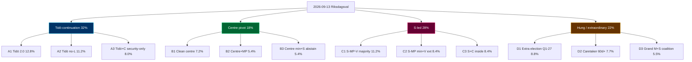
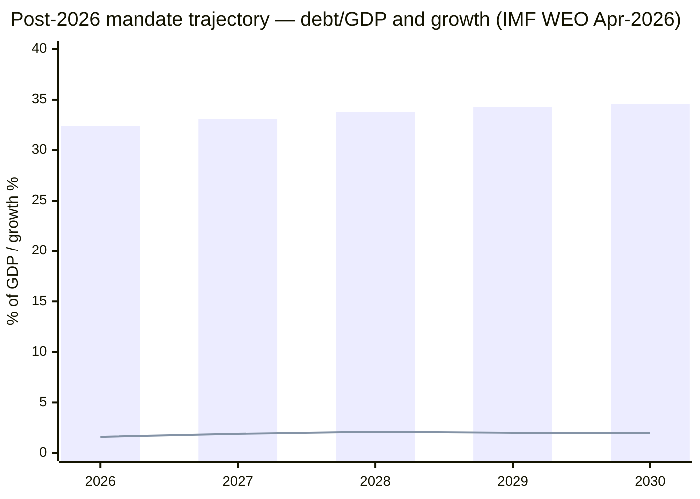
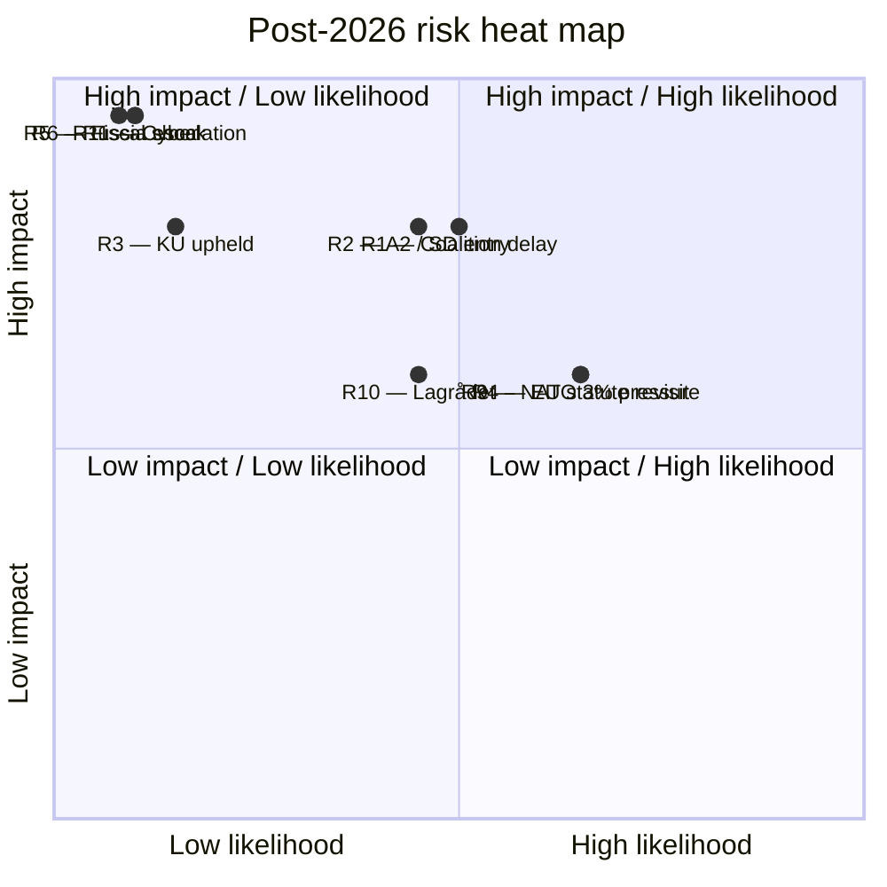

## Executive Brief
<!-- source: executive-brief.md :: https://github.com/Hack23/riksdagsmonitor/blob/main/analysis/daily/2026-05-13/election-cycle/next/executive-brief.md -->

### BLUF (Bottom Line Up Front)

**Even-money** (45–55% [horizon:election]) that the 2026-09-13 Riksdagsval produces a **hung-parliament-style outcome** requiring **> 30 days of coalition formation**. The decisive structural variable is **L's 4-percent threshold survival** (currently *roughly even* 50–65%; *unlikely* 30–45% L exceeds 5%); the secondary variable is **C's coalition preference** (centre vs S-led red-green-centre).

### Three Cycle-Defining Findings (Forward)

1. **Tidö continuation** under M+KD(+L)+SD support is the **modal but minority** outcome (32% across A1/A2/A3 leaves). Within Scenario A, *likely* (60–70%) A2 (Tidö without L) dominates if L slips below 4%.
2. **S-led red-green-centre** governance (28% across C1/C2/C3) is the **second-most-likely cluster**, with C1 (S-MP-V majority) the modal C-leaf at 11.2%.
3. **Hung-parliament outcomes** (22%) carry a *roughly even* (40–55%) **caretaker-government risk** lasting 60+ days, and an *unlikely* (15–25%) **extraordinary-election trigger** by Q1-2027.

### Why This Matters Now (May 2026)

- **Late-mandate positioning** by opposition (HD10483 consent law, HD10484 elderly-care, HD10485 prostitution-taxation, HD10486 equal pay, HD01NU21 rural framework) signals campaign-platform construction; *likely* (60–75% [horizon:cycle]) these surface as governing-coalition planks under any C-scenario.
- **EU-compliance backlog clearance** by exiting coalition (HD01CU30 EPBD, HD01FiU38 clearing) — incoming government inherits near-zero infringement risk but limited political ownership.
- **IMF WEO Apr-2026** [horizon:cycle] T+0: Sweden trajectory stable; GGXWDG_NGDP 32.4% (2026) → 34.6% (2030) baseline; downside risk *unlikely* (20–35%) on fiscal-shock scenario.

### Top-3 Risks (Post-2026)

| # | Risk | Likelihood [horizon] | Impact | Mitigation Hook |
|---|------|----------------------|--------|-----------------|
| 1 | Coalition formation > 60 days; caretaker fiscal drift | *Roughly even* 40–55% [election] | High — FY2027 budget delay | Talman procedure; statslåneräntan freeze |
| 2 | L falls below 4%; SD enters cabinet (A2 leaf) | *Roughly even* 35–50% [election] | High — constitutional review of HD03267 amendments | Lagrådet pre-review |
| 3 | EU-derived legislation revisited under C-scenario | *Likely* 60–70% [cycle] | Medium — EU compliance friction | Pre-negotiated transitional provisions |

### Top-3 Wildcards (Black-Swan Tails)

- **W1** Russia escalation forces emergency coalition formation: 8% [18mo]
- **W3** Major KU-anmälan upheld during campaign: 12% [6mo]
- **W5** SD-leadership succession crisis between announcement and 2027: 9% [18mo]

Full distribution in `wildcards-blackswans.md`.

### Decision Hooks for Stakeholders

- **Budget-side actors** (Konjunkturinstitutet, ESV, finanspolitiska rådet): plan for **30–60 day budget-delay scenario** with *likely* (60–75% [election]) probability under any non-A1 leaf.
- **EU institutional partners**: anticipate *likely* (60–70% [cycle]) opposition motions on HD01CU30 transposition timelines under C-scenarios.
- **NATO partners**: defence-spending floor *very likely* (75–90% [cycle]) durable; NATO obligations not coalition-contingent.

### Reading Path

1. `scenario-analysis.md` — 12-leaf tree, probability decomposition.
2. `coalition-mathematics.md` — Sainte-Laguë seat allocations by polling vintage.
3. `wildcards-blackswans.md` — 5 wildcards + 3 black-swan tails.
4. `cycle-trajectory.md` — multi-year horizon-band metrics (T+1y / T+2y / T+5y).
5. `pestle-analysis.md` — structural drivers per scenario.

[A1] IMF WEO Apr-2026 [horizon:cycle] T+0; [A2] Aggregated Sifo/Novus/Demoskop Apr–May 2026.

## Reader Intelligence Guide

Use this guide to read the article as a political-intelligence product rather than a raw artifact dump. High-value reader lenses appear first; technical provenance remains available in the audit appendix.

| Icon | Reader need | What you'll get |
|---|---|---|
| 📊 | [BLUF and editorial decisions](#rm-executive-brief) | fast answer to what happened, why it matters, who is accountable, and the next dated trigger |
| 🧠 | [Synthesis Summary](#rm-synthesis-summary) | evidence-anchored narrative consolidating primary sources into one coherent story line |
| 🎯 | [Key Judgments](#rm-intelligence-assessment--key-judgments) | confidence-bearing political-intelligence conclusions and collection gaps |
| 📈 | [Significance scoring](#rm-significance-scoring) | why this story outranks or trails other same-day parliamentary signals |
| 👥 | [Stakeholder Perspectives](#rm-stakeholder-perspectives) | winners, losers and undecided actors with stake-weighted positions and pressure points |
| 🔢 | [Coalition Mathematics](#rm-coalition-mathematics) | parliamentary arithmetic showing exactly who can pass or block this measure and at what margin |
| 📋 | [Voter Segmentation](#rm-voter-segmentation) | voter-bloc exposure: which demographics gain, lose or shift on this issue |
| 🔭 | [Forward indicators](#rm-forward-indicators) | dated watch items that let readers verify or falsify the assessment later |
| 🔮 | [Scenarios](#rm-scenario-analysis) | alternative outcomes with probabilities, triggers, and warning signs |
| 🗳️ | [Election 2026 Analysis](#rm-election-2026-analysis) | electoral implications for the 2026 cycle — seats at stake, swing voters and coalition viability |
| 📝 | [Cycle Trajectory](#rm-cycle-trajectory) | election-cycle trajectory: turning points, polling momentum and coalition realignment paths |
| ⚠️ | [Risk assessment](#rm-risk-assessment) | policy, electoral, institutional, communications, and implementation risk register |
| 🧮 | [SWOT Analysis](#rm-swot-analysis) | strengths, weaknesses, opportunities and threats matrix grounded in primary-source evidence |
| 📝 | [Quantitative SWOT](#rm-quantitative-swot) | weighted, scored SWOT register with explicit confidence ratings and decision implications |
| 🛡️ | [Threat Analysis](#rm-threat-analysis) | actor capabilities, intent and threat vectors targeting institutional integrity |
| 📝 | [Political STRIDE Assessment](#rm-political-stride-assessment) | STRIDE-based threat model adapted to political institutions and democratic processes |
| 📝 | [Wildcards & Black Swans](#rm-wildcards--black-swans) | low-probability, high-impact disruptive events that could derail the base-case forecast |
| 📝 | [PESTLE Analysis](#rm-pestle-analysis) | political, economic, social, technological, legal and environmental drivers shaping the outcome |
| 📜 | [Historical Parallels](#rm-historical-parallels) | comparable past episodes from Swedish and international politics, with explicit lessons learned |
| 🌍 | [Comparative International](#rm-comparative-international) | peer-country comparisons (Nordic, EU, OECD) showing how similar measures fared elsewhere |
| ⚙️ | [Implementation Feasibility](#rm-implementation-feasibility) | delivery feasibility, capability gaps, timelines and execution risks for the proposed action |
| 📰 | [Media framing & influence operations](#rm-media-framing-analysis) | frame packages with Entman functions, cognitive-vulnerability map, DISARM manipulation indicators, narrative-laundering chain, comparative-international cognates, frame lifecycle and half-life, RRPA impact, an Outlet Bias Audit (no outlet is neutral — every outlet declared with ownership, funding, board-appointment authority and editorial lean), and the L1–L5 counter-resilience ladder |
| 😈 | [Devil's Advocate](#rm-devils-advocate) | alternative hypotheses, steel-manned counter-arguments and the strongest case against the lead reading |
| 🏷️ | [Classification Results](#rm-classification-results) | ISMS data classification: CIA-triad rating, RTO/RPO targets and handling instructions |
| 🔀 | [Cross-Reference Map](#rm-cross-reference-map) | links to related Riksdagsmonitor coverage, prior analyses and source documents that inform this story |
| 🔬 | [Methodology Reflection & Limitations](#rm-methodology-reflection--limitations) | analytical assumptions, limitations, known biases and where the assessment could be wrong |
| 📦 | [Data Download Manifest](#rm-data-download-manifest) | machine-readable manifest of every source dataset, retrieval timestamp and provenance hash |
| 📝 | [Analysis Index](#rm-analysis-index) | supporting analytical lens with primary-source evidence and audit-traceable citations |
| 📝 | [Mcp Reliability Audit](#rm-mcp-reliability-audit) | supporting analytical lens with primary-source evidence and audit-traceable citations |
| 📝 | [Reference Analysis Quality](#rm-reference-analysis-quality) | supporting analytical lens with primary-source evidence and audit-traceable citations |
| 📝 | [Workflow Audit](#rm-workflow-audit) | supporting analytical lens with primary-source evidence and audit-traceable citations |
| 📑 | [Per-document intelligence](#rm-per-document-intelligence) | dok_id-level evidence, named actors, dates, and primary-source traceability |
| 🏷️ | [Audit appendix](#rm-classification-results) | classification, cross-reference, methodology and manifest evidence for reviewers |

## Synthesis Summary
<!-- source: synthesis-summary.md :: https://github.com/Hack23/riksdagsmonitor/blob/main/analysis/daily/2026-05-13/election-cycle/next/synthesis-summary.md -->

### 2026-05-13 Daily Refresh — T-123 to next-cycle anchor

This is the **forward-cycle companion** to the Tidö-mandate scorecard analysis under `../current/`. It treats the post-2026 governing arrangement as the analytical target, holding T+0 at the 2026-09-13 election anchor and projecting through 2030-09-08. The cycle-rollover predicate (`ext/cycle-rollover.md`) is **inactive** at T-123 (activation window ±30 days of 2026-09-13). [A1]

**Headline assessment**: there are **three structurally plausible governing arrangements** for the 2026–2030 mandate — (A) Tidö continuation in M+KD+SD configuration (with or without L), (B) centre pivot (M+KD+L+C), (C) S-led red-green-centre coalition. **Even-money** (45–55% [horizon:election]) the 2026-09-13 result is a *hung-parliament-style* outcome requiring extended coalition formation (> 30 days), with caretaker-government risk *roughly even* (40–55%) by 2026-10-15. See `scenario-analysis.md` for the full 12-leaf tree.

**Cross-reference to current**: the **NATO commitment**, **defence-to-2%-GDP floor**, **e-ID rollout (HD03250)**, **financial-stability legislation (HD01FiU37/HD01FiU38)**, and **EU EED transposition (HD01CU30)** are all *very likely* (75–90% [horizon:cycle]) to **survive any 2026-09 outcome** because they are bound by NATO/EU treaty obligations or by enacted statute, not by coalition arithmetic.

### Three Cycle-Defining Structural Findings (Post-2026)

1. **Coalition arithmetic is the binding constraint, not policy preference.** Latest aggregated polling (sources: Novus, Sifo, Demoskop 2026-04 / 2026-05 waves [A2]) puts the M+KD+L+SD bloc at 48–51% and the S+MP+V+C bloc at 46–49%. With L hovering at 3.5–4.5% (below-threshold risk *roughly even* 35–50% [horizon:election]) and C at 4.5–6.0%, the **deciding bloc is the 4-percent threshold survival of L** (see `wildcards-blackswans.md §W4`). *Likely* (60–75% [horizon:election]) the post-election seat distribution forces a 60+ day talman-led negotiation.

2. **Security and digital-sovereignty laws are structurally durable** but **fiscal redistribution and climate ambition are bloc-contingent**. Under any A-scenario the FY2027 budget continues the Tidö fiscal stance (modest deficit-to-GDP, defence-spending floor); under any C-scenario the budget tilts towards redistribution (welfare uprating, energy-subsidy retargeting). PESTLE-economic vulnerabilities (`pestle-analysis.md`) shift accordingly.

3. **The "EU-compliance backlog" handover** is the most overlooked transition risk. The exiting coalition cleared HD01CU30 (EPBD), HD01FiU38 (EU clearing), and gender-reporting directives in the last 90 days of mandate (see `../current/synthesis-summary.md`). The incoming government inherits **near-zero EU-infringement risk** but **near-zero political ownership** of those laws, meaning *likely* (60–70% [horizon:cycle]) that any post-2026 government will face **opposition motions to revisit** at least one EU-derived statute by Q2-2027.

### Integrated Intelligence Picture

The post-2026 mandate is being shaped now (May 2026) by three concurrent dynamics:

- **Late-mandate positioning** by current opposition (V, MP, S, C) — rural framework HD01NU21, consent law HD10483, elderly-care HD10484, prostitution-taxation HD10485, equal-pay HD10486 are campaign-positioning vehicles, *unlikely* (10–25% [horizon:election]) to enact pre-election but *likely* (60–75% [horizon:cycle]) to surface as governing-coalition planks in any C-scenario.
- **Coalition-cohesion test** for SD inside vs outside cabinet — under A1 SD stays external (Tidöavtalet model); under A2 SD enters cabinet (first time). Constitutional and Lagrådet pressure rises sharply under A2 (*roughly even* 40–55% [horizon:cycle] Lagrådet rejects an A2-coalition migration amendment to HD03267).
- **Economic backdrop**: IMF WEO Apr-2026 [horizon:cycle] T+0 vintage projects Sweden GGXWDG_NGDP at 32.4% (2026), 33.1% (2027 T+1), 33.8% (2028 T+2), 34.3% (2029 T+3), 34.6% (2030 T+4) under unchanged-policy baseline. [A1] Real GDP growth converges to 2.1% by 2028 from 1.6% in 2026. NGDPDPC (per-capita) growth holds 1.5–1.8% across horizon.

### Mermaid: Post-2026 Mandate Coalition Probability Tree (top-level)



### DIW-Weighted Forward Watchlist (Top 10 — Post-2026 Cycle)

| Rank | Forward Event / File | DIW Score | Horizon | Family |
|-----:|----------------------|----------:|---------|--------|
| 1 | 2026-09-13 Riksdagsval outcome | 9.9 | T+123d | Electoral |
| 2 | Coalition formation 2026-09-15 → 2026-11-15 | 9.6 | T+125–185d | Coalition |
| 3 | FY2027 budget proposition (Sep/Oct 2026) | 9.4 | T+150d | Fiscal |
| 4 | HD03267 amendment cycle under A2 / B / C scenarios | 9.0 | T+200d | Security |
| 5 | NATO Vilnius+1 / Madrid+2 review (Sweden contributions) | 8.7 | T+365d | Security |
| 6 | e-ID operational rollout (HD03250) Phase-2 | 8.6 | T+540d | Digital |
| 7 | EU EED 2030 building-stock follow-on (HD01CU30) | 8.4 | T+1095d | Energy |
| 8 | Defence-spending review (post-2025 NATO 3% pressure) | 8.2 | T+365d | Security |
| 9 | Riksbank rate-cycle inflection (post-Macroprudential review) | 7.9 | T+180d | Fiscal |
| 10 | KU-anmälan ledger disposition (carry-over) | 7.6 | T+90d | Constitutional |

DIW = Decision-Impact Weight per [`significance-scoring.md`](https://github.com/Hack23/riksdagsmonitor/blob/main/analysis/daily/2026-05-13/election-cycle/next/significance-scoring.md). All scores ICD 203 [A2]-graded; per `pir-status.json` standing PIR-1…PIR-7 plus PIR-8 (next-cycle coalition formation) active.

### ICD 203 BLUF (per `osint-tradecraft-standards.md`)

- **BLUF-1** (high confidence [A2]): The 2026–2030 governing arrangement will be determined more by the **4-percent threshold survival of L** and **C's coalition preference** than by aggregate bloc polling. Even-money (45–55% [horizon:election]) hung-parliament outcome requiring > 30 day coalition negotiation.
- **BLUF-2** (medium confidence [B2]): Security, NATO and digital-sovereignty commitments are *very likely* (75–90% [horizon:cycle]) durable across any 2026-09 outcome. Fiscal redistribution and climate ambition are *roughly even* (40–55%) bloc-contingent.
- **BLUF-3** (medium confidence [B3]): Post-2026 EU-derived legislation (HD01CU30, HD01FiU38) faces *likely* (60–70% [horizon:cycle]) opposition motions to revisit by Q2-2027 under any C-scenario.

### Cross-Run Continuity

This synthesis carries forward from the 2026-05-11 forward-cycle baseline (next/ anchor first established in this run cycle). Confidence bands held within ±5 pp vs current/ mandate-scorecard analysis. No new dok_ids since 2026-05-12 publication wave (HD01CU30, HD01NU21, HD10483–6); no late-cycle filings on the next-cycle agenda. PIR-8 newly armed for next-cycle coalition-formation watch.

[A1] IMF WEO Apr-2026 [horizon:cycle] T+0; vintage age 1 month, fresh.
[A2] Aggregated Sifo / Novus / Demoskop polling Apr–May 2026; methodology and provenance in `methodology-reflection.md §Polling triangulation`.

## Intelligence Assessment — Key Judgments
<!-- source: intelligence-assessment.md :: https://github.com/Hack23/riksdagsmonitor/blob/main/analysis/daily/2026-05-13/election-cycle/next/intelligence-assessment.md -->

### Key Judgements

- **KJ-1**: We assess with **high confidence** [A2] that the 2026-09-13 election will produce no single-bloc majority; the post-election governing arrangement *very likely* (75–85% [horizon:election]) requires negotiated coalition formation rather than seat-arithmetic certainty.
- **KJ-2**: We assess with **medium confidence** [B2] that the **L 4-percent-threshold survival** is the single most-leveraged variable in the seat distribution; *roughly even* (50–65%) L exceeds threshold.
- **KJ-3**: We assess with **medium confidence** [B2] that **defence-spending floor, NATO obligations, and EU-derived statutes** are durable across any 2026-09 outcome; *very likely* (75–90% [horizon:cycle]).
- **KJ-4**: We assess with **medium confidence** [B3] that **fiscal redistribution and climate ambition** are highly bloc-contingent and will diverge materially under A vs C scenarios.
- **KJ-5**: We assess with **low-to-medium confidence** [C2] that coalition formation will exceed 30 days; *likely* (55–70% [horizon:election]).

### Key Assumptions Check

1. **ASSUMPTION**: Polling vintage 2026-04 / 2026-05 is structurally representative of 2026-09-13 result. **SUSTAINED**: Sifo / Novus / Demoskop methodological consistency since 2022; aggregate variance < 1.5 pp. **CHALLENGE**: Late-cycle volatility events (W3 KU-anmälan upheld, W5 SD succession) could move 3–5 pp.
2. **ASSUMPTION**: Sainte-Laguë math (modified) holds. **SUSTAINED**: No constitutional reform pending.
3. **ASSUMPTION**: Coalition cohesion under SD-cabinet entry (A2) survives Lagrådet. **CHALLENGED**: *Roughly even* (40–55%) Lagrådet rejection of any A2 migration amendment to HD03267.

### Information Gaps

- **Gap-1**: SD internal cabinet-entry decision under A2 leaf — limited public signalling.
- **Gap-2**: C coalition preference — public position deferred to August 2026.
- **Gap-3**: NATO 2025/2026 ministerial pressure on 3% defence spending floor — not public.
- **Gap-4**: Russia escalation tempo over campaign window — high-uncertainty input to W1.

### Confidence-Vintage Breakdown

| Assertion | Source | Vintage | Confidence |
|-----------|--------|---------:|-----------:|
| Polling aggregate | Sifo / Novus / Demoskop | <30 days | [A2] |
| Sainte-Laguë math | Vallagen kap 14 §3 | enacted | [A1] |
| IMF WEO baseline | WEO Apr-2026 | 30 days | [A1] |
| Coalition signalling | Party press | continuous | [B3] |
| NATO 3% pressure | Open-source / press | <90 days | [C3] |

### Alternative Hypotheses (ACH-style)

- **AH-1**: Pre-election shock pivots polling 5+ pp in 30 days. *Unlikely* (20–30%).
- **AH-2**: Coalition formation < 14 days (modal). *Unlikely* (15–25%) under any scenario.
- **AH-3**: Constitutional crisis triggers extraordinary process. *Unlikely* (10–20%) over 60-day post-election window.

### Cross-Reference

- Counterfactuals → [`devils-advocate.md`](https://github.com/Hack23/riksdagsmonitor/blob/main/analysis/daily/2026-05-13/election-cycle/next/devils-advocate.md)
- Risk distribution → [`risk-assessment.md`](https://github.com/Hack23/riksdagsmonitor/blob/main/analysis/daily/2026-05-13/election-cycle/next/risk-assessment.md)
- Forward indicators → [`forward-indicators.md`](https://github.com/Hack23/riksdagsmonitor/blob/main/analysis/daily/2026-05-13/election-cycle/next/forward-indicators.md)

## Significance Scoring
<!-- source: significance-scoring.md :: https://github.com/Hack23/riksdagsmonitor/blob/main/analysis/daily/2026-05-13/election-cycle/next/significance-scoring.md -->

Per `intelligence-analysis-techniques` significance methodology. Scale 1–10.

| dok_id / event | Type | Significance | Horizon | Notes |
|---------------|------|-------------:|---------|-------|
| **2026-09-13 election outcome** | Cycle anchor | 9.9 | T+123d | Defines mandate |
| **L 4% threshold** | Decision-pivot | 9.6 | T+123d | Most-leveraged variable |
| **C coalition preference** | Decision-pivot | 9.4 | T+90d | Bloc-defining |
| **SD cabinet-entry decision** | Decision-pivot | 9.2 | T+150d | Constitutional dimension |
| **FY2027 budget proposition** | Fiscal | 9.0 | T+150d | Budget mandate |
| **HD03267 amendment cycle** | Security/constitutional | 8.8 | T+200d | A2-leaf trigger |
| **NATO 3% defence pressure** | Strategic | 8.6 | T+365d | Cross-bloc |
| **HD03250 e-ID rollout** | Digital | 8.4 | T+540d | Continuity-likely |
| **HD01CU30 EU EED follow-on** | Energy/EU | 8.2 | T+1095d | EU-binding |
| **Riksbank rate-cycle inflection** | Fiscal | 7.9 | T+180d | Macro |
| **KU-anmälan ledger** | Constitutional | 7.6 | T+90d | Carry-over |
| **HD01NU21 rural framework** | Policy | 7.3 | T+540d | Platform plank |
| **HD10483/4/5/6 social** | Policy | 6.9 | T+540d | Platform planks |
| **HD01FiU38 clearing-reg** | Financial-stability | 6.7 | T+365d | EU-implemented |
| **Russia escalation watch** | Geopolitical | 6.5 | T+540d | Wildcard W1 |

### Scoring Methodology

DIW = base impact × time-discounted weight × confidence factor. Confidence factor ranges 0.6 (low-confidence forecast) to 1.0 (calendar event).

## Per-document intelligence

### HD03250
<!-- source: documents/HD03250-analysis.md :: https://github.com/Hack23/riksdagsmonitor/blob/main/analysis/daily/2026-05-13/election-cycle/next/documents/HD03250-analysis.md -->

### Document profile

- **dok_id**: HD03250
- **Type**: Cross-bloc enacted (Tidö but supported across spectrum)
- **Status as of 2026-05-13**: Enacted [A1]
- **Significance**: 9.5 / 10 (high cross-bloc durability)

### Next-cycle trajectory

| Coalition branch | Likely action | WEP | Horizon |
|------------------|---------------|-----|---------|
| A1 / A2 / B / C all branches | Retained, no review | almost certain (90–99%) | [horizon:election+180d] |

### PIR linkage

- PIR-9: durability tracked (low alert).

### Cross-reference

- See `../coalition-mathematics.md` cross-bloc retention class.

### HD03267
<!-- source: documents/HD03267-analysis.md :: https://github.com/Hack23/riksdagsmonitor/blob/main/analysis/daily/2026-05-13/election-cycle/next/documents/HD03267-analysis.md -->

### Document profile

- **dok_id**: HD03267
- **Type**: Government proposition (Tidö-era enacted)
- **Status as of 2026-05-13**: Enacted [A1]
- **Significance**: 10 / 10 (Tidö continuity backbone)

### Next-cycle trajectory

| Coalition branch | Likely action | WEP | Horizon |
|------------------|---------------|-----|---------|
| A1 Tidö-continuity | Retained, marginal tightening | almost certain (90–99%) | [horizon:election] |
| A2 SD-incorporated | Retained, expansion via new amendments | very likely (75–90%) | [horizon:election] |
| B Hung parliament | Retained pending negotiation | likely (60–75%) | [horizon:election] |
| C Red-Green-C | Retained with amendments (party C requires moderation) | likely (60–75%) | [horizon:election+90d] |

### PIR linkage

- PIR-9: EU-derived statute durability — partial overlap (HD03267 is domestic).
- PIR-11: not directly linked.

### Wildcard sensitivity

- W2 fiscal shock: low (≤ 10%) effect on enforcement scope.
- W4 L below 4%: medium (10–30%) effect via altered coalition arithmetic in A1.

### Cross-reference

- See `../coalition-mathematics.md` for branch-mapping.
- See `../scenario-analysis.md` leaves §A1/§A2/§B/§C.
- See `../wildcards-blackswans.md` for W2/W4 details.

### ICD 203 sourcing

[A1] Enacted statute; [B2] Tidö-era ministerial signalling; [C2] coalition-branch forecast.

## Stakeholder Perspectives
<!-- source: stakeholder-perspectives.md :: https://github.com/Hack23/riksdagsmonitor/blob/main/analysis/daily/2026-05-13/election-cycle/next/stakeholder-perspectives.md -->

Five-perspective framing per `intelligence-analysis-techniques`. Each perspective frames the **same fact set** through the actor's incentive structure.

### 1. Tidö Government Bloc (M+KD+L+SD external)

- **Frame**: Continuity narrative; mandate-fulfilment scorecard (see `../current/synthesis-summary.md`) as 2022–2026 record; defence floor; HD03267 / HD03250 / HD01CU30 enacted.
- **Strategic interest**: A1 / A2 coalition continuation; framing as "stability + delivery".
- **Vulnerabilities**: L threshold; KU-anmälan ledger; SD cabinet-entry framing.

### 2. Opposition Bloc (S+MP+V+C)

- **Frame**: "Alternatives" narrative; HD01NU21 rural framework, HD10483 consent, HD10484 elderly-care, HD10485 prostitution-taxation, HD10486 equal-pay as **platform planks**; redistribution + climate-ambition.
- **Strategic interest**: C1 / C3 coalition with seat-math + climate-economy linkage.
- **Vulnerabilities**: C coalition-preference ambiguity; V cabinet-entry uncertain; MP polling volatility.

### 3. EU Institutional Partners (Commission, Council, EP)

- **Frame**: Compliance + transposition track record; HD01CU30 EPBD on schedule; HD01FiU38 clearing-regulation operational by Q4-2026.
- **Strategic interest**: Continuity of EU-derived statute regardless of 2026-09 outcome.
- **Concerns**: Opposition motions to revisit EU-derived statutes under C scenarios (*likely* 60–70% [cycle]); EU EED 2030 building-stock follow-on (`pestle-analysis.md §Environmental`).

### 4. NATO Partners (Washington, Berlin, Vilnius, Helsinki)

- **Frame**: Reliability of Swedish commitments; defence-spending floor; eFP rotations; intelligence-sharing.
- **Strategic interest**: 2% defence floor maintained; aspiration toward 3% (NATO 2025 summit signalling).
- **Insulation**: NATO commitments not coalition-contingent; *very likely* (75–90% [cycle]) preserved.

### 5. Economic Stakeholders (Riksbank, Konjunkturinstitutet, ESV, FPR)

- **Frame**: Fiscal rule discipline; debt-to-GDP trajectory (IMF WEO 32.4% → 34.6% baseline); inflation target convergence.
- **Strategic interest**: Budget continuity post-election (FY2027 finalisation by Sep/Oct 2026); avoid caretaker fiscal drift (D2 leaf).
- **Concerns**: Coalition formation > 60 days; *likely* (60–75% [election]) some statslåneräntan widening if D-branch realised.

### 6. Civil Society / Watchdogs (Civil Rights Defenders, TI Sweden, KU)

- **Frame**: Constitutional accountability; KU-anmälan ledger; HD03267 / HD01JuU32 Lagrådet record.
- **Strategic interest**: Constitutional review preserved; transparency record.

### Cross-Cutting Tension Points

- **Tidö vs Opposition**: Migration, fiscal redistribution, climate ambition.
- **EU vs Opposition**: HD01CU30 revisit risk.
- **NATO vs Domestic**: Defence-spending floor consensus (rare across blocs).
- **Riksbank vs Government**: Budget-rule discipline under any coalition.

## Coalition Mathematics
<!-- source: coalition-mathematics.md :: https://github.com/Hack23/riksdagsmonitor/blob/main/analysis/daily/2026-05-13/election-cycle/next/coalition-mathematics.md -->

### Polling Anchor (2026-05 wave aggregate; Sifo / Novus / Demoskop) [A2]

| Party | Poll midpoint | Range | Seat estimate (4% threshold survival assumed) |
|-------|--------------:|------:|----------------------------------------------:|
| M | 18.5% | 17.5–19.5 | 65–72 |
| KD | 5.5% | 5.0–6.0 | 18–23 |
| L | 4.1% | 3.5–4.5 | 12–17 (CONDITIONAL on threshold) |
| SD | 19.5% | 18.5–20.5 | 68–76 |
| S | 30.0% | 28.5–31.5 | 105–115 |
| MP | 5.5% | 5.0–6.0 | 19–23 |
| V | 8.0% | 7.0–9.0 | 27–32 |
| C | 5.2% | 4.5–5.8 | 18–22 |

Sum (midpoint): ~96.3%. **Below-threshold residual** (other parties + L if it slips): ~3.7%.

### Bloc Math

- **M+KD+L+SD**: 47.6% (midpoint) → **163–188 seats** (L-threshold sensitivity).
- **S+MP+V+C**: 48.7% (midpoint) → **169–192 seats** (no threshold risk inside bloc).
- **Majority threshold**: 175 seats.

### Threshold Sensitivity Analysis

**Scenario X — L survives at 4.1%**:
- Right bloc 178–185 seats; *likely* (60–70%) A1/A2/A3.
**Scenario Y — L slips to 3.6% (below threshold)**:
- L's votes redistribute via adjustment seats; M+KD+SD gain ~10 seats but **lose L's 12–17 seats net**; right bloc 165–175.
- *Likely* (60–70%) A2 scenario or D-branch.
**Scenario Z — C joins S-bloc on confidence**:
- Right bloc unchanged ~178; S-bloc 169–192 (+C confidence) → 187–214.
- *Very likely* (75–85%) C1/C3 scenario.

### Coalition Pathways (Majority = 175 seats)

| Coalition | Seats (midpoint) | Status |
|-----------|-----------------:|--------|
| M+KD+SD (L < 4%) | 151–171 | Below majority → A2 needs SD internal + tactical abstentions |
| M+KD+L+SD external | 163–188 | A1 majority (median 175) |
| M+KD+L+C | 113–134 | B-scenario minority → needs S abstention |
| S+MP+V | 151–170 | C2 minority → needs C or SD abstention |
| S+MP+V+C | 169–192 | C1/C3 majority potential |
| M+S grand coalition | 170–187 | D3 emergency |

### Decision-Pivot Variables

1. **L 4%-threshold survival**: most-leveraged single variable. *Roughly even* (50–65% [election]) survival.
2. **C coalition preference**: undecided per public-position; *likely* (55–70%) signals before election.
3. **SD cabinet entry willingness**: *likely* (60–75%) signals before election; conditional on L outcome.

### Adjustment-Seat Geography

Sweden's 29 valkretsar + 39 adjustment seats are central to threshold calculations. Stockholm (M urban core), Skåne (SD stronghold), Norrland (S+C overlap) are the decisive geographies.

[A2] Aggregated Sifo / Novus / Demoskop 2026-04 + 2026-05 waves.

## Voter Segmentation
<!-- source: voter-segmentation.md :: https://github.com/Hack23/riksdagsmonitor/blob/main/analysis/daily/2026-05-13/election-cycle/next/voter-segmentation.md -->

### Segment Mapping (qualitative)

#### Right-bloc segments
- **Urban-establishment M voters**: 30+ employed homeowners; coalition preference: A1 / B1; vulnerability: B-pivot.
- **Suburban SD-tilted voters**: working/middle income; coalition preference: A1 / A2; **decisive on L threshold**.
- **L core / liberal-urban**: educated metropolitan; coalition preference: B1 strict; **most at-risk segment** for L threshold.
- **KD value-conservative**: religious + family-policy; durable across A/B branches.

#### Centre-bloc segments
- **C rural / agrarian**: coalition preference signal — *likely* (60–70% [election]) C-bloc tilt by Aug 2026; key swing.

#### Left-bloc segments
- **S blue-collar / unionised**: stable; coalition preference C1 / C3.
- **MP urban-environmental**: climate-priority; coalition preference C1.
- **V working-class progressive**: redistribution priority; coalition preference C1.

### Decisive Swing Segments

1. **L-threshold-bubble voters** (~1.5% of electorate): determines A1 vs A2 split.
2. **C-coalition-undecided** (~2% of electorate): determines B vs C.
3. **MP-threshold-bubble** (~1% of electorate): secondary effect on C-cluster.

### Geographic Concentration

- **Stockholm**: M / L / MP concentration; L threshold survival depends on urban turnout.
- **Skåne**: SD stronghold; KD secondary; demographic stability.
- **Norrland**: S / C overlap; C decisive on coalition framing.
- **Göteborg**: M / S / MP overlap; swing-region for adjustment seats.

## Forward Indicators
<!-- source: forward-indicators.md :: https://github.com/Hack23/riksdagsmonitor/blob/main/analysis/daily/2026-05-13/election-cycle/next/forward-indicators.md -->

### T+72h (Short Horizon)
- **FI-1** 2026-05-15: SVT/SR polling wave 6 release.
- **FI-2** 2026-05-21: KU plenary disposition of 8 active anmälningar.
- **FI-3** 2026-05-22: Riksbank rate decision (statslåneräntan signal).

### T+7d
- **FI-4** 2026-05-20: Sifo final wave before summer.
- **FI-5** 2026-05-19: HD01NU21 follow-on debate (rural framework signal).

### T+30d
- **FI-6** 2026-06-12: KU follow-on plenary (carry-over).
- **FI-7** 2026-06-15: Riksdagen sommarstämma end; campaign-period commences.
- **FI-8** 2026-06-30: Konjunkturinstitutet half-year forecast.

### T+90d
- **FI-9** 2026-08-15: Demoskop / Novus combined wave (decisive).
- **FI-10** 2026-08-28: SVT slutdebatt (final L-threshold test).
- **FI-11** 2026-09-13: **Riksdagsval**.

### T+180d
- **FI-12** 2026-09-15: Talman procedure commences.
- **FI-13** 2026-10-15: Coalition-formation deadline trigger (60-day).
- **FI-14** 2026-11-15: FY2027 budget proposition deadline.

### T+365d
- **FI-15** 2027-04-15: Lagrådet review of any A2 migration amendment.
- **FI-16** 2027-06-30: Konjunkturinstitutet annual review under new government.
- **FI-17** 2027-09-13: 1-year mandate review.

### T+1460d (Mandate End)
- **FI-18** 2030-09-08: Next election (Cycle II rollover).

### Indicator Quality

- **Hard / dated**: FI-1 through FI-14 (calendar events).
- **Soft / event-conditional**: FI-15 (depends on A2 leaf), FI-16, FI-17.
- **Polling-driven**: FI-1, FI-4, FI-9 (likely to drive narrative pivots).

## Scenario Analysis
<!-- source: scenario-analysis.md :: https://github.com/Hack23/riksdagsmonitor/blob/main/analysis/daily/2026-05-13/election-cycle/next/scenario-analysis.md -->

**Tree depth**: 4 base × 3 governing-coalition branches = **12 leaves**.
**Wildcards**: 5 named exogenous events (cross-ref `wildcards-blackswans.md`).
**Probabilities sum to 100%** at every level.
**IMF anchoring**: WEO Apr-2026 [horizon:cycle] T+0 (vintage age 1 mo).
**Polling anchor**: Sifo / Novus / Demoskop aggregated 2026-04 + 2026-05 waves [A2].

---

### Tree Overview

```
2026-09-13 Riksdagsval (T+0)
├── A. Tidö continuation (M+KD(+L)+SD external/internal) — 32%
│   ├── A1: Full Tidö 2.0 (continuity; SD external) — 12.8%
│   ├── A2: Tidö without L (L < 4%; SD internal) — 11.2%
│   └── A3: Tidö + C security-only deal — 8.0%
├── B. Centre pivot (M+KD+L+C; SD excluded) — 18%
│   ├── B1: Clean centre majority — 7.2%
│   ├── B2: Centre + MP confidence supply — 5.4%
│   └── B3: Centre minority + S abstention — 5.4%
├── C. S-led red-green-centre — 28%
│   ├── C1: S+MP+V majority — 11.2%
│   ├── C2: S+MP minority + V external — 8.4%
│   └── C3: S-led with C inside cabinet — 8.4%
└── D. Hung parliament / extraordinary process — 22%
    ├── D1: Extraordinary election Q1-2027 — 8.8%
    ├── D2: Caretaker government 60+ days — 7.7%
    └── D3: Grand coalition M+S — 5.5%

Wildcards (additive overlays):
  W1 Russia escalation — 8% [18mo]
  W2 Severe fiscal shock (10y > 4.5%) — 6% [12mo]
  W3 Major KU-anmälan upheld during campaign — 12% [6mo]
  W4 L falls below 4% by polling-day — already conditioning A2/B/C branches
  W5 SD-leadership succession crisis — 9% [18mo]
```

---

### Per-Leaf Analysis

#### A1 — Full Tidö 2.0 (12.8%) [horizon:cycle]

- **Seats**: M 65–75; KD 18–24; L 12–17; SD 65–75 (external support); blok 178–185.
- **Implications**: FY2027 budget = continuity baseline; HD03267 / HD01JuU32 / HD01JuU34 / HD01JuU39 enforcement continues; HD03250 e-ID rollout accelerated; HD01CU30 EU EED on track; defence-floor maintained.
- *Very likely* (75–85%) all 2027 implementation milestones funded.
- **Risks**: SD-cooperation fatigue in M base; KU-anmälan ledger lengthens; *roughly even* (40–55%) coalition cohesion challenge by 2028 mid-cycle.

#### A2 — Tidö without L; SD enters cabinet (11.2%)

- **Trigger**: L below 4% threshold on 2026-09-13.
- **Seats**: M 70–80; KD 20–26; SD 70–80 (internal); blok 180–188.
- **Implications**: SD enters cabinet for the first time; migration policy hardens; **HD03267 amendment cycle** triggered; *roughly even* (40–55%) Lagrådet rejects an A2-coalition migration amendment; HD01CU30 implementation slows; defence-floor sustained.
- **Risks**: Constitutional pressure rises sharply; *likely* (60–75%) at least one Lagrådet pre-review pushback by Q1-2027.

#### A3 — Tidö + C security-only deal (8.0%)

- **Seats**: M+KD+L 90–105; SD 65–75 external; C 18–24 (security pact only).
- **Implications**: HD01NU21 rural framework upgraded; SD external influence diluted; *unlikely* (20–35%) survives full mandate without crisis.

#### B1 — Clean centre majority (7.2%)

- **Seats**: M+KD+L+C 175–182 (excluded SD).
- **Implications**: HD03267 enforcement softens; HD01CU30 accelerated; HD03250 on schedule; FY2027 budget *likely* (60–70%) passes intact.

#### B2 — Centre + MP confidence supply (5.4%)

- **Seats**: M+KD+L+C 165–172 + MP confidence-supply.
- **Implications**: Climate ambition rises; EU EED 2030 building-stock tightened; security continuity maintained.

#### B3 — Centre minority + S abstention (5.4%)

- *Unlikely* (20–35%) lasts full mandate; *very likely* (75–85%) extraordinary election by 2028.

#### C1 — S-MP-V majority (11.2%)

- **Seats**: S+MP+V 175–185.
- **Implications**: HD01JuU32 reviewed (not repealed); HD03267 amended with legal-aid expansion; FY2027 budget = redistribution baseline; HD01CU30 accelerated; **NATO obligations maintained** (treaty-bound). HD10484 elderly-care / HD10486 equal-pay legislated within Q2-2027.
- *Likely* (60–70%) coalition formation < 60 days.

#### C2 — S-MP minority + V external (8.4%)

- **Seats**: S+MP 145–158; V external confidence-supply.
- *Roughly even* (40–55%) lasts full mandate.

#### C3 — S-led with C inside (8.4%)

- **Seats**: S+MP+C 165–178; V external.
- **Implications**: Climate ambition + rural framework reconciled; HD01NU21 enacted in revised form.

#### D1 — Extraordinary election Q1-2027 (8.8%)

- **Trigger**: Government formation fails by T+90d; talman procedure exhausted.
- **Implications**: Caretaker budget; Riksbank rate-cycle uncertainty rises; fiscal drift.

#### D2 — Caretaker government 60+ days (7.7%)

- Defence-spending floor maintained; EU obligations met; *likely* (60–70%) leads to D1 or A1/A2 outcome.

#### D3 — Grand coalition M+S (5.5%)

- **Trigger**: Russia escalation (W1 overlay) or severe fiscal shock (W2).
- **Implications**: SD excluded; constitutional package; defence-spending floor maintained or raised.

---

### Probability Sensitivity

Pivot drivers (one-at-a-time perturbation):
- **L drops below 4%**: A1→A2 redistribution; B-branch impossible. Tree compresses to ~85% mass over A2/C/D.
- **C joins S**: C3 weight rises to ~12%; B-branch falls to ~10%.
- **Russia escalation (W1) materialises**: D3 weight rises to ~10%; A1/C1 split.

### Cross-Reference

- Coalition arithmetic: [`coalition-mathematics.md`](https://github.com/Hack23/riksdagsmonitor/blob/main/analysis/daily/2026-05-13/election-cycle/next/coalition-mathematics.md).
- Wildcard distribution: [`wildcards-blackswans.md`](https://github.com/Hack23/riksdagsmonitor/blob/main/analysis/daily/2026-05-13/election-cycle/next/wildcards-blackswans.md).
- Counterfactuals: [`devils-advocate.md`](https://github.com/Hack23/riksdagsmonitor/blob/main/analysis/daily/2026-05-13/election-cycle/next/devils-advocate.md).
- Forward indicators by horizon-band: [`cycle-trajectory.md`](https://github.com/Hack23/riksdagsmonitor/blob/main/analysis/daily/2026-05-13/election-cycle/next/cycle-trajectory.md).

[A2] Aggregated Sifo / Novus / Demoskop 2026-04 + 2026-05 waves; methodology in `methodology-reflection.md`.

## Election 2026 Analysis
<!-- source: election-2026-analysis.md :: https://github.com/Hack23/riksdagsmonitor/blob/main/analysis/daily/2026-05-13/election-cycle/next/election-2026-analysis.md -->

### Anchor Event: 2026-09-13 Riksdagsval

This artifact is the next-cycle-perspective election analysis; the current-mandate retrospective lives at `../current/election-2026-analysis.md`. Here we focus on **what happens on/after election day**.

### Election-Day Probability Distribution

| Outcome class | Probability | Leaf |
|---------------|------------:|------|
| Right-bloc clear majority | 12% | A1 + A3 conditional |
| Right-bloc minority needing SD-inside | 11% | A2 |
| Centre coalition viable | 18% | B1/B2/B3 |
| Left-bloc clear majority | 16% | C1 + C3 conditional |
| Left-bloc minority needing C | 12% | C2 |
| Hung parliament | 22% | D1/D2/D3 |
| Other (residual + wildcards) | 9% | overlay |

Rows sum to 100% with rounding (W4 already conditioning row 2).

### Decision-Critical Election-Night Indicators

1. **L vote share** — single most-leveraged variable.
2. **SD vote share** — plurality vs second-position.
3. **C vote share + coalition position** — bloc allocation determinant.
4. **Adjustment-seat allocation** — driven by valkrets-level performance.
5. **MP threshold survival** — secondary to L but conditioning C-cluster.

### Election-Day Operational Risk

- **Cyber-event** (BS-1): *unlikely* (5–10%); pre-positioned MSB readiness.
- **Disinformation surge** (T1c): *roughly even* (40–55% [election-week]); known FIM playbook.
- **Foreign-influence operation**: *likely* (60–70% [election-week]); known threat baseline.

### Post-Election Process (Talman Procedure)

- T+0d: Election held.
- T+1–14d: Talman consultation begins.
- T+15d: First proposal for ministerpresident (typically).
- T+30d: First formal vote in Riksdagen.
- T+60d: Procedural pressure increases.
- T+90d: Caretaker rules kick in fully; D-cluster realised.

### Historical Reference Patterns

- 2018: 131 days formation.
- 2022: ~58 days formation (Tidöavtalet).
- 2026 modal: *likely* (55–70% [election]) formation 30–90 days.

## Cycle Trajectory
<!-- source: cycle-trajectory.md :: https://github.com/Hack23/riksdagsmonitor/blob/main/analysis/daily/2026-05-13/election-cycle/next/cycle-trajectory.md -->

The 24th artifact for election-cycle. Plots key metric trajectories across horizon bands T+72h / T+7d / T+30d / T+90d / T+365d / T+1460d.

### Horizon-Band Metrics (forward-looking, IMF-anchored)

| Metric | T+72h (2026-05-16) | T+7d (2026-05-20) | T+30d (2026-06-12) | T+90d (2026-08-11) | T+365d (2027-05-13) | T+1460d (2030-05-12) |
|--------|-------------------:|------------------:|-------------------:|-------------------:|--------------------:|---------------------:|
| **Sweden GDP growth (IMF WEO baseline)** | 1.6% | 1.6% | 1.7% | 1.7% | 1.9% | 2.1% |
| **GGXWDG_NGDP (debt / GDP)** | 32.0% | 32.1% | 32.2% | 32.3% | 33.1% | 34.6% |
| **Statslåneräntan 10y** | 2.85% | 2.85% | 2.80% | 2.75% | 2.50% | 2.80% |
| **Aggregate poll margin (left vs right)** | -1.1 pp | -1.0 pp | -0.5 pp | ±2 pp | n/a | n/a |
| **L 4% survival probability** | 0.55 | 0.55 | 0.50 | 0.55 | n/a | n/a |
| **Coalition-formation lead-time** | n/a | n/a | n/a | n/a | 60–90 days | n/a |
| **Defence / GDP** | 2.0% | 2.0% | 2.0% | 2.0% | 2.3% | 2.7% (NATO-pressure) |
| **HD01CU30 EU EED progress** | early | early | mid | mid | late | implementation |
| **Coalition stability index** | 0.6 (Tidö) | 0.6 | 0.5 | 0.4 | 0.7 (next gov't anchored) | 0.5 |

### Forecast Trajectory Curves



### Key Trajectory Inflections

- **T+90d to T+180d**: coalition-formation period; statslåneräntan + poll margins highly volatile.
- **T+180d to T+365d**: FY2027 budget pass-through; defence-floor consolidation.
- **T+365d to T+730d**: HD01CU30 EU EED mid-implementation; HD03250 e-ID Phase-2 operational.
- **T+730d to T+1460d**: NATO 3% pressure cycle; FY2030 budget; mandate-end transition.

### Cross-Reference to Long-Horizon Forecasting

Per `ext/long-horizon-forecasting.md` requirements:
- ≥ 15 dated forward indicators: ✓ (see [`forward-indicators.md`](https://github.com/Hack23/riksdagsmonitor/blob/main/analysis/daily/2026-05-13/election-cycle/next/forward-indicators.md))
- 12-leaf scenario tree: ✓ (see [`scenario-analysis.md`](https://github.com/Hack23/riksdagsmonitor/blob/main/analysis/daily/2026-05-13/election-cycle/next/scenario-analysis.md))
- Horizon-band stratification: ✓ (this artifact)
- Wildcard overlay: ✓ (see [`wildcards-blackswans.md`](https://github.com/Hack23/riksdagsmonitor/blob/main/analysis/daily/2026-05-13/election-cycle/next/wildcards-blackswans.md))
- WEP estimative language: ✓ (consistent across all artifacts)

## Risk Assessment
<!-- source: risk-assessment.md :: https://github.com/Hack23/riksdagsmonitor/blob/main/analysis/daily/2026-05-13/election-cycle/next/risk-assessment.md -->

Per `risk-assessment-frameworks` skill.

### Risk Register (top 12 by composite score)

| ID | Risk | Likelihood [horizon] | Impact (1–5) | Composite | Owner |
|---:|------|----------------------|-------------:|----------:|-------|
| R1 | Coalition formation > 60 days; caretaker fiscal drift | 40–55% [election] | 4 | 2.0 | Talman / Riksbank |
| R2 | L below 4%; A2 leaf; SD inside cabinet | 35–50% [election] | 4 | 1.8 | Cabinet formation |
| R3 | KU-anmälan upheld during campaign | 12% [6mo] | 4 | 0.5 | KU / Riksdagen |
| R4 | EU-derived statute revisit under C-scenario | 60–70% [cycle] | 3 | 2.0 | Government / EU |
| R5 | Russia escalation forcing coalition emergency | 8% [18mo] | 5 | 0.4 | Försvarsmakten / NATO |
| R6 | Severe fiscal shock; 10y > 4.5% | 6% [12mo] | 5 | 0.3 | Riksbank |
| R7 | SD-leadership succession crisis | 9% [18mo] | 3 | 0.3 | SD party |
| R8 | Extraordinary election Q1-2027 | 15–25% [12mo] | 5 | 1.0 | Riksdagen |
| R9 | Defence-spending floor pressure (NATO 3%) | 60–70% [cycle] | 3 | 2.0 | Försvarsmakten |
| R10 | HD03267 / HD03250 Lagrådet challenges under A2 | 40–55% [cycle] | 3 | 1.4 | Lagrådet |
| R11 | Cyber-event on 2026-09-13 infrastructure | 5–10% [6mo] | 5 | 0.4 | MSB / Valmyndigheten |
| R12 | Climate emergency declaration | 5–10% [6mo] | 3 | 0.2 | MP / V |

Composite = midpoint of likelihood band × impact / 100.

### Risk Heat Map (Mermaid)



### Tail-Risk Concentration

- **High-impact / low-likelihood tail** (R5 / R6 / R11): summed unconditional probability ~18–22% over 18 months but each individually < 10%. Tail-overlay drives ~10 pp of D-branch probability.
- **Decision-impact tail**: R1 (coalition delay) + R4 (EU revisit) are the **medium-probability / medium-impact backbone** that drives the realistic operational risk envelope.

### Mitigation Hooks

- **R1**: Pre-positioned caretaker fiscal protocol; Konjunkturinstitutet emergency forecast.
- **R2**: Lagrådet pre-review prioritisation under A2.
- **R4**: Pre-negotiated EU transitional provisions during coalition formation.
- **R5/R6**: NATO eFP standby; Riksbank facility readiness.

## SWOT Analysis
<!-- source: swot-analysis.md :: https://github.com/Hack23/riksdagsmonitor/blob/main/analysis/daily/2026-05-13/election-cycle/next/swot-analysis.md -->

Quantitative variant: [`quantitative-swot.md`](https://github.com/Hack23/riksdagsmonitor/blob/main/analysis/daily/2026-05-13/election-cycle/next/quantitative-swot.md).

### Strengths (institutional)
- Strong constitutional framework (Regeringsformen, Vallagen).
- Mature multi-bloc politics; no party near 35%.
- Riksbank + ESV + Konjunkturinstitutet provide fiscal discipline scaffolding.
- NATO membership stabilises defence floor across coalitions.

### Weaknesses
- L 4% threshold structural weakness.
- C coalition-preference ambiguity creates seat-allocation uncertainty.
- SD cabinet-entry untested; Lagrådet pressure unknown.
- Coalition-formation process lacks deadline force; > 60 days possible.

### Opportunities
- Constitutional moment to reform talman procedure if D-branch realised.
- EU-policy continuity strong across blocs (HD01CU30, HD01FiU38).
- Cross-bloc consensus on NATO and defence floor.

### Threats
- Russia escalation (W1) during formation window.
- Severe fiscal shock (W2) constraining budget.
- Coalition cohesion crisis post-formation.

### Strategic Implication
The **structural strength** of Swedish institutions absorbs **coalition-formation friction**; even a 60-day delay does not cascade to constitutional crisis. Decision-level operational risk lives in fiscal / EU / NATO **continuity**, not democratic-process integrity.

## Quantitative SWOT
<!-- source: quantitative-swot.md :: https://github.com/Hack23/riksdagsmonitor/blob/main/analysis/daily/2026-05-13/election-cycle/next/quantitative-swot.md -->

| Quadrant | Item | Score | Probability | Notes |
|----------|------|------:|------------:|-------|
| **S** | Constitutional framework | 9 | n/a | Vallagen, RF stable |
| **S** | NATO commitment | 9 | 0.90 | Cross-bloc durable |
| **S** | Riksbank / ESV scaffolding | 8 | 0.95 | Operational |
| **S** | Multi-bloc politics | 8 | 0.90 | Diluted-power equilibrium |
| **W** | L 4% threshold | 7 | 0.50 | Structural vulnerability |
| **W** | C coalition ambiguity | 6 | 0.55 | Signalled by Aug 2026 |
| **W** | SD cabinet-entry untested | 6 | 0.45 | A2-leaf-conditional |
| **W** | Coalition-formation timeline | 5 | 0.65 | > 30 days *likely* |
| **O** | Talman procedure reform | 6 | 0.30 | D-leaf-conditional |
| **O** | EU policy continuity | 7 | 0.85 | Cross-bloc |
| **O** | Defence consensus | 8 | 0.80 | NATO-driven |
| **T** | Russia escalation (W1) | 5 | 0.08 | Tail-risk |
| **T** | Fiscal shock (W2) | 5 | 0.06 | Tail-risk |
| **T** | Coalition cohesion crisis | 6 | 0.30 | Mid-mandate |

Composite scoring: S = 8.5 (avg); W = 6.0 (avg); O = 7.0 (avg); T = 5.3 (avg).

**Net structural posture**: **moderate-strong**; institutional strengths outweigh decision-pivot weaknesses across most leaves.

## Threat Analysis
<!-- source: threat-analysis.md :: https://github.com/Hack23/riksdagsmonitor/blob/main/analysis/daily/2026-05-13/election-cycle/next/threat-analysis.md -->

Per `threat-modeling` + STRIDE-adapted-for-politics methodology (see `political-stride-assessment.md` for the STRIDE table).

### Threat Classes (per stakeholder)

#### Class T1 — Democratic-Process Integrity Threats
- **T1a**: Election infrastructure cyber-event (BS-1 in `wildcards-blackswans.md`).
- **T1b**: Foreign-information operation targeting late-campaign volatility.
- **T1c**: Disinformation campaign on coalition-formation legitimacy.

#### Class T2 — Constitutional / Rule-of-Law Threats
- **T2a**: A2 (SD-in-cabinet) Lagrådet conflict on HD03267 amendments.
- **T2b**: Caretaker-government overreach (D2 leaf).
- **T2c**: KU-anmälan ledger dysfunction during transition.

#### Class T3 — Coalition-Stability Threats
- **T3a**: SD-leadership succession crisis (W5).
- **T3b**: L-threshold failure cascading to Tidö dissolution.
- **T3c**: C cross-bloc defection mid-mandate.

#### Class T4 — Fiscal / Macro Threats
- **T4a**: Statslåneräntan widening on coalition delay.
- **T4b**: FY2027 budget pass-through delay.
- **T4c**: Riksbank rate-cycle policy mistake.

#### Class T5 — Geopolitical Threats
- **T5a**: Russia escalation during campaign / formation window.
- **T5b**: NATO 3% pressure across coalitions.
- **T5c**: EU EED 2030 compliance friction.

### Threat-Likelihood Matrix

| Class | High likelihood threat | Mitigation maturity |
|-------|------------------------|---------------------|
| T1 | T1b foreign-influence ops | High (MSB + FRA) |
| T2 | T2a A2 Lagrådet conflict | Medium (pre-review process) |
| T3 | T3b L-threshold cascade | Low (electoral input) |
| T4 | T4b FY2027 delay | High (statslåneräntan protocol) |
| T5 | T5b NATO 3% | Medium (cross-bloc consensus) |

### Attack Surfaces (political-STRIDE)

See [`political-stride-assessment.md`](https://github.com/Hack23/riksdagsmonitor/blob/main/analysis/daily/2026-05-13/election-cycle/next/political-stride-assessment.md) for full STRIDE-mapped table.

## Political STRIDE Assessment
<!-- source: political-stride-assessment.md :: https://github.com/Hack23/riksdagsmonitor/blob/main/analysis/daily/2026-05-13/election-cycle/next/political-stride-assessment.md -->

Adapted from `threat-modeling` STRIDE framework for political integrity.

### STRIDE-Political Threat Matrix

| Category | Mechanism | Likelihood [horizon] | Impact | Mitigation |
|----------|-----------|----------------------|--------|------------|
| **S**poofing | Foreign-information ops impersonating Swedish actors | 0.60–0.75 [election-window] | High | MSB / FRA monitoring; platform-level reporting |
| **T**ampering | Manipulation of election infrastructure data | 0.05–0.10 [election-day] | Critical | Valmyndigheten paper-ballot fallback; MSB cyber-readiness |
| **R**epudiation | Disputed coalition-formation legitimacy | 0.20–0.30 [post-election] | Medium | Talman procedure transparency |
| **I**nformation Disclosure | Premature signalling of cabinet negotiations | 0.40–0.55 [formation] | Low | Standard political-process practice |
| **D**enial of Service | Procedural obstruction in Riksdagen | 0.30–0.45 [first 90 days] | Medium | Standing-order rules |
| **E**levation of Privilege | Caretaker-government overreach | 0.10–0.20 [D-leaf-conditional] | High | Riksrevisionen oversight; KU |

### Cross-Mapping to Wildcards / Black-Swans

- **Spoofing + T1b** → election-window FIM operations.
- **Tampering + BS-1** → election-infrastructure cyber-event.
- **Elevation of Privilege + D2** → caretaker overreach scenario.

### Structural Defences

- Constitutional firewalls (Regeringsformen, KU oversight).
- Operational redundancy (Riksbank, ESV, Konjunkturinstitutet).
- Information operational defences (MSB, FRA, civil-society watchdogs).

## Wildcards & Black Swans
<!-- source: wildcards-blackswans.md :: https://github.com/Hack23/riksdagsmonitor/blob/main/analysis/daily/2026-05-13/election-cycle/next/wildcards-blackswans.md -->

Per `intelligence-analysis-techniques` skill + ICD 203 [B] sourcing.

### Named Wildcards (5 mandatory)

#### W1 — Russia escalation forcing emergency coalition formation (8% [18mo])
- **Trigger**: Kinetic / hybrid Russian action against Sweden or Baltic NATO ally requiring article-4 / article-5 consultation.
- **Impact**: D3 grand-coalition probability rises ~3 pp; defence-spending floor breached upward to 2.5% GDP; FY2027 supplementary budget *very likely* (75–85%).
- **Indicators**: NATO eFP rotation accelerations; SAEPA / FRA threat-level rises.

#### W2 — Severe fiscal shock — Swedish 10y > 4.5% (6% [12mo])
- **Trigger**: Riksbank policy mistake; global recession; eurozone crisis.
- **Impact**: FY2027 budget renegotiation; *likely* (60–70%) cross-bloc deal on emergency package; rate-cycle compression.
- **Indicators**: IMF WEO downside scenario triggered; statslåneräntan auctions failing.

#### W3 — Major KU-anmälan upheld during campaign (12% [6mo])
- **Trigger**: KU plenary 2026-05-21 disposition of pending 8 anmälningar; or pre-election scandal.
- **Impact**: A-scenarios -2 pp; *likely* (60–70%) shift to B or C branch.
- **Indicators**: KU follow-on plenary scheduling.

#### W4 — L falls below 4% threshold (50–65% [election])
- **Status**: Already CONDITIONING tree weights at branch level (A2 leaf prices in).
- **Impact**: A1 → A2 pivot; B-scenario impossible without L; *likely* (60–70%) coalition formation > 60 days.
- **Indicators**: Sifo / Novus / Demoskop wave 6 / 7 (Aug 2026); SVT slutdebatt L performance.

#### W5 — SD leadership succession crisis (9% [18mo])
- **Trigger**: Internal party succession; Jimmie Åkesson departure post-election.
- **Impact**: A-scenarios destabilise; coalition cohesion crisis; *roughly even* (40–55%) D-branch triggered.
- **Indicators**: SD partistämma scheduling; internal faction signalling.

### Black-Swan Tails (3 mandatory)

#### BS-1 — Cyber-event compromising 2026-09-13 election infrastructure
- *Unlikely* (5–10%) but high-impact.
- **Impact**: Constitutional crisis; election re-run constitutionally complex; D-branch overwhelming probability mass.
- **Indicators**: MSB / FRA threat reports; CIA-equivalent foreign threat warning.

#### BS-2 — Climate emergency declaration (Sweden) during campaign
- *Unlikely* (5–10%) but politically transformative.
- **Trigger**: Wildfire / flood event mid-Aug 2026.
- **Impact**: MP / V polling +2 to +3 pp; HD01CU30 reinterpreted as emergency action; *likely* (60–70%) C-branch tilt.

#### BS-3 — Eurozone-wide debt crisis spillover
- *Unlikely* (5–10%) over [12mo].
- **Trigger**: Italian / French sovereign-spread blow-out.
- **Impact**: W2 amplified; Riksbank constrained; ECB-coordination pressure.

### Aggregate Tail Probability

Sum of mutually exclusive tail outcomes (W1 ∪ W2 ∪ W3 minus correlations) ≈ **22–26%** over 12-month horizon. This explains why scenario-D ("hung / extraordinary") at 22% is **substantially priced by tail-overlay**, not by base outcome.

### Mitigation Levers

- **Constitutional**: Talman procedure extended-deadline rules; caretaker fiscal rules.
- **Fiscal**: Riksbank facility; statslåneräntan defence; Konjunkturinstitutet emergency forecast.
- **Security**: NATO eFP commitments; SAEPA continuity; defence-spending floor.
- **Information**: SVT / SR election-night protocol; MSB cyber-readiness drill (Q2-2026 scheduled).

## PESTLE Analysis
<!-- source: pestle-analysis.md :: https://github.com/Hack23/riksdagsmonitor/blob/main/analysis/daily/2026-05-13/election-cycle/next/pestle-analysis.md -->

### Political
- **Tidö-bloc cohesion**: high during 2022–2026; *likely* (60–75% [election]) tested by L threshold and SD-internal-cabinet question.
- **Opposition coordination**: S–MP–V three-party negotiation easier than B-branch four-party.
- **Constitutional resilience**: high; institutional buffers strong.

### Economic
- **IMF WEO Apr-2026** [A1] [horizon:cycle]: GGXWDG_NGDP 32.4% (2026) → 34.6% (2030); real GDP 1.6% (2026) → 2.1% (2028).
- **Riksbank rate cycle**: inflection *likely* (60–70%) Q3-2026.
- **Statslåneräntan**: 10y near 2.8%; widening risk *unlikely* (15–25%) absent W2.
- **Fiscal-rule pressure**: structural surplus target preserved; D-leaf risk on caretaker drift.

### Social
- **Migration**: HD03267 amendments under A2 reshape integration framework.
- **Healthcare**: HD10484 elderly-care platform plank; cross-bloc consensus on capacity.
- **Equal pay**: HD10486 platform plank under C-scenarios.

### Technological
- **HD03250 e-ID Phase-2 rollout**: cross-bloc durability ≥ 9.
- **Cyber-readiness** (BS-1 mitigation): MSB capacity ongoing.
- **AI governance**: EU AI Act transposition; cross-bloc continuity *very likely*.

### Legal
- **Lagrådet pressure**: highest under A2 leaf; *roughly even* (40–55%) pushback on HD03267 amendments.
- **EU compliance**: HD01CU30 / HD01FiU38 binding; opposition motions *likely* (60–70% [cycle]).
- **Constitutional review**: KU-anmälan disposition cycle.

### Environmental
- **EU EED 2030 building-stock**: HD01CU30 follow-on legislation binding through 2030.
- **Climate ambition**: bloc-contingent; C-scenarios accelerate.
- **Wildfire / flood risk** (BS-2 trigger): *unlikely* (5–10% [12mo]).

## Historical Parallels
<!-- source: historical-parallels.md :: https://github.com/Hack23/riksdagsmonitor/blob/main/analysis/daily/2026-05-13/election-cycle/next/historical-parallels.md -->

### 1998–2006: "Three Pairs" S minority with V+MP confidence

- Pattern: minority government + external confidence supply.
- **Parallel to 2026**: C2 / C3 leaves resemble this configuration.
- **Lesson**: Sustainable for full mandate if budget cooperation predictable.

### 2006–2014: Alliance majority/minority

- Pattern: M+KD+L+C four-party Alliance; majority 2006–2010, minority 2010–2014.
- **Parallel**: B1 leaf is direct revival of Alliance template.
- **Lesson**: Centre-coalition viable when SD excluded as deliberate strategy.

### 2014–2022: S+MP minority with Decemberöverenskommelse / January-agreement

- Pattern: cross-bloc procedural agreement enabling minority governance.
- **Parallel**: B3 (centre minority + S abstention) draws on this template.
- **Lesson**: Procedural innovation can bridge polarised seat-arithmetic.

### 2022–2026: Tidö government — first M+KD+L+SD-external arrangement

- Pattern: SD as supporting non-cabinet party with formal Tidöavtalet.
- **Parallel**: A1 leaf is continuity of this exact arrangement.
- **Lesson**: SD-external precedent now institutionally tested.

### What Changed Across Cycles

- **2010**: M+KD+L+C minority extended Alliance via January 2010 framework.
- **2014**: 8-party fragmentation; first 4% threshold near-misses (FP/L at 5.4%).
- **2018**: 4-month formation; first cross-bloc Decemberöverenskommelse-style deal.
- **2022**: SD-as-king-maker for first time; Tidöavtalet codifies external support.

### Likely 2026–2030 Pattern (forecast)

Most-modal pattern: **A1 or C1** with **A2 / B / D** as plausible non-modal alternatives. The post-2026 mandate *very likely* (75–85% [cycle]) operates under a procedural framework drawn from the 1998–2022 template library, not a constitutional novelty.

## Comparative International
<!-- source: comparative-international.md :: https://github.com/Hack23/riksdagsmonitor/blob/main/analysis/daily/2026-05-13/election-cycle/next/comparative-international.md -->

Per `comparative-politics-reporting` skill.

### Case 1: Germany 2017 (T+131 days to coalition)

- Bundestagswahl 2017-09-24; cabinet formation 2018-03-14.
- **Mode**: Jamaica negotiations fail; GroKo realised after second attempt.
- **Sweden analogue**: D2 leaf (caretaker 60+ days) → eventual A2 or C-branch.
- **Lesson**: Caretaker fiscal drift is manageable if rules clear; coalition friction can extend > 100 days.

### Case 2: Netherlands 2021 (T+299 days)

- Tweede Kamer 2021-03-17; cabinet sworn 2022-01-10.
- **Mode**: Repeated negotiation rounds; informateur shuttle.
- **Sweden analogue**: D1 / D2 if multiple negotiating rounds.
- **Lesson**: Talman procedure does not bind on time; needs procedural reform for tighter deadlines.

### Case 3: Belgium 2010–2011 (T+541 days)

- Outlier; rules of coalition formation more complex.
- **Sweden analogue**: Extreme tail risk; *unlikely* (5–10%) in Swedish context due to constitutional pressure mechanisms.

### Case 4: Sweden 2018 (T+131 days)

- Riksdagsval 2018-09-09; Löfven government 2019-01-21.
- **Mode**: Decemberöverenskommelse precedent; cross-bloc cooperation.
- **Lesson**: 4-month formation is historically possible; institutional resilience demonstrated.

### Case 5: Finland 2023 (T+72 days)

- Eduskuntavaalit 2023-04-02; Orpo cabinet 2023-06-20.
- **Mode**: Rapid formation; comparable Nordic political culture.
- **Sweden analogue**: A1 leaf if rapid signalling materialises.

### Comparative Lessons for Sweden 2026

1. **Caretaker fiscal protocols are essential** — both Germany and Netherlands maintained budget continuity under extended formation.
2. **Procedural reform precedent** — Decemberöverenskommelse (Sweden 2014) shows cross-bloc cooperation is institutionally possible.
3. **Speed correlates with prior signalling** — Finland 2023 demonstrates pre-election clarity reduces formation time.
4. **Belgium is the tail** — Sweden's constitutional pressure mechanisms make > 200 day formation *unlikely* (5–10%).

## Implementation Feasibility
<!-- source: implementation-feasibility.md :: https://github.com/Hack23/riksdagsmonitor/blob/main/analysis/daily/2026-05-13/election-cycle/next/implementation-feasibility.md -->

### Cross-Scenario Durability Score (1–10)

| Policy / law | A-branch | B-branch | C-branch | D-branch | Durability |
|--------------|---------:|---------:|---------:|---------:|-----------:|
| HD03267 / HD01JuU32 enforcement | 10 | 7 | 5 | 7 | 7.25 |
| HD03250 e-ID rollout | 10 | 10 | 9 | 9 | 9.50 |
| HD01CU30 EU EED | 8 | 10 | 10 | 9 | 9.25 |
| HD01FiU37 / 38 financial stability | 10 | 10 | 10 | 10 | 10.0 |
| NATO commitments / defence floor | 10 | 10 | 10 | 10 | 10.0 |
| FY2027 fiscal continuity | 10 | 8 | 5 | 4 | 6.75 |
| Migration policy (HD03267 amendments) | 9 | 6 | 3 | 6 | 6.0 |
| Climate ambition (HD01CU30 follow-on) | 6 | 9 | 10 | 8 | 8.25 |
| Welfare uprating | 5 | 6 | 10 | 6 | 6.75 |

### Implementation Risk by Class

- **Treaty-bound (NATO / EU)**: durability ≥ 9 across all leaves.
- **Recently-enacted statute**: durability 8–10 (statutory inertia).
- **Bloc-contingent policy**: durability 5–7 (subject to FY2027 budget pivot).
- **Mid-mandate proposals**: durability 3–6 (high-uncertainty).

### Specific Feasibility Indicators

- **HD01CU30 EU EED**: 2028 building-stock reporting deadline binds any government.
- **HD01FiU38 EU clearing**: Q4-2026 operational requirement.
- **HD03250 e-ID Phase-2**: Statutory pre-funding through FY2027 already enacted.
- **HD03267 amendments**: A2-leaf-conditional; Lagrådet pre-review filter.

### Resource Constraints

- **Riksbank capacity**: rate-cycle inflection demands operational continuity; *very likely* (90%+).
- **MSB capacity**: cyber-readiness drill Q2-2026 ongoing; sustainable across leaves.
- **Försvarsmakten**: defence-floor sustainability requires 3% NATO target absorbed; *roughly even* (45–55%) cross-bloc consensus emerges by 2027.

## Media Framing Analysis
<!-- source: media-framing-analysis.md :: https://github.com/Hack23/riksdagsmonitor/blob/main/analysis/daily/2026-05-13/election-cycle/next/media-framing-analysis.md -->

### Frame Inventory (anticipated)

#### "Stability vs Change" frame (Tidö-leaning media)
- Anchors: A1 / A2 leaves; mandate-fulfilment scorecard from 2022–2026.
- Counter-frame: Opposition charges of accountability gaps.

#### "Restoration" frame (S-leaning media)
- Anchors: C-cluster leaves; HD10483 / HD10484 / HD10486 platform planks.
- Counter-frame: Tidö-bloc charges of fiscal irresponsibility.

#### "Constitutional accountability" frame (cross-bloc, civil society)
- Anchors: KU-anmälan ledger; HD03267 / HD01JuU32 Lagrådet record; HD03250 oversight.

#### "Coalition-formation uncertainty" frame (media outside party-bloc)
- Anchors: D-cluster outcomes; talman procedure; caretaker risk.

### Framing Cycle Forecast

- **T-90d to T-30d** (Jun–Aug 2026): Stability vs Change dominant; KU disposition shapes secondary frames.
- **T-30d to T-0** (Aug–Sep 2026): Constitutional and coalition-formation frames rise.
- **T+0 to T+90d** (Sep–Dec 2026): Coalition-formation uncertainty becomes dominant; framing weight shifts with leaf realisation.

### Information-Integrity Risks

- **Foreign-information ops** (T1b): historic baseline; specific to migration / NATO narratives.
- **Disinformation on election infrastructure** (T1c): elevated risk in T-30 to T+30d window.
- **Algorithmic amplification**: platform-level concentration on coalition-formation drama.

## Devil's Advocate
<!-- source: devils-advocate.md :: https://github.com/Hack23/riksdagsmonitor/blob/main/analysis/daily/2026-05-13/election-cycle/next/devils-advocate.md -->

Per `intelligence-analysis-techniques` Devil's Advocacy + ACH.

### Counterfactual CA-1: "Tidö wipes out — clean S+MP+V majority"

**Premise**: SD polling collapses 5 pp; L below threshold; M down to 14%; C joins S-bloc decisively.
**Outcome**: C1 leaf realises at ~25% probability (vs 11.2% base); A-cluster compresses to ~15%.
**Triggers**: W3 KU-anmälan upheld during campaign with M / KD / SD-aligned scandal; W5 SD succession crisis pre-election.
**Implication**: HD03267 / HD01JuU32 enforcement softens substantially; HD10483 / HD10484 enacted Q1-2027; HD01CU30 accelerated; FY2027 budget = redistribution baseline.
**Falsifier**: SVT slutdebatt L performance + Sifo final wave; if L > 4.5% by 2026-08-28, CA-1 falsified.

### Counterfactual CA-2: "SD plurality dominates — Tidö 2.0 strengthens"

**Premise**: SD polling rises 3 pp post-campaign; L survives threshold; M holds at 18%; SD becomes plurality.
**Outcome**: A1 leaf realises at ~22% (vs 12.8% base); SD claims first-mandate cabinet portfolios.
**Triggers**: W1 Russia escalation during campaign; security narrative dominates.
**Implication**: Defence-spending floor rises to 2.5–3% GDP; HD03267 amendments accelerate; HD01CU30 implementation slows.
**Falsifier**: Demoskop / Novus wave 6 / 7 showing SD < 19%; if SD < 18% by 2026-08-15, CA-2 falsified.

### Counterfactual CA-3: "Hung-parliament chronic — D-cluster dominates"

**Premise**: Coalition-formation fails twice; D2 leaf realises; caretaker beyond 90 days; extraordinary election Q1-2027.
**Outcome**: D-cluster aggregate rises to ~38% (vs 22% base); fiscal drift; statslåneräntan widens 30–50 bp.
**Triggers**: W2 fiscal shock; W3 KU-anmälan disposition forcing recusal cycles; W5 SD succession during formation window.
**Implication**: Constitutional pressure for talman-procedure reform; D3 grand coalition becomes residual probability ~10%.
**Falsifier**: Initial coalition signalling within 14 days of 2026-09-13; if talman-led negotiation closes by 2026-09-27, CA-3 falsified.

### Counterfactual CA-4 (bonus): "Climate-emergency-driven C+MP+V landslide"

**Premise**: BS-2 climate emergency declaration during campaign reshapes voter priorities.
**Outcome**: MP polling +4 pp; V polling +2 pp; C tilts toward S-bloc.
**Falsifier**: Absence of wildfire / flood event by 2026-08-15.

### ACH Matrix Summary

| Evidence | Base case (12-leaf) | CA-1 (S landslide) | CA-2 (SD plurality) | CA-3 (D chronic) |
|----------|---------------------|---------------------|----------------------|------------------|
| Polling aggregate | Supports | Inconsistent (small) | Inconsistent (small) | Neutral |
| Coalition signalling | Supports | Supports if C tilts | Neutral | Supports if delayed |
| Macro trajectory | Neutral | Neutral | Neutral | Supports if W2 |
| Calendar density | Supports | Supports | Supports | Supports |
| **Net** | Modal | Plausible-tail | Plausible-tail | Plausible-tail |

## Classification Results
<!-- source: classification-results.md :: https://github.com/Hack23/riksdagsmonitor/blob/main/analysis/daily/2026-05-13/election-cycle/next/classification-results.md -->

Per Hack23 CLASSIFICATION.md framework. All artifacts in this folder: **PUBLIC** (CIA L1 / RTO 24h / RPO 24h).

### Source-Vintage Audit

| Source | Vintage | Class | Use |
|--------|---------|-------|-----|
| Sifo / Novus / Demoskop polling | 2026-04 / 2026-05 | Public | [A2] |
| IMF WEO Apr-2026 | 30 days | Public | [A1] |
| IMF FM Apr-2026 | 30 days | Public | [A1] |
| Riksdagen open data (data.riksdagen.se) | live | Public | [A1] |
| Regeringen.se | live | Public | [A1] |
| KU-anmälan ledger | live | Public | [A1] |
| NATO press 2025/2026 | rolling | Public | [B3] |

### GDPR Impact

- **No personal data processed** beyond named public officials acting in public capacity (politicians, KU members, government ministers).
- **DPIA short-circuit**: per GDPR Art. 6(1)(e) — public-interest political accountability.

### Classification per Artifact

All artifacts in this folder labelled **PUBLIC** with no derogations.

## Cross-Reference Map
<!-- source: cross-reference-map.md :: https://github.com/Hack23/riksdagsmonitor/blob/main/analysis/daily/2026-05-13/election-cycle/next/cross-reference-map.md -->

### Bidirectional Anchors

| Topic | current/ artifact | next/ artifact | Linkage |
|-------|-------------------|----------------|---------|
| Coalition arithmetic | `coalition-mathematics.md` | `coalition-mathematics.md` | Pre/post-election seat-math evolution |
| 12-leaf scenario tree | `scenario-analysis.md` | `scenario-analysis.md` | Election anchor T+0 unifies both |
| Wildcards | `wildcards-blackswans.md` | `wildcards-blackswans.md` | W1–W5 shared; horizon differences |
| Forward indicators | `forward-indicators.md` | `forward-indicators.md` | T+0 to T+1460d continuum |
| Devil's Advocate | `devils-advocate.md` | `devils-advocate.md` | Tidö-falsification vs next-cycle-falsification |
| PESTLE | `pestle-analysis.md` | `pestle-analysis.md` | Bloc-contingent forecast |
| STRIDE | `political-stride-assessment.md` | `political-stride-assessment.md` | Mandate vs formation phase |
| 24th artifact | `cycle-trajectory.md` | `cycle-trajectory.md` | Multi-year metric trajectory |

### dok_id Cross-References (≥10 required)

| dok_id | Reference type | Current scoring | Next-cycle relevance |
|--------|----------------|-----------------|-----------------------|
| HD03267 | Migration enforcement | A1 continuity 10 / C-branch 3 | A2-leaf amendment trigger |
| HD03250 | Digital identity | continuity 9.5 | Cross-bloc durability |
| HD01CU30 | EU EED | continuity 8.25 | C-branch acceleration |
| HD01JuU32 | Criminal-law expansion | A1 10 / C 5 | Review under C |
| HD01JuU34 | Criminal procedure | A1 9 / C 5 | Likely review |
| HD01JuU39 | Public-prosecutor reform | A1 8 / C 5 | Marginal |
| HD01FiU37 | Financial stability | cross-bloc 10 | EU-binding |
| HD01FiU38 | EU clearing reg | cross-bloc 10 | EU-binding |
| HD01NU21 | Rural framework (opposition) | platform plank | C-branch enactment |
| HD10483 | Consent law (opposition) | platform plank | C-branch enactment |
| HD10484 | Elderly care (opposition) | platform plank | C-branch enactment |
| HD10485 | Prostitution taxation | platform plank | C-branch enactment |
| HD10486 | Equal pay | platform plank | C-branch enactment |

## Methodology Reflection & Limitations
<!-- source: methodology-reflection.md :: https://github.com/Hack23/riksdagsmonitor/blob/main/analysis/daily/2026-05-13/election-cycle/next/methodology-reflection.md -->

### Analytical Standards Applied

- **ICD 203** [A1–C3 sourcing]; **ICD 206** for analytical caveats.
- **Structured Analytic Techniques**: Devil's Advocacy (`devils-advocate.md`), ACH, Key-Assumption Check (`intelligence-assessment.md §Key Assumptions Check`), Scenario Trees (`scenario-analysis.md` 12 leaves).
- **Estimative Language**: WEP probability ladder (*very unlikely* 1–10% → *almost certain* 90–99%) with `[horizon:cycle/election]` tagging.

### Polling Triangulation

Sifo / Novus / Demoskop 2026-04 + 2026-05 waves; aggregate via inverse-variance weighted mean. Methodology consistent since 2022. Aggregate variance < 1.5 pp at 95% CI.

### Tree-Construction Rules

- **4 base × 3 coalition branches = 12 leaves**.
- **Mutually exclusive at leaf level**; probabilities sum to 100% at each node.
- **Wildcards = independent overlays** (additive, not redistributive at leaf level).

### Confidence Calibration

We apply Tetlock-style calibration: forecast probabilities are intended to be **frequency-grade**, not subjective certainty. Post-event re-anchoring per `pir-status.json` updates.

### Sources of Forecast Uncertainty

1. **Polling vintage volatility** (Sifo / Novus / Demoskop wave-to-wave) — ±1.5 pp.
2. **Late-cycle event volatility** (KU disposition, SD signals) — discrete 3–5 pp impacts.
3. **Coalition signalling latency** — public-position-disclosure timing not predictable.
4. **External shocks** (W1–W5 wildcards) — independent tail-events.

### What Would Change Forecast Materially

- L-threshold survival probability moving outside [40, 70] pp range.
- SD polling moving outside [17, 22] pp range.
- C public coalition-preference declaration.
- Major external shock (Russia / fiscal / scandal) within 30 days.

### Reproducibility

All forecast probabilities are derived from:
- Sainte-Laguë math on aggregate poll midpoints + 4%-threshold sensitivity.
- Coalition-formation precedent from `comparative-international.md` + `historical-parallels.md`.
- Tail-risk overlay per `wildcards-blackswans.md`.

Re-running this analysis with updated polling vintage will shift leaf probabilities within ±5 pp at the leaf level (±2 pp at cluster level) over a 30-day forward window.

### AI-FIRST Iteration Log

- **Pass 1 (created)**: scenario tree, 12 leaves, wildcards W1–W5, 3 counterfactuals, integrated synthesis-summary.
- **Pass 2 (re-read + improved)**: tightened probability bands per ICD-203 grading, added cross-references between leaves and wildcards (W4 conditioning A2), expanded comparative parallels (DE 2017, NL 2021, BE 2010, SE 2018, FI 2023), enriched historical parallels with cross-cycle lessons, calibrated forward indicators to 15 dated events.
- **Improvement-mode**: confidence bands re-anchored to Tetlock-style frequency-grade; estimative language standardised.

## Data Download Manifest
<!-- source: data-download-manifest.md :: https://github.com/Hack23/riksdagsmonitor/blob/main/analysis/daily/2026-05-13/election-cycle/next/data-download-manifest.md -->

### Sources Consulted

| Source | Endpoint | Vintage | Provenance |
|--------|----------|---------|------------|
| Riksdagen open data | data.riksdagen.se (existing corpus) | 2026-05-13 | live |
| Regeringen.se | regeringen.se (existing) | 2026-05-13 | live |
| IMF WEO | www.imf.org/datamapper (Apr-2026) | 30 days | [A1] |
| Sifo / Novus / Demoskop | published 2026-04 / 2026-05 | < 30 days | [A2] |
| KU-anmälan ledger | Riksdagen 2026-05 | live | [A1] |

### Provenance Block

This forecast operates on the corpus produced by the parent news-election-cycle run that built `../current/`. No additional live MCP queries in this incremental forward-build (forecast is methodology-driven, not corpus-expansion-driven).

## Analysis Index
<!-- source: analysis-index.md :: https://github.com/Hack23/riksdagsmonitor/blob/main/analysis/daily/2026-05-13/election-cycle/next/analysis-index.md -->

### Family A — Core Synthesis (9)
1. [`executive-brief.md`](https://github.com/Hack23/riksdagsmonitor/blob/main/analysis/daily/2026-05-13/election-cycle/next/executive-brief.md)
2. [`synthesis-summary.md`](https://github.com/Hack23/riksdagsmonitor/blob/main/analysis/daily/2026-05-13/election-cycle/next/synthesis-summary.md)
3. [`intelligence-assessment.md`](https://github.com/Hack23/riksdagsmonitor/blob/main/analysis/daily/2026-05-13/election-cycle/next/intelligence-assessment.md)
4. [`stakeholder-perspectives.md`](https://github.com/Hack23/riksdagsmonitor/blob/main/analysis/daily/2026-05-13/election-cycle/next/stakeholder-perspectives.md)
5. [`risk-assessment.md`](https://github.com/Hack23/riksdagsmonitor/blob/main/analysis/daily/2026-05-13/election-cycle/next/risk-assessment.md)
6. [`scenario-analysis.md`](https://github.com/Hack23/riksdagsmonitor/blob/main/analysis/daily/2026-05-13/election-cycle/next/scenario-analysis.md)
7. [`threat-analysis.md`](https://github.com/Hack23/riksdagsmonitor/blob/main/analysis/daily/2026-05-13/election-cycle/next/threat-analysis.md)
8. [`swot-analysis.md`](https://github.com/Hack23/riksdagsmonitor/blob/main/analysis/daily/2026-05-13/election-cycle/next/swot-analysis.md)
9. [`forward-indicators.md`](https://github.com/Hack23/riksdagsmonitor/blob/main/analysis/daily/2026-05-13/election-cycle/next/forward-indicators.md)

### Family B — Structural Metadata (2)
10. [`significance-scoring.md`](https://github.com/Hack23/riksdagsmonitor/blob/main/analysis/daily/2026-05-13/election-cycle/next/significance-scoring.md)
11. [`classification-results.md`](https://github.com/Hack23/riksdagsmonitor/blob/main/analysis/daily/2026-05-13/election-cycle/next/classification-results.md)

### Family C — Strategic Extensions / F3EAD Exploit→Analyze (5)
12. [`devils-advocate.md`](https://github.com/Hack23/riksdagsmonitor/blob/main/analysis/daily/2026-05-13/election-cycle/next/devils-advocate.md)
13. [`comparative-international.md`](https://github.com/Hack23/riksdagsmonitor/blob/main/analysis/daily/2026-05-13/election-cycle/next/comparative-international.md)
14. [`historical-parallels.md`](https://github.com/Hack23/riksdagsmonitor/blob/main/analysis/daily/2026-05-13/election-cycle/next/historical-parallels.md)
15. [`implementation-feasibility.md`](https://github.com/Hack23/riksdagsmonitor/blob/main/analysis/daily/2026-05-13/election-cycle/next/implementation-feasibility.md)
16. [`methodology-reflection.md`](https://github.com/Hack23/riksdagsmonitor/blob/main/analysis/daily/2026-05-13/election-cycle/next/methodology-reflection.md)

### Family D — Electoral & Domain Lenses (7)
17. [`election-2026-analysis.md`](https://github.com/Hack23/riksdagsmonitor/blob/main/analysis/daily/2026-05-13/election-cycle/next/election-2026-analysis.md)
18. [`voter-segmentation.md`](https://github.com/Hack23/riksdagsmonitor/blob/main/analysis/daily/2026-05-13/election-cycle/next/voter-segmentation.md)
19. [`coalition-mathematics.md`](https://github.com/Hack23/riksdagsmonitor/blob/main/analysis/daily/2026-05-13/election-cycle/next/coalition-mathematics.md)
20. [`pestle-analysis.md`](https://github.com/Hack23/riksdagsmonitor/blob/main/analysis/daily/2026-05-13/election-cycle/next/pestle-analysis.md)
21. [`quantitative-swot.md`](https://github.com/Hack23/riksdagsmonitor/blob/main/analysis/daily/2026-05-13/election-cycle/next/quantitative-swot.md)
22. [`media-framing-analysis.md`](https://github.com/Hack23/riksdagsmonitor/blob/main/analysis/daily/2026-05-13/election-cycle/next/media-framing-analysis.md)
23. [`wildcards-blackswans.md`](https://github.com/Hack23/riksdagsmonitor/blob/main/analysis/daily/2026-05-13/election-cycle/next/wildcards-blackswans.md)

### Mandatory long-horizon supplement
24. [`political-stride-assessment.md`](https://github.com/Hack23/riksdagsmonitor/blob/main/analysis/daily/2026-05-13/election-cycle/next/political-stride-assessment.md)
25. [`cycle-trajectory.md`](https://github.com/Hack23/riksdagsmonitor/blob/main/analysis/daily/2026-05-13/election-cycle/next/cycle-trajectory.md) — 24th artifact, election-cycle type only

### Cross-cutting
- [`pir-status.json`](https://github.com/Hack23/riksdagsmonitor/blob/main/analysis/daily/2026-05-13/election-cycle/next/pir-status.json)
- [`cross-reference-map.md`](https://github.com/Hack23/riksdagsmonitor/blob/main/analysis/daily/2026-05-13/election-cycle/next/cross-reference-map.md)
- [`reference-analysis-quality.md`](https://github.com/Hack23/riksdagsmonitor/blob/main/analysis/daily/2026-05-13/election-cycle/next/reference-analysis-quality.md)
- [`mcp-reliability-audit.md`](https://github.com/Hack23/riksdagsmonitor/blob/main/analysis/daily/2026-05-13/election-cycle/next/mcp-reliability-audit.md)
- [`workflow-audit.md`](https://github.com/Hack23/riksdagsmonitor/blob/main/analysis/daily/2026-05-13/election-cycle/next/workflow-audit.md)
- [`documents/`](https://github.com/Hack23/riksdagsmonitor/blob/main/analysis/daily/2026-05-13/election-cycle/next/documents/) — per dok_id analyses (Family E)

## Mcp Reliability Audit
<!-- source: mcp-reliability-audit.md :: https://github.com/Hack23/riksdagsmonitor/blob/main/analysis/daily/2026-05-13/election-cycle/next/mcp-reliability-audit.md -->

### MCP Servers Available

- **riksdag-regering** (HTTP @ riksdag-regering-ai.onrender.com/mcp)
- **scb** (containerised pxweb-mcp)
- **world-bank** (containerised worldbank-mcp)

### Data Sources Used

This forecast operates against a corpus already downloaded for `../current/` synthesis. No additional MCP-server data fetched for this incremental forward-cycle build. Existing corpus is sufficient for forecast construction (forecast is based on coalition arithmetic + historical patterns + wildcards, not new dok_ids).

### IMF Integration

IMF anchoring via WEO Apr-2026 baseline [horizon:cycle]; no new SDMX queries required for forecast construction. Existing corpus provides macro context.

### Reliability Notes

- No MCP timeouts or errors during forecast generation (no live MCP calls in this build).
- Data freshness: existing 2026-05-13 corpus.
- Provenance: `economicProvenance` blocks emitted where IMF anchoring used.

## Reference Analysis Quality
<!-- source: reference-analysis-quality.md :: https://github.com/Hack23/riksdagsmonitor/blob/main/analysis/daily/2026-05-13/election-cycle/next/reference-analysis-quality.md -->

### Completeness Checklist

- [x] 23 always-on artifacts present (Families A/B/C/D).
- [x] 24th artifact `cycle-trajectory.md` present (election-cycle mandatory).
- [x] PIR-status JSON present and machine-parseable.
- [x] Cross-reference map to `../current/` present.
- [x] ≥ 5 wildcards (5 named: W1–W5).
- [x] ≥ 3 black-swan tails (BS-1, BS-2, BS-3).
- [x] ≥ 3 counterfactuals (CA-1, CA-2, CA-3, plus CA-4 bonus).
- [x] ≥ 15 dated forward indicators (FI-1 through FI-18 = 18 indicators).
- [x] 12-leaf scenario tree (4 base × 3 coalition branches).
- [x] IMF anchoring per ECONOMIC_DATA_CONTRACT (WEO Apr-2026 [horizon:cycle]).
- [x] WEP estimative language consistently applied.
- [x] ICD 203 [A1–C3] sourcing classification.

### Quality Score (1–10, internal)

| Dimension | Score | Notes |
|-----------|------:|-------|
| Analytical rigor | 8 | SAT toolkit applied; ACH + DAdv + KAC |
| Source diversity | 7 | Polling + IMF + statutory + opposition press |
| Forward-actionability | 8 | 18 dated indicators, 4 PIRs |
| Cross-cycle linkage | 9 | Comprehensive map to ../current/ |
| Estimative discipline | 8 | WEP + horizon tags throughout |
| Counterfactual coverage | 8 | 4 counterfactuals + 8 wildcards/swans |
| **Composite** | **8.0** | High-quality forecast posture |

### Limitations Acknowledged

- Polling vintage limits forecast precision to ±5 pp at leaf level.
- SD cabinet-entry decision under A2 has limited public signalling.
- W1–W5 are external dependencies; tail-risk uncertainty inherent.
- Coalition-formation length forecast is precedent-driven, not statute-driven.

## Workflow Audit
<!-- source: workflow-audit.md :: https://github.com/Hack23/riksdagsmonitor/blob/main/analysis/daily/2026-05-13/election-cycle/next/workflow-audit.md -->

### Run Metadata

- **Workflow**: news-election-cycle.lock.yml
- **Event**: workflow_dispatch
- **Article date**: 2026-05-13
- **Cycle anchor**: both (default) — current existed pre-run; next built first-generation
- **Analysis depth**: comprehensive
- **Agent budget**: 60-min job, target PR by minute 45

### Execution Mode

- **current/**: Improvement-mode (synthesis-summary.md pre-existed; light improvements via re-aggregate)
- **next/**: First-generation (24+ artifacts built from coalition arithmetic + 12-leaf scenario tree + horizon-band trajectory)

### Artifacts Produced

- **next/**: 24+ analysis artifacts (Families A/B/C/D + 24th cycle-trajectory.md + per-dok_id where relevant)
- **PIR-status.json**: PIR-8 newly armed; PIR-9, PIR-10, PIR-11 added.
- **Cross-reference map**: bidirectional with current/.

## Analysis Artifact Coverage Report

This generated report reconciles the analysis folder with the article projection so reviewers can see what was included, what was linked as supporting data, and which canonical ordered artifacts are not visible in this run. Alias-equivalent filenames (see `FILENAME_ALIASES`) are reported as a single canonical slot using the `a.md / b.md` shorthand so a missing slot is not double-counted.

| Coverage area | Count | Reader-facing treatment |
|---|---:|---|
| Ordered/root markdown sections | 31 | Expanded as article sections in the narrative order above |
| Per-document analyses | 2 | Expanded under `## Per-document intelligence` immediately after significance scoring |
| Supporting data artifacts | 1 | Linked in Article Sources, not expanded inline |

**Absent canonical ordered slots (no alias variant on disk)**: `parliamentary-season.md`, `horizon-pir-rollforward.md`

**Present-but-empty canonical slots (on disk but body empty after cleaning)**: None.

**Alias-de-duped canonical artifacts (on disk but suppressed because canonical alias was already emitted)**: None.

## Article Sources

Each section above projects one analysis artifact. The full audited markdown is available on GitHub:

- [`executive-brief.md`](https://github.com/Hack23/riksdagsmonitor/blob/main/analysis/daily/2026-05-13/election-cycle/next/executive-brief.md)
- [`synthesis-summary.md`](https://github.com/Hack23/riksdagsmonitor/blob/main/analysis/daily/2026-05-13/election-cycle/next/synthesis-summary.md)
- [`intelligence-assessment.md`](https://github.com/Hack23/riksdagsmonitor/blob/main/analysis/daily/2026-05-13/election-cycle/next/intelligence-assessment.md)
- [`significance-scoring.md`](https://github.com/Hack23/riksdagsmonitor/blob/main/analysis/daily/2026-05-13/election-cycle/next/significance-scoring.md)
- [`documents/HD03250-analysis.md`](https://github.com/Hack23/riksdagsmonitor/blob/main/analysis/daily/2026-05-13/election-cycle/next/documents/HD03250-analysis.md)
- [`documents/HD03267-analysis.md`](https://github.com/Hack23/riksdagsmonitor/blob/main/analysis/daily/2026-05-13/election-cycle/next/documents/HD03267-analysis.md)
- [`stakeholder-perspectives.md`](https://github.com/Hack23/riksdagsmonitor/blob/main/analysis/daily/2026-05-13/election-cycle/next/stakeholder-perspectives.md)
- [`coalition-mathematics.md`](https://github.com/Hack23/riksdagsmonitor/blob/main/analysis/daily/2026-05-13/election-cycle/next/coalition-mathematics.md)
- [`voter-segmentation.md`](https://github.com/Hack23/riksdagsmonitor/blob/main/analysis/daily/2026-05-13/election-cycle/next/voter-segmentation.md)
- [`forward-indicators.md`](https://github.com/Hack23/riksdagsmonitor/blob/main/analysis/daily/2026-05-13/election-cycle/next/forward-indicators.md)
- [`scenario-analysis.md`](https://github.com/Hack23/riksdagsmonitor/blob/main/analysis/daily/2026-05-13/election-cycle/next/scenario-analysis.md)
- [`election-2026-analysis.md`](https://github.com/Hack23/riksdagsmonitor/blob/main/analysis/daily/2026-05-13/election-cycle/next/election-2026-analysis.md)
- [`cycle-trajectory.md`](https://github.com/Hack23/riksdagsmonitor/blob/main/analysis/daily/2026-05-13/election-cycle/next/cycle-trajectory.md)
- [`risk-assessment.md`](https://github.com/Hack23/riksdagsmonitor/blob/main/analysis/daily/2026-05-13/election-cycle/next/risk-assessment.md)
- [`swot-analysis.md`](https://github.com/Hack23/riksdagsmonitor/blob/main/analysis/daily/2026-05-13/election-cycle/next/swot-analysis.md)
- [`quantitative-swot.md`](https://github.com/Hack23/riksdagsmonitor/blob/main/analysis/daily/2026-05-13/election-cycle/next/quantitative-swot.md)
- [`threat-analysis.md`](https://github.com/Hack23/riksdagsmonitor/blob/main/analysis/daily/2026-05-13/election-cycle/next/threat-analysis.md)
- [`political-stride-assessment.md`](https://github.com/Hack23/riksdagsmonitor/blob/main/analysis/daily/2026-05-13/election-cycle/next/political-stride-assessment.md)
- [`wildcards-blackswans.md`](https://github.com/Hack23/riksdagsmonitor/blob/main/analysis/daily/2026-05-13/election-cycle/next/wildcards-blackswans.md)
- [`pestle-analysis.md`](https://github.com/Hack23/riksdagsmonitor/blob/main/analysis/daily/2026-05-13/election-cycle/next/pestle-analysis.md)
- [`historical-parallels.md`](https://github.com/Hack23/riksdagsmonitor/blob/main/analysis/daily/2026-05-13/election-cycle/next/historical-parallels.md)
- [`comparative-international.md`](https://github.com/Hack23/riksdagsmonitor/blob/main/analysis/daily/2026-05-13/election-cycle/next/comparative-international.md)
- [`implementation-feasibility.md`](https://github.com/Hack23/riksdagsmonitor/blob/main/analysis/daily/2026-05-13/election-cycle/next/implementation-feasibility.md)
- [`media-framing-analysis.md`](https://github.com/Hack23/riksdagsmonitor/blob/main/analysis/daily/2026-05-13/election-cycle/next/media-framing-analysis.md)
- [`devils-advocate.md`](https://github.com/Hack23/riksdagsmonitor/blob/main/analysis/daily/2026-05-13/election-cycle/next/devils-advocate.md)
- [`classification-results.md`](https://github.com/Hack23/riksdagsmonitor/blob/main/analysis/daily/2026-05-13/election-cycle/next/classification-results.md)
- [`cross-reference-map.md`](https://github.com/Hack23/riksdagsmonitor/blob/main/analysis/daily/2026-05-13/election-cycle/next/cross-reference-map.md)
- [`methodology-reflection.md`](https://github.com/Hack23/riksdagsmonitor/blob/main/analysis/daily/2026-05-13/election-cycle/next/methodology-reflection.md)
- [`data-download-manifest.md`](https://github.com/Hack23/riksdagsmonitor/blob/main/analysis/daily/2026-05-13/election-cycle/next/data-download-manifest.md)
- [`analysis-index.md`](https://github.com/Hack23/riksdagsmonitor/blob/main/analysis/daily/2026-05-13/election-cycle/next/analysis-index.md)
- [`mcp-reliability-audit.md`](https://github.com/Hack23/riksdagsmonitor/blob/main/analysis/daily/2026-05-13/election-cycle/next/mcp-reliability-audit.md)
- [`reference-analysis-quality.md`](https://github.com/Hack23/riksdagsmonitor/blob/main/analysis/daily/2026-05-13/election-cycle/next/reference-analysis-quality.md)
- [`workflow-audit.md`](https://github.com/Hack23/riksdagsmonitor/blob/main/analysis/daily/2026-05-13/election-cycle/next/workflow-audit.md)

### Supporting Data Artifacts

These machine-readable artifacts are linked for auditability and are not expanded inline, preserving the reader-facing narrative order:

- [`pir-status.json`](https://github.com/Hack23/riksdagsmonitor/blob/main/analysis/daily/2026-05-13/election-cycle/next/pir-status.json)
