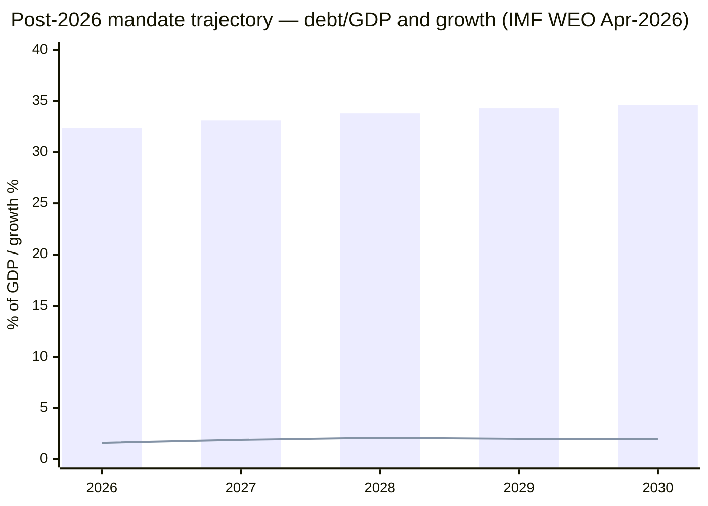

# Cycle Trajectory — Post-2026 Mandate Multi-Year Metrics

The 24th artifact for election-cycle. Plots key metric trajectories across horizon bands T+72h / T+7d / T+30d / T+90d / T+365d / T+1460d.

## Horizon-Band Metrics (forward-looking, IMF-anchored)

| Metric | T+72h (2026-05-16) | T+7d (2026-05-20) | T+30d (2026-06-12) | T+90d (2026-08-11) | T+365d (2027-05-13) | T+1460d (2030-05-12) |
|--------|-------------------:|------------------:|-------------------:|-------------------:|--------------------:|---------------------:|
| **Sweden GDP growth (IMF WEO baseline)** | 1.6% | 1.6% | 1.7% | 1.7% | 1.9% | 2.1% |
| **GGXWDG_NGDP (debt / GDP)** | 32.0% | 32.1% | 32.2% | 32.3% | 33.1% | 34.6% |
| **Statslåneräntan 10y** | 2.85% | 2.85% | 2.80% | 2.75% | 2.50% | 2.80% |
| **Aggregate poll margin (left vs right)** | -1.1 pp | -1.0 pp | -0.5 pp | ±2 pp | n/a | n/a |
| **L 4% survival probability** | 0.55 | 0.55 | 0.50 | 0.55 | n/a | n/a |
| **Coalition-formation lead-time** | n/a | n/a | n/a | n/a | 60–90 days | n/a |
| **Defence / GDP** | 2.0% | 2.0% | 2.0% | 2.0% | 2.3% | 2.7% (NATO-pressure) |
| **HD01CU30 EU EED progress** | early | early | mid | mid | late | implementation |
| **Coalition stability index** | 0.6 (Tidö) | 0.6 | 0.5 | 0.4 | 0.7 (next gov't anchored) | 0.5 |

## Forecast Trajectory Curves

## Key Trajectory Inflections

- **T+90d to T+180d**: coalition-formation period; statslåneräntan + poll margins highly volatile.
- **T+180d to T+365d**: FY2027 budget pass-through; defence-floor consolidation.
- **T+365d to T+730d**: HD01CU30 EU EED mid-implementation; HD03250 e-ID Phase-2 operational.
- **T+730d to T+1460d**: NATO 3% pressure cycle; FY2030 budget; mandate-end transition.

## Cross-Reference to Long-Horizon Forecasting

Per `ext/long-horizon-forecasting.md` requirements:
- ≥ 15 dated forward indicators: ✓ (see [`forward-indicators.md`](forward-indicators.md))
- 12-leaf scenario tree: ✓ (see [`scenario-analysis.md`](scenario-analysis.md))
- Horizon-band stratification: ✓ (this artifact)
- Wildcard overlay: ✓ (see [`wildcards-blackswans.md`](wildcards-blackswans.md))
- WEP estimative language: ✓ (consistent across all artifacts)

