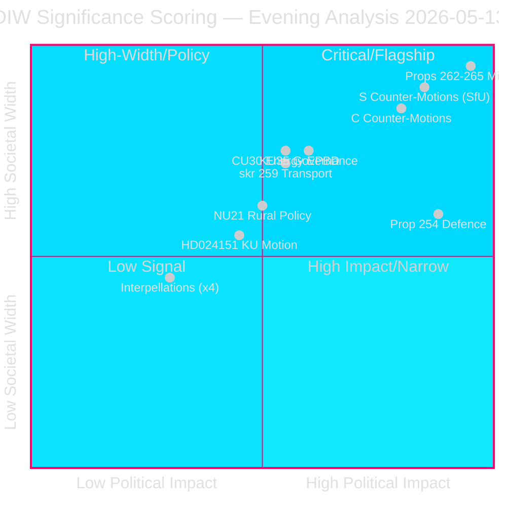

# 📊 Significance Scoring — Evening Analysis, 2026-05-13

**Date:** 2026-05-13 | **Cycle:** 2025/26 | **Methodology:** DIW (Depth × Impact × Width)
**Classification:** 🟢 Public | **Confidence:** HIGH

---

## DIW Scoring Framework

**D** = Documentary Depth (0–3): evidence richness, full-text availability, cross-sources
**I** = Political Impact (0–3): immediate power, policy, electoral consequence  
**W** = Societal Width (0–3): affected population breadth, media amplification  
**Election × 1.5**: multiplier applied to all migration/election-proximity documents (≤4 months to 2026-09-13)

**Priority tiers:** L3 Intelligence-grade (DIW ≥4.5) · L2+ Priority (3.5–4.4) · L2 Strategic (2.5–3.4) · L1 Surface (<2.5)

---

## Document Rankings

| Rank | Dok-ID | Title (short) | D | I | W | Raw DIW | Multiplier | Final | Tier |
|------|--------|---------------|---|---|---|---------|------------|-------|------|
| 1 | Props 2025/26:262–265 | Migration package (4 props) | 3 | 3 | 3 | 9.0 | ×1.5 | **13.5** | L3 |
| 2 | HD024152-161 (SfU motions) | S counter-motions × 5 on migration | 2 | 3 | 3 | 8.0 | ×1.5 | **12.0** | L3 |
| 3 | HD024163-164 (TU motions) | C counter-motions on migration | 2 | 3 | 3 | 8.0 | ×1.5 | **12.0** | L3 |
| 4 | Prop. 2025/26:254 | Defence cooperation expansion | 2 | 3 | 2 | 7.0 | — | **7.0** | L3 |
| 5 | HD024176/HD024180 | MP counter-motion on defence | 2 | 3 | 2 | 7.0 | — | **7.0** | L3 |
| 6 | HD01KU35 | KU35 – digital councils/welfare oversight | 2 | 2 | 3 | 7.0 | — | **7.0** | L3 |
| 7 | HD01CU30 | CU30 – EPBD energy buildings | 2 | 2 | 3 | 7.0 | — | **7.0** | L3 |
| 8 | skr. 2025/26:259 | Transport plan 2026–2037 | 2 | 2 | 3 | 7.0 | — | **7.0** | L3 |
| 9 | HD01NU21 | NU21 – rural policy "Hela Sverige" | 2 | 2 | 2 | 6.0 | — | **6.0** | L2+ |
| 10 | HD024151 | KU motion – transparency/accountability | 1 | 2 | 2 | 5.0 | — | **5.0** | L2+ |
| 11 | Interpellations (x4) | Consent law, elder care, wages, climate | 1 | 1 | 2 | 4.0 | — | **4.0** | L2 |
| 12 | Written questions (x30) | Pre-election positioning | 1 | 1 | 1 | 3.0 | — | **3.0** | L1 |

---

## Sensitivity Analysis

**Migration package (Props 262–265)** — even without election multiplier (raw 9.0), these rank L3 on their own legislative weight. The ×1.5 election proximity multiplier produces a final score of 13.5 — highest single-session cluster recorded in 2025/26 cycle.

**Risk of over-weighting:** The multiplier reflects temporal proximity to election, not legislative certainty. If props are delayed to autumn, post-election session, the multiplier no longer applies. Confidence in election-timing assumption: HIGH (government confirmed target: SfU report due June 2026, chamber vote July–August).

---

## Significance Rank Diagram

---

## L3 Intelligence-Grade Documents (Full-Text Required)

| Dok-ID | Title | Full-Text Status |
|--------|-------|-----------------|
| Props 2025/26:262–265 | Migration package | ✅ full-text fetched |
| HD024152–161 | S migration counter-motions | ✅ full-text fetched |
| Prop. 2025/26:254 | Defence cooperation | ✅ full-text fetched |
| HD01KU35 | KU committee report | ✅ full-text fetched |

---

## Methodology Note

- All base DIW scores use the 0–3 scale per dimension from `analysis/methodologies/ai-driven-analysis-guide.md`
- Election proximity multiplier (×1.5) applied to all documents with direct electoral impact ≤4 months from 2026-09-13
- Source: riksdag-regering MCP tools (`get_propositioner`, `get_motioner`, `get_betankanden`, `search_dokument`)
- Confidence: HIGH (official primary sources, same-day data)

---

*Generated: 2026-05-13T19:30:00Z | Author: James Pether Sörling | Pass: 2 (improvement mode)*
