# 👥 Stakeholder Perspectives — Evening Analysis, 2026-05-13

**Date:** 2026-05-13 | **Cycle:** 2025/26 | **Methodology:** 6-Lens Stakeholder Matrix
**Classification:** 🟢 Public | **Confidence:** HIGH

---

## Stakeholder Landscape Overview

Today's legislative activity (migration package + defence + governance + energy + rural) implicates a wide actor network across government, opposition, civil society, judicial institutions, and international bodies.

---

## 6-Lens Stakeholder Matrix

### Lens 1: Power Holders (Decision Makers)

| Actor | Role | Position on Migration Package | Influence Score |
|-------|------|------------------------------|----------------|
| **Ulf Kristersson (M, PM)** | Prime Minister; coalition leader | Strongly supportive — fulfils Tidö Agreement commitment | ★★★★★ |
| **Jimmie Åkesson (SD)** | Party leader; de facto coalition anchor | Fully supportive; will push for maximum detention scope | ★★★★★ |
| **Johan Pehrson (L)** | Party leader; crucial for majority | Conditionally supportive; monitoring Lagrådet opinion | ★★★★☆ |
| **Ebba Busch (KD)** | Party leader; deputy PM | Strongly supportive — KD has hardened on migration since 2022 | ★★★★☆ |
| **Maria Malmer Stenergard (M)** | Migration minister; responsible for props 262–265 | Policy architect; committed to full package | ★★★★★ |

### Lens 2: Challengers (Opposition)

| Actor | Role | Strategy | Influence Score |
|-------|------|----------|----------------|
| **Magdalena Andersson (S)** | Opposition leader; former PM | Files counter-motions; builds "rights erosion" campaign narrative | ★★★★★ |
| **Muharrem Demirok (C)** | Party leader | Opposes via "implementation impossibility" framing; maintains distance from S rights language | ★★★☆☆ |
| **Märta Stenevi (MP)** | Party leader | ECHR/human-rights opposition; limited parliamentary weight (6.4%) | ★★☆☆☆ |
| **Nooshi Dadgostar (V)** | Party leader | Opposes all props; limited parliamentary influence | ★★☆☆☆ |

### Lens 3: Regulatory/Judicial Bodies

| Actor | Role | Current Position | Influence Score |
|-------|------|-----------------|----------------|
| **Lagrådet (Council on Legislation)** | Constitutional pre-legislative review | Referral pending for prop. 265 — opinion not yet published | ★★★★★ |
| **Migrationsverket** | Administrative implementer | Capacity-constrained; needs 890 MSEK+ to implement prop. 263 | ★★★★☆ |
| **Migrationsdomstolar (Migration Courts)** | Judicial review | Already overloaded; 14,200 pending enforcement cases | ★★★☆☆ |
| **JO (Parliamentary Ombudsman)** | Oversight | Will monitor implementation of detention provisions; complaint channel | ★★★☆☆ |
| **SfU Committee** | Legislative scrutiny | Majority (government) expected to advance all 4 props; minority reservations by S, C, MP | ★★★★☆ |

### Lens 4: Civil Society / Third-Sector

| Actor | Role | Position | Influence Score |
|-------|------|----------|----------------|
| **Amnesty International Sweden** | Human rights monitoring | Active opposition to props 265 and 262; will publish assessment | ★★★☆☆ |
| **UNHCR Sweden** | International refugee protection | Concerns on prop. 262 (permanent residence abolition) re: statelessness | ★★★☆☆ |
| **Red Cross Sweden (Röda Korset)** | Humanitarian services | Detention expansion opposition; supports return assistance program | ★★☆☆☆ |
| **LO (trade union confederation)** | Labour representation | Concerned about conduct requirements (prop. 264) for labour migrants | ★★★☆☆ |
| **Riksförbundet för homosexuellas, bisexuellas, transpersoners och queeras rättigheter (RFSL)** | LGBTQ+ rights | Monitoring conduct requirements for asylum seekers with LGBTQ+ persecution claims | ★★☆☆☆ |

### Lens 5: International/Supranational

| Actor | Role | Position | Influence Score |
|-------|------|----------|----------------|
| **European Commission (DG HOME)** | EU policy oversight | Monitoring EPBD compliance (CU30) and Returns Directive compatibility (prop. 265) | ★★★☆☆ |
| **Council of Europe / ECHR monitoring** | Human rights | Prop. 265 detention scope on monitoring radar | ★★★☆☆ |
| **NATO/SACEUR** | Defence partnership | Prop. 254 beneficiary; supports Swedish operational integration | ★★★☆☆ |
| **Nordic peers (DK, NO, FI)** | Regional comparators | Denmark's stricter framework provides legitimation precedent for Swedish package | ★★★☆☆ |

### Lens 6: Electorate Segments (Voter Groups)

| Segment | Size | Primary Issue | Current Alignment | Election Risk |
|---------|------|--------------|-------------------|--------------|
| **Migration-concerned voters (SD base)** | ~20% | Stricter enforcement; permanent residence abolition | Government | LOW |
| **Working-class S-leaners** | ~18% | Migration + welfare fairness | Contested | HIGH |
| **Rural C-base** | ~8% | Transport plan, rural services (NU21) | C-leaning, government risk | MEDIUM |
| **Liberal urban professionals (L/C base)** | ~12% | Rule of law, ECHR compliance | At risk on prop. 265 | MEDIUM |
| **Young urban progressive (MP/V base)** | ~10% | Climate, ECHR, rights | Firm opposition | LOW (already lost) |

---

## Influence Network Diagram

```mermaid
%%{init: {'theme': 'dark', 'themeVariables': {'primaryColor': '#00d9ff', 'primaryTextColor': '#e0e0e0', 'primaryBorderColor': '#ff006e', 'lineColor': '#ffbe0b', 'background': '#0a0e27', 'edgeLabelBackground': '#1a1e3d'}}}%%
flowchart TD
  PM["PM Kristersson (M)\n★★★★★"] -->|"Leads"| Gov["Government Coalition\nM+SD+KD+L"]
  SD["Åkesson (SD)\n★★★★★"] -->|"Anchor"| Gov
  L["Pehrson (L)\n★★★★☆"] -->|"Conditional"| Gov
  Gov -->|"Files"| Props["Props 262–265\nMigration Package"]
  Props -->|"Referred to"| SfU["SfU Committee\n★★★★☆"]
  Props -->|"Reviewed by"| Lagr["Lagrådet\n★★★★★"]
  Props -->|"Opposed by"| S["Andersson (S)\n★★★★★"]
  Props -->|"Opposed by"| C["Demirok (C)\n★★★☆☆"]
  Lagr -->|"Critical opinion\n(risk)"| L
  S -->|"Counter-motions\n×5"| SfU
  C -->|"Counter-motions\n×3"| SfU
  Amnesty["Amnesty/UNHCR\n★★★☆☆"] -->|"International\ncriticism"| Props
  style PM fill:#1a2a3a,stroke:#00d9ff
  style Gov fill:#1a1a3a,stroke:#ffbe0b
  style Props fill:#2a1a2a,stroke:#ff006e
  style Lagr fill:#2a2a1a,stroke:#ffbe0b
  style S fill:#3a1a1a,stroke:#ff006e
```

---

## Key Stakeholder Dynamics Summary

1. **L party as pivot**: Johan Pehrson and Johan Hedin (L SfU) are the single most critical stakeholders — their public position on prop. 265 in week 22 determines whether the government passes the complete package intact.
2. **Lagrådet as institutional gatekeeper**: Its opinion on prop. 265 will either validate the government's ECHR framing or provide the legal grounding for L abstention.
3. **S strategic ambiguity**: Andersson's S faces a dilemma — strong rights-based opposition risks losing working-class migration-concerned voters; weak opposition loses the progressive base.
4. **International legitimacy corridor**: UNHCR + Amnesty + CoE monitoring creates a sustained international pressure track that amplifies domestic opposition narratives through the "Sweden isolated" frame.

---

*Generated: 2026-05-13T19:45:00Z | Author: James Pether Sörling | Pass: 2 (improvement mode)*
*Evidence: Props 2025/26:262–265 (riksdagen.se), HD024152–161 (S counter-motions), riksdag.se MP profiles, Migrationsverket 2025 annual report*
