# ⚔️ SWOT Analysis — Evening Analysis, 2026-05-13

**Date:** 2026-05-13 | **Cycle:** 2025/26 | **Methodology:** Political SWOT + TOWS Matrix
**Classification:** 🟢 Public | **Confidence:** HIGH

---

## Subject: Swedish Government Coalition — Migration Policy Package (Props 2025/26:262–265)

*Analysis covers the ruling M+SD+KD+L coalition's strategic position on the migration legislative package and its electoral consequences.*

---

## Strengths

| Strength | Evidence | Dok-ID |
|----------|----------|--------|
| **Majority coalition unity on core migration agenda** | M+SD+KD+L = ~175–180 seats; SD, M, KD have full alignment; L has participated in consultation process | Props 2025/26:262–265 government bills; coalition agreement 2022 |
| **Voter salience alignment** | 38% of voters cite immigration as top concern (Novus Jan 2026); government's "stricter control" framing polls at 52% approval among key electoral segments | Novus Jan 2026 poll; HD024152–161 S opposition motions (confirm debate salience) |
| **Legislative preparation — linked package strategy** | 4 simultaneous propositions form a coherent, mutually reinforcing framework; harder for opposition to pick off individual elements | Props 2025/26:262, 263, 264, 265 (HD03 series, filed same-day) |
| **Legal scaffolding:** Conduct requirements (vandel) modelled on Danish 2002 precedent with "objectification" corrections | Government consultation documents cite comparative law basis; SfU legal advisors expected to validate | HD024163-164 (C motions — acknowledges government's comparative-law approach) |
| **Policy record — completion of mandate commitment** | Government committed to migration reform in Tidö Agreement (Oct 2022); 2026 package fulfils central coalition compact | Tidö Agreement §§ on "Ansvarsfull migrationspolitik" |

---

## Weaknesses

| Weakness | Evidence | Dok-ID |
|----------|----------|--------|
| **ECHR exposure — Prop. 265 detention provisions** | Administrative detention up to 24 months approaches EU Returns Directive 18-month outer bound; Lagrådet review probability HIGH; Strasbourg challenge probability MEDIUM-HIGH | Risk-assessment RISK-001; ECHR Art. 5(1)(f); Saadi v UK [2008] |
| **L party conditional support creates narrow majority risk** | L has publicly emphasised "rule-of-law" and "judicial review" conditions; any L abstention on prop. 265 could reduce coalition majority to single digits | Risk-assessment RISK-002; intelligence-assessment KJ-1 |
| **Return capacity structural gap** | Migrationsverket lacks enforcement capacity: 14,200 final negative decisions, only 41% of target-country nationals can be forcibly returned (Afghanistan, Eritrea, Somalia non-cooperative) | Prop. 2025/26:263 impact assessment; Migrationsverket 2025 annual report |
| **Permanent residence abolition — statelessness risk** | Prop. 262 abolishes permanent residence; conflicts with UNHCR 1954 statelessness convention obligations; no safeguard clause drafted | Prop. 2025/26:262; UNHCR statelessness convention Art. 8 |
| **Messaging complexity for undecided voters** | 4-prop package = complex narrative; opposition can selectively attack "weakest" element (detention) while voters cannot track full package | HD024176 (MP) uses "human rights" framing; media-framing-analysis.md |

---

## Opportunities

| Opportunity | Evidence | Dok-ID |
|-------------|----------|--------|
| **Election-defining issue**: Cement migration as primary campaign battleground where government leads | 2026-09-13 election ≤4 months; migration #1 salience at 38%; SD gain 3–6 seats projected under Scenario B | election-2026-analysis.md; scenario-analysis.md |
| **Opposition fragmentation**: S and C both oppose but on different grounds; S (rights-based) vs C (evidence-based) creates incoherent counter-narrative | HD024152–161 (S motions) focus on ECHR; HD024163–164 (C motions) focus on implementation gaps | scenario-analysis Scenario C |
| **Nordic peer validation**: Denmark and Norway have similar frameworks; comparative-international.md shows trend legitimisation | comparative-international.md §Nordic peers |
| **Defence-migration linkage narrative**: Both migration control and defence cooperation position Sweden as asserting sovereignty in new geopolitical environment | Prop. 2025/26:254 (defence) + Props 262–265 (migration) together form "sovereignty" narrative |
| **Welfare system narrative**: Conduct requirements (prop. 264) can be framed as "protecting welfare state" — high resonance with S-leaning working-class voters | Novus polling on welfare fairness; HD01NU21 (rural welfare services) |

---

## Threats

| Threat | Evidence | Dok-ID |
|--------|----------|--------|
| **ECHR Court ruling before election** | If European Court of Human Rights issues interim measure against detention provisions, government faces "we passed unconstitutional law" narrative | Risk-assessment RISK-001; ECHR Art. 39 provisional measures |
| **Lagrådet negative opinion on prop. 265** | If Lagrådet (Council on Legislation) issues critical opinion, L party gain pretext for abstention; government must either amend or overrule Lagrådet (politically damaging) | www.lagradet.se referral — pending publication; intelligence-assessment KJ-1 |
| **SD internal hardening — demand for more** | SD may agitate for even stricter measures or use L softness on detention as campaign differentiation; coalition tension from the right as well as centre | HD024152–161 S motions (reference SD positions in debate) |
| **International reputation damage** | UN special rapporteurs, UNHCR, CoE monitoring — sustained international criticism could burden government diplomatic capacity | Props 2025/26:262–265 international-law section; comparative-international.md |
| **Implementation timeline — governance risk** | Complex 4-law package requires Migrationsverket operational adaptation, IT system upgrades, court capacity expansion — all within 12 months; capacity risk HIGH | implementation-feasibility.md; Statskontoret pre-warm: no directly relevant source found for migration package implementation capacity |

---

## TOWS Matrix (Strategic Options)

| | **Strengths (S)** | **Weaknesses (W)** |
|---|---|---|
| **Opportunities (O)** | **SO — Exploit:** Use voter salience + coalition unity to pass all 4 props before summer recess; lock in electoral advantage. Leverage Nordic-peer validation to deflect ECHR criticism. | **WO — Convert:** Address L party ECHR concerns by adding Lagrådet-reviewed sunset clause to prop. 265. Publish return capacity roadmap to counter "empty law" critique. |
| **Threats (T)** | **ST — Protect:** Pre-empt international criticism by citing ECHR Art. 5(1)(f) compliance framework. Use coalition unity as shield against SD hardening. | **WT — Minimise:** Amend prop. 265 detention ceiling from 24 to 18 months (EU Returns Directive standard) to reduce ECHR exposure while retaining political symbolism. |

---

## Cross-SWOT Analysis: Migration-Defence Intersection

Both migration control (Props 262–265) and defence expansion (Prop. 254) draw on the same "sovereignty assertion" narrative. This is a **coherence advantage** for the government coalition — but also a concentration risk: a failure on either front (ECHR ruling OR NATO partner criticism) damages both simultaneously.

```mermaid
%%{init: {'theme': 'dark', 'themeVariables': {'primaryColor': '#00d9ff', 'primaryTextColor': '#e0e0e0', 'primaryBorderColor': '#ff006e', 'lineColor': '#ffbe0b', 'background': '#0a0e27', 'edgeLabelBackground': '#1a1e3d'}}}%%
flowchart LR
  A["Strengths\nMajority unity\nVoter salience\n↑ DIW score"] -->|"SO strategy"| E["Exploit election window:\nPass all 4 props\nbefore summer"]
  B["Weaknesses\nECHR exposure\nReturn capacity gap"] -->|"WO strategy"| F["Convert: Add sunset\nclause + capacity\nroadmap"]
  C["Opportunities\nElection framing\nOpposition split"] -->|"ST strategy"| G["Protect: Pre-empt\nECHR via Art 5(1)(f)\nframing"]
  D["Threats\nLagrådets opinion\nECHR ruling risk"] -->|"WT strategy"| H["Minimise: Amend\nprop 265 to 18-mo\ndetention ceiling"]
  style A fill:#1a3a1a,stroke:#00d9ff
  style B fill:#3a1a1a,stroke:#ff006e
  style C fill:#1a2a3a,stroke:#ffbe0b
  style D fill:#3a1a2a,stroke:#ff006e
  style E fill:#0a0e27,stroke:#00d9ff
  style F fill:#0a0e27,stroke:#00d9ff
  style G fill:#0a0e27,stroke:#ffbe0b
  style H fill:#0a0e27,stroke:#ff006e
```

---

*Generated: 2026-05-13T19:35:00Z | Author: James Pether Sörling | Pass: 2 (improvement mode)*
