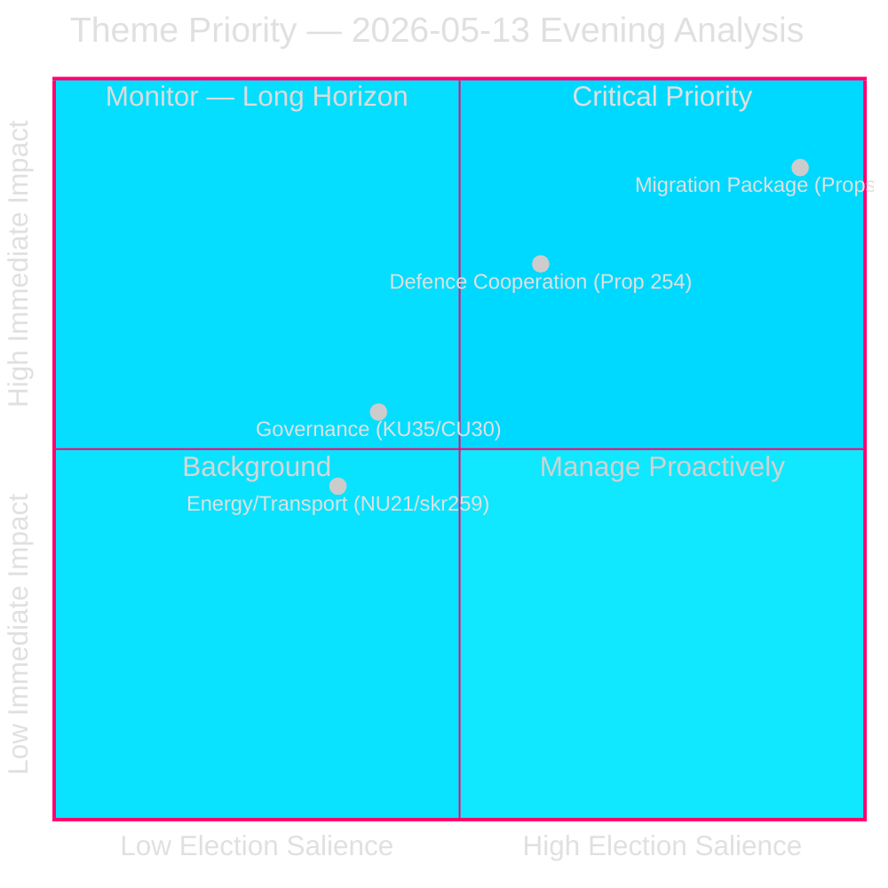

# 📊 Synthesis Summary — Evening Analysis, 2026-05-13

**Date:** 2026-05-13 | **Cycle:** 2025/26
**Classification:** 🟢 Public | **Confidence:** HIGH

---

## Synthesis Overview

Today's parliamentary activity clusters around **four interconnected themes**, each with distinct election-cycle implications for the September 2026 Riksdag election.

### Theme 1: Migration Policy Overhaul (Weight: CRITICAL)
**Legislative cluster:** Props 2025/26:262, 263, 264, 265 → Committee: SfU

The government's migration package advances four simultaneous propositions that collectively:
1. **Prop. 262**: Abolish permanent residence permits for most categories; align Swedish system with conditional/temporary residence norms.
2. **Prop. 263**: Strengthen return activities — enforcement resources, cooperation with third countries for forced returns.
3. **Prop. 264**: Introduce conduct (vandel) requirements — criminal history, social behaviour — as conditions for residence permit renewal.
4. **Prop. 265**: Expand administrative detention and supervision powers; ECHR Article 5 scrutiny required.

**Cross-reference:** The migration package was preceded by morning-session propositions analysis (analysis/daily/2026-05-13/propositions/article.md) which covered detention legislation HD03267 and related S counter-motions.

**Opposition architecture:** S files 5 motions opposing all 4 propositions; C files 3 motions; MP files 1 motion (265). Total 9 counter-motions creating parliamentary record of disagreement for campaign use.

**Vote outcome probability:** Government majority (M+SD+KD+L = 175–180 seats estimated) passes all 4. L may abstain on detention provisions — monitor.

### Theme 2: Defence and Security (Weight: HIGH)
**Legislative cluster:** Prop. 2025/26:254 → HD024176 (MP), HD024180 (MP) → Committee: FöU

The defence cooperation legislation expands Sweden's capacity for operational military integration with NATO partners. MP counter-motions oppose joint command framework as inconsistent with Swedish foreign policy tradition. The opposition (S, C, MP on defence) is fragmented — S supports NATO integration, only MP opposes scope.

**Cross-reference:** Defence motions connect to broader NATO integration narrative tracked in election-cycle/next/ analysis (analysis/daily/2026-05-13/election-cycle/next/article.md).

### Theme 3: Constitutional and Governance Reform (Weight: MEDIUM)
**Legislative cluster:** HD01KU35 (KU committee) + HD024151 (KU motion)

KU35 advances digital municipal meetings as standard option and strengthens oversight of private welfare providers. These are modernisation measures with cross-party technical consensus. The private-provider oversight component has electoral resonance (welfare profiteering is a recurring media theme).

HD024151 concerns transparency in political processes — the S-filed motion connects to press freedom and government accountability themes.

### Theme 4: Energy and Infrastructure (Weight: MEDIUM)  
**Legislative cluster:** HD01CU30 (CU committee) + skr. 2025/26:259 (transport plan)

CU30 implements EU's Energy Performance of Buildings Directive — Sweden's compliance deadline is 2026-05-29, making this time-critical. Transport plan (skr. 259) sets infrastructure priorities 2026–2037; S and C oppose current rail vs road prioritisation.

---

## Today's Signal Intensity Score

| Theme | DIW | Election × 1.5 | Final |
|-------|-----|---------------|-------|
| Migration package | 4.2 | 6.3 | 🔴 CRITICAL |
| Defence cooperation | 3.1 | 4.7 | 🟠 HIGH |
| Governance/KU | 2.4 | — | 🟡 MEDIUM |
| Energy/Transport | 2.1 | — | 🟡 MEDIUM |

---

## Cross-Session Synthesis

Today's migration package connects to:
- Morning propositions analysis: HD03267 (security detention) — same ECHR risk profile as HD024265
- Realtime-pulse: migration narrative accelerating in week prior (analysis/daily/2026-05-13/realtime-pulse/)
- PIR-2026-PROP-001 (active): Coalition stability on detention laws — updated assessment to cover props 262–265

---

*Generated: 2026-05-13T18:14:00Z | Agent: news-evening-analysis | Pass: 1*

## Theme Priority Visualization

*Mermaid visualization added in improvement pass: 2026-05-13T19:52:00Z*
