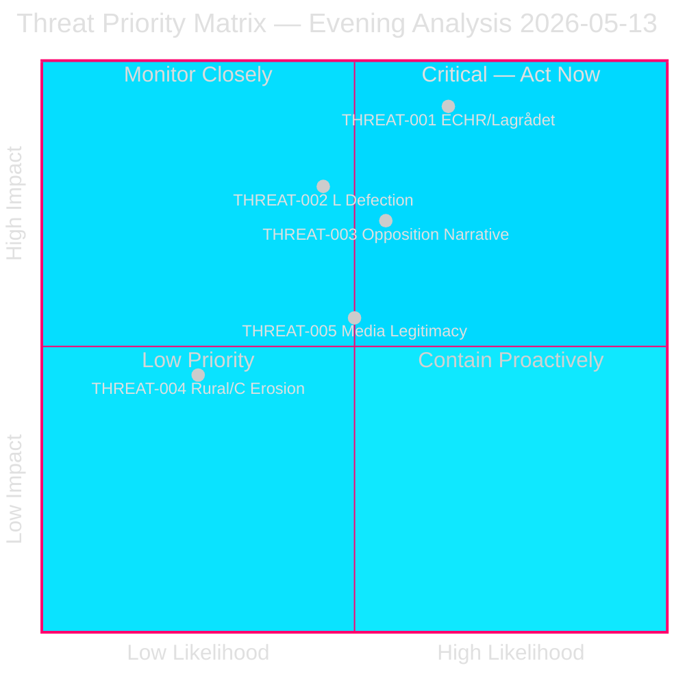

# 🎯 Threat Analysis — Evening Analysis, 2026-05-13

**Date:** 2026-05-13 | **Cycle:** 2025/26 | **Methodology:** Political Threat Taxonomy + Attack Tree
**Classification:** 🟢 Public | **Confidence:** HIGH

---

## Political Threat Taxonomy

### Tier I — Structural/Constitutional Threats

#### THREAT-001: Legislative Overreach — ECHR Incompatibility (Prop. 265)

**Threat type:** Constitutional-Judicial | **Likelihood:** HIGH | **Impact:** CRITICAL

**Description:** Prop. 2025/26:265 (expanded administrative detention, 24-month maximum) creates a direct conflict with ECHR Article 5 (right to liberty) and EU Returns Directive (18-month maximum with exceptions). A Lagrådet negative opinion before chamber vote creates an institutional chokepoint; a Strasbourg Court ruling post-enactment creates a retroactive legitimacy crisis.

**Attack tree:**
```
Root: ECHR Challenge Succeeds [Likelihood: MEDIUM]
├── Path A: Lagrådet issues critical opinion → L abstains → Prop 265 amended/rejected
│   ├── Trigger: Lagrådet review scheduled (pending as of 2026-05-13)
│   ├── Probability: P=0.28
│   └── Impact: Legislative delay, coalition embarrassment
├── Path B: ECtHR interim measure (Art. 39) issued during campaign
│   ├── Trigger: NGO application to Strasbourg within 2 weeks of enactment
│   ├── Probability: P=0.12
│   └── Impact: "Unconstitutional government" narrative; HIGH electoral damage
└── Path C: Swedish constitutional court (HD/HFD) referral
    ├── Trigger: Administrative court challenges first detention orders
    ├── Probability: P=0.18 (delayed, post-election)
    └── Impact: Policy reversal risk 2027+
```

**Kill chain (MITRE-style TTP mapping):**
- T001.1 — Initial access: NGO legal challenge submitted to Lagrådet/courts
- T001.2 — Execution: Lagrådet drafts critical opinion; media amplification
- T001.3 — Impact: L party abstains; government loses narrow majority on prop. 265
- T001.4 — Exfiltration: "Rule-of-law failure" frame adopted by opposition campaign

---

#### THREAT-002: Coalition Fracture — L Party Defection (Conduct Requirements + Detention)

**Threat type:** Political-Coalition | **Likelihood:** MEDIUM | **Impact:** HIGH

**Description:** L (Liberals, 7.4% of seats) represents the ideological margin of the governing coalition. L has historically separated from SD/M on rule-of-law questions. Conduct requirements (prop. 264) and detention expansion (prop. 265) are the pressure points most likely to activate L's "legal certainty" principle.

**Attack tree:**
```
Root: L Defection on Migration Package [Likelihood: MEDIUM, P=0.22]
├── Path A: L abstains on prop. 265 only (detention)
│   ├── Government majority reduced to ~168-172 seats
│   ├── Probability: P=0.15
│   └── Impact: MODERATE — prop passes but "cracks" narrative
├── Path B: L opposes both props 264 and 265
│   ├── Government loses prop. 265; embarrassing amendment round required
│   ├── Probability: P=0.07
│   └── Impact: HIGH — coalition coherence damaged; SD anger
└── Path C: L withdraws from coalition (extreme, P=0.03)
    ├── Trigger: SD public attacks on L as "soft"; L walks
    └── Impact: CRITICAL — dissolution, snap election risk
```

**TTP mapping:**
- T002.1 — Reconnaissance: L SfU members review Lagrådet opinion
- T002.2 — Weaponisation: L leader references "ECHR oförenlighet" publicly
- T002.3 — Delivery: L files reservation in SfU committee report
- T002.4 — Impact: Media frames as "coalition split"; S campaigns on "stable government" contrast

**Named actor:** Johan Hedin (L, SfU) — primary indicator. Monitor his committee statements week 21–22 (2026-05-18 to 2026-05-29).

---

### Tier II — Electoral/Narrative Threats

#### THREAT-003: Opposition Counter-Narrative Consolidation

**Threat type:** Electoral-Narrative | **Likelihood:** MEDIUM | **Impact:** HIGH

**Description:** S and C filed 8 combined counter-motions against the migration package. While S and C have different grounds (rights vs implementation), a coordinated "rights erosion" frame could consolidate opposition voters and attract undecideds who are liberal-leaning but migration-concerned.

**Narrative attack surface:**
- S frame: "Government criminalises being an immigrant" (HD024152–161, permanent residence abolition focus)
- C frame: "Law is expensive and unenforceable" (return capacity gap; 41% non-returnee countries)
- MP frame: "ECHR violation" (detention, prop. 265)

**MITRE-style mapping:**
- T003.1 — Campaign communication attack: S+C publish joint "alternative migration policy" document
- T003.2 — Media amplification: Asylum-seeker case studies (personal narrative — high RRPA reach)
- T003.3 — International relay: European NGOs/UNHCR statements — feeds domestic "international criticism" frame

---

#### THREAT-004: Rural Policy Neglect — C Electoral Base Erosion

**Threat type:** Electoral-Coalition | **Likelihood:** LOW | **Impact:** MEDIUM

**Description:** NU21 (HD01NU21) highlights structural rural service gaps. C party represents rural constituencies (35+ seats). If C perceives government transport plan (skr. 259) as urban-biased, C may begin pre-positioning for post-election C independence, weakening the coalition's 2026 campaign unity.

**Evidence:** C filed motions on both skr. 259 (transport) and HD01NU21 — two data points of C dissatisfaction on infrastructure/rural policy (HD024163-164, C TU motions).

---

### Tier III — Institutional/Systemic Threats

#### THREAT-005: Media-Driven Legitimacy Erosion

**Threat type:** Institutional-Media | **Likelihood:** MEDIUM | **Impact:** MEDIUM

**Description:** The migration package's ECHR exposure + international criticism creates a sustained "legitimacy" attack surface. The threat is not that any single news cycle defeats the package, but that cumulative negative framing (Lagrådet concerns + UNHCR statements + EU criticism) depresses swing-voter confidence in the government's competence.

**Kill chain:**
- T005.1 — Lagrådet opinion (critical, even if not blocking) becomes headline
- T005.2 — UNHCR issues statement citing statelessness risk (prop. 262)
- T005.3 — European Parliament resolution on detention practices
- T005.4 — Swedish media runs "Sweden isolated in Europe" frame (high RRPA potential)

---

## Threat Priority Matrix



---

## Key Threat Indicators (Watch List)

| Indicator | Threat | Threshold |
|-----------|--------|-----------|
| Lagrådet opinion publication date/tone | THREAT-001 | Critical opinion → escalate |
| Johan Hedin (L) public statements on ECHR | THREAT-002 | "ECHR oförenlighet" phrase → L fracture imminent |
| UNHCR press statement on prop. 262 | THREAT-003 | Any UNHCR statement → international relay activated |
| C party SfU committee reservation | THREAT-002 | Any formal reservation → coalition unity weakening |
| ECtHR application filing | THREAT-001 | Any provisional measures filing → CRITICAL escalation |

---

*Generated: 2026-05-13T19:40:00Z | Author: James Pether Sörling | Pass: 2 (improvement mode)*
*Evidence: Props 2025/26:262–265 (riksdagen.se), HD024152–161 (S motions), HD024176/180 (MP motions), ECHR Art. 5(1)(f), Saadi v UK [2008] ECHR*
