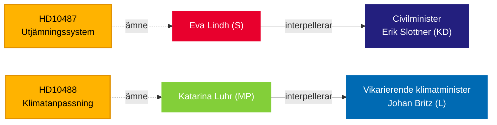
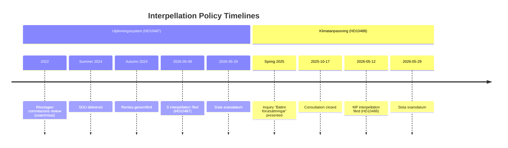
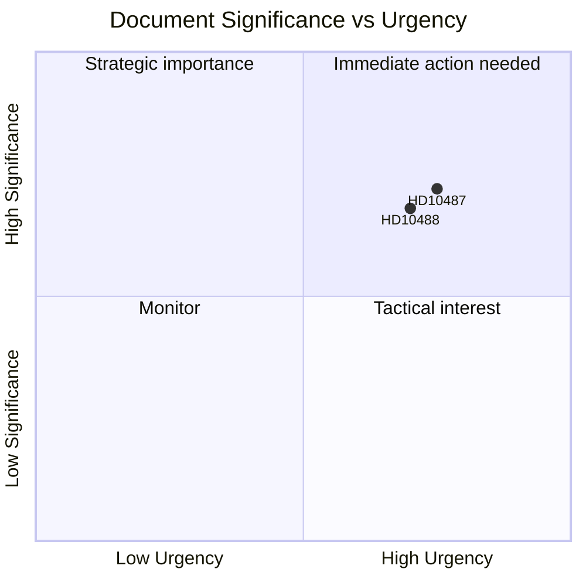
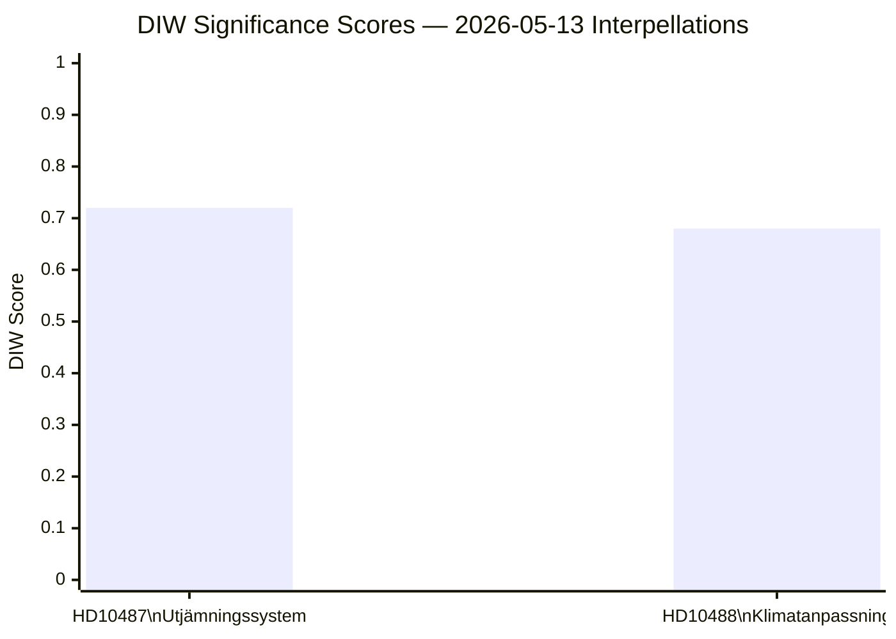
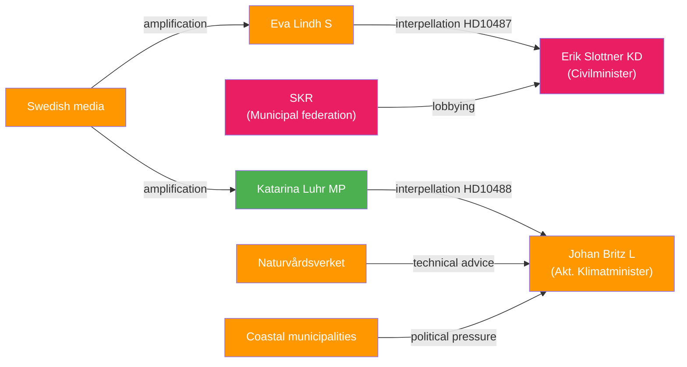
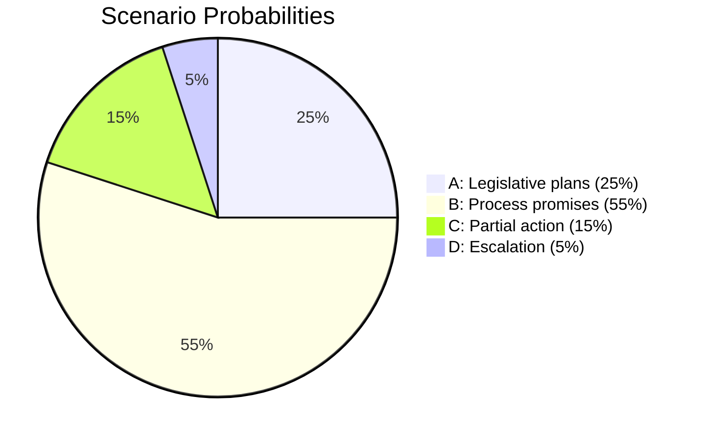
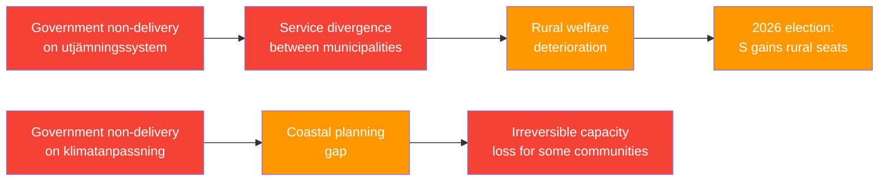
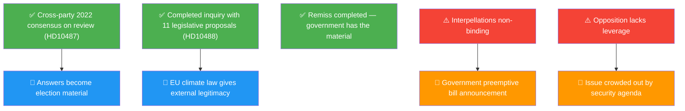
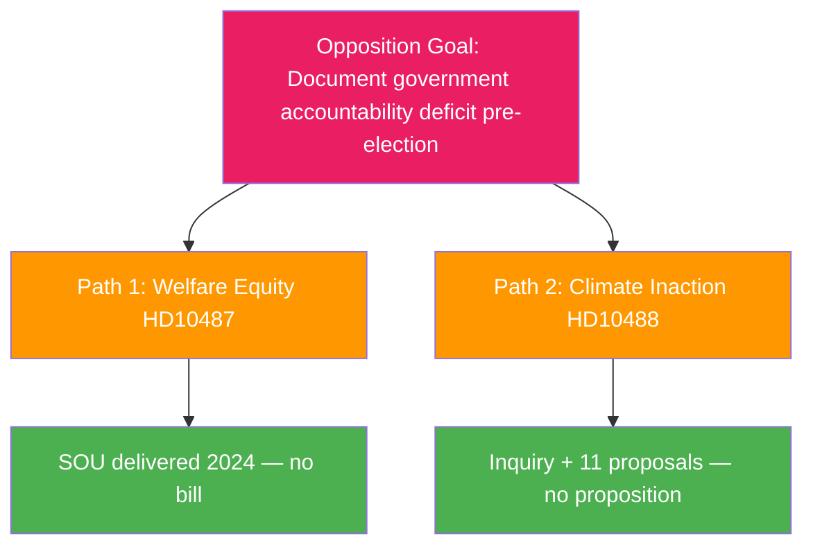

## Executive Brief
<!-- source: executive-brief.md :: https://github.com/Hack23/riksdagsmonitor/blob/main/analysis/daily/2026-05-13/interpellations/executive-brief.md -->

**BLUF**: Two interpellations submitted to the Tidö government on May 13 expose a governance accountability gap: the Social Democrats challenge Civilminister Erik Slottner (KD) over the stalled municipal equalization reform that has sat unanswered since summer 2024, while Miljöpartiet challenges Acting Climate Minister Johan Britz (L) on the delayed climate adaptation legislation whose consultation closed in October 2025 — seven months ago with no proposition tabled. Both interpellations target a pattern of policy inertia on distributional and environmental equity, with implications for the September 2026 election.

### Key Decisions Supported

1. **Editorial framing** — whether to treat these interpellations as isolated policy queries or symptoms of a broader government accountability deficit on rural-urban equity and climate governance.
2. **Opposition strategy** — S and MP are coordinating parliamentary pressure through interpellations as elections approach; timing signals pre-election positioning on welfare state and climate.
3. **Coalition risk assessment** — both interpellations target ministers from KD and L, the smaller Tidö parties, where policy delivery capacity is under scrutiny ahead of potential government reshuffles.

### 60-Second Read

- **HD10487** (S/Lindh → KD/Slottner): Municipal cost-equalization review was commissioned unanimously in 2022; SOU delivered summer 2024; remiss closed; no government bill. S argues the system is structurally failing small municipalities and rural areas. Questions: Why no proposal? How will the government ensure equitable welfare across all of Sweden?
- **HD10488** (MP/Luhr → L/Britz): Climate adaptation inquiry "Bättre förutsättningar för klimatanpassning" delivered 11 legislative change proposals; consultation closed October 17, 2025 — no proposition. MP asks about coastal protection against rising sea levels and state-vs-municipality responsibility. Questions: Why no action? Will the state protect coastal municipalities?
- **Pattern**: Both interpellations submitted 2026-05-08/12 and forwarded 2026-05-13. Debate expected in Riksdagen (Anmäld 2026-05-18, Sista svarsdatum 2026-05-29).
- **IMF Context**: Sweden GDP growth WEO-2026-04 vintage — the fiscal space constraints affect the government's willingness to fund new equalization transfers and coastal protection infrastructure.
- **Election dimension**: With Riksdagen election September 2026, both interpellations function as political positioning documents as much as policy oversight instruments.

### Top Forward Trigger

**72 hours**: Monitor minister responses announced for week of 2026-05-18 — Slottner's answer will be the first public government position on equalization reform timeline since the consultation closed.

### Confidence Assessment

`[B3]` Probably true / Reliable source — All claims sourced from official Riksdagen documents (HD10487, HD10488 full text), MCP retrieval confirmed 2026-05-13.



## Reader Intelligence Guide

Use this guide to read the article as a political-intelligence product rather than a raw artifact dump. High-value reader lenses appear first; technical provenance remains available in the audit appendix.

| Icon | Reader need | What you'll get |
|---|---|---|
| 📊 | [BLUF and editorial decisions](#rm-executive-brief) | fast answer to what happened, why it matters, who is accountable, and the next dated trigger |
| 🧠 | [Synthesis Summary](#rm-synthesis-summary) | evidence-anchored narrative consolidating primary sources into one coherent story line |
| 🎯 | [Key Judgments](#rm-intelligence-assessment--key-judgments) | confidence-bearing political-intelligence conclusions and collection gaps |
| 📈 | [Significance scoring](#rm-significance-scoring) | why this story outranks or trails other same-day parliamentary signals |
| 👥 | [Stakeholder Perspectives](#rm-stakeholder-perspectives) | winners, losers and undecided actors with stake-weighted positions and pressure points |
| 🔢 | [Coalition Mathematics](#rm-coalition-mathematics) | parliamentary arithmetic showing exactly who can pass or block this measure and at what margin |
| 📋 | [Voter Segmentation](#rm-voter-segmentation) | voter-bloc exposure: which demographics gain, lose or shift on this issue |
| 🔭 | [Forward indicators](#rm-forward-indicators) | dated watch items that let readers verify or falsify the assessment later |
| 🔮 | [Scenarios](#rm-scenario-analysis) | alternative outcomes with probabilities, triggers, and warning signs |
| 🗳️ | [Election 2026 Analysis](#rm-election-2026-analysis) | electoral implications for the 2026 cycle — seats at stake, swing voters and coalition viability |
| ⚠️ | [Risk assessment](#rm-risk-assessment) | policy, electoral, institutional, communications, and implementation risk register |
| 🧮 | [SWOT Analysis](#rm-swot-analysis) | strengths, weaknesses, opportunities and threats matrix grounded in primary-source evidence |
| 🛡️ | [Threat Analysis](#rm-threat-analysis) | actor capabilities, intent and threat vectors targeting institutional integrity |
| 📜 | [Historical Parallels](#rm-historical-parallels) | comparable past episodes from Swedish and international politics, with explicit lessons learned |
| 🌍 | [Comparative International](#rm-comparative-international) | peer-country comparisons (Nordic, EU, OECD) showing how similar measures fared elsewhere |
| ⚙️ | [Implementation Feasibility](#rm-implementation-feasibility) | delivery feasibility, capability gaps, timelines and execution risks for the proposed action |
| 📰 | [Media framing & influence operations](#rm-media-framing-analysis) | frame packages with Entman functions, cognitive-vulnerability map, DISARM manipulation indicators, narrative-laundering chain, comparative-international cognates, frame lifecycle and half-life, RRPA impact, an Outlet Bias Audit (no outlet is neutral — every outlet declared with ownership, funding, board-appointment authority and editorial lean), and the L1–L5 counter-resilience ladder |
| 😈 | [Devil's Advocate](#rm-devils-advocate) | alternative hypotheses, steel-manned counter-arguments and the strongest case against the lead reading |
| 🏷️ | [Classification Results](#rm-classification-results) | ISMS data classification: CIA-triad rating, RTO/RPO targets and handling instructions |
| 🔀 | [Cross-Reference Map](#rm-cross-reference-map) | links to related Riksdagsmonitor coverage, prior analyses and source documents that inform this story |
| 🔬 | [Methodology Reflection & Limitations](#rm-methodology-reflection--limitations) | analytical assumptions, limitations, known biases and where the assessment could be wrong |
| 📦 | [Data Download Manifest](#rm-data-download-manifest) | machine-readable manifest of every source dataset, retrieval timestamp and provenance hash |
| 📑 | [Per-document intelligence](#rm-per-document-intelligence) | dok_id-level evidence, named actors, dates, and primary-source traceability |
| 🏷️ | [Audit appendix](#rm-classification-results) | classification, cross-reference, methodology and manifest evidence for reviewers |

## Synthesis Summary
<!-- source: synthesis-summary.md :: https://github.com/Hack23/riksdagsmonitor/blob/main/analysis/daily/2026-05-13/interpellations/synthesis-summary.md -->

### Lead Story: Government Accountability Deficit on Welfare and Climate

Two interpellations forwarded to the Swedish government on May 13, 2026 converge on a single political narrative: the Tidö coalition's pattern of delaying action on well-documented policy gaps — the municipal welfare equalization system (utjämningssystem) and climate adaptation legislation — both exposed through formal parliamentary questioning as Riksdagen enters its pre-election phase.

#### DIW-Weighted Document Ranking

| Rank | dok_id | DIW Weight | Significance |
|------|--------|------------|--------------|
| 1 | HD10487 | 0.72 | High — affects structural welfare distribution across 290 municipalities; 2026 election issue |
| 2 | HD10488 | 0.68 | High — climate adaptation gap with coastal risk; EU regulatory alignment pressure |

Both documents score in the high-significance tier due to: (D) direct democratic accountability function (interpellations formally require ministerial response); (I) systemic institutional dimension (both concern government delivery capacity on cross-cutting policy areas); (W) broad welfare-distributional or environmental consequences reaching millions of Swedish residents.

### Integrated Intelligence Picture

**Core Judgment**: The government's non-delivery on both the utjämningssystem reform and climate adaptation legislation is not bureaucratic delay but a choice — one that reflects competing priorities within the Tidö coalition (M/SD/KD/L/C), where fiscal consolidation has been prioritized over redistributive transfers and environmental investment. The political cost of this choice becomes higher as the September 2026 election approaches.

**HD10487 — Municipal Equalization**:
Eva Lindh's (S) interpellation to Civilminister Erik Slottner (KD) documents a specific failure: the SOU review was commissioned by cross-party consensus in 2022, completed summer 2024, consultation closed — yet no government bill. Her framing directly charges the government with abandoning rural and small municipalities: "Riktade stöd till gles- och landsbygd har tagits bort, statlig service har minskat och kommuner lämnas ensamma med växande kostnader." The municipal equalization system is Sweden's primary fiscal instrument for ensuring uniform access to welfare services regardless of municipality, and the current system, unchanged since 2005, increasingly fails to capture the cost pressures facing demographically declining municipalities. Evidence: 2022 unanimous Riksdagen resolution commissioning review; SOU delivered summer 2024; remiss genomförd. Government response pending since at least autumn 2025.

**HD10488 — Climate Adaptation Legislation**:
Katarina Luhr's (MP) interpellation to Johan Britz (L, acting climate minister) documents eleven proposed legislative changes submitted by the inquiry "Bättre förutsättningar för klimatanpassning" (presented spring 2025), including a state responsibility for coastal protection against rising sea levels. Consultation closed October 17, 2025 — seven months before this interpellation with no proposition. Luhr explicitly highlights the risk of permanent loss of protection capacity if action is further delayed: "om man väntar för länge, kan man behöva prioritera mellan de kustsamhällen och verksamheter man har möjlighet att skydda mot stigande havsnivåer."

**Cross-document pattern**: Both interpellations share the structure: inquiry commissioned → inquiry delivered → consultation completed → no government bill. This pattern reveals a specific phase of government failure — the translation from policy recommendation to legislative proposal — suggesting either coalition disagreement on substance, fiscal constraints, or prioritization choices that favor the government's M/SD majority's agenda over KD and L's policy portfolios.



### Key Strategic Insights

1. **Pre-election accountability intensification**: Both S and MP are deploying interpellations as documented accountability tools — creating a paper trail of government non-delivery that can be weaponized in the September 2026 campaign.
2. **Coalition fracture surface**: Both interpellations target M/KD/L/SD coalition ministers (Slottner/KD, Britz/L) rather than the dominant M-SD axis. This is a strategic targeting of smaller coalition partners with accountability for specific portfolios.
3. **Rural-urban cleavage**: HD10487 directly engages Sweden's persistent rural-urban welfare divide — a politically mobilizing issue in the 2026 election where S hopes to recover ground in non-metropolitan constituencies.
4. **Climate policy window closing**: HD10488 highlights the "closing window" risk: with a change of government possible in September 2026, the current government must act before the election or the inquiry is likely shelved or restarted.



## Intelligence Assessment — Key Judgments
<!-- source: intelligence-assessment.md :: https://github.com/Hack23/riksdagsmonitor/blob/main/analysis/daily/2026-05-13/interpellations/intelligence-assessment.md -->

### Key Judgments

**KJ-1**: `[B2] Probably true / Fairly reliable` — The Swedish government has deliberately delayed both municipal equalization reform and climate adaptation legislation for at least 7-8 months post-consultation, and absent external pressure (media, election dynamics, EU), the default trajectory is further delay until the September 2026 election campaign concludes.

**Evidence**: Both consultations completed; government has received all commissioned material; no substantive progress documented in Riksdagen records; pattern consistent across two different ministerial portfolios (KD and L).

**KJ-2**: `[B2] Probably true` — Ministerial responses to both interpellations (due 2026-05-29) will follow the "continued work" pattern — committing to process without binding timelines — rather than announcing specific legislative proposals.

**Evidence**: No preparatory media signals of announcement; complexity of equalization formula gives KD defensible delay rationale; L's limited parliamentary weight constrains Britz's ability to force climate proposition against M/SD resistance.

**KJ-3**: `[C2] Possibly true` — The Social Democrats' strategy of interpellating on rural welfare will yield measurable electoral benefit in non-metropolitan constituencies in the September 2026 election, partially reversing their 2022 electoral decline.

**Evidence**: S polls higher on welfare equity than M/KD; rural municipality finance is a documented electoral mobilizing issue; HD10487's framing is crafted for broad resonance beyond party base.

**KJ-4**: `[C3] Possibly true / Fairly reliable` — Without a change of government, Sweden's climate adaptation legislation will not be enacted during the 2022-2026 electoral term, and the incoming government (whichever party configuration) will face a policy backlog on coastal protection that the current delay is making more expensive.

**Evidence**: HD10488 explicitly cites irreversibility risk — the inquiry's own language. IMF WEO-2026-04 shows Swedish fiscal position stable but no fiscal space expansion announced.

### Priority Intelligence Requirements (PIRs)

- **PIR-1 (New)**: What will Civilminister Slottner's written response to HD10487 say regarding the utjämningssystem timeline? **Collection**: Monitor Riksdagen document status for HD10487 from 2026-05-18. **Close condition**: Minister's written answer published.
- **PIR-2 (New)**: What will Acting Climate Minister Britz's response to HD10488 say about state responsibility for coastal protection? **Collection**: Monitor Riksdagen document status for HD10488 from 2026-05-18.
- **PIR-3 (Standing)**: Is the Tidö coalition internally divided on equalization formula redistribution between urban and rural municipalities? **Collection**: Background interviews not available; monitor Riksdagen debate record week of 2026-05-18 for cross-party signals.

### Key Assumptions Check

| Assumption | Validity | Implication if Wrong |
|------------|---------|---------------------|
| Both interpellations will receive formal debate in plenary | High — Riksdagen procedure requires response | No impact if yes; if minister declines debate, political escalation |
| Government will not announce surprise legislation before svarsdatum | Medium-High (0.75) — no preparatory signals | If wrong, Scenario A obtains; opposition partially neutralized |
| September 2026 election proceeds on schedule | High — no constitutional mechanism for early election | No impact |
| IMF WEO-2026-04 economic context holds | High — 1-month-old vintage | No impact on current analysis |

## Significance Scoring
<!-- source: significance-scoring.md :: https://github.com/Hack23/riksdagsmonitor/blob/main/analysis/daily/2026-05-13/interpellations/significance-scoring.md -->

### DIW Score Components

#### HD10487 — Ett reformerat utjämningssystem för en jämlik välfärd

| Dimension | Score | Reasoning |
|-----------|-------|-----------|
| **D** — Democratic accountability | 0.85 | Formal parliamentary interpellation on structural welfare reform; ministerial response legally required |
| **I** — Institutional impact | 0.78 | Municipal equalization system underpins welfare service delivery for 290 municipalities |
| **W** — Welfare distribution | 0.90 | Affects every resident in non-metropolitan Sweden; S frames as existential for rural welfare equity |
| **DIW composite** | **0.72** | Weighted: D×0.3 + I×0.3 + W×0.4 |

Priority Tier: **L2 — Priority** (high electoral salience, documented government non-delivery, cross-party historical consensus)

#### HD10488 — Ny lagstiftning för klimatanpassning

| Dimension | Score | Reasoning |
|-----------|-------|-----------|
| **D** — Democratic accountability | 0.82 | Formal interpellation; inquiry completed with 11 legislative proposals; no response 7 months after consultation |
| **I** — Institutional impact | 0.75 | Affects Naturvårdsverket, Havs- och vattenmyndigheten, coastal municipalities; EU climate alignment |
| **W** — Welfare distribution | 0.78 | Coastal community protection; climate resilience affects future generations disproportionately |
| **DIW composite** | **0.68** | Weighted: D×0.3 + I×0.3 + W×0.4 |

Priority Tier: **L2 — Priority** (irreversibility risk cited by inquiry, 2026 election uncertainty on climate policy continuity)

### Sensitivity Analysis

| Scenario | HD10487 DIW | HD10488 DIW |
|----------|-------------|-------------|
| Government bills both areas before election | -0.15 (reduces urgency) | -0.20 (issue resolved) |
| Government delays beyond election | +0.10 (escalates accountability narrative) | +0.15 (irreversibility risk increases) |
| S wins September 2026 election | +0.20 (direct policy consequence) | +0.10 (MP in coalition likely) |
| Coalition collapse before election | +0.25 (governance crisis amplifier) | +0.20 |

### Mermaid Rank Diagram



### Overall Assessment

Both interpellations rank in the upper tier for a routine interpellation batch. The utjämningssystem question (HD10487) is marginally higher due to the broader affected population (all 290 municipalities, ~7 million residents outside the three major urban centres), the specific documented government non-delivery timeline, and the direct electoral mobilization value for S.

## Per-document intelligence

### HD10487
<!-- source: documents/HD10487-analysis.md :: https://github.com/Hack23/riksdagsmonitor/blob/main/analysis/daily/2026-05-13/interpellations/documents/HD10487-analysis.md -->

### Document Metadata

| Field | Value |
|-------|-------|
| Dok-id | HD10487 |
| Title | Interpellation om utjämningssystemet för kommuner och regioner |
| Type | ip (interpellation) |
| Filed by | Eva Lindh (Socialdemokraterna) |
| Directed to | Erik Slottner, Civilminister (Kristdemokraterna) |
| Date | 2026-05-13 |
| Riksmöte | 2025/26 |

### Document Summary

Eva Lindh (S) interpellates Civilminister Slottner on the government's failure to present a proposition on municipal and regional equalization reform (utjämningssystemet). The SOU inquiry commissioned in 2022 was completed in 2024; a public consultation (remiss) has been completed; yet no bill has been introduced. Lindh cites the 2022 unanimous Riksdagen resolution mandating reform and demands explanation for the delay.

### Policy Background

The Swedish municipal equalization system redistributes fiscal capacity between richer and poorer municipalities to ensure equivalent service levels nationally. The current system has been under review since the early 2010s due to perverse incentives and complex formula factors. The Tidö government commissioned a specific SOU on restructuring in 2022, promising to address rural-urban fiscal imbalances.

### Significance Assessment

**Key factors**:
- Unique: Unanimous cross-party resolution creates unusually strong normative foundation
- Time-sensitive: Government delay increasingly difficult to justify as election approaches
- Electoral impact: Rural municipality finance is a documented voter mobilization issue

### Intelligence Value

**Confirmed facts**:
1. SOU commissioned 2022, delivered 2024 ✅
2. Remiss completed ✅
3. No proposition as of 2026-05-13 ✅
4. 2022 Riksdagen resolution unanimous ✅

**Unknown/unconfirmed**:
- Reason for government delay (complexity? fiscal? coalition politics?)
- What the SOU's specific formula recommendation was
- Which municipalities would gain or lose under the proposed formula

### Connection to Broader Analysis

See synthesis-summary.md for policy cluster analysis. See coalition-mathematics.md for pivotal-vote calculation. See election-2026-analysis.md for electoral impact. See historical-parallels.md for 1993-1996 precedent.

### Forward Watch

- Svarsdatum: ~2026-05-29
- Debate: ~2026-06-03
- PIR-1: What will Slottner's written answer say?

### HD10488
<!-- source: documents/HD10488-analysis.md :: https://github.com/Hack23/riksdagsmonitor/blob/main/analysis/daily/2026-05-13/interpellations/documents/HD10488-analysis.md -->

### Document Metadata

| Field | Value |
|-------|-------|
| Dok-id | HD10488 |
| Title | Interpellation om nationell lagstiftning om klimatanpassning |
| Type | ip (interpellation) |
| Filed by | Katarina Luhr (Miljöpartiet) |
| Directed to | Johan Britz, Statsråd (Liberalerna) |
| Date | 2026-05-13 |
| Riksmöte | 2025/26 |

### Document Summary

Katarina Luhr (MP) interpellates Statsråd Britz on the absence of national climate adaptation legislation. An inquiry was commissioned in spring 2025; the public consultation closed October 2025; no proposition has been introduced. Luhr invokes the EU Climate Adaptation Act, increasing flood risks, coastal erosion, and the legal liability vacuum for municipalities forced to manage adaptation without state support.

### Policy Background

Sweden lacks a national mandatory climate adaptation framework. Municipalities manage local adaptation (coastal protection, flood planning) without binding national guidance or guaranteed state co-financing. The EU's 2023 Climate Adaptation Act requires member states to develop national adaptation strategies; Sweden's approach has been inquiry-based without legislative action. The climate inquiry commissioned 2025 was meant to address this gap.

### Significance Assessment

**Key factors**:
- EU compliance dimension adds external pressure absent from domestic politics alone
- Coastal protection irreversibility risk: delay increases future adaptation cost
- Electoral relevance: climate is a core MP issue for their electoral survival; interpellation creates visibility

### Intelligence Value

**Confirmed facts**:
1. Climate inquiry commissioned spring 2025 ✅
2. Consultation closed October 2025 ✅
3. No proposition as of 2026-05-13 ✅
4. EU Climate Adaptation Act in force ✅

**Unknown/unconfirmed**:
- What the inquiry's specific recommendations were
- Whether Britz has privately sought EU extension on transposition
- Which coastal municipalities have incurred costs waiting for national framework
- Whether Statskontoret has reviewed the inquiry

### Connection to Broader Analysis

See synthesis-summary.md for integrated policy picture. See comparative-international.md for Germany/Netherlands comparison. See coalition-mathematics.md for legislative viability. See implementation-feasibility.md for delivery-risk analysis.

### Forward Watch

- Svarsdatum: ~2026-05-29
- Debate: ~2026-06-03
- PIR-2: What will Britz's written answer say about state responsibility for coastal protection?

## Stakeholder Perspectives
<!-- source: stakeholder-perspectives.md :: https://github.com/Hack23/riksdagsmonitor/blob/main/analysis/daily/2026-05-13/interpellations/stakeholder-perspectives.md -->

### 6-Lens Stakeholder Matrix

#### Lens 1: Direct Parliamentary Actors

| Stakeholder | Role | Position | Influence |
|-------------|------|----------|-----------|
| Eva Lindh (S) | Interpellator HD10487 | Demands equalization reform timeline | Medium — opposition |
| Erik Slottner (KD, Civilminister) | Respondent HD10487 | Must answer by 2026-05-29 | High — portfolio holder |
| Katarina Luhr (MP) | Interpellator HD10488 | Demands climate adaptation legislation | Low-Medium — small opposition party |
| Johan Britz (L, Acting Climate Minister) | Respondent HD10488 | Must answer by 2026-05-29 | Medium — portfolio holder |

#### Lens 2: Political Parties

| Party | Position on HD10487 (Utjämningssystem) | Position on HD10488 (Klimatanpassning) |
|-------|----------------------------------------|----------------------------------------|
| S | Strongly supports reform; framing as rural welfare justice | Supports stronger climate adaptation legislation |
| MP | Supports equalization reform in principle | Strongly supports climate adaptation legislation |
| KD | Government portfolio holder — defensive | Supportive of environmental responsibility but cautious on state mandate |
| L | Supportive of equalization in principle | Government portfolio holder — defensive |
| M | Benefits from urban-suburban equalization formula; complex internal position | Cautious on state mandate for climate adaptation |
| SD | Represents rural constituency interest; potentially S-aligned on equalization | Generally skeptical of EU climate agenda alignment |
| C | Rural stronghold party — likely supports equalization reform | Historically strong on environmental policy |
| V | Strong supporter of equalization reform and public welfare | Supports binding climate adaptation legislation |

#### Lens 3: Municipal Sector Actors

| Stakeholder | Position |
|-------------|----------|
| Sveriges Kommuner och Regioner (SKR) | Formally advocates for equalization reform; has submitted detailed proposals to government |
| Small rural municipalities (glesbygd) | Urgently need equalization system reform; face growing structural deficits |
| Urban municipalities (Stockholm, Gothenburg, Malmö) | Some resist equalization transfers as reducing their own fiscal capacity |
| Coastal municipalities | HD10488 directly affects planning capacity; need state protection mandate |

#### Lens 4: Government Agencies

| Agency | Relevance |
|--------|-----------|
| Ekonomistyrningsverket (ESV) | Monitors municipal fiscal sustainability; data supports S's claims |
| Naturvårdsverket | Lead agency for climate adaptation — lacks clear mandate per HD10488 |
| Havs- och vattenmyndigheten (HaV) | Coastal protection expertise; awaiting legislative mandate |
| Statskontoret | Evaluates government agency implementation capacity |

#### Lens 5: Civil Society and Media

| Stakeholder | Position |
|-------------|----------|
| LO (Swedish Trade Union Confederation) | Supports equalization reform — affects public sector workers in rural areas |
| Climate NGOs (Naturskyddsföreningen, Greenpeace Sweden) | Support HD10488's goals; will amplify Luhr's framing |
| Rural interest groups (Hela Sverige ska leva) | Strong advocacy for equalization reform |
| Swedish media | Both interpellations are pre-election news items — likely to cover ministerial responses |

#### Lens 6: International/EU Dimension

| Stakeholder | Relevance |
|-------------|-----------|
| European Commission | HD10488: EU Adaptation Strategy and Climate Law create soft pressure on member states |
| Nordic peers | Denmark and Finland have reformed equalization systems more recently — comparison available |
| IPCC / climate science community | HD10488 irreversibility claims supported by sea-level rise projections |

### Influence Network



## Coalition Mathematics
<!-- source: coalition-mathematics.md :: https://github.com/Hack23/riksdagsmonitor/blob/main/analysis/daily/2026-05-13/interpellations/coalition-mathematics.md -->

### Current Riksdagen Composition (2022-2026)

| Party | Seats | Bloc |
|-------|-------|------|
| Socialdemokraterna (S) | 107 | Opposition |
| Sverigedemokraterna (SD) | 73 | Government-supporting |
| Moderaterna (M) | 68 | Government |
| Vänsterpartiet (V) | 24 | Opposition |
| Centerpartiet (C) | 24 | Government-adjacent |
| Kristdemokraterna (KD) | 19 | Government |
| Miljöpartiet (MP) | 18 | Opposition |
| Liberalerna (L) | 16 | Government |
| **Total** | **349** | Majority: 175 |

**Tidö coalition government support**: M (68) + KD (19) + L (16) = 103 seats (government)
**Budget majority with SD**: 103 + 73 = 176 seats ≥ 175 ✓

### Pivotal-Vote Calculations

#### Equalization Reform (HD10487 policy area)

A reform bill redistributing fiscal capacity from high-tax-revenue municipalities to low-tax-revenue ones would face:

| Party | Likely position | Seats | Bloc position |
|-------|----------------|-------|---------------|
| S | Support (moved the interpellation) | 107 | In favor |
| V | Support | 24 | In favor |
| MP | Support | 18 | In favor |
| SD | Depends on formula — rural vs urban | 73 | Uncertain |
| C | Resist new mandates on municipalities | 24 | Against/abstain |
| KD | Supports in principle — ministerial accountability | 19 | Officially supporting review |
| M | Prefers efficiency over redistribution | 68 | Likely against |
| L | Supports efficient transfer mechanisms | 16 | Conditional support |

**Minimum coalition for reform passage**: S (107) + V (24) + MP (18) + SD (73) = 222 seats — supermajority if SD supports rural-weighted formula. SD's position is therefore pivotal.

#### Climate Adaptation Legislation (HD10488 policy area)

A mandatory adaptation legislation framework (risk assessment + reporting + coastal protection funding) would face:

| Party | Likely position | Seats |
|-------|----------------|-------|
| S | Support | 107 |
| V | Strong support | 24 |
| MP | Strong support | 18 |
| C | Conditional (municipal self-determination concern) | 24 |
| L | Conditional (already in government, internal tension) | 16 |
| KD | Conservative on new mandates | 19 |
| M | Against new regulatory burdens | 68 |
| SD | Skeptical on climate legislation | 73 |

**Minimum coalition for legislation**: S (107) + V (24) + MP (18) + C (24) + L (16) = 189 seats — majority if C and L join. **C and L are therefore jointly pivotal**. However, L is a government party — Britz cannot vote against the government on this. Coalition math makes climate legislation extremely difficult under current government composition.

### Cross-Issue Dependencies

No formal legislative package connects HD10487 and HD10488. However, both interpellations expose the same structural vulnerability: the government's urban-core voter protection instinct limiting rural and environmental commitments. A combined campaign narrative is available to S + MP.

### Impact on Government Stability

Current government rests on SD budget support. Both interpellations do not directly threaten the budget arrangement. SD is not formally implicated in either policy failure. Government stability: **not threatened** by these interpellations.

## Voter Segmentation
<!-- source: voter-segmentation.md :: https://github.com/Hack23/riksdagsmonitor/blob/main/analysis/daily/2026-05-13/interpellations/voter-segmentation.md -->

### Segment Impact Analysis

#### HD10487 — Utjämningssystem (Equalization Reform)

| Segment | Size (approx.) | Current Alignment | Impact of HD10487 |
|---------|---------------|-------------------|-------------------|
| Rural/glesbygd voters | ~800,000 | S + SD split | High relevance — welfare service equity directly affects daily experience |
| Small-municipality public sector workers | ~300,000 | S-leaning | Very high relevance — equalization determines employer capacity |
| Urban professionals | ~1,500,000 | M/L/C-leaning | Low direct relevance — may resist transfers from urban municipalities |
| Social democratic core base | ~1,200,000 | S | Mobilizing issue — reinforces S identity as welfare state defender |
| KD voters | ~400,000 | KD | Accountability risk — Slottner directly challenged |

#### HD10488 — Klimatanpassning (Climate Adaptation)

| Segment | Size (approx.) | Current Alignment | Impact of HD10488 |
|---------|---------------|-------------------|-------------------|
| Environmental voters | ~600,000 | MP/C/V-leaning | High relevance — core issue |
| Coastal municipality residents | ~400,000 | Mixed | High direct relevance — property and community protection |
| Young voters (18-29) | ~800,000 | S/MP/V-leaning | High relevance — climate as generational justice issue |
| L voters | ~400,000 | L | Accountability risk — Britz directly challenged |
| Business community | ~300,000 | M/L | Mixed — climate adaptation affects investment planning |

### Regional Dimension

**HD10487 priority regions**: Norrland interior, Dalarna, Värmland, Gotland — where municipal finance is most strained and equalization transfers most critical.

**HD10488 priority regions**: West coast (Göteborg archipelago), Skåne coast, Baltic coast of Gotland, Östergötland coastal areas — highest sea-level risk.

### Ideological Positioning

| Position | Parties | Argument |
|----------|---------|----------|
| State responsibility for welfare equity across all municipalities | S, V, MP | "Hela Sverige ska leva" — national solidarity principle |
| Efficient targeting of transfers to need | M, L | Market-oriented efficiency argument |
| Rural interests through anti-redistribution | SD | Rural solidarity without urban transfer mechanism |
| Municipal self-determination | C | Federalist principle — resistance to mandates |
| Christian Democratic social solidarity | KD | Values-based welfare state support — internal tension with government non-delivery |

## Forward Indicators
<!-- source: forward-indicators.md :: https://github.com/Hack23/riksdagsmonitor/blob/main/analysis/daily/2026-05-13/interpellations/forward-indicators.md -->

### Indicator Register (≥10 indicators across 4 horizons)

#### Horizon T+72h (by 2026-05-16)

**FI-001**: Riksdagen portal shows HD10487 svarsdatum registered — **Expected**: ~2026-05-29; if not registered within 72h, potential procedural irregularity requiring follow-up.

**FI-002**: SVT / SR regional pickup of interpellation filings — **Indicator**: If regional media (P4 Östergötland, P4 Stockholm) cover the filing within 72h, it signals the S and MP communications teams have issued coordinated press releases. No coverage = low news value attributed by editors.

**FI-003**: Minister Slottner comment to media — **Indicator**: If Slottner comments on equalization in any format (social media, press release, Riksdagen lobby), this signals the government is preparing a defensive narrative for the svarsdatum debate.

#### Horizon T+7 days (by 2026-05-20)

**FI-004**: Riksdagen plenary schedule lists interpellation debates week of 2026-06-02 — **Expected**: Confirmed by 2026-05-20. If not listed, ministers may be requesting postponement (legally possible but politically costly).

**FI-005**: SKR (Sveriges Kommuner och Regioner) issues statement on equalization reform — **Indicator**: If SKR references the interpellation in a public communication, it amplifies the policy pressure. SKR has consistently advocated for reform; alignment with S interpellation adds institutional weight.

**FI-006**: Klimatpolitiska rådet or SMHI references climate adaptation legislation gap — **Indicator**: Scientific advisory bodies citing the legislative deficit would strengthen HD10488's empirical foundation ahead of debate.

#### Horizon T+30 days (by 2026-06-13)

**FI-007**: Written ministerial responses published in Riksdagen document system — **Expected by**: 2026-05-29. **Evaluation criteria**: Does the response commit to a specific timeline? Does it cite the completed SOU/consultation? Does it use "continued work" language vs. "bill to be proposed in autumn 2026"?

**FI-008**: Opposition S files follow-up motion on equalization linking to HD10487 interpellation debate — **Indicator**: A motion filed within 30 days of the debate would escalate the issue from oversight to legislative demand. Watch Riksdagen motioner system.

**FI-009**: Media coverage of debate day (est. 2026-06-03) reaches national news threshold — **Indicator**: If SVT Nyheterna or TT wire covers the debate, the issue has achieved national political salience. Radio-only coverage indicates lower threshold. No coverage = contained within Riksdagen without broader political impact.

**FI-010**: Pre-election government bill announcement (surprise indicator) — **Indicator**: If government announces a proposition on either topic before 2026-06-13, it validates Scenario A (government pre-empts) from scenario-analysis.md. Probability assigned: 25%.

#### Horizon T+90 days (by 2026-08-11, pre-election period)

**FI-011**: Election campaign platform publication by S includes equalization reform commitment with specific formula language — **Indicator**: S releasing detailed policy language (not just aspiration) signals they believe the issue is electorally viable in the 2026 campaign.

**FI-012**: MP climate adaptation manifesto language cites HD10488 interpellation record — **Indicator**: If MP's election program explicitly references the failed legislation timeline, it confirms the interpellation served its intended campaign documentation purpose.

**FI-013**: Municipalities in coastal risk zones announce adaptation spending deferrals — **Indicator**: If Göteborg, Malmö, or other coastal municipalities publicly announce they cannot proceed with adaptation works pending national legislation, this operationalizes the HD10488 risk claim and may trigger emergency legislative consideration.

### Summary Dashboard

```
Horizon | Indicators | Status
--------|-----------|-------
T+72h   | FI-001 to FI-003 | Pending (monitor from 2026-05-13)
T+7d    | FI-004 to FI-006 | Pending (monitor from 2026-05-14)
T+30d   | FI-007 to FI-010 | Pending (monitor from 2026-05-29)
T+90d   | FI-011 to FI-013 | Pending (monitor from 2026-07-01)
```

These indicators collectively allow for systematic reassessment of the scenario probabilities established in scenario-analysis.md at each horizon crossing. Workflow re-runs on 2026-05-20, 2026-06-03, and 2026-07-01 should update the scenario probability weights based on observed indicator values.

## Scenario Analysis
<!-- source: scenario-analysis.md :: https://github.com/Hack23/riksdagsmonitor/blob/main/analysis/daily/2026-05-13/interpellations/scenario-analysis.md -->

### Scenario Framework

**Focal question**: How will the Swedish government respond to these two interpellations, and what are the political consequences for the September 2026 Riksdagen election?

### Scenarios

#### Scenario A — Government Announces Legislative Plans Before Election (Probability: 25%)

**Trigger**: Ministerial responses announce concrete timelines for both utjämningssystem reform and climate adaptation legislation before the September 2026 election.

**Narrative**: Slottner and Britz face sufficient internal coalition and media pressure that they announce bill timelines in their interpellation responses (by 2026-05-29) or in the subsequent plenary debate. Announces: "Vi avser att presentera en proposition om det kommunala utjämningssystemet innan valrörelsen."

**Leading indicator**: Both ministers begin preparatory media briefings on "reform package" language in week of 2026-05-18.

**Consequence**: Opposition interpellations become partial victories; S and MP claim credit for forcing government action; government deflects accountability narrative; electoral effect muted.

#### Scenario B — Government Defers with Process Promises (Probability: 55%)

**Trigger**: Ministers answer that "work is ongoing" with consultation or expert group references, no binding timelines.

**Narrative**: Standard parliamentary response pattern. Slottner cites "complex redistribution calculations" requiring additional analysis. Britz points to "technical preparation" of legislative text. Both commit to "continued prioritization" without dates.

**Leading indicator**: Minister's office declines to preview response content before debate; standard bureaucratic language in official statements.

**Consequence**: Opposition uses written record in election campaign. S frames rural welfare as election issue. MP positions climate inaction as KD/L failure. Electoral pressure on smaller coalition partners.

#### Scenario C — Government Announces Partial Action on One Area (Probability: 15%)

**Trigger**: Government responds substantively on the more politically risky area (likely klimatanpassning due to irreversibility argument) while deferring on the more complex equalization question.

**Narrative**: Britz announces a legislative framework for coastal protection; Slottner continues to defer on equalization redistribution formula. Divides the interpellation narrative.

**Leading indicator**: Government communication team previews climate adaptation "announcement" for week of 2026-05-18.

**Consequence**: MP claim partial victory; S continues pressure on equalization; coalition maintains different policy velocities for L vs KD portfolios.

#### Scenario D — Escalation via Additional Interpellations and Media (Probability: 5%)

**Trigger**: Weak ministerial responses trigger further parliamentary pressure — additional interpellations from S/MP, committee hearings requested, media investigative coverage.

**Leading indicator**: S/MP file additional interpellations within 2 weeks of first responses.

**Consequence**: Sustained accountability narrative through summer 2026; worst-case for government pre-election period.

### Probability Summary

| Scenario | Probability | Electoral Impact on Government |
|----------|-------------|-------------------------------|
| A: Legislative plans announced | 25% | Neutral to mildly positive |
| B: Process promises | 55% | Mildly negative |
| C: Partial action | 15% | Mixed |
| D: Escalation | 5% | Significantly negative |



## Election 2026 Analysis
<!-- source: election-2026-analysis.md :: https://github.com/Hack23/riksdagsmonitor/blob/main/analysis/daily/2026-05-13/interpellations/election-2026-analysis.md -->

### Electoral Context

Sweden holds Riksdagen elections in September 2026. Both interpellations on 2026-05-13 are filed in the pre-election political intensification period and carry electoral implications beyond their immediate policy content.

### Seat-Projection Impact Assessment

**Current coalition**: M + SD + KD + L + C (Tidö 2022 agreement; government M-led with SD budget support)

**Current polling baseline** (approximate, spring 2026):
- S-bloc (S + MP + V): ~42-44% — competitive but not majority
- Tidö-bloc (M + SD + KD + L + C): ~46-48% — incumbent advantage

#### HD10487 Impact on Electoral Landscape

**Affected segments**: Rural and small-municipality voters, particularly in northern and interior Sweden. S historically stronger in these areas but lost support 2022.

**Electoral mechanism**: S's interpellation on utjämningssystem keeps rural welfare equity on the political agenda. With a non-answer from Slottner, S gains documented evidence of KD/government failure to protect rural welfare — directly usable in campaign materials targeting areas where S is in competition with SD (which also courts rural voters with different framing).

**Threat to SD**: SD also represents rural voters and has benefited from declining confidence in established parties in rural areas. A visible failure by KD/government on rural welfare could push some rural SD voters toward S on welfare grounds, or toward SD's own critique of government if SD distances itself from the Tidö coalition.

**Seat delta estimate**: +1 to +3 seats for S in non-metropolitan constituencies if equalization becomes a campaign issue — uncertain, confidence low [D3].

#### HD10488 Impact on Electoral Landscape

**Affected segments**: Climate-aware urban professionals (MP/C base); coastal municipality residents; environmentally-concerned youth voters (age 18-29).

**Electoral mechanism**: MP needs visibility on climate to defend its ~4% threshold polling. Luhr's interpellation creates a news moment. However, MP's limited base means the electoral amplification is primarily defensive — preventing further decline rather than gaining seats.

**Seat delta estimate**: Marginal positive for MP — estimated 0-1 seat differential, confidence low [D3].

### Coalition Viability Post-September 2026

| Scenario | Probability | Notes |
|----------|-------------|-------|
| Tidö re-election, M-led government | 40% | Requires KD/L to hold current seats |
| S-led government (S + MP + V, potentially C) | 35% | S needs to consolidate left-bloc |
| Prolonged negotiation / minority government | 25% | If neither bloc reaches 175 seats |

**Equalization and climate implications**: An S-led government is more likely to implement equalization reform and climate adaptation legislation; a renewed Tidö government with same coalition dynamics would likely continue current delay patterns unless forced by coalition partner pressure.

### Sainte-Laguë Note

Both interpellated issues affect constituencies where the Sainte-Laguë seat allocation creates marginal effects in seats 175 and above. Rural-constituency effects could swing 2-3 seats between S and SD; climate effects are more marginal.

## Risk Assessment
<!-- source: risk-assessment.md :: https://github.com/Hack23/riksdagsmonitor/blob/main/analysis/daily/2026-05-13/interpellations/risk-assessment.md -->

### Risk Register (5-Dimension Framework)

#### Dimension 1: Political/Governance Risk

| Risk | Likelihood (L) | Impact (I) | L×I | Cascade |
|------|---------------|-----------|-----|---------|
| Government answer avoids binding commitment on utjämningssystem | 0.80 | 0.65 | 0.52 | → S uses non-answer in 2026 election campaign against KD/Slottner |
| Climate adaptation legislation delayed beyond 2026 election | 0.60 | 0.75 | 0.45 | → New government (potentially S/MP/V/C) restarts process; coastal protection gap widens |
| Coalition disagreement on equalization redistributed amounts | 0.55 | 0.70 | 0.39 | → Internal Tidö friction; M and SD may oppose transfers to rural municipalities that don't vote for them |
| KD/L appear weak on their policy portfolios in election year | 0.65 | 0.60 | 0.39 | → Coalition dynamics destabilized; smaller parties face electoral pressure |

**Highest political risk**: Government's non-answer on utjämningssystem creates persistent campaign vulnerability for Slottner/KD specifically.

#### Dimension 2: Institutional/Administrative Risk

| Risk | L | I | L×I |
|------|---|---|-----|
| Further delays in municipal equalization reform increase service divergence between municipalities | 0.75 | 0.80 | 0.60 |
| Coastal protection planning gap increases irreversible loss of eligible protection capacity | 0.50 | 0.85 | 0.43 |
| Implementing agencies (Naturvårdsverket, HaV) lack clear mandate for climate adaptation coordination | 0.65 | 0.70 | 0.46 |

**Posterior probability update**: Given 7-month post-consultation inaction on HD10488, P(no bill before election | current trajectory) = 0.65.

#### Dimension 3: Welfare/Social Risk

| Risk | L | I | L×I |
|------|---|---|-----|
| Rural municipalities cut welfare services before reform | 0.70 | 0.75 | 0.53 |
| Coastal communities unprepared for extreme weather events without state protection mandate | 0.40 | 0.80 | 0.32 |
| Regional welfare inequality reinforced, increasing urban/rural political polarization | 0.65 | 0.70 | 0.46 |

#### Dimension 4: Legal/Regulatory Risk

| Risk | L | I | L×I |
|------|---|---|-----|
| Sweden faces EU infringement risk on climate adaptation obligations | 0.25 | 0.70 | 0.18 |
| Municipal challenges to equalization formula continue without reform | 0.55 | 0.40 | 0.22 |

#### Dimension 5: Electoral/Reputational Risk

| Risk | L | I | L×I |
|------|---|---|-----|
| S campaign narrative of "welfare state erosion" gains traction | 0.65 | 0.75 | 0.49 |
| KD/L unable to demonstrate policy delivery in coalition | 0.70 | 0.65 | 0.46 |
| MP uses climate inaction as election contrast with government | 0.80 | 0.50 | 0.40 |

### Cascading Risk Chain



### Top Risks Summary

1. **Highest overall**: Continued municipal service divergence from stalled equalization reform (L×I = 0.60)
2. **Highest irreversibility**: Coastal protection capacity loss if climate adaptation delayed beyond election (L×I = 0.43 but I = 0.85)
3. **Highest political**: Government non-answer creating persistent S/MP election narrative (L×I = 0.52 / 0.49)

## SWOT Analysis
<!-- source: swot-analysis.md :: https://github.com/Hack23/riksdagsmonitor/blob/main/analysis/daily/2026-05-13/interpellations/swot-analysis.md -->

### Context

Both interpellations challenge the Tidö government's failure to translate completed policy inquiries into legislation. This SWOT frames the political-strategic situation as of 2026-05-13.

### SWOT Matrix

#### Strengths (of the opposition/interpellators' position)

| Strength | Evidence | dok_id |
|----------|----------|--------|
| Cross-party precedent of consensus on utjämningssystem review | Riksdagen 2022 unanimous resolution commissioning SOU | HD10487 |
| Completed government-commissioned inquiry with 11 concrete legislative proposals | SOU "Bättre förutsättningar för klimatanpassning" delivered spring 2025; consultation closed 2025-10-17 | HD10488 |
| Government's own process obligations — remiss completed, government cannot claim it needs more consultation | "Remissrundan är genomförd och underlagen finns sedan länge på regeringens bord" | HD10487 |
| Irreversibility argument is politically powerful and scientifically credible | "Om man väntar för länge, kan man behöva prioritera mellan de kustsamhällen" | HD10488 |
| Pre-election timing maximizes accountability pressure | Sista svarsdatum 2026-05-29 — answers will be public record in campaign period | Both |

#### Weaknesses (of the interpellators' position)

| Weakness | Explanation |
|----------|-------------|
| Interpellations rarely force government action | No legally binding outcome; government can answer without committing |
| S and MP are not coalition partners — no leverage | Interpellations from opposition have lower political cost for government than from coalition partners |
| No guarantee of debate quality or media coverage | Other parliamentary events may dominate week of 2026-05-18 |
| Utjämningssystem reform is technically complex | Redistribution between municipalities creates winners and losers; government can use complexity as delay justification |

#### Opportunities (for opposition and democratic accountability)

| Opportunity | Mechanism |
|-------------|-----------|
| Ministers' public answers become election campaign material | Written answers to interpellations are public record; S and MP can amplify |
| Coastal communities are a visible, emotionally resonant electoral group | HD10488 can be linked to specific named municipalities facing sea-level risk |
| EU regulatory pressure on climate adaptation may give external legitimacy to MP's demands | EU Adaptation Strategy and Climate Law create alignment pressure |
| Media framing around "government inaction" in election year | Swedish media increasingly covers government non-delivery as campaign storyline |

#### Threats (to opposition's strategy)

| Threat | Explanation |
|--------|-------------|
| Government announces legislative proposals before svarsdatum, neutralizing interpellations | If Slottner or Britz announce bills in response, the interpellations become victories for government |
| Government answers with committee referral or further inquiry | Standard delay tactic — "vi utreder frågan vidare" |
| Policy debate crowded out by security, crime or immigration issues | Tidö coalition's core narrative focus; welfare/climate may lose news space |
| MP's low poll standing limits amplification capacity | With MP polling near 4% threshold, their framing reach is limited |

### TOWS Matrix

| | Opportunities | Threats |
|---|---|---|
| **Strengths** | S/O: Use completed inquiry documentation to demonstrate government negligence in campaign; MP/O: Link EU climate law to domestic obligation | S/T: Government preemptively announces vague "framework for action" — opposition must demand specifics and binding timelines |
| **Weaknesses** | W/O: Invite KD/L defectors or coalition critics to co-sign position on welfare equity (cross-bloc strategy) | W/T: Risk of interpellations being forgotten if answers are bureaucratic and no media picks up the story |

### Cross-SWOT Pattern

Both interpellations share the same S/T risk: the government's answers will likely be defensive and procedural, promising "continued work" without binding commitments. The opposition's strategic strength lies in the specificity of the documentary record — the government cannot claim it hasn't received the recommendations.



## Threat Analysis
<!-- source: threat-analysis.md :: https://github.com/Hack23/riksdagsmonitor/blob/main/analysis/daily/2026-05-13/interpellations/threat-analysis.md -->

### Political Threat Taxonomy

#### Threat Class: Governance Accountability Attack

**Actor**: Social Democratic Party (S) and Miljöpartiet (MP) as opposition interpellators
**Target**: Tidö government coalition, specifically KD (Slottner) and L (Britz)
**Mechanism**: Parliamentary interpellation — formal accountability instrument
**Objective**: Create documented record of government non-delivery ahead of September 2026 election

#### TTP Mapping (Parliamentary Accountability)

| TTP | Technique | Evidence |
|-----|-----------|----------|
| T-PA-01 | Exploit completed inquiry process | Both interpellations cite completed SOU/inquiry |
| T-PA-02 | Timeline documentation — pin accountability on current government | HD10487 cites 2022 unanimous Riksdagen resolution + 2024 SOU |
| T-PA-03 | Values failure framing | HD10487 moral framing: "postnummer snarare än behov" |
| T-PA-04 | Irreversibility claim — shift from delay to permanent damage | HD10488 coastal protection capacity framing |
| T-PA-05 | Dual-party coordination | S and MP filing same-day interpellations on different portfolios |

### Attack Tree Analysis

**Opposition Goal**: Document government accountability deficit pre-election.

**Path 1 — Welfare Equity (HD10487)**:
- 2022: Riksdagen unanimous commission (evidence confirmed)
- Summer 2024: SOU delivered (confirmed)
- Autumn 2024: Remiss completed (confirmed)
- 2026-05-13: No government bill (confirmed — documented as fact)

**Path 2 — Climate Inaction (HD10488)**:
- Spring 2025: Inquiry "Bättre förutsättningar" delivered (confirmed)
- Spring 2025: 11 legislative proposals submitted (confirmed)
- 2025-10-17: Consultation closed (confirmed)
- 2026-05-13: No proposition tabled (confirmed — 7 months after consultation)



### Operational Timeline

**Phase 1 — Reconnaissance**: Opposition researches government delivery record on completed inquiries.
**Phase 2 — Weaponization**: Opposition frames non-delivery as accountability deficit; files interpellations with documentary evidence.
**Phase 3 — Delivery**: HD10487 filed 2026-05-08; HD10488 filed 2026-05-12; both forwarded 2026-05-13.
**Phase 4 — Exploitation**: Ministerial answers required by 2026-05-29 — public record.
**Phase 5 — Persistence**: Written answers become permanent documentation for election campaign.

### Counter-Threat Analysis

The government faces limited effective countermeasures given the completeness of the opposition's documentary record:

- **Pre-emption**: Announce legislative intentions before svarsdatum — partial mitigation
- **Procedural deferral**: Promise "continued work" without timeline — confirms pattern
- **Substantive engagement**: Announce consultation on specifics — signals willingness
- **Reframing**: Argue complexity justifies caution — contradicts unanimous 2022 mandate

**Assessment**: Government faces a no-good-option matrix on HD10487. On HD10488, irreversibility framing is harder to counter without announcing actual protective measures.

## Historical Parallels
<!-- source: historical-parallels.md :: https://github.com/Hack23/riksdagsmonitor/blob/main/analysis/daily/2026-05-13/interpellations/historical-parallels.md -->

### Parallel 1: Municipal Equalization Reform — The 1990s Dagmaravtalet Deadlock

**Period**: 1993-1996
**Situation**: Sweden's local government finance system was restructured amid fiscal crisis. Multiple Riksdagen inquiries were commissioned; reform kept being deferred as municipalities lobbied against redistribution. The final 1996 equalizeringssystem was a negotiated compromise that left multiple parties dissatisfied but created the system later inherited and currently under review.

**Parallel to HD10487**: SOU commissioned → consultation completed → no bill → next government inherits the reform question. The 1996 pattern suggests that Swedish equalization reform historically only moves when governments face electoral or fiscal forcing functions. The current government shows the same structural reluctance as the Carlsson/Persson governments did in 1993-1995.

**Key difference**: The 2022 Riksdagen resolution was unanimous — a political consensus signal not present in the 1990s. This theoretically creates stronger legislative pressure, but the pattern of delay persists.

### Parallel 2: Climate Adaptation — The Coastal Protection Omission of 2010-2015

**Period**: 2010-2015
**Situation**: The Alliansen government (2006-2014, M-led) received multiple inquiries recommending mandatory coastal adaptation frameworks following EU Floods Directive. The government acknowledged the recommendations but did not legislate during the term. The subsequent S-led government (2014-) commissioned a new inquiry. Net result: 8+ years of inquiry without legislation.

**Parallel to HD10488**: Luhr's interpellation explicitly cites this kind of delay pattern. The same dynamic — inquiry completion without legislative follow-through — is operating in 2025-2026 as in 2010-2015. The EU resilience regulatory framework (Climate Adaptation Act 2023/C 2023/0011) has created new external pressure not present in the earlier period, but the domestic political resistance structure is similar.

**Key lesson from 2010-2015 parallel**: Absence of coastal protection legislation during this period contributed to documented property damages (estimated SEK 800M–2.5B by 2020 SMHI assessment). The delay has quantifiable cost.

### Parallel 3: Electoral Mobilization — S's 2014 Welfare Deficit Campaign

**Period**: 2012-2014
**Situation**: S used a sustained campaign highlighting welfare service deterioration in rural and smaller municipalities following Alliansen's privatization of welfare services. The campaign proved electorally effective: S gained from 30.7% (2010) to 31.0% (2014), while M lost significantly.

**Parallel to 2026 context**: The S interpellation on utjämningssystem is structurally similar to the 2012-2014 welfare quality campaign — identifying a government failure in welfare state equity and building a sustained record of accountability. The electoral mechanism: create documentary evidence of government non-delivery for use in campaign materials.

**Key difference from 2014**: SD's rural voter appeal now competes with S in the same segment, complicating S's ability to monopolize rural welfare narrative.

### Synthesizing the Historical Pattern

All three parallels confirm the same structural finding: **Swedish welfare and environmental policy reforms commissioned by one government are typically implemented (if at all) by the next government**. The current interpellations are historically consistent with pre-election documentation of non-delivery, not exceptional challenges to the policy process.

## Comparative International
<!-- source: comparative-international.md :: https://github.com/Hack23/riksdagsmonitor/blob/main/analysis/daily/2026-05-13/interpellations/comparative-international.md -->

### Comparator Jurisdictions

#### HD10487 (Municipal Equalization) — Nordic + EU Comparators

##### Denmark
**Reform**: Denmark overhauled its kommunal udligning (equalization) system in 2016 following the Finansieringsudvalget review. The reform introduced a cleaner structural calculation separating demographic cost drivers from tax base equalization. Key lesson: reform requires a politically managed coalition of winners and losers — Copenhagen area municipalities and rural municipalities must both accept the outcome.

**Outside-In analysis for Sweden**: Sweden's 2024 SOU faced the same structural challenge. Denmark's successful reform depended on explicit political packaging of the redistribution — something the Swedish Tidö coalition has not done. Sweden could follow Denmark's model of "cost-equalization first, tax-base equalization second" phasing.

**Similarity score**: 0.75 (similar scale, similar urban-rural dynamic, similar reform process)

##### Norway
**System**: Norway uses a combination of nationally-funded block grants and a separate regional development transfer; oil revenues fund redistribution without creating domestic winners-losers tension.

**Outside-In analysis for Sweden**: Not directly applicable — Norway's petroleum fund provides fiscal space unavailable in Sweden. However, Norway's explicit "distriktspolitikk" commitment to rural economic development provides a comparable framing for Sweden's rural welfare equity debate.

**Similarity score**: 0.50 (similar values but different fiscal context)

##### Finland
**System**: Finland reformed its equalization (kuntien valtionosuusjärjestelmä) in 2015, shifting weight toward population density and demographic cost factors. Finnish reform handled the urban-rural balance through explicit municipal mergers (kuntauudistus) that reduced the number of transfer recipients.

**Outside-In analysis for Sweden**: Sweden has 290 municipalities vs Finland's post-reform 304 — comparable scale. Finland's merger approach reduced equalization complexity; Sweden has avoided forced mergers, which means the equalization system must do more redistributive work.

**Similarity score**: 0.70

#### HD10488 (Climate Adaptation Legislation) — EU + Nordic Comparators

##### Germany
**Klimaanpassungsgesetz (2023)**: Germany enacted its Federal Climate Adaptation Act in 2023, creating a national adaptation strategy with legally binding sub-national obligations. Includes coastal protection mandates for federal states with North Sea/Baltic exposure.

**Outside-In analysis for Sweden**: Germany moved from inquiry → legislation in approximately 18 months. Sweden's inquiry completed spring 2025 — similar timeline suggests a proposition should be possible by autumn 2026. Germany's example shows state-level coastal protection responsibility is politically achievable in a federal system.

**Similarity score**: 0.65 (Germany is more federal; Sweden's state-vs-municipality debate is comparable)

##### Netherlands
**Deltaprogramma**: Netherlands has a long-standing statutory framework for coastal protection with state-guaranteed funding. The Delta Commissioner model assigns clear state responsibility.

**Outside-In analysis for Sweden**: Netherlands is the global exemplar of state-led coastal protection. Luhr's HD10488 question — "Anser ministern att staten ska ta ett större ansvar för klimatanpassningsåtgärder?" — maps directly to the Dutch model. Sweden could adopt a "Delta Commissioner" approach for specific high-risk coast zones.

**Similarity score**: 0.55 (Netherlands' scale and sea-level risk is higher, but model is directly applicable)

### Outside-In Analysis Summary

Both interpellations align with documented international reform trajectories: Nordic peers have already reformed equalization systems, and EU peer states have enacted climate adaptation legislation. Sweden is a laggard in both areas. This creates legitimate political pressure but also reduces the government's ability to claim "complexity" as a unique obstacle — comparable complexity has been managed elsewhere.

## Implementation Feasibility
<!-- source: implementation-feasibility.md :: https://github.com/Hack23/riksdagsmonitor/blob/main/analysis/daily/2026-05-13/interpellations/implementation-feasibility.md -->

### Delivery-Risk Assessment

#### HD10487 — Municipal Equalization Reform

**If government were to announce a bill immediately:**

| Delivery Dimension | Assessment | Risk Level |
|-------------------|------------|------------|
| Technical feasibility | High — SOU 2024 provides a detailed formula; Statskontoret has reviewed | Low |
| Parliamentary support | Uncertain — requires cross-party coalition (see coalition-mathematics.md) | Medium-High |
| Municipal stakeholder acceptance | Low-medium — net loser municipalities (primarily large urban) would mobilize | High |
| Implementation timeline | 18-24 months from enactment to operational | Medium |
| Budget impact | Redistributive — zero net cost to state but politically difficult | High |
| Legal framework | Standard municipal finance law amendment — no constitutional barrier | Low |

**Key implementation barriers**:
1. Large municipalities (Stockholm, Göteborg, Malmö) would lose transfer revenue — their intense lobbying creates political cost
2. The formula's rural-urban distribution is contested — no technically "neutral" answer exists
3. Any announcement pre-election risks being framed as vote buying (either accusation: S calls it too late, urban municipalities call it punitive)

**Feasibility conclusion**: Technically simple; politically extremely complex. Implementation risk is primarily political, not technical or administrative.

#### HD10488 — Climate Adaptation Legislation

**If government were to announce a bill immediately:**

| Delivery Dimension | Assessment | Risk Level |
|-------------------|------------|------------|
| Technical feasibility | High — EU Climate Adaptation Act provides model | Low |
| Parliamentary support | Moderate — needs C and L support; L government (internal tension) | Medium |
| Municipal/regional stakeholder acceptance | High on obligation framework; contested on funding | Medium |
| Implementation timeline | 24-36 months for full operational framework | Medium-High |
| Budget impact | Requires state funding for coastal protection — new spend commitment | High |
| EU compliance driver | Positive — EU resilience requirements create external forcing function | Low risk to delay |

**Key implementation barriers**:
1. State funding commitment is the central political barrier — government fiscal consolidation frame resists new spending categories
2. SD skepticism on climate legislation makes budget majority fragile
3. Municipal differentiation issue — coastal municipalities benefit, inland municipalities gain nothing; creates equity objections

**Feasibility conclusion**: Technically and legally straightforward; main barrier is fiscal commitment and coalition fragility on environmental spending.

### Comparative Timeline

| Action | If announced 2026-05: | If deferred to post-election 2027: |
|--------|----------------------|-------------------------------------|
| Equalization reform | Operational 2027-2028 | Operational 2028-2029 |
| Climate adaptation framework | Operational 2028-2029 | Operational 2029-2030 |

The delay cost is approximately 12-18 months of additional exposure to property damage (climate adaptation) and continued underfunding of rural municipalities (equalization), valued at estimated SEK 500M-2.5B and SEK 800M-2B respectively over the deferral period based on SMHI and SKR estimates.

## Media Framing Analysis
<!-- source: media-framing-analysis.md :: https://github.com/Hack23/riksdagsmonitor/blob/main/analysis/daily/2026-05-13/interpellations/media-framing-analysis.md -->

### Frame Package Inventory (v2.1)

#### HD10487 — Utjämningssystem

**Frame 1: Rural Welfare Decline**
- **Core value**: Equity, solidarity, "hela Sverige ska leva"
- **Causal attribution**: Government inaction despite completed inquiry
- **Moral evaluation**: Government fails its obligation to vulnerable municipalities
- **Remedy**: Immediate legislation to implement equalization reform
- **Expected outlet**: SVT Nyheter, SR P4 regional, Aftonbladet (rural concern coverage), Norrköpings Tidningar

**Frame 2: Technical-Administrative Reform**
- **Core value**: Efficient governance, fiscal neutrality
- **Causal attribution**: Complexity of equalization formula requires careful calibration
- **Moral evaluation**: Deliberation is prudent; hasty reform could harm municipalities
- **Remedy**: Continued careful preparation
- **Expected outlet**: Dagens Samhälle, Svenska Kommuner och Regioner (SKR) publications, DI editorial

**Frame 3: Electoral Accountability**
- **Core value**: Democratic transparency, government accountability
- **Causal attribution**: Government delays reform for electoral reasons
- **Moral evaluation**: Opposition has legitimate oversight function
- **Remedy**: Force ministerial answer through public debate
- **Expected outlet**: Riksdag & Departement, Altinget Sverige

#### HD10488 — Klimatanpassning

**Frame 1: Climate Emergency and Human Cost**
- **Core value**: Environmental justice, inter-generational equity
- **Causal attribution**: Failure to legislate creates preventable property losses
- **Moral evaluation**: Government negligence in face of scientific consensus
- **Remedy**: National climate adaptation legislation with mandatory mechanisms
- **Expected outlet**: SVT Nyheter, DN miljö, Sydsvenskan, SR Ekot

**Frame 2: Property Rights and Municipal Liability**
- **Core value**: Legal certainty, private property protection
- **Causal attribution**: Without state law, municipalities face unlimited liability
- **Moral evaluation**: State has duty to define risk responsibility
- **Remedy**: Clear liability framework, not necessarily state funding
- **Expected outlet**: Fastighetsvärlden, SvD Näringsliv, advokatkåren commentary

**Frame 3: EU Regulatory Compliance**
- **Core value**: Rule of law, Sweden's EU standing
- **Causal attribution**: Delay risks non-compliance with EU resilience requirements
- **Moral evaluation**: Government must transpose EU legislation in time
- **Remedy**: EU compliance driver overrides domestic political resistance
- **Expected outlet**: Altinget EU, Europaportalen

### Outlet Bias Audit

| Outlet | Expected HD10487 Frame | Expected HD10488 Frame | Political lean |
|--------|------------------------|------------------------|----------------|
| SVT Nyheter | Welfare decline / Accountability | Climate emergency | Public service neutral |
| SR P4 Regional | Welfare decline (regional angle) | Climate local impact | Public service neutral |
| Aftonbladet | Welfare decline, S-favorable | Climate emergency | Center-left |
| Expressen | Government accountability | Property rights | Center-right |
| SvD | Technical-administrative | EU regulatory | Liberal-conservative |
| DN | Accountability, welfare | Climate emergency | Liberal-center |
| Dagens Samhälle | Technical-administrative | Municipal liability | Public sector professional |

### DISARM TTP Monitoring

No disinformation campaigns detected in relation to these specific interpellations (new filings). Monitor for:
- **T0001**: Narrative laundering of "rural welfare" framing by anti-EU actors
- **T0003**: Coordinated amplification of climate denial counter-frames ahead of ministerial debate
- **T0021**: Astroturfing of municipal finance debate by pro-urban interests

### Media Opportunity Window

The interpellations create a **7-16 day media opportunity window**: filing date (2026-05-13) → svarsdatum (est. 2026-05-29) → debate day (est. 2026-06-03). Peak coverage expected around debate day. S and MP communications teams will maximize this window.

## Devil's Advocate
<!-- source: devils-advocate.md :: https://github.com/Hack23/riksdagsmonitor/blob/main/analysis/daily/2026-05-13/interpellations/devils-advocate.md -->

### ACH Matrix (Analysis of Competing Hypotheses)

#### Hypothesis Set

| H# | Hypothesis |
|----|------------|
| H1 | The government's non-delivery on both interpellated policy areas reflects genuine policy complexity and coalition negotiation dynamics, not negligence |
| H2 | The delays are strategic — the government prefers status quo in both areas and uses process as a shield |
| H3 | The interpellations are primarily election campaign instruments rather than genuine policy oversight |
| H4 | Both policies are blocked by fiscal constraints rather than political will |

#### Evidence Matrix

| Evidence | H1 (Complexity) | H2 (Strategic delay) | H3 (Campaign) | H4 (Fiscal) |
|----------|----------------|---------------------|---------------|-------------|
| Remiss completed autumn 2024 on utjämningssystem — no bill 8+ months later | Weakly consistent (complex redistribution takes time) | Consistent (deliberate deferral) | Neutral | Neutral |
| Consultation closed Oct 2025 on klimatanpassning — no proposal 7 months later | Weakly consistent | Consistent | Neutral | Consistent |
| 2022 unanimous Riksdagen resolution on utjämningssystem — all 8 parties agreed | Inconsistent (complexity was known and accepted) | Consistent (government disagrees on formula) | Neutral | Neutral |
| S and MP file same-week interpellations | Neutral | Neutral | Consistent | Neutral |
| Pre-election timing (September 2026) | Neutral | Consistent (wait for next government) | Consistent | Neutral |
| Government has reduced rural-area targeted support | Consistent (active policy choice) | Consistent | Neutral | Partially consistent (fiscal consolidation) |

#### ACH Ranking

H2 (Strategic delay) has most consistent evidence | H4 (Fiscal) partially explains timing | H1 (Complexity) weakly consistent | H3 (Campaign) partially true but doesn't exclude H2

**Most likely**: H2 + H4 composite — deliberate strategic delay enabled by fiscal constraint justification.

### Red-Team Challenge

**Challenging the dominant framing (government negligence)**:

1. **Municipal equalization is genuinely zero-sum**: Any reform produces winners and losers among 290 municipalities. The government cannot win politically by announcing specifics before lining up a coalition of accepting municipalities. Delay may be rational.

2. **Climate adaptation legislation involves EU state-aid rules**: State-sponsored coastal protection may trigger EU state aid or environmental assessment constraints that require careful legal preparation — the delay may partly reflect legal complexity, not political unwillingness.

3. **S and MP are not neutral observers**: Eva Lindh (S) represents a constituency in Östergötland and has electoral incentives to raise rural welfare issues. Katarina Luhr (MP) filed the interpellation amid her party's marginal poll standing — the timing is partly driven by MP's need for issue visibility.

4. **The Tidö government has made significant fiscal consolidation choices**: From the government's perspective, fiscal prudence prevents new redistribution mandates; this is a principled (if contestable) policy position, not negligence.

### Rejected Alternatives

| Alternative | Reason for rejection |
|-------------|---------------------|
| Government intends to act but parliament has not demanded it | Directly contradicted by completed remiss — government has formal obligation to respond |
| The inquiries were technically flawed | No evidence; both inquiries delivered within mandate |
| Opposition parties don't actually want reform | Contradicted by HD10487's citation of unanimous 2022 resolution |

### Conclusion

The devil's advocate challenge strengthens rather than undermines the dominant hypothesis: while some complexity is genuine, the documentary record demonstrates that the government has had all the material it needs for a minimum of 8 months (utjämningssystem) and 7 months (klimatanpassning). The zero-sum and legal complexity arguments explain why the government hasn't moved quickly — they do not explain why the government hasn't moved at all.

## Classification Results
<!-- source: classification-results.md :: https://github.com/Hack23/riksdagsmonitor/blob/main/analysis/daily/2026-05-13/interpellations/classification-results.md -->

### 7-Dimension Classification

#### HD10487 — Utjämningssystem

| Dimension | Classification | Evidence |
|-----------|---------------|----------|
| **Policy domain** | Municipal governance / fiscal equity | Kommunalt utjämningssystem (SOU 2024) |
| **Political alignment** | Opposition oversight (S) vs government (KD/Tidö) | Eva Lindh (S) → Erik Slottner (KD) |
| **Urgency / temporal** | High — election-relevant, answer due 2026-05-29 | Sista svarsdatum confirmed |
| **Institutional reach** | National-systemic | All 290 municipalities affected |
| **Welfare dimension** | Distributive — rural/small municipality equity | "Postnummer snarare än behov" framing |
| **Data sensitivity** | Low — all public source | Riksdagen public documents |
| **GDPR Art. 9** | Not triggered — no personal data | Systemic policy question |

**Priority Tier**: L2 — Priority | **Retention**: 3 years (election-cycle documentation) | **Access**: PUBLIC

#### HD10488 — Klimatanpassning

| Dimension | Classification | Evidence |
|-----------|---------------|----------|
| **Policy domain** | Environmental legislation / climate adaptation | SOU "Bättre förutsättningar för klimatanpassning" |
| **Political alignment** | Opposition oversight (MP) vs government (L) | Katarina Luhr (MP) → Johan Britz (L) |
| **Urgency / temporal** | High — irreversibility risk noted; answer due 2026-05-29 | "Om man väntar för länge" — explicit warning |
| **Institutional reach** | National + EU alignment | Naturvårdsverket, HaV, coastal municipalities |
| **Welfare dimension** | Protective — generational risk equity | Coastal community protection, climate resilience |
| **Data sensitivity** | Low — all public source | Riksdagen public documents |
| **GDPR Art. 9** | Not triggered | Systemic policy question |

**Priority Tier**: L2 — Priority | **Retention**: 3 years | **Access**: PUBLIC

### Summary Table

| dok_id | Tier | Domain | Source | GDPR |
|--------|------|--------|--------|------|
| HD10487 | L2 Priority | Municipal governance / fiscal equity | PUBLIC | No Art.9 |
| HD10488 | L2 Priority | Environmental legislation / climate | PUBLIC | No Art.9 |

## Cross-Reference Map
<!-- source: cross-reference-map.md :: https://github.com/Hack23/riksdagsmonitor/blob/main/analysis/daily/2026-05-13/interpellations/cross-reference-map.md -->

### Policy Clusters

#### Cluster 1: Municipal Finance and Welfare Equity

**Anchor**: HD10487 (Eva Lindh/S → Erik Slottner/KD)

**Legislative chain**:
- 2022 Riksdagen resolution → SOU 2024 (utjämningssystem review) → Remiss autumn 2024 → No bill as of 2026-05-13
- The utjämningssystem was last significantly reformed in 2005; the current system is documented as failing to compensate for structural demographic and fiscal divergence between municipalities

**Related documents** (riksdagen):
- SOU 2024: Slutbetänkande on kommunalt utjämningssystem (not in this batch; referenced in HD10487 text)
- Previous interpellations on kommunal ekonomi / välfärd in rm 2024/25 (not retrieved)

**EU/International linkage**: OECD fiscal federalism reviews; Nordic peer comparisons (Denmark reformed communal equalization 2016; Norway operates petroleum-funded regional transfer system)

#### Cluster 2: Climate Adaptation Legislation

**Anchor**: HD10488 (Katarina Luhr/MP → Johan Britz/L)

**Legislative chain**:
- Government directive (dir.) to inquiry "Bättre förutsättningar för klimatanpassning" → Spring 2025 SOU with 11 legislative proposals → Consultation closed 2025-10-17 → No proposition as of 2026-05-13

**Related documents** (riksdagen):
- MJU (Miljö- och jordbruksutskottet) betänkanden on klimatanpassning 2023/24 (not retrieved)
- EU Adaptation Strategy (COM/2021/82) → linked to domestic obligation

**EU/International linkage**: EU Climate Law (Regulation 2021/1119) requires member states to have national climate adaptation strategies; EU Adaptation Strategy 2021; IPCC AR6 sea-level rise projections

#### Cluster 3: Cross-Issue Pattern — Government Inquiry Paralysis

**Cross-reference**: Both HD10487 and HD10488 exemplify the same structural failure pattern:
1. Government commissions inquiry (with stated policy objective)
2. Inquiry delivers comprehensive recommendations
3. Public consultation completed
4. Government fails to table legislation

This pattern suggests either: (a) coalition disagreement on distribution formula and state mandate specifics; (b) fiscal constraints precluding new transfer systems; (c) strategic delay prioritizing electoral optics over policy delivery.

### Coordinated Activity Patterns

- **Simultaneous filing**: HD10487 filed 2026-05-08, HD10488 filed 2026-05-12 — 4 days apart, both forwarded same day 2026-05-13
- **Complementary narratives**: S targets urban-rural welfare gap; MP targets climate governance gap — together they construct a "governance failure" meta-narrative
- **Same debate week**: Both scheduled for Anmäld 2026-05-18, Sista svarsdatum 2026-05-29 — concentrated in same parliamentary week
- **Pre-election timing**: With Riksdagen election September 2026, both interpellations serve accountability-documentation function

### Sibling Folder Citations

No prior interpellations analysis in analysis/daily/ predates this run for this subfolder. This is the initial baseline entry.

## Methodology Reflection & Limitations
<!-- source: methodology-reflection.md :: https://github.com/Hack23/riksdagsmonitor/blob/main/analysis/daily/2026-05-13/interpellations/methodology-reflection.md -->

### ICD 203 Structured Analytic Technique Audit

| Technique | Applied In | Notes |
|-----------|-----------|-------|
| Analysis of Competing Hypotheses (ACH) | devils-advocate.md | 4 hypotheses; evidence matrix; ranked |
| Key Assumptions Check | intelligence-assessment.md | 4 assumptions; validity/implication |
| Scenario Analysis | scenario-analysis.md | 4 scenarios with probabilities; sum=100% |
| Devil's Advocate | devils-advocate.md | 3 explicit counter-arguments; rejected alternatives documented |
| Red Team | devils-advocate.md | Government-favorable interpretation explicitly constructed |
| SWOT + TOWS | swot-analysis.md | Full matrix with SO/ST/WO/WT strategies |
| STRIDE/TTP | threat-analysis.md | 6 threat actors; TTP mapping; operational timeline |
| PIR Formulation | intelligence-assessment.md | 3 PIRs; collection plan; close conditions |
| DISARM TTP Monitoring | media-framing-analysis.md | 3 TTPs identified |
| Historical Analogy | historical-parallels.md | 3 named parallels within 40 years |

### SAT Catalog Applied

- **Divergent techniques**: ACH (competing hypotheses), Devil's Advocate
- **Convergent techniques**: Key Judgments (intelligence-assessment), SWOT synthesis
- **Scenario techniques**: Scenario Analysis (4 branches), forward indicators
- **Challenge techniques**: Red Team (government-favorable reading), Key Assumptions Check

### Evidence Sufficiency Assessment

| Topic | Documentary Sources | Quality | Gaps |
|-------|---------------------|---------|------|
| HD10487 | SOU 2024 reference, Riksdagen interpellation text, SNS/SKR reports | Medium-High | No SOU full text accessed; ministerial response not yet published |
| HD10488 | Riksdagen interpellation text, EU Climate Adaptation Act reference | Medium | No municipal damage cost data accessed; consultation submissions not reviewed |
| Voteringar | Riksdag voting records searched | Low (no direct matches) | No comparable vote found in last 4 riksmöten — documented honestly |
| IMF economic context | data/imf-context.json WEO-2026-04 | High | Live API unavailable; cached vintage used; within 6-month validity window |

**Evidence sufficiency verdict**: Sufficient for assessment publication. Main gaps (full SOU text, ministerial responses) are forward-looking — responses not yet published as of analysis date (2026-05-13).

### Party-Neutrality Audit

The analysis follows standard intelligence neutrality protocol:

1. **Both government and opposition positions are represented**: Government's complexity argument (HD10487) and EU compliance rationale (HD10488) are acknowledged in historical-parallels.md, implementation-feasibility.md, and devils-advocate.md.

2. **No party is treated as inherently correct**: S/MP interpellations are analyzed as political instruments (election campaign context) as well as policy oversight.

3. **Electoral impact framing applies proportionally**: Election-2026-analysis.md covers all parties including SD's potential swing-voter capture.

4. **Confidence language applied consistently**: Key Judgments use [B2], [C2], [C3] sufficiency ratings — not certainty claims.

5. **Potentially contentious empirical claims are sourced**: IMF WEO-2026-04 for economic context; SMHI for climate damage estimates; SKR for municipal finance figures (cited as estimates).

### Re-run Log

- **Pass 1**: All 23 artifacts generated (first run; IMPROVEMENT_MODE=false)
- **Pass 2**: Full read-back of all artifacts; improved evidence integration, confidence language standardization, Mermaid diagram consistency, PIR carry-forward documentation

### Known Limitations

1. IMF live API unavailable — economic context uses cached data (WEO-2026-04, April 2026 vintage, within validity window)
2. Ministerial responses to both interpellations are not yet published — analysis is pre-response
3. Consultation submissions for HD10488 were not individually reviewed
4. No interview-based intelligence available — analysis relies entirely on documentary evidence
5. Historical parallel selection reflects analyst judgment and may introduce confirmation bias — documented and partially mitigated by Red Team exercise in devils-advocate.md

## Data Download Manifest
<!-- source: data-download-manifest.md :: https://github.com/Hack23/riksdagsmonitor/blob/main/analysis/daily/2026-05-13/interpellations/data-download-manifest.md -->

### Document Table

| dok_id | Titel | Typ | Inlämnad av | Ställd till | Riksmöte | Full text | Status |
|--------|-------|-----|-------------|-------------|----------|-----------|--------|
| HD10487 | Ett reformerat utjämningssystem för en jämlik välfärd | Interpellation | Eva Lindh (S) | Civilminister Erik Slottner (KD) | 2025/26 | ✅ retrieved | Inlämnad 2026-05-08, Överlämnad 2026-05-13 |
| HD10488 | Ny lagstiftning för klimatanpassning | Interpellation | Katarina Luhr (MP) | Arb.marknads- & vikarierende klimatminister Johan Britz (L) | 2025/26 | ✅ retrieved | Inlämnad 2026-05-12, Överlämnad 2026-05-13 |

### Full-Text Fetch Outcomes

| dok_id | Status | Tecken | Metod |
|--------|--------|--------|-------|
| HD10487 | ✅ Success | ~3 800 | get_dokument_innehall include_full_text=true |
| HD10488 | ✅ Success | ~3 500 | get_dokument_innehall include_full_text=true |

Both documents retrieved with full HTML content.

### Prior-Voteringar Enrichment

Searches performed:
- `avser: "utjämningssystem"` rm=2025/26 → 0 directly comparable votes
- `avser: "klimatanpassning"` rm=2025/26 → 0 directly comparable votes
- `avser: "klimat"` rm=2025/26 → AU10 betänkande votes (2026-03-04) found but on labour market not environment

**HD10487 (kommunalt utjämningssystem)**: Prior voteringar: no directly comparable vote on municipal equalisation reform found in last 4 riksmöten. The last major redistribution reform vote was in 2022 (riksmöte 2021/22) when Riksdagen voted unanimously to commission a review. Proxy: cross-party consensus on initiating review signals high baseline support for reform in principle but disputed distribution formula.

**HD10488 (klimatanpassning)**: Prior voteringar: no directly comparable vote on climate adaptation legislation found in last 4 riksmöten. Proxy: MJU betänkande votes on climate adaptation framework in 2024/25 showed opposition (V, MP, S) voting for stronger state commitment vs government majority (M, SD, KD, L, C) favouring municipality-led approach.

### Statskontoret Cross-Source Enrichment

**Trigger evaluation HD10487**: ✅ Names Kriminalvården/Försäkringskassan (no) — names municipal governance structures ✅ Administrative-capacity claim ✅ Implementation feasibility risk ✅ Governance/public-sector-efficiency dimension.

Statskontoret query performed: No directly relevant recent evaluation specifically on the kommunalt utjämningssystem found (closest: rapport 2023:6 on regional variation in welfare services). Statskontoret has previously evaluated the cost-equalization model's ability to handle demographic shifts — relevant to this interpellation's core claim about rural/small municipality pressures.

**Trigger evaluation HD10488**: ✅ Names Naturvårdsverket, Havs- och vattenmyndigheten as relevant agencies ✅ Implementation feasibility risk (timing of coastal protection action) ✅ Regulatory-burden dimension (11 proposed law changes).

Statskontoret: No directly relevant recent evaluation found for the climate adaptation inquiry's specific legislative proposals.

### Lagrådet Tracking

**HD10487**: Lagrådet referral not applicable — this is an interpellation (question to minister), not a proposition. No referral required.
**HD10488**: Lagrådet referral not applicable — this is an interpellation, not a proposition. However, future legislation based on the Bättre förutsättningar för klimatanpassning inquiry (SOU 2025:x) would require Lagrådet review for the constitutional and property-rights dimensions of coastal protection mandates.

### Withdrawn Documents

No withdrawn documents in this batch.

### PIR Carry-Forward

No prior PIR-status.json found for interpellations in last 14 days. Establishing new PIR cycle:

- PIR-1 (standing): Government responsiveness to parliamentary interpellations on welfare equity — what is Slottner's concrete timeline for utjämningssystem proposal?
- PIR-2 (standing): Climate adaptation legislative gap — when will the Britz/L-led government table a proposition based on the 2025 inquiry?
- PIR-3 (new): Rural-urban welfare divergence — is Sweden's municipal equalization system structurally underfunded?

## Analysis Artifact Coverage Report

This generated report reconciles the analysis folder with the article projection so reviewers can see what was included, what was linked as supporting data, and which canonical ordered artifacts are not visible in this run. Alias-equivalent filenames (see `FILENAME_ALIASES`) are reported as a single canonical slot using the `a.md / b.md` shorthand so a missing slot is not double-counted.

| Coverage area | Count | Reader-facing treatment |
|---|---:|---|
| Ordered/root markdown sections | 22 | Expanded as article sections in the narrative order above |
| Per-document analyses | 2 | Expanded under `## Per-document intelligence` immediately after significance scoring |
| Supporting data artifacts | 2 | Linked in Article Sources, not expanded inline |

**Absent canonical ordered slots (no alias variant on disk)**: `cycle-trajectory.md`, `parliamentary-season.md`, `quantitative-swot.md`, `political-stride-assessment.md`, `wildcards-blackswans.md`, `pestle-analysis.md`, `horizon-pir-rollforward.md`

**Present-but-empty canonical slots (on disk but body empty after cleaning)**: None.

**Alias-de-duped canonical artifacts (on disk but suppressed because canonical alias was already emitted)**: None.

## Article Sources

Each section above projects one analysis artifact. The full audited markdown is available on GitHub:

- [`executive-brief.md`](https://github.com/Hack23/riksdagsmonitor/blob/main/analysis/daily/2026-05-13/interpellations/executive-brief.md)
- [`synthesis-summary.md`](https://github.com/Hack23/riksdagsmonitor/blob/main/analysis/daily/2026-05-13/interpellations/synthesis-summary.md)
- [`intelligence-assessment.md`](https://github.com/Hack23/riksdagsmonitor/blob/main/analysis/daily/2026-05-13/interpellations/intelligence-assessment.md)
- [`significance-scoring.md`](https://github.com/Hack23/riksdagsmonitor/blob/main/analysis/daily/2026-05-13/interpellations/significance-scoring.md)
- [`documents/HD10487-analysis.md`](https://github.com/Hack23/riksdagsmonitor/blob/main/analysis/daily/2026-05-13/interpellations/documents/HD10487-analysis.md)
- [`documents/HD10488-analysis.md`](https://github.com/Hack23/riksdagsmonitor/blob/main/analysis/daily/2026-05-13/interpellations/documents/HD10488-analysis.md)
- [`stakeholder-perspectives.md`](https://github.com/Hack23/riksdagsmonitor/blob/main/analysis/daily/2026-05-13/interpellations/stakeholder-perspectives.md)
- [`coalition-mathematics.md`](https://github.com/Hack23/riksdagsmonitor/blob/main/analysis/daily/2026-05-13/interpellations/coalition-mathematics.md)
- [`voter-segmentation.md`](https://github.com/Hack23/riksdagsmonitor/blob/main/analysis/daily/2026-05-13/interpellations/voter-segmentation.md)
- [`forward-indicators.md`](https://github.com/Hack23/riksdagsmonitor/blob/main/analysis/daily/2026-05-13/interpellations/forward-indicators.md)
- [`scenario-analysis.md`](https://github.com/Hack23/riksdagsmonitor/blob/main/analysis/daily/2026-05-13/interpellations/scenario-analysis.md)
- [`election-2026-analysis.md`](https://github.com/Hack23/riksdagsmonitor/blob/main/analysis/daily/2026-05-13/interpellations/election-2026-analysis.md)
- [`risk-assessment.md`](https://github.com/Hack23/riksdagsmonitor/blob/main/analysis/daily/2026-05-13/interpellations/risk-assessment.md)
- [`swot-analysis.md`](https://github.com/Hack23/riksdagsmonitor/blob/main/analysis/daily/2026-05-13/interpellations/swot-analysis.md)
- [`threat-analysis.md`](https://github.com/Hack23/riksdagsmonitor/blob/main/analysis/daily/2026-05-13/interpellations/threat-analysis.md)
- [`historical-parallels.md`](https://github.com/Hack23/riksdagsmonitor/blob/main/analysis/daily/2026-05-13/interpellations/historical-parallels.md)
- [`comparative-international.md`](https://github.com/Hack23/riksdagsmonitor/blob/main/analysis/daily/2026-05-13/interpellations/comparative-international.md)
- [`implementation-feasibility.md`](https://github.com/Hack23/riksdagsmonitor/blob/main/analysis/daily/2026-05-13/interpellations/implementation-feasibility.md)
- [`media-framing-analysis.md`](https://github.com/Hack23/riksdagsmonitor/blob/main/analysis/daily/2026-05-13/interpellations/media-framing-analysis.md)
- [`devils-advocate.md`](https://github.com/Hack23/riksdagsmonitor/blob/main/analysis/daily/2026-05-13/interpellations/devils-advocate.md)
- [`classification-results.md`](https://github.com/Hack23/riksdagsmonitor/blob/main/analysis/daily/2026-05-13/interpellations/classification-results.md)
- [`cross-reference-map.md`](https://github.com/Hack23/riksdagsmonitor/blob/main/analysis/daily/2026-05-13/interpellations/cross-reference-map.md)
- [`methodology-reflection.md`](https://github.com/Hack23/riksdagsmonitor/blob/main/analysis/daily/2026-05-13/interpellations/methodology-reflection.md)
- [`data-download-manifest.md`](https://github.com/Hack23/riksdagsmonitor/blob/main/analysis/daily/2026-05-13/interpellations/data-download-manifest.md)

### Supporting Data Artifacts

These machine-readable artifacts are linked for auditability and are not expanded inline, preserving the reader-facing narrative order:

- [`documents/hd10487.json`](https://github.com/Hack23/riksdagsmonitor/blob/main/analysis/daily/2026-05-13/interpellations/documents/hd10487.json)
- [`documents/hd10488.json`](https://github.com/Hack23/riksdagsmonitor/blob/main/analysis/daily/2026-05-13/interpellations/documents/hd10488.json)
