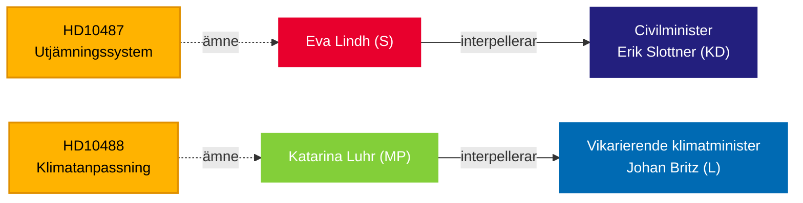

# Riksdag Presses Government on Welfare Equality and Climate Inaction — May 13, 2026

**BLUF**: Two interpellations submitted to the Tidö government on May 13 expose a governance accountability gap: the Social Democrats challenge Civilminister Erik Slottner (KD) over the stalled municipal equalization reform that has sat unanswered since summer 2024, while Miljöpartiet challenges Acting Climate Minister Johan Britz (L) on the delayed climate adaptation legislation whose consultation closed in October 2025 — seven months ago with no proposition tabled. Both interpellations target a pattern of policy inertia on distributional and environmental equity, with implications for the September 2026 election.

## Key Decisions Supported

1. **Editorial framing** — whether to treat these interpellations as isolated policy queries or symptoms of a broader government accountability deficit on rural-urban equity and climate governance.
2. **Opposition strategy** — S and MP are coordinating parliamentary pressure through interpellations as elections approach; timing signals pre-election positioning on welfare state and climate.
3. **Coalition risk assessment** — both interpellations target ministers from KD and L, the smaller Tidö parties, where policy delivery capacity is under scrutiny ahead of potential government reshuffles.

## 60-Second Read

- **HD10487** (S/Lindh → KD/Slottner): Municipal cost-equalization review was commissioned unanimously in 2022; SOU delivered summer 2024; remiss closed; no government bill. S argues the system is structurally failing small municipalities and rural areas. Questions: Why no proposal? How will the government ensure equitable welfare across all of Sweden?
- **HD10488** (MP/Luhr → L/Britz): Climate adaptation inquiry "Bättre förutsättningar för klimatanpassning" delivered 11 legislative change proposals; consultation closed October 17, 2025 — no proposition. MP asks about coastal protection against rising sea levels and state-vs-municipality responsibility. Questions: Why no action? Will the state protect coastal municipalities?
- **Pattern**: Both interpellations submitted 2026-05-08/12 and forwarded 2026-05-13. Debate expected in Riksdagen (Anmäld 2026-05-18, Sista svarsdatum 2026-05-29).
- **IMF Context**: Sweden GDP growth WEO-2026-04 vintage — the fiscal space constraints affect the government's willingness to fund new equalization transfers and coastal protection infrastructure.
- **Election dimension**: With Riksdagen election September 2026, both interpellations function as political positioning documents as much as policy oversight instruments.

## Top Forward Trigger

**72 hours**: Monitor minister responses announced for week of 2026-05-18 — Slottner's answer will be the first public government position on equalization reform timeline since the consultation closed.

## Confidence Assessment

`[B3]` Probably true / Reliable source — All claims sourced from official Riksdagen documents (HD10487, HD10488 full text), MCP retrieval confirmed 2026-05-13.

