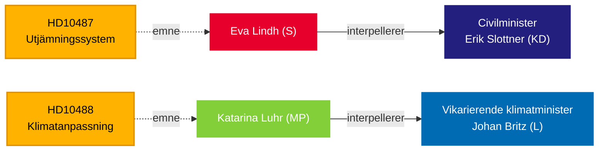

# Riksdag presser regeringen om velfærdsulighed og klimapassivitet — 13. maj 2026

**BLUF**: To interpellationer indsendt til Tidö-regeringen den 13. maj blotlægger et ansvarsgab i styringen: Socialdemokraterne udfordrer civilminister Erik Slottner (KD) om den stoppede kommunale udligningsreform, der har ligget ubesvaret siden sommeren 2024, mens Miljöpartiet udfordrer fungerende klimaminister Johan Britz (L) om den forsinkede klimatilpasningslovgivning, hvis høring sluttede i oktober 2025 — for syv måneder siden uden at der er fremsat noget lovforslag. Begge interpellationer er rettet mod et mønster af politisk træghed vedrørende fordelings- og miljøretfærdighed med konsekvenser for valget i september 2026.

## Nøglebeslutninger støttet

1. **Redaktionel indramning** — om disse interpellationer skal behandles som isolerede politiske forespørgsler eller som symptomer på et bredere regeringsansvarsproblem vedrørende land-by-lighed og klimastyring.
2. **Oppositionsstrategi** — S og MP koordinerer parlamentarisk pres via interpellationer i takt med, at valget nærmer sig; timingen signalerer forvalgpositionering om velfærdsstat og klima.
3. **Koalitionsrisikovurdering** — begge interpellationer er rettet mod ministre fra KD og L, de mindre Tidö-partier, hvor politikleverancekapaciteten er under lup forud for eventuelle ministerrokader.

## 60-sekunders læsning

- **HD10487** (S/Lindh → KD/Slottner): Kommunernes omkostningsudligningsgennemgang blev bestilt enstemmigt i 2022; SOU leveret sommeren 2024; høring afsluttet; intet lovforslag. S hævder, at systemet strukturelt svigter små kommuner og landdistrikter. Spørgsmål: Hvorfor intet forslag? Hvordan vil regeringen sikre ligeværdig velfærd i hele Sverige?
- **HD10488** (MP/Luhr → L/Britz): Klimatilpasningsudredningen "Bättre förutsättningar för klimatanpassning" leverede 11 lovændringsforsalg; høringen sluttede den 17. oktober 2025 — intet forslag. MP spørger om kystbeskyttelse mod stigende havniveauer og stat-vs-kommune-ansvar. Spørgsmål: Hvorfor ingen handling? Vil staten beskytte kystkommuner?
- **Mønster**: Begge interpellationer indsendt 2026-05-08/12 og videresendt 2026-05-13. Debat forventet i Riksdagen (Anmäld 2026-05-18, Sista svarsdatum 2026-05-29).
- **IMF-kontekst**: Sveriges BNP-vækst IMF WEO-2026-04 — de finanspolitiske begrænsninger påvirker regeringens vilje til at finansiere nye udligningstilskud og kystbeskyttelsesinfrastruktur.
- **Valgdimension**: Med riksdagsvalget i september 2026 fungerer begge interpellationer som politiske positioneringsdokumenter såvel som politikiske tilsynsinstrumenter.

## Vigtigste fremadrettede trigger

**72 timer**: Overvåg ministerresponserne varslet for ugen 2026-05-18 — Slottners svar vil være den første offentlige regeringsposition om udligningsreformtidsplanen siden høringen sluttede.

## Tillidsanalyse

`[B3]` Sandsynligvis korrekt / Pålidelig kilde — Alle påstande hentet fra officielle Riksdag-dokumenter (HD10487, HD10488 fuld tekst), MCP-hentning bekræftet 2026-05-13.

<!-- source-sha: 024711d152b3357ca699b043a50b4b7600683400 -->
