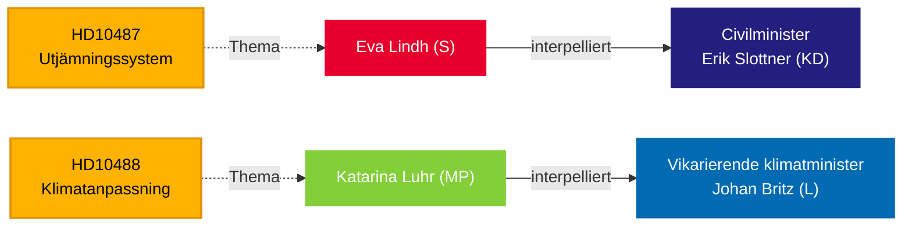

# Riksdag drängt Regierung bei Wohlfahrtsgerechtigkeit und Klimapassivität — 13. Mai 2026

**BLUF**: Zwei Interpellationen, die am 13. Mai an die Tidö-Regierung eingereicht wurden, offenbaren eine Verantwortungslücke in der Regierungsführung: Die Sozialdemokraten fordern Zivilminister Erik Slottner (KD) wegen der ins Stocken geratenen Kommunalausgleichsreform heraus, die seit Sommer 2024 unbeantwortet geblieben ist, während Miljöpartiet den amtierenden Klimaminister Johan Britz (L) wegen der verzögerten Klimaanpassungsgesetzgebung herausfordert, deren Konsultationsphase im Oktober 2025 endete — vor sieben Monaten ohne vorgelegten Gesetzentwurf. Beide Interpellationen zielen auf ein Muster politischer Trägheit bei Verteilungs- und Umweltgerechtigkeit, mit Implikationen für die Wahl im September 2026.

## Unterstützte Entscheidungen

1. **Redaktionelle Einordnung** — ob diese Interpellationen als isolierte politische Anfragen oder als Symptome eines umfassenderen Regierungsverantwortungsdefizits bei städtisch-ländlicher Gerechtigkeit und Klimagovernance behandelt werden sollten.
2. **Oppositionsstrategie** — S und MP koordinieren parlamentarischen Druck durch Interpellationen, während sich die Wahl nähert; das Timing signalisiert Vorwahl-Positionierung bei Wohlfahrtsstaat und Klima.
3. **Koalitionsrisikobewertung** — beide Interpellationen richten sich an Minister von KD und L, den kleineren Tidö-Parteien, wo die politische Lieferfähigkeit vor möglichen Kabinettsumbildungen unter Beobachtung steht.

## 60-Sekunden-Lektüre

- **HD10487** (S/Lindh → KD/Slottner): Die Überprüfung des kommunalen Kostanausgleichs wurde 2022 einstimmig in Auftrag gegeben; SOU im Sommer 2024 geliefert; Konsultation abgeschlossen; kein Gesetzentwurf. S argumentiert, dass das System kleine Kommunen und ländliche Gebiete strukturell benachteiligt. Fragen: Warum kein Vorschlag? Wie wird die Regierung gleichwertige Wohlfahrt in ganz Schweden sicherstellen?
- **HD10488** (MP/Luhr → L/Britz): Die Klimaanpassungsuntersuchung "Bättre förutsättningar för klimatanpassning" lieferte 11 Gesetzesänderungsvorschläge; die Konsultation endete am 17. Oktober 2025 — kein Vorschlag. MP fragt nach Küstenschutz gegen steigende Meeresspiegel und Staat-vs.-Gemeinde-Verantwortung. Fragen: Warum keine Maßnahmen? Wird der Staat Küstenkommunen schützen?
- **Muster**: Beide Interpellationen am 2026-05-08/12 eingereicht und am 2026-05-13 weitergeleitet. Debatte im Riksdagen erwartet (Anmäld 2026-05-18, Sista svarsdatum 2026-05-29).
- **IMF-Kontext**: Schwedisches BIP-Wachstum IMF WEO-2026-04 — die finanzpolitischen Beschränkungen beeinflussen die Bereitschaft der Regierung, neue Ausgleichstransfers und Küstenschutzinfrastruktur zu finanzieren.
- **Wahldimension**: Mit der Riksdagswahl im September 2026 fungieren beide Interpellationen ebenso als politische Positionierungsdokumente wie als Politiküberwachungsinstrumente.

## Wichtigster Voraus-Auslöser

**72 Stunden**: Ministerantworten für die Woche 2026-05-18 beobachten — Slottners Antwort wird die erste öffentliche Regierungsposition zur Zeitplanung der Ausgleichsreform seit dem Ende der Konsultation sein.

## Vertrauensbewertung

`[B3]` Wahrscheinlich korrekt / Zuverlässige Quelle — Alle Behauptungen aus offiziellen Riksdag-Dokumenten (HD10487, HD10488 Volltext), MCP-Abruf bestätigt am 2026-05-13.

<!-- source-sha: 024711d152b3357ca699b043a50b4b7600683400 -->
