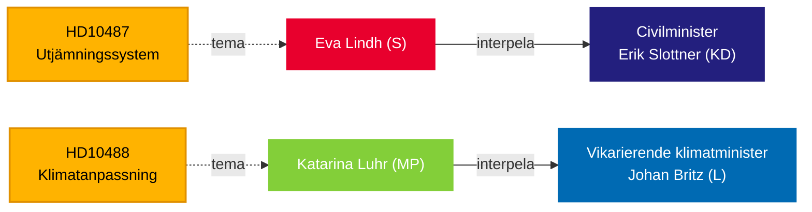

# El Riksdag presiona al gobierno sobre igualdad del bienestar e inacción climática — 13 de mayo de 2026

**BLUF**: Dos interpelaciones presentadas al gobierno Tidö el 13 de mayo revelan una brecha de responsabilidad en la gobernanza: los Socialdemócratas desafían al ministro civil Erik Slottner (KD) sobre la estancada reforma de igualación municipal que lleva sin respuesta desde el verano de 2024, mientras que Miljöpartiet desafía al ministro de clima en funciones Johan Britz (L) sobre la retrasada legislación de adaptación climática cuya consulta cerró en octubre de 2025 — hace siete meses sin propuesta presentada. Ambas interpelaciones apuntan a un patrón de inercia política sobre equidad distributiva y ambiental, con implicaciones para las elecciones de septiembre de 2026.

## Decisiones respaldadas

1. **Encuadre editorial** — si tratar estas interpelaciones como consultas políticas aisladas o como síntomas de un déficit más amplio de responsabilidad gubernamental en materia de equidad urbano-rural y gobernanza climática.
2. **Estrategia de oposición** — S y MP coordinan la presión parlamentaria mediante interpelaciones a medida que se acercan las elecciones; el momento señala posicionamiento preelectoral sobre el Estado de bienestar y el clima.
3. **Evaluación de riesgo de coalición** — ambas interpelaciones se dirigen a ministros de KD y L, los partidos Tidö menores, donde la capacidad de entrega de políticas está bajo escrutinio antes de posibles remodelaciones de gobierno.

## Lectura en 60 segundos

- **HD10487** (S/Lindh → KD/Slottner): La revisión del sistema de igualación de costos municipales fue encargada por unanimidad en 2022; SOU entregada en verano de 2024; consulta cerrada; ningún proyecto de ley. S argumenta que el sistema falla estructuralmente a los pequeños municipios y las zonas rurales. Preguntas: ¿Por qué no hay propuesta? ¿Cómo garantizará el gobierno bienestar equitativo en toda Suecia?
- **HD10488** (MP/Luhr → L/Britz): La investigación de adaptación climática "Bättre förutsättningar för klimatanpassning" entregó 11 propuestas de cambio legislativo; la consulta cerró el 17 de octubre de 2025 — ninguna propuesta. MP pregunta sobre la protección costera contra el aumento del nivel del mar y la responsabilidad estado-municipio. Preguntas: ¿Por qué no hay acción? ¿Protegerá el Estado a los municipios costeros?
- **Patrón**: Ambas interpelaciones presentadas el 2026-05-08/12 y remitidas el 2026-05-13. Debate esperado en el Riksdagen (Anmäld 2026-05-18, Sista svarsdatum 2026-05-29).
- **Contexto FMI**: Crecimiento del PIB de Suecia IMF WEO-2026-04 — las restricciones del espacio fiscal afectan la voluntad del gobierno de financiar nuevas transferencias de igualación e infraestructura de protección costera.
- **Dimensión electoral**: Con las elecciones del Riksdag en septiembre de 2026, ambas interpelaciones funcionan tanto como documentos de posicionamiento político como instrumentos de supervisión política.

## Principal desencadenante prospectivo

**72 horas**: Monitorear las respuestas ministeriales anunciadas para la semana del 2026-05-18 — la respuesta de Slottner será la primera posición pública del gobierno sobre el cronograma de la reforma de igualación desde que cerró la consulta.

## Evaluación de confianza

`[B3]` Probablemente correcto / Fuente confiable — Todas las afirmaciones extraídas de documentos oficiales del Riksdag (HD10487, HD10488 texto completo), recuperación MCP confirmada el 2026-05-13.

<!-- source-sha: 024711d152b3357ca699b043a50b4b7600683400 -->
