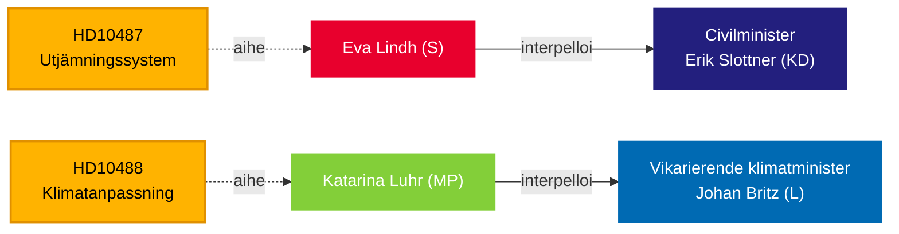

# Riksdag painostaa hallitusta hyvinvoinnin tasa-arvosta ja ilmastopassiivisuudesta — 13. toukokuuta 2026

**BLUF**: Kaksi 13. toukokuuta Tidö-hallitukselle jätettyjä välikysymystä paljastaa hallinnon vastuuvajeen: Socialdemokraterna haastaa siviiliministeri Erik Slottnerin (KD) pysähtyneestä kuntien tasausreformista, joka on jäänyt vastaamattomaksi kesästä 2024, kun taas Miljöpartiet haastaa vt. ilmastoministeri Johan Britzin (L) viivästyneestä ilmastonmuutokseen sopeutumislainsäädännöstä, jonka lausuntokierros päättyi lokakuussa 2025 — seitsemän kuukautta sitten ilman esitettyä hallituksen esitystä. Molemmat välikysymykset kohdistuvat poliittisen hitauden kuvioon jakeluun ja ympäristöoikeudenmukaisuuteen liittyvissä asioissa, mikä vaikuttaa syyskuun 2026 vaaleihin.

## Tuetut päätökset

1. **Toimituksellinen kehystys** — pitäisikö nämä välikysymykset käsitellä yksittäisinä poliittisina kyselyinä vai oireina laajemmasta hallituksen vastuuvajesta kaupunki-maaseutu-tasa-arvossa ja ilmastohallinnossa.
2. **Oppositiostrategia** — S ja MP koordinoivat parlamentaarista painetta välikysymysten kautta vaalien lähestyessä; ajoitus viestii ennen vaaleja tehtävästä asemoinnista hyvinvointivaltion ja ilmaston osalta.
3. **Koalitioriskiarvio** — molemmat välikysymykset kohdistuvat KD:n ja L:n ministereihin, pienempiin Tidö-puolueisiin, joiden politiikan toimeenpanokykyä tarkastellaan ennen mahdollisia hallituksen uudelleenjärjestelyjä.

## 60 sekunnin lukeminen

- **HD10487** (S/Lindh → KD/Slottner): Kuntien kustannusten tasausjärjestelmän tarkastelu tilattiin yksimielisesti vuonna 2022; SOU toimitettu kesällä 2024; lausuntokierros päättynyt; ei hallituksen esitystä. S väittää, että järjestelmä epäonnistuu rakenteellisesti pienten kuntien ja maaseutualueiden osalta. Kysymykset: Miksi ei esitystä? Miten hallitus varmistaa tasapuolisen hyvinvoinnin koko Ruotsissa?
- **HD10488** (MP/Luhr → L/Britz): Ilmastonmuutokseen sopeutumisen selvitys "Bättre förutsättningar för klimatanpassning" toimitti 11 lainsäädäntöehdotusta; lausuntokierros päättyi 17. lokakuuta 2025 — ei hallituksen esitystä. MP kysyy rannikkosuojelusta merenpinnan nousua vastaan ja valtion–kunnan vastuunjaosta. Kysymykset: Miksi ei toimenpiteitä? Suojaako valtio rannikkokunnat?
- **Kaava**: Molemmat välikysymykset jätetty 2026-05-08/12 ja välitetty eteenpäin 2026-05-13. Debatti odotetaan Riksdagenissa (Anmäld 2026-05-18, Sista svarsdatum 2026-05-29).
- **IMF-konteksti**: Ruotsin BKT-kasvu IMF WEO-2026-04 — finanssipolitiset rajoitteet vaikuttavat hallituksen halukkuuteen rahoittaa uusia tasaussiirtoja ja rannikkosuojeluinfrastruktuuria.
- **Vaaliulottuvuus**: Syyskuun 2026 riksdagvaalien lähestyessä molemmat välikysymykset toimivat poliittisina asemointiasiakirjoina yhtä lailla kuin politiikan valvontavälineinä.

## Tärkein tulevaisuuden laukaisin

**72 tuntia**: Seuraa viikolla 2026-05-18 ilmoitettuja ministerivastaukssia — Slottnerin vastaus tulee olemaan hallituksen ensimmäinen julkinen kanta tasausuudistuksen aikatauluun lausuntokierroksen päättymisen jälkeen.

## Luotettavuusarvio

`[B3]` Todennäköisesti tosi / Luotettava lähde — Kaikki väitteet peräisin virallisista Riksdag-asiakirjoista (HD10487, HD10488 koko teksti), MCP-haku vahvistettu 2026-05-13.

<!-- source-sha: 024711d152b3357ca699b043a50b4b7600683400 -->
