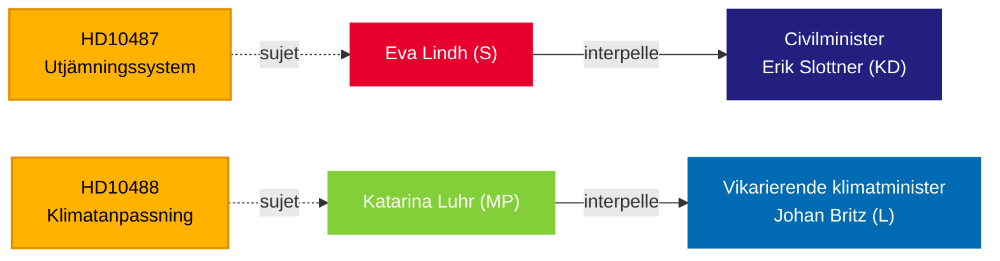

# Le Riksdag presse le gouvernement sur l'équité sociale et l'inaction climatique — 13 mai 2026

**BLUF** : Deux interpellations soumises au gouvernement Tidö le 13 mai révèlent un déficit de responsabilité dans la gouvernance : les Sociaux-démocrates mettent au défi le ministre civil Erik Slottner (KD) au sujet de la réforme bloquée de la péréquation communale, sans réponse depuis l'été 2024, tandis que Miljöpartiet met au défi le ministre du climat par intérim Johan Britz (L) au sujet de la législation retardée sur l'adaptation climatique, dont la consultation s'est clôturée en octobre 2025 — il y a sept mois sans proposition déposée. Les deux interpellations visent un schéma d'inertie politique sur l'équité distributive et environnementale, avec des implications pour les élections de septembre 2026.

## Décisions soutenues

1. **Cadrage éditorial** — s'il convient de traiter ces interpellations comme des questions politiques isolées ou comme des symptômes d'un déficit plus large de responsabilité gouvernementale sur l'équité urbain-rural et la gouvernance climatique.
2. **Stratégie d'opposition** — S et MP coordonnent la pression parlementaire par des interpellations à l'approche des élections ; le calendrier signale un positionnement pré-électoral sur l'État-providence et le climat.
3. **Évaluation des risques de coalition** — les deux interpellations visent des ministres de KD et L, les plus petits partis Tidö, dont la capacité de mise en œuvre des politiques est scrutée avant d'éventuels remaniements ministériels.

## Lecture en 60 secondes

- **HD10487** (S/Lindh → KD/Slottner) : L'examen de la péréquation des coûts communaux a été commandé à l'unanimité en 2022 ; la SOU livrée à l'été 2024 ; consultation clôturée ; aucun projet de loi. S soutient que le système défaille structurellement pour les petites communes et les zones rurales. Questions : Pourquoi aucune proposition ? Comment le gouvernement assurera-t-il une protection sociale équitable dans toute la Suède ?
- **HD10488** (MP/Luhr → L/Britz) : L'enquête sur l'adaptation climatique « Bättre förutsättningar för klimatanpassning » a produit 11 propositions de modification législative ; la consultation s'est clôturée le 17 octobre 2025 — aucune proposition. MP interroge sur la protection côtière face à la montée des eaux et sur la responsabilité État-communes. Questions : Pourquoi aucune action ? L'État protégera-t-il les communes côtières ?
- **Schéma** : Les deux interpellations soumises les 2026-05-08/12 et transmises le 2026-05-13. Débat attendu au Riksdagen (Anmäld 2026-05-18, Sista svarsdatum 2026-05-29).
- **Contexte FMI** : Croissance du PIB suédois FMI WEO-2026-04 — les contraintes budgétaires affectent la volonté du gouvernement de financer de nouveaux transferts de péréquation et des infrastructures de protection côtière.
- **Dimension électorale** : Avec les élections du Riksdag en septembre 2026, les deux interpellations servent autant de documents de positionnement politique que d'instruments de contrôle de l'action publique.

## Principal déclencheur prospectif

**72 heures** : Surveiller les réponses ministérielles annoncées pour la semaine du 2026-05-18 — la réponse de Slottner sera la première position publique du gouvernement sur le calendrier de la réforme de la péréquation depuis la clôture de la consultation.

## Évaluation de fiabilité

`[B3]` Probablement exact / Source fiable — Toutes les affirmations proviennent de documents officiels du Riksdag (HD10487, HD10488 texte intégral), récupération MCP confirmée le 2026-05-13.

<!-- source-sha: 024711d152b3357ca699b043a50b4b7600683400 -->
