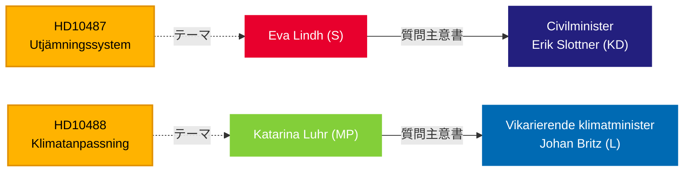

# Riksdagが福祉平等と気候不作為でTidö政府を追及 — 2026年5月13日

**BLUF**: 5月13日にTidö政府に提出された2つの質問主意書は、統治における説明責任のギャップを露わにしている。社会民主党は、2024年夏以来未回答のまま止まっている地方自治体均等化改革についてErik Slottner民政大臣（KD）に迫り、一方Miljöpartietは2025年10月に意見募集が終了した気候適応立法の遅延について代行気候大臣Johan Britz（L）に迫っている — 7ヶ月前に法案提出なし。両質問主意書は、分配的・環境的公正における政策惰性のパターンを標的にしており、2026年9月選挙への含意がある。

## 支援される意思決定

1. **編集上の枠組み** — これらの質問主意書を孤立した政策照会として扱うべきか、農村-都市間平等と気候統治における政府の広範な説明責任の欠如の症状として扱うべきか。
2. **野党戦略** — SとMPは選挙が近づく中、質問主意書を通じて議会圧力を調整している。タイミングは福祉国家と気候に関する選挙前のポジショニングを示している。
3. **連立リスク評価** — 両質問主意書はKDとLの大臣、つまり小規模なTidö政党を対象としており、政府改造の可能性を前に政策遂行能力が問われている。

## 60秒の概要

- **HD10487**（S/Lindh → KD/Slottner）: 市町村費用均等化の見直しは2022年に全会一致で委託；SOU は2024年夏に提出；意見募集終了；法案なし。Sはシステムが構造的に小規模自治体と農村地域を失敗させていると主張。問い：なぜ提案がないのか？政府はどうやってスウェーデン全国に平等な福祉を確保するか？
- **HD10488**（MP/Luhr → L/Britz）: 気候適応調査「Bättre förutsättningar för klimatanpassning」は11件の法改正提案を提出；意見募集は2025年10月17日に終了 — 法案なし。MPは海面上昇に対する沿岸保護と国対自治体の責任について問う。問い：なぜ行動しないか？国は沿岸自治体を保護するか？
- **パターン**: 両質問主意書は2026-05-08/12に提出され2026-05-13に回付。Riksdagenでの討論予定（Anmäld 2026-05-18, Sista svarsdatum 2026-05-29）。
- **IMF文脈**: スウェーデンGDP成長率 IMF WEO-2026-04 — 財政余地の制約が新規均等化交付と沿岸保護インフラへの政府支出意欲に影響。
- **選挙側面**: 2026年9月のRiksdagvalen選挙を前に、両質問主意書は政策監視ツールとしてと同様に政治的ポジショニング文書としても機能している。

## 主要な将来のトリガー

**72時間**: 2026-05-18週に予告された大臣の回答を監視 — Slottnerの回答は意見募集終了以来、均等化改革の時間軸に関する最初の公式政府見解となる。

## 信頼度評価

`[B3]` おそらく正確 / 信頼できる情報源 — すべての主張は公式Riksdag文書（HD10487, HD10488全文）より、MCP取得は2026-05-13に確認済み。

<!-- source-sha: 024711d152b3357ca699b043a50b4b7600683400 -->
