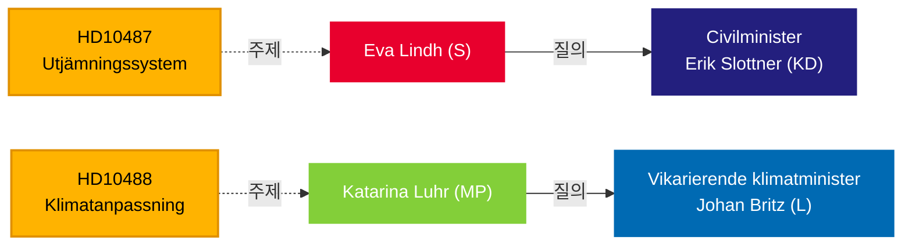

# Riksdag, 복지 평등과 기후 무대응에 대해 정부 압박 — 2026년 5월 13일

**BLUF**: 5월 13일 Tidö 정부에 제출된 두 건의 질의는 거버넌스의 책임 공백을 드러낸다. 사회민주당은 2024년 여름부터 미답으로 남겨진 정체된 지자체 균등화 개혁에 대해 에릭 슬로트너 민정장관(KD)에게 문제를 제기하고, 밀외파르티에트는 2025년 10월 의견수렴이 종료된 기후 적응 법안 지연에 대해 요한 브리츠 기후장관 직무대행(L)에게 문제를 제기한다 — 7개월 전이며 제안서 제출 없음. 두 질의 모두 분배적·환경적 형평성에 관한 정책 관성 패턴을 겨냥하며, 2026년 9월 선거에 함의를 갖는다.

## 지원되는 의사결정

1. **편집 프레이밍** — 이 질의들을 고립된 정책 문의로 볼 것인지, 아니면 도시-농촌 형평성과 기후 거버넌스에 관한 광범위한 정부 책임 결여의 징후로 볼 것인지.
2. **야당 전략** — S와 MP는 선거가 다가오면서 질의를 통해 의회 압박을 조율하고 있다. 타이밍은 복지국가와 기후에 관한 선거 전 포지셔닝을 시사한다.
3. **연립 위험 평가** — 두 질의 모두 소규모 Tidö 정당인 KD와 L의 장관을 겨냥하며, 가능한 내각 개편을 앞두고 정책 이행 능력이 주목받고 있다.

## 60초 요약

- **HD10487** (S/Lindh → KD/Slottner): 지자체 비용 균등화 검토가 2022년 만장일치로 위임됨; SOU는 2024년 여름 제출; 의견수렴 종료; 법안 없음. S는 제도가 소규모 지자체와 농촌 지역에 구조적으로 실패하고 있다고 주장. 질문: 왜 제안이 없는가? 정부가 어떻게 스웨덴 전역에서 균등한 복지를 보장할 것인가?
- **HD10488** (MP/Luhr → L/Britz): 기후 적응 조사 "Bättre förutsättningar för klimatanpassning"이 11개 법률 개정 제안을 제출; 의견수렴은 2025년 10월 17일 종료 — 법안 없음. MP는 해수면 상승에 대한 해안 보호와 국가-지자체 책임 분담에 대해 질문. 질문: 왜 조치가 없는가? 국가가 해안 지자체를 보호할 것인가?
- **패턴**: 두 질의 모두 2026-05-08/12에 제출되고 2026-05-13에 회부됨. Riksdagen에서 토론 예정 (Anmäld 2026-05-18, Sista svarsdatum 2026-05-29).
- **IMF 맥락**: 스웨덴 GDP 성장률 IMF WEO-2026-04 — 재정 공간 제약이 새로운 균등화 이전과 해안 보호 인프라 재정 지원 의지에 영향을 미친다.
- **선거 차원**: 2026년 9월 Riksdag 선거를 앞두고, 두 질의는 정책 감시 수단만큼이나 정치적 포지셔닝 문서로 기능한다.

## 주요 미래 트리거

**72시간**: 2026-05-18 주에 예고된 장관 답변 모니터링 — 슬로트너의 답변은 의견수렴 종료 이후 균등화 개혁 일정에 관한 첫 번째 공식 정부 입장이 된다.

## 신뢰도 평가

`[B3]` 아마도 사실 / 신뢰할 수 있는 출처 — 모든 주장은 공식 Riksdag 문서(HD10487, HD10488 전문)에서 출처를 가지며, MCP 검색은 2026-05-13에 확인됨.

<!-- source-sha: 024711d152b3357ca699b043a50b4b7600683400 -->
