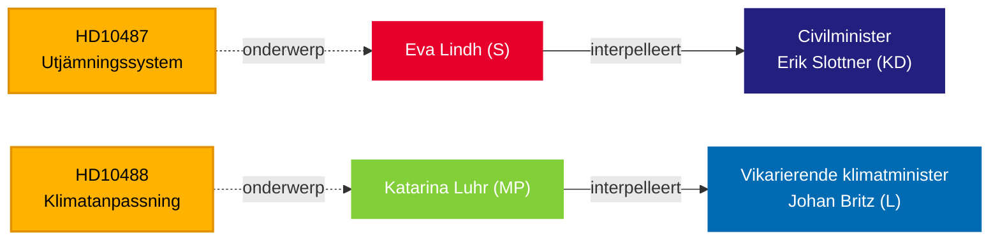

# Riksdag dringt bij regering aan op welzijnsgelijkheid en klimaatpassiviteit — 13 mei 2026

**BLUF**: Twee interpellaties ingediend bij de Tidö-regering op 13 mei onthullen een verantwoordingsgat in het bestuur: de Sociaaldemocra dagen civilminister Erik Slottner (KD) uit over de gestagneerde gemeentelijke vereffeningshervorming die sinds zomer 2024 onbeantwoord is gebleven, terwijl Miljöpartiet waarnemend klimaatminister Johan Britz (L) uitdaagt over de vertraagde klimaatadaptatienwetgeving waarvan de consultatie in oktober 2025 sloot — zeven maanden geleden zonder ingediend wetsvoorstel. Beide interpellaties richten zich op een patroon van politieke traagheid bij distributieve en milieurechtvaardigheidsvraagstukken, met gevolgen voor de verkiezingen van september 2026.

## Ondersteunde beslissingen

1. **Redactionele inkadering** — of deze interpellaties behandeld moeten worden als geïsoleerde beleidsvragen of als symptomen van een breder overheidsverantwoordingstekort bij stedelijk-landelijke gelijkheid en klimaatgovernance.
2. **Oppositiestrategie** — S en MP coördineren parlementaire druk via interpellaties naarmate de verkiezingen naderen; de timing signaleert voorverkiezingspositionering rond de verzorgingsstaat en klimaat.
3. **Coalitierisicoanalyse** — beide interpellaties richten zich op ministers van KD en L, de kleinere Tidö-partijen, waar de beleidsleveringscapaciteit wordt onderzocht voor mogelijke kabinetshervormingen.

## 60 seconden lezen

- **HD10487** (S/Lindh → KD/Slottner): De herziening van de gemeentelijke kostenevening werd unaniem besteld in 2022; SOU geleverd zomer 2024; consultatie afgesloten; geen wetsvoorstel. S betoogt dat het systeem kleine gemeenten en landelijke gebieden structureel benadeelt. Vragen: Waarom geen voorstel? Hoe zorgt de regering voor gelijkwaardige welzijnsvoorzieningen in heel Zweden?
- **HD10488** (MP/Luhr → L/Britz): Het klimaatadaptatieonderzoek "Bättre förutsättningar för klimatanpassning" leverde 11 voorstellen voor wetswijzigingen; de consultatie sloot op 17 oktober 2025 — geen voorstel. MP vraagt naar kustbescherming tegen stijgende zeespiegels en staat-vs-gemeente-verantwoordelijkheid. Vragen: Waarom geen actie? Zal de staat kustkomunen beschermen?
- **Patroon**: Beide interpellaties ingediend op 2026-05-08/12 en doorgestuurd op 2026-05-13. Debat verwacht in Riksdagen (Anmäld 2026-05-18, Sista svarsdatum 2026-05-29).
- **IMF-context**: Zweedse bbp-groei IMF WEO-2026-04 — de begrotingsruimtebeperkingen beïnvloeden de bereidheid van de regering om nieuwe vereffeningsoverdrachten en kustbeschermingsinfrastructuur te financieren.
- **Verkiezingsdimensie**: Met de Riksdag-verkiezingen in september 2026 functioneren beide interpellaties evenzeer als politieke positioneringsdocumenten als beleidscontroleinstrumenten.

## Belangrijkste toekomstige trigger

**72 uur**: Ministerresponsies monitoren die zijn aangekondigd voor de week van 2026-05-18 — Slottners antwoord zal de eerste publieke regeringspositie zijn over de tijdlijn van de vereffeningshervorming sinds de consultatie sloot.

## Vertrouwensbeoordeling

`[B3]` Waarschijnlijk juist / Betrouwbare bron — Alle beweringen afkomstig uit officiële Riksdag-documenten (HD10487, HD10488 volledige tekst), MCP-ophaling bevestigd op 2026-05-13.

<!-- source-sha: 024711d152b3357ca699b043a50b4b7600683400 -->
