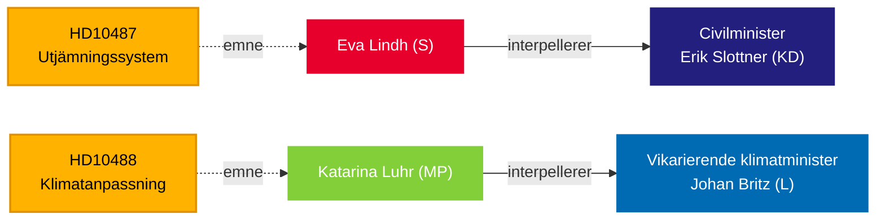

# Riksdag presser regjeringen om velferdslikhet og klimapassivitet — 13. mai 2026

**BLUF**: To interpellasjoner levert til Tidö-regjeringen 13. mai avslører et ansvarsgap i styringen: Sosialdemokratene utfordrer sivilminister Erik Slottner (KD) om den stoppede kommunale utjevningsreformen som har ligget ubesvart siden sommeren 2024, mens Miljöpartiet utfordrer fungerende klimaminister Johan Britz (L) om den forsinkede klimatilpasningslovgivningen hvis høring ble avsluttet i oktober 2025 — sju måneder siden uten at noe forslag er lagt frem. Begge interpellasjonene retter seg mot et mønster av politisk treghett om fordeling og miljørettferdighet, med konsekvenser for valget i september 2026.

## Nøkkelbeslutninger støttet

1. **Redaksjonell innramning** — om disse interpellasjonene skal behandles som isolerte politiske spørsmål eller som symptomer på et bredere regjeringsansvarsproblem om by-land-likhet og klimastyring.
2. **Opposisjonsstrategi** — S og MP koordinerer parlamentarisk press via interpellasjoner etter hvert som valget nærmer seg; timingen signaliserer forvalgposisjonering om velferdsstat og klima.
3. **Koalisjonsrisikovurdering** — begge interpellasjonene er rettet mot statsråder fra KD og L, de mindre Tidö-partiene, der politikkleveringskapasiteten er under lupen foran mulige regjeringsskifter.

## 60-sekunders lesning

- **HD10487** (S/Lindh → KD/Slottner): Gjennomgang av kommunenes kostnadsutjevning ble bestilt enstemmig i 2022; SOU levert sommeren 2024; høring avsluttet; ingen proposisjon. S hevder at systemet strukturelt svikter små kommuner og landlige områder. Spørsmål: Hvorfor ingen proposisjon? Hvordan vil regjeringen sikre likeverdig velferd i hele Sverige?
- **HD10488** (MP/Luhr → L/Britz): Klimatilpasningsutredningen "Bättre förutsättningar för klimatanpassning" leverte 11 lovforslag; høringen ble avsluttet 17. oktober 2025 — ingen proposisjon. MP spør om kystbeskyttelse mot stigende havnivåer og stat-vs-kommune-ansvar. Spørsmål: Hvorfor ingen handling? Vil staten beskytte kystkommuner?
- **Mønster**: Begge interpellasjonene levert 2026-05-08/12 og videresendt 2026-05-13. Debatt forventet i Riksdagen (Anmäld 2026-05-18, Sista svarsdatum 2026-05-29).
- **IMF-kontekst**: Sveriges BNP-vekst IMF WEO-2026-04 — de finanspolitiske begrensingene påvirker regjeringens vilje til å finansiere nye utjevningstilskudd og kystbeskyttelsesinfrastruktur.
- **Valgdimensjon**: Med riksdagsvalget i september 2026 fungerer begge interpellasjonene som politiske posisjoneringsdokumenter like mye som politiske tilsynsinstrumenter.

## Viktigste fremoverskuende utløser

**72 timer**: Overvåk ministerresponsene varslet for uken 2026-05-18 — Slottners svar vil være den første offentlige regjeringsposisjonen om tidslinje for utjevningsreformen siden høringen ble avsluttet.

## Tillitsanalyse

`[B3]` Sannsynligvis korrekt / Pålitelig kilde — Alle påstander hentet fra offisielle Riksdag-dokumenter (HD10487, HD10488 fulltekst), MCP-henting bekreftet 2026-05-13.

<!-- source-sha: 024711d152b3357ca699b043a50b4b7600683400 -->
