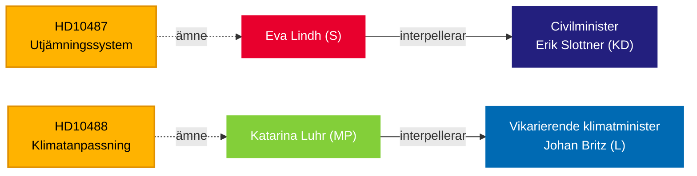

# Riksdag pressar regeringen om välfärdslikvärdighet och klimatpassivitet — 13 maj 2026

**BLUF**: Två interpellationer inlämnade till Tidöregeringen den 13 maj blottar ett ansvarsgap i styrningen: Socialdemokraterna utmanar civilminister Erik Slottner (KD) om den stoppade kommunala utjämningsreformen som legat obesvarad sedan sommaren 2024, medan Miljöpartiet utmanar tillförordnad klimatminister Johan Britz (L) om den försenade klimatanpassningslagstiftningen vars remiss avslutades i oktober 2025 — sju månader sedan utan att någon proposition lagts fram. Båda interpellationerna riktar in sig på ett mönster av politisk trögrörlighet kring fördelningspolitisk och miljörelaterad rättvisa, med implikationer för valet i september 2026.

## Nyckelstöd för beslut

1. **Redaktionell inramning** — om dessa interpellationer ska behandlas som isolerade politiska frågor eller som symptom på ett bredare underskott i regeringens ansvarsskyldighet kring stad-landsbygd-jämlikhet och klimatstyrning.
2. **Oppositionsstrategi** — S och MP samordnar det parlamentariska trycket genom interpellationer i takt med att valet nalkas; tidpunkten signalerar förvalspositionering om välfärdsstat och klimat.
3. **Koalitionsriskbedömning** — båda interpellationerna riktar sig mot ministrar från KD och L, de mindre Tidöpartierna, där policyleveransförmågan granskas inför eventuella regeringsombildningar.

## 60-sekunders läsning

- **HD10487** (S/Lindh → KD/Slottner): Kommunernas kostnadsutjämningsöversyn beställdes enhälligt 2022; SOU levererad sommaren 2024; remiss avslutad; ingen proposition. S hävdar att systemet strukturellt missgynnar små kommuner och landsbygdsområden. Frågor: Varför ingen proposition? Hur ska regeringen säkerställa likvärdig välfärd i hela Sverige?
- **HD10488** (MP/Luhr → L/Britz): Klimatanpassningsutredningen "Bättre förutsättningar för klimatanpassning" levererade 11 lagändringsförslag; remissen avslutades den 17 oktober 2025 — ingen proposition. MP frågar om kustskydd mot stigande havsnivåer och stat–kommun-ansvarsfördelning. Frågor: Varför ingen åtgärd? Ska staten skydda kustkommuner?
- **Mönster**: Båda interpellationerna inlämnade 2026-05-08/12 och vidarebefordrade 2026-05-13. Debatt förväntad i riksdagen (Anmäld 2026-05-18, Sista svarsdatum 2026-05-29).
- **IMF-kontext**: Sveriges BNP-tillväxt IMF WEO-2026-04 — de finanspolitiska begränsningarna påverkar regeringens vilja att finansiera nya utjämningsöverföringar och kustskyddsinfrastruktur.
- **Valdimension**: Med riksdagsvalet i september 2026 fungerar båda interpellationerna lika mycket som politiska positioneringsdokument som som policytillsynsinstrument.

## Viktigaste framåtblickande trigger

**72 timmar**: Bevaka ministrarnas svar aviserade för veckan 2026-05-18 — Slottners svar kommer att vara den första offentliga regeringspositionen om tidsplanen för utjämningsreformen sedan remissen avslutades.

## Förtroendeanalys

`[B3]` Troligtvis korrekt / Pålitlig källa — Alla påståenden hämtade från officiella riksdagsdokument (HD10487, HD10488 fulltext), MCP-hämtning bekräftad 2026-05-13.

<!-- source-sha: 024711d152b3357ca699b043a50b4b7600683400 -->
