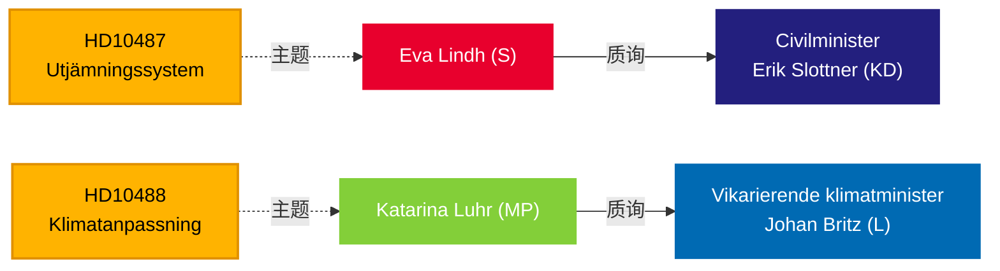

# Riksdag就福利平等和气候不作为向政府施压 — 2026年5月13日

**BLUF**：5月13日提交给Tidö政府的两份质询揭示了治理中的问责缺口：社会民主党就自2024年夏天以来悬而未决的地方政府均等化改革向民政大臣Erik Slottner（KD）发出挑战，而Miljöpartiet则就延迟的气候适应立法向代理气候大臣Johan Britz（L）发出挑战——后者的磋商已于2025年10月结束，七个月来没有提出任何议案。两份质询都针对分配和环境公平领域的政策惰性模式，对2026年9月的选举具有深远影响。

## 支持的决策

1. **编辑框架** — 是否将这些质询视为孤立的政策询问，还是更广泛的政府责任缺失（在城乡平等和气候治理方面）的症状。
2. **反对党策略** — 随着选举临近，S和MP通过质询协调议会压力；时机表明选前在福利国家和气候问题上的定位。
3. **联合风险评估** — 两份质询均针对KD和L（较小的Tidö政党）的大臣，在可能的内阁改组前，政策执行能力正受到审视。

## 60秒速读

- **HD10487**（S/Lindh → KD/Slottner）：地方政府成本均等化审查于2022年全票委托；SOU于2024年夏季交付；磋商结束；无议案。S认为该系统在结构上让小型市政当局和农村地区失败。问题：为何无提案？政府将如何确保瑞典全国的平等福利？
- **HD10488**（MP/Luhr → L/Britz）：气候适应调查"Bättre förutsättningar för klimatanpassning"提出了11项立法修改建议；磋商于2025年10月17日结束——无提案。MP就海平面上升的海岸保护以及国家与市政府的责任分担提问。问题：为何无行动？国家会保护沿海市政当局吗？
- **规律**：两份质询于2026-05-08/12提交并于2026-05-13转交。预计在Riksdagen辩论（Anmäld 2026-05-18, Sista svarsdatum 2026-05-29）。
- **IMF背景**：瑞典GDP增长IMF WEO-2026-04年份数据——财政空间限制影响政府资助新均等化转移和海岸保护基础设施的意愿。
- **选举维度**：随着2026年9月Riksdag选举临近，两份质询既作为政治定位文件也作为政策监督工具发挥作用。

## 主要前瞻性触发因素

**72小时**：关注为2026-05-18周宣布的部长回应——Slottner的回应将是磋商结束以来政府就均等化改革时间表的首次公开表态。

## 信心评估

`[B3]` 可能正确 / 可靠来源 — 所有主张均来源于Riksdag官方文件（HD10487, HD10488全文），MCP检索已于2026-05-13确认。

<!-- source-sha: 024711d152b3357ca699b043a50b4b7600683400 -->
