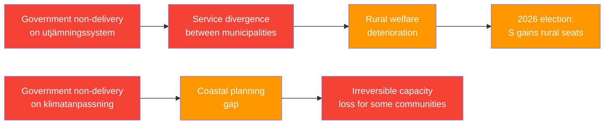

# Risk Assessment — 2026-05-13 Interpellations

## Risk Register (5-Dimension Framework)

### Dimension 1: Political/Governance Risk

| Risk | Likelihood (L) | Impact (I) | L×I | Cascade |
|------|---------------|-----------|-----|---------|
| Government answer avoids binding commitment on utjämningssystem | 0.80 | 0.65 | 0.52 | → S uses non-answer in 2026 election campaign against KD/Slottner |
| Climate adaptation legislation delayed beyond 2026 election | 0.60 | 0.75 | 0.45 | → New government (potentially S/MP/V/C) restarts process; coastal protection gap widens |
| Coalition disagreement on equalization redistributed amounts | 0.55 | 0.70 | 0.39 | → Internal Tidö friction; M and SD may oppose transfers to rural municipalities that don't vote for them |
| KD/L appear weak on their policy portfolios in election year | 0.65 | 0.60 | 0.39 | → Coalition dynamics destabilized; smaller parties face electoral pressure |

**Highest political risk**: Government's non-answer on utjämningssystem creates persistent campaign vulnerability for Slottner/KD specifically.

### Dimension 2: Institutional/Administrative Risk

| Risk | L | I | L×I |
|------|---|---|-----|
| Further delays in municipal equalization reform increase service divergence between municipalities | 0.75 | 0.80 | 0.60 |
| Coastal protection planning gap increases irreversible loss of eligible protection capacity | 0.50 | 0.85 | 0.43 |
| Implementing agencies (Naturvårdsverket, HaV) lack clear mandate for climate adaptation coordination | 0.65 | 0.70 | 0.46 |

**Posterior probability update**: Given 7-month post-consultation inaction on HD10488, P(no bill before election | current trajectory) = 0.65.

### Dimension 3: Welfare/Social Risk

| Risk | L | I | L×I |
|------|---|---|-----|
| Rural municipalities cut welfare services before reform | 0.70 | 0.75 | 0.53 |
| Coastal communities unprepared for extreme weather events without state protection mandate | 0.40 | 0.80 | 0.32 |
| Regional welfare inequality reinforced, increasing urban/rural political polarization | 0.65 | 0.70 | 0.46 |

### Dimension 4: Legal/Regulatory Risk

| Risk | L | I | L×I |
|------|---|---|-----|
| Sweden faces EU infringement risk on climate adaptation obligations | 0.25 | 0.70 | 0.18 |
| Municipal challenges to equalization formula continue without reform | 0.55 | 0.40 | 0.22 |

### Dimension 5: Electoral/Reputational Risk

| Risk | L | I | L×I |
|------|---|---|-----|
| S campaign narrative of "welfare state erosion" gains traction | 0.65 | 0.75 | 0.49 |
| KD/L unable to demonstrate policy delivery in coalition | 0.70 | 0.65 | 0.46 |
| MP uses climate inaction as election contrast with government | 0.80 | 0.50 | 0.40 |

## Cascading Risk Chain

## Top Risks Summary

1. **Highest overall**: Continued municipal service divergence from stalled equalization reform (L×I = 0.60)
2. **Highest irreversibility**: Coastal protection capacity loss if climate adaptation delayed beyond election (L×I = 0.43 but I = 0.85)
3. **Highest political**: Government non-answer creating persistent S/MP election narrative (L×I = 0.52 / 0.49)
