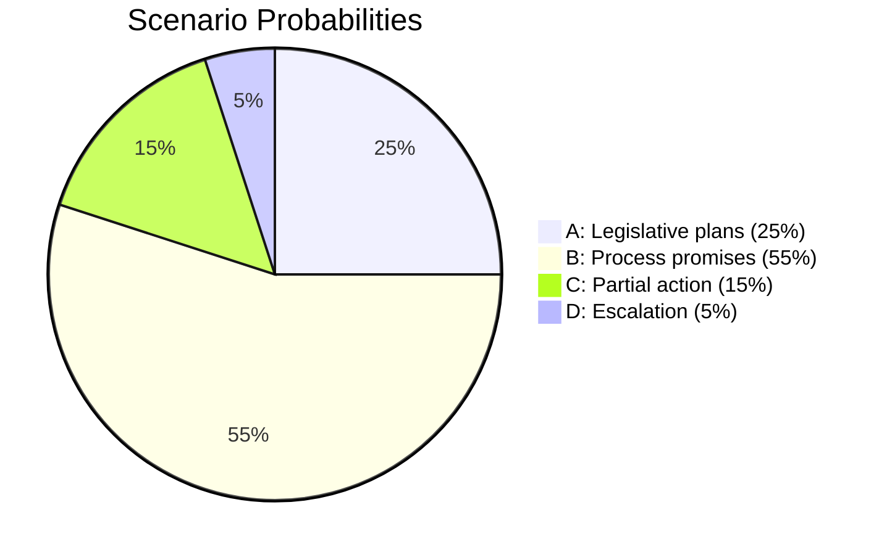

# Scenario Analysis — 2026-05-13 Interpellations

## Scenario Framework

**Focal question**: How will the Swedish government respond to these two interpellations, and what are the political consequences for the September 2026 Riksdagen election?

## Scenarios

### Scenario A — Government Announces Legislative Plans Before Election (Probability: 25%)

**Trigger**: Ministerial responses announce concrete timelines for both utjämningssystem reform and climate adaptation legislation before the September 2026 election.

**Narrative**: Slottner and Britz face sufficient internal coalition and media pressure that they announce bill timelines in their interpellation responses (by 2026-05-29) or in the subsequent plenary debate. Announces: "Vi avser att presentera en proposition om det kommunala utjämningssystemet innan valrörelsen."

**Leading indicator**: Both ministers begin preparatory media briefings on "reform package" language in week of 2026-05-18.

**Consequence**: Opposition interpellations become partial victories; S and MP claim credit for forcing government action; government deflects accountability narrative; electoral effect muted.

### Scenario B — Government Defers with Process Promises (Probability: 55%)

**Trigger**: Ministers answer that "work is ongoing" with consultation or expert group references, no binding timelines.

**Narrative**: Standard parliamentary response pattern. Slottner cites "complex redistribution calculations" requiring additional analysis. Britz points to "technical preparation" of legislative text. Both commit to "continued prioritization" without dates.

**Leading indicator**: Minister's office declines to preview response content before debate; standard bureaucratic language in official statements.

**Consequence**: Opposition uses written record in election campaign. S frames rural welfare as election issue. MP positions climate inaction as KD/L failure. Electoral pressure on smaller coalition partners.

### Scenario C — Government Announces Partial Action on One Area (Probability: 15%)

**Trigger**: Government responds substantively on the more politically risky area (likely klimatanpassning due to irreversibility argument) while deferring on the more complex equalization question.

**Narrative**: Britz announces a legislative framework for coastal protection; Slottner continues to defer on equalization redistribution formula. Divides the interpellation narrative.

**Leading indicator**: Government communication team previews climate adaptation "announcement" for week of 2026-05-18.

**Consequence**: MP claim partial victory; S continues pressure on equalization; coalition maintains different policy velocities for L vs KD portfolios.

### Scenario D — Escalation via Additional Interpellations and Media (Probability: 5%)

**Trigger**: Weak ministerial responses trigger further parliamentary pressure — additional interpellations from S/MP, committee hearings requested, media investigative coverage.

**Leading indicator**: S/MP file additional interpellations within 2 weeks of first responses.

**Consequence**: Sustained accountability narrative through summer 2026; worst-case for government pre-election period.

## Probability Summary

| Scenario | Probability | Electoral Impact on Government |
|----------|-------------|-------------------------------|
| A: Legislative plans announced | 25% | Neutral to mildly positive |
| B: Process promises | 55% | Mildly negative |
| C: Partial action | 15% | Mixed |
| D: Escalation | 5% | Significantly negative |

