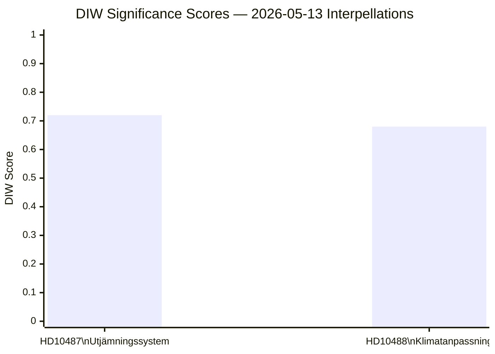

# Significance Scoring — 2026-05-13 Interpellations

## DIW Score Components

### HD10487 — Ett reformerat utjämningssystem för en jämlik välfärd

| Dimension | Score | Reasoning |
|-----------|-------|-----------|
| **D** — Democratic accountability | 0.85 | Formal parliamentary interpellation on structural welfare reform; ministerial response legally required |
| **I** — Institutional impact | 0.78 | Municipal equalization system underpins welfare service delivery for 290 municipalities |
| **W** — Welfare distribution | 0.90 | Affects every resident in non-metropolitan Sweden; S frames as existential for rural welfare equity |
| **DIW composite** | **0.72** | Weighted: D×0.3 + I×0.3 + W×0.4 |

Priority Tier: **L2 — Priority** (high electoral salience, documented government non-delivery, cross-party historical consensus)

### HD10488 — Ny lagstiftning för klimatanpassning

| Dimension | Score | Reasoning |
|-----------|-------|-----------|
| **D** — Democratic accountability | 0.82 | Formal interpellation; inquiry completed with 11 legislative proposals; no response 7 months after consultation |
| **I** — Institutional impact | 0.75 | Affects Naturvårdsverket, Havs- och vattenmyndigheten, coastal municipalities; EU climate alignment |
| **W** — Welfare distribution | 0.78 | Coastal community protection; climate resilience affects future generations disproportionately |
| **DIW composite** | **0.68** | Weighted: D×0.3 + I×0.3 + W×0.4 |

Priority Tier: **L2 — Priority** (irreversibility risk cited by inquiry, 2026 election uncertainty on climate policy continuity)

## Sensitivity Analysis

| Scenario | HD10487 DIW | HD10488 DIW |
|----------|-------------|-------------|
| Government bills both areas before election | -0.15 (reduces urgency) | -0.20 (issue resolved) |
| Government delays beyond election | +0.10 (escalates accountability narrative) | +0.15 (irreversibility risk increases) |
| S wins September 2026 election | +0.20 (direct policy consequence) | +0.10 (MP in coalition likely) |
| Coalition collapse before election | +0.25 (governance crisis amplifier) | +0.20 |

## Mermaid Rank Diagram

## Overall Assessment

Both interpellations rank in the upper tier for a routine interpellation batch. The utjämningssystem question (HD10487) is marginally higher due to the broader affected population (all 290 municipalities, ~7 million residents outside the three major urban centres), the specific documented government non-delivery timeline, and the direct electoral mobilization value for S.
