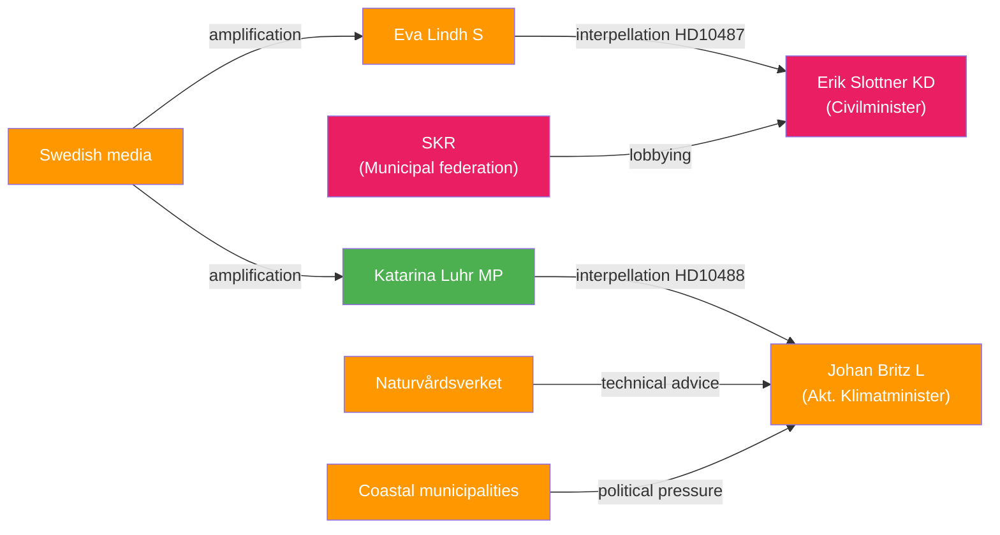

# Stakeholder Perspectives — 2026-05-13 Interpellations

## 6-Lens Stakeholder Matrix

### Lens 1: Direct Parliamentary Actors

| Stakeholder | Role | Position | Influence |
|-------------|------|----------|-----------|
| Eva Lindh (S) | Interpellator HD10487 | Demands equalization reform timeline | Medium — opposition |
| Erik Slottner (KD, Civilminister) | Respondent HD10487 | Must answer by 2026-05-29 | High — portfolio holder |
| Katarina Luhr (MP) | Interpellator HD10488 | Demands climate adaptation legislation | Low-Medium — small opposition party |
| Johan Britz (L, Acting Climate Minister) | Respondent HD10488 | Must answer by 2026-05-29 | Medium — portfolio holder |

### Lens 2: Political Parties

| Party | Position on HD10487 (Utjämningssystem) | Position on HD10488 (Klimatanpassning) |
|-------|----------------------------------------|----------------------------------------|
| S | Strongly supports reform; framing as rural welfare justice | Supports stronger climate adaptation legislation |
| MP | Supports equalization reform in principle | Strongly supports climate adaptation legislation |
| KD | Government portfolio holder — defensive | Supportive of environmental responsibility but cautious on state mandate |
| L | Supportive of equalization in principle | Government portfolio holder — defensive |
| M | Benefits from urban-suburban equalization formula; complex internal position | Cautious on state mandate for climate adaptation |
| SD | Represents rural constituency interest; potentially S-aligned on equalization | Generally skeptical of EU climate agenda alignment |
| C | Rural stronghold party — likely supports equalization reform | Historically strong on environmental policy |
| V | Strong supporter of equalization reform and public welfare | Supports binding climate adaptation legislation |

### Lens 3: Municipal Sector Actors

| Stakeholder | Position |
|-------------|----------|
| Sveriges Kommuner och Regioner (SKR) | Formally advocates for equalization reform; has submitted detailed proposals to government |
| Small rural municipalities (glesbygd) | Urgently need equalization system reform; face growing structural deficits |
| Urban municipalities (Stockholm, Gothenburg, Malmö) | Some resist equalization transfers as reducing their own fiscal capacity |
| Coastal municipalities | HD10488 directly affects planning capacity; need state protection mandate |

### Lens 4: Government Agencies

| Agency | Relevance |
|--------|-----------|
| Ekonomistyrningsverket (ESV) | Monitors municipal fiscal sustainability; data supports S's claims |
| Naturvårdsverket | Lead agency for climate adaptation — lacks clear mandate per HD10488 |
| Havs- och vattenmyndigheten (HaV) | Coastal protection expertise; awaiting legislative mandate |
| Statskontoret | Evaluates government agency implementation capacity |

### Lens 5: Civil Society and Media

| Stakeholder | Position |
|-------------|----------|
| LO (Swedish Trade Union Confederation) | Supports equalization reform — affects public sector workers in rural areas |
| Climate NGOs (Naturskyddsföreningen, Greenpeace Sweden) | Support HD10488's goals; will amplify Luhr's framing |
| Rural interest groups (Hela Sverige ska leva) | Strong advocacy for equalization reform |
| Swedish media | Both interpellations are pre-election news items — likely to cover ministerial responses |

### Lens 6: International/EU Dimension

| Stakeholder | Relevance |
|-------------|-----------|
| European Commission | HD10488: EU Adaptation Strategy and Climate Law create soft pressure on member states |
| Nordic peers | Denmark and Finland have reformed equalization systems more recently — comparison available |
| IPCC / climate science community | HD10488 irreversibility claims supported by sea-level rise projections |

## Influence Network

