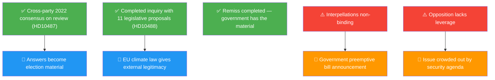

# SWOT Analysis — Interpellation Debates 2026-05-13

## Context

Both interpellations challenge the Tidö government's failure to translate completed policy inquiries into legislation. This SWOT frames the political-strategic situation as of 2026-05-13.

## SWOT Matrix

### Strengths (of the opposition/interpellators' position)

| Strength | Evidence | dok_id |
|----------|----------|--------|
| Cross-party precedent of consensus on utjämningssystem review | Riksdagen 2022 unanimous resolution commissioning SOU | HD10487 |
| Completed government-commissioned inquiry with 11 concrete legislative proposals | SOU "Bättre förutsättningar för klimatanpassning" delivered spring 2025; consultation closed 2025-10-17 | HD10488 |
| Government's own process obligations — remiss completed, government cannot claim it needs more consultation | "Remissrundan är genomförd och underlagen finns sedan länge på regeringens bord" | HD10487 |
| Irreversibility argument is politically powerful and scientifically credible | "Om man väntar för länge, kan man behöva prioritera mellan de kustsamhällen" | HD10488 |
| Pre-election timing maximizes accountability pressure | Sista svarsdatum 2026-05-29 — answers will be public record in campaign period | Both |

### Weaknesses (of the interpellators' position)

| Weakness | Explanation |
|----------|-------------|
| Interpellations rarely force government action | No legally binding outcome; government can answer without committing |
| S and MP are not coalition partners — no leverage | Interpellations from opposition have lower political cost for government than from coalition partners |
| No guarantee of debate quality or media coverage | Other parliamentary events may dominate week of 2026-05-18 |
| Utjämningssystem reform is technically complex | Redistribution between municipalities creates winners and losers; government can use complexity as delay justification |

### Opportunities (for opposition and democratic accountability)

| Opportunity | Mechanism |
|-------------|-----------|
| Ministers' public answers become election campaign material | Written answers to interpellations are public record; S and MP can amplify |
| Coastal communities are a visible, emotionally resonant electoral group | HD10488 can be linked to specific named municipalities facing sea-level risk |
| EU regulatory pressure on climate adaptation may give external legitimacy to MP's demands | EU Adaptation Strategy and Climate Law create alignment pressure |
| Media framing around "government inaction" in election year | Swedish media increasingly covers government non-delivery as campaign storyline |

### Threats (to opposition's strategy)

| Threat | Explanation |
|--------|-------------|
| Government announces legislative proposals before svarsdatum, neutralizing interpellations | If Slottner or Britz announce bills in response, the interpellations become victories for government |
| Government answers with committee referral or further inquiry | Standard delay tactic — "vi utreder frågan vidare" |
| Policy debate crowded out by security, crime or immigration issues | Tidö coalition's core narrative focus; welfare/climate may lose news space |
| MP's low poll standing limits amplification capacity | With MP polling near 4% threshold, their framing reach is limited |

## TOWS Matrix

| | Opportunities | Threats |
|---|---|---|
| **Strengths** | S/O: Use completed inquiry documentation to demonstrate government negligence in campaign; MP/O: Link EU climate law to domestic obligation | S/T: Government preemptively announces vague "framework for action" — opposition must demand specifics and binding timelines |
| **Weaknesses** | W/O: Invite KD/L defectors or coalition critics to co-sign position on welfare equity (cross-bloc strategy) | W/T: Risk of interpellations being forgotten if answers are bureaucratic and no media picks up the story |

## Cross-SWOT Pattern

Both interpellations share the same S/T risk: the government's answers will likely be defensive and procedural, promising "continued work" without binding commitments. The opposition's strategic strength lies in the specificity of the documentary record — the government cannot claim it hasn't received the recommendations.

