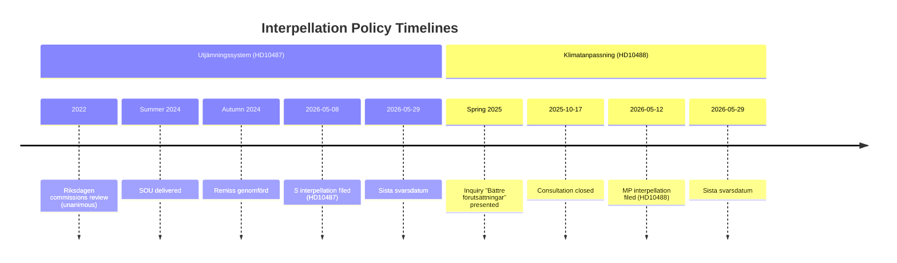
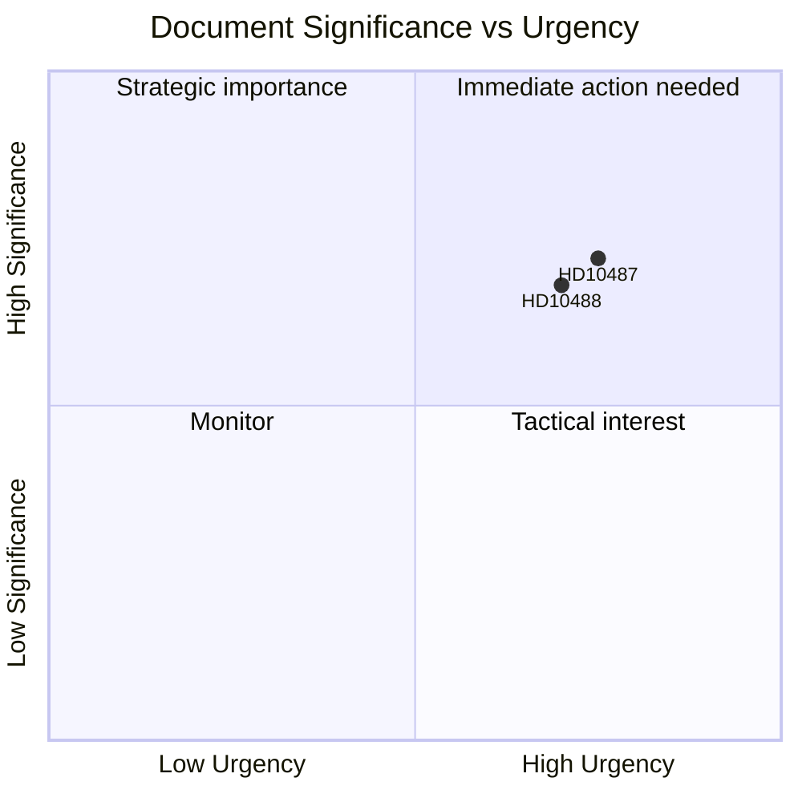

# Synthesis Summary — Interpellation Debates 2026-05-13

## Lead Story: Government Accountability Deficit on Welfare and Climate

Two interpellations forwarded to the Swedish government on May 13, 2026 converge on a single political narrative: the Tidö coalition's pattern of delaying action on well-documented policy gaps — the municipal welfare equalization system (utjämningssystem) and climate adaptation legislation — both exposed through formal parliamentary questioning as Riksdagen enters its pre-election phase.

### DIW-Weighted Document Ranking

| Rank | dok_id | DIW Weight | Significance |
|------|--------|------------|--------------|
| 1 | HD10487 | 0.72 | High — affects structural welfare distribution across 290 municipalities; 2026 election issue |
| 2 | HD10488 | 0.68 | High — climate adaptation gap with coastal risk; EU regulatory alignment pressure |

Both documents score in the high-significance tier due to: (D) direct democratic accountability function (interpellations formally require ministerial response); (I) systemic institutional dimension (both concern government delivery capacity on cross-cutting policy areas); (W) broad welfare-distributional or environmental consequences reaching millions of Swedish residents.

## Integrated Intelligence Picture

**Core Judgment**: The government's non-delivery on both the utjämningssystem reform and climate adaptation legislation is not bureaucratic delay but a choice — one that reflects competing priorities within the Tidö coalition (M/SD/KD/L/C), where fiscal consolidation has been prioritized over redistributive transfers and environmental investment. The political cost of this choice becomes higher as the September 2026 election approaches.

**HD10487 — Municipal Equalization**:
Eva Lindh's (S) interpellation to Civilminister Erik Slottner (KD) documents a specific failure: the SOU review was commissioned by cross-party consensus in 2022, completed summer 2024, consultation closed — yet no government bill. Her framing directly charges the government with abandoning rural and small municipalities: "Riktade stöd till gles- och landsbygd har tagits bort, statlig service har minskat och kommuner lämnas ensamma med växande kostnader." The municipal equalization system is Sweden's primary fiscal instrument for ensuring uniform access to welfare services regardless of municipality, and the current system, unchanged since 2005, increasingly fails to capture the cost pressures facing demographically declining municipalities. Evidence: 2022 unanimous Riksdagen resolution commissioning review; SOU delivered summer 2024; remiss genomförd. Government response pending since at least autumn 2025.

**HD10488 — Climate Adaptation Legislation**:
Katarina Luhr's (MP) interpellation to Johan Britz (L, acting climate minister) documents eleven proposed legislative changes submitted by the inquiry "Bättre förutsättningar för klimatanpassning" (presented spring 2025), including a state responsibility for coastal protection against rising sea levels. Consultation closed October 17, 2025 — seven months before this interpellation with no proposition. Luhr explicitly highlights the risk of permanent loss of protection capacity if action is further delayed: "om man väntar för länge, kan man behöva prioritera mellan de kustsamhällen och verksamheter man har möjlighet att skydda mot stigande havsnivåer."

**Cross-document pattern**: Both interpellations share the structure: inquiry commissioned → inquiry delivered → consultation completed → no government bill. This pattern reveals a specific phase of government failure — the translation from policy recommendation to legislative proposal — suggesting either coalition disagreement on substance, fiscal constraints, or prioritization choices that favor the government's M/SD majority's agenda over KD and L's policy portfolios.

## Key Strategic Insights

1. **Pre-election accountability intensification**: Both S and MP are deploying interpellations as documented accountability tools — creating a paper trail of government non-delivery that can be weaponized in the September 2026 campaign.
2. **Coalition fracture surface**: Both interpellations target M/KD/L/SD coalition ministers (Slottner/KD, Britz/L) rather than the dominant M-SD axis. This is a strategic targeting of smaller coalition partners with accountability for specific portfolios.
3. **Rural-urban cleavage**: HD10487 directly engages Sweden's persistent rural-urban welfare divide — a politically mobilizing issue in the 2026 election where S hopes to recover ground in non-metropolitan constituencies.
4. **Climate policy window closing**: HD10488 highlights the "closing window" risk: with a change of government possible in September 2026, the current government must act before the election or the inquiry is likely shelved or restarted.

