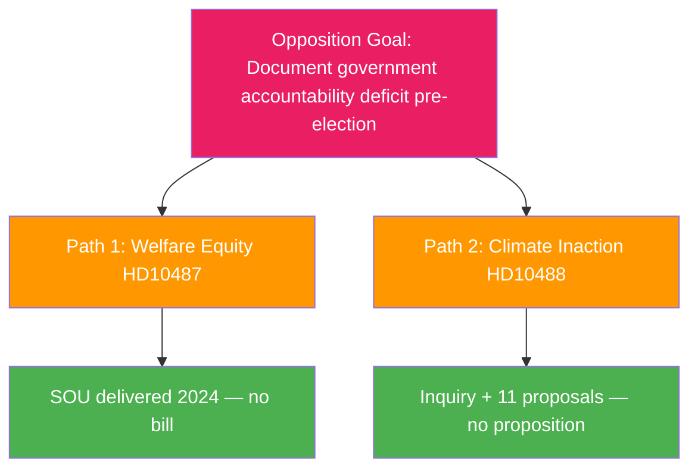

# Threat Analysis — 2026-05-13 Interpellations

## Political Threat Taxonomy

### Threat Class: Governance Accountability Attack

**Actor**: Social Democratic Party (S) and Miljöpartiet (MP) as opposition interpellators
**Target**: Tidö government coalition, specifically KD (Slottner) and L (Britz)
**Mechanism**: Parliamentary interpellation — formal accountability instrument
**Objective**: Create documented record of government non-delivery ahead of September 2026 election

### TTP Mapping (Parliamentary Accountability)

| TTP | Technique | Evidence |
|-----|-----------|----------|
| T-PA-01 | Exploit completed inquiry process | Both interpellations cite completed SOU/inquiry |
| T-PA-02 | Timeline documentation — pin accountability on current government | HD10487 cites 2022 unanimous Riksdagen resolution + 2024 SOU |
| T-PA-03 | Values failure framing | HD10487 moral framing: "postnummer snarare än behov" |
| T-PA-04 | Irreversibility claim — shift from delay to permanent damage | HD10488 coastal protection capacity framing |
| T-PA-05 | Dual-party coordination | S and MP filing same-day interpellations on different portfolios |

## Attack Tree Analysis

**Opposition Goal**: Document government accountability deficit pre-election.

**Path 1 — Welfare Equity (HD10487)**:
- 2022: Riksdagen unanimous commission (evidence confirmed)
- Summer 2024: SOU delivered (confirmed)
- Autumn 2024: Remiss completed (confirmed)
- 2026-05-13: No government bill (confirmed — documented as fact)

**Path 2 — Climate Inaction (HD10488)**:
- Spring 2025: Inquiry "Bättre förutsättningar" delivered (confirmed)
- Spring 2025: 11 legislative proposals submitted (confirmed)
- 2025-10-17: Consultation closed (confirmed)
- 2026-05-13: No proposition tabled (confirmed — 7 months after consultation)

## Operational Timeline

**Phase 1 — Reconnaissance**: Opposition researches government delivery record on completed inquiries.
**Phase 2 — Weaponization**: Opposition frames non-delivery as accountability deficit; files interpellations with documentary evidence.
**Phase 3 — Delivery**: HD10487 filed 2026-05-08; HD10488 filed 2026-05-12; both forwarded 2026-05-13.
**Phase 4 — Exploitation**: Ministerial answers required by 2026-05-29 — public record.
**Phase 5 — Persistence**: Written answers become permanent documentation for election campaign.

## Counter-Threat Analysis

The government faces limited effective countermeasures given the completeness of the opposition's documentary record:

- **Pre-emption**: Announce legislative intentions before svarsdatum — partial mitigation
- **Procedural deferral**: Promise "continued work" without timeline — confirms pattern
- **Substantive engagement**: Announce consultation on specifics — signals willingness
- **Reframing**: Argue complexity justifies caution — contradicts unanimous 2022 mandate

**Assessment**: Government faces a no-good-option matrix on HD10487. On HD10488, irreversibility framing is harder to counter without announcing actual protective measures.
