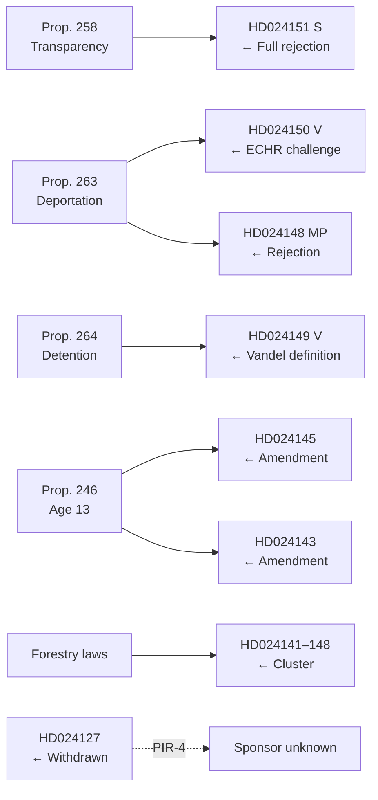

# Cross-Reference Map — Opposition Motions 2026-05-13

**Author**: James Pether Sörling  
**Date**: 2026-05-13  

---

## Policy Cluster Cross-References

### Cluster 1: Democratic Integrity / Party Financing (Prop. 258)

- **Primary motion**: HD024151 (S) — Full rejection, constitutional challenge
- **Related documents**: None in this batch (standalone S strategy)
- **Linked analysis files**:
  - `intelligence-assessment.md` — KJ-1 (highest significance)
  - `risk-assessment.md` — R-01 (constitutional veto)
  - `scenario-analysis.md` — Scenario B (opposition activation)
  - `historical-parallels.md` — Parallel 1 (1994 party finance law)
  - `coalition-mathematics.md` — Prop. 258 pivotal vote analysis
  - `election-2026-analysis.md` — Impact 1 (S narrative gain)
  - `devils-advocate.md` — H2 (good-faith transparency)
  - `media-framing-analysis.md` — Frame A (democratic integrity)

---

### Cluster 2: Migration / Deportation (Props. 263 + 264)

- **Primary motions**: HD024150 (V, ECHR/deportation), HD024149 (V, vandel), HD024148 (MP)
- **Linked analysis files**:
  - `intelligence-assessment.md` — KJ-3 (ECHR risk)
  - `implementation-feasibility.md` — Props. 263+264 (Migrationsverket/Kriminalvården bottleneck)
  - `historical-parallels.md` — Parallel 3 (Agiza/El-Zari 2006)
  - `comparative-international.md` — Nordic migration comparisons
  - `voter-segmentation.md` — Segment 6 (New Swedes)
  - `election-2026-analysis.md` — Impact 3 (SD consolidation)
  - `coalition-mathematics.md` — Props. 263+264 vote count

---

### Cluster 3: Criminal Age 13 (Prop. 246)

- **Primary motions**: HD024145 (amendment), HD024143 (amendment), HD024141 (related)
- **Linked analysis files**:
  - `intelligence-assessment.md` — KJ-2
  - `implementation-feasibility.md` — Prop. 246 (SiS/UNCRC bottleneck)
  - `historical-parallels.md` — Parallel 2 (1997–1999 juvenile justice reform)
  - `comparative-international.md` — Nordic age of criminal responsibility
  - `voter-segmentation.md` — Segments 2+4 (law-and-order vs. social care)
  - `coalition-mathematics.md` — Prop. 246 fragility (C/L dissent)
  - `election-2026-analysis.md` — Impact 2

---

### Cluster 4: Forestry Policy

- **Primary motions**: HD024141–HD024148 (cluster of ~8 motions)
- **Linked analysis files**:
  - `significance-scoring.md` — Forestry cluster (DIW 35–45, Tier 3)
  - `historical-parallels.md` — Parallel 5 (Skogsvårdslagen 2008–2014)
  - `voter-segmentation.md` — Segment 5 (rural/forestry)
  - `implementation-feasibility.md` — Forestry (4.0/5 — low risk)

---

### Cluster 5: Withdrawn Motion (HD024127)

- **Status**: Motionen utgår — strategic signal
- **Linked analysis files**:
  - `data-download-manifest.md` — Withdrawn motion record
  - `intelligence-assessment.md` — PIR-4 (identify sponsor)
  - `forward-indicators.md` — FI-04 (sponsor identification T+1 week)
  - `devils-advocate.md` — H3 (coalition-internal conflict signal)

---

## Legislative Chain Map

## Artifact Completeness Check (23 Required)

### Family A — Core Synthesis (9 required)
- [x] `data-download-manifest.md`
- [x] `executive-brief.md`
- [x] `synthesis-summary.md`
- [x] `intelligence-assessment.md`
- [x] `significance-scoring.md`
- [x] `classification-results.md`
- [x] `swot-analysis.md`
- [x] `risk-assessment.md`
- [x] `cross-reference-map.md` ← this file

### Family B — Structural Metadata (2 required)
- [x] `cross-reference-map.md` (dual-family — serves both A and B)
- [ ] `README.md`

### Family C — Strategic Extensions (5 required)
- [x] `threat-analysis.md`
- [x] `stakeholder-perspectives.md`
- [x] `scenario-analysis.md`
- [x] `comparative-international.md`
- [x] `devils-advocate.md`
- [ ] `methodology-reflection.md` ← outstanding

### Family D — Electoral & Domain Lenses (7 required)
- [x] `election-2026-analysis.md`
- [x] `voter-segmentation.md`
- [x] `coalition-mathematics.md`
- [x] `historical-parallels.md`
- [x] `media-framing-analysis.md`
- [x] `implementation-feasibility.md`
- [x] `forward-indicators.md`

### Family E — Per-Document Analysis
- [ ] `documents/HD024151-analysis.md`
- [ ] `documents/HD024150-analysis.md`
- [ ] `documents/HD024149-analysis.md`
