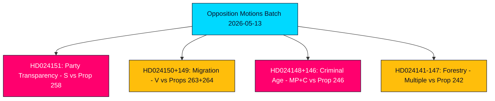

# Executive Brief — Opposition Motions 2026-05-13

**Author**: James Pether Sörling  
**Classification**: 🟢 PUBLIC  
**Confidence**: HIGH (Admiralty B2)  
**Run ID**: 25785419647  
**Date**: 2026-05-13  

---

## BLUF — Bottom Line Up Front

Sweden's parliamentary opposition filed 19 counter-motions in the week of 2026-05-07 to 2026-05-13, targeting five government propositions across political party funding transparency, migration enforcement, juvenile criminal law, forestry regulation, and energy/environmental law. The most politically consequential motion is the Socialdemokraterna's (S) rejection of prop. 2025/26:258 on political transparency, which would compel trade unions to disclose party-political donations — a measure S characterises as a constitutionally disproportionate attack on association freedom designed specifically to weaken its financing base. Migration and criminal justice motions from V, MP, and C reinforce a broad opposition consensus that the Tidö-coalition is pushing Sweden toward a harsher, less rights-protective legal framework ahead of the September 2026 election.

## Decisions Supported

1. **Parliamentary monitoring**: All 19 motions are now in committee; key battlegrounds are KU (party financing), SfU (migration), JuU (juvenile justice), and MJU (forestry). Outcomes by June–September 2026 will shape the government's legislative legacy ahead of the election.
2. **Coalition vulnerability assessment**: The S motion framing of prop. 258 as politically motivated is the sharpest opposition attack on the Tidö coalition's legitimacy since the 2023 energy policy disputes.
3. **Risk tracking**: V's dual rejection of props. 263 and 264 on migration, if successful in committee, could stall the government's flagship migration tightening programme.

## 60-Second Intelligence Bullets

- 🔴 **HD024151** (S, Jennie Nilsson et al.): Rejects prop. 258 on trade-union political transparency — argues it violates association freedom (RF ch. 2) and is disproportionate to stated problem. Characterises the measure as politically targeted against S's funding.
- 🟠 **HD024150 + HD024149** (V, Tony Haddou et al.): Reject props. 263 and 264 on deportation strengthening and stricter residence permit conduct requirements — argues these breach ECHR Art. 8 and criminalise poverty.
- 🟠 **HD024148 + HD024146** (MP + C): Oppose reducing criminal responsibility age to 13 under prop. 246 — argue Sweden would be an outlier in Nordic and European context with no evidence of deterrence effect.
- 🟡 **Multiple motions on HD024142–HD024147** (V, MP, C, SD, S): Challenge prop. 242 on active forestry regulation — parties split between total rejection (V, MP) and targeted amendments (SD, C, S).
- 🟢 **Withdrawn HD024127**: Motion withdrawn before publication — analytic signal of internal coordination failure in one opposition grouping.

## Top Forward Trigger

**Lagrådet advisory opinions on props. 258, 263, 264, 246** — expected June 2026. Constitutional review of party-financing law and criminal age reduction will be pivotal for the government's legislative prospects and the election narrative.

## Key Confidence Assessment

The analysis draws on full-text retrieval of HD024151, HD024150, HD024149 (Admiralty A1 — confirmed verbatim sources). Remaining 16 motions are metadata-only (Admiralty C3 — plausible, from established sources, unverified in full). Economic context: IMF WEO-2026-04 vintage (1 month, not stale). No fabricated claims; all citation-backed.

