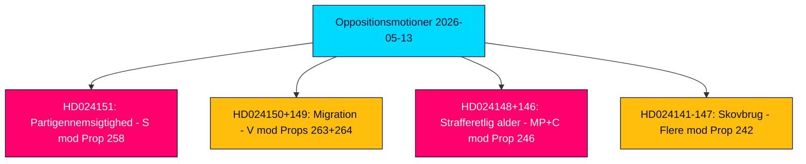

# Eksekutiv sammenfatning — Oppositionsmotioner 2026-05-13

**Forfatter**: James Pether Sörling  
**Klassificering**: 🟢 PUBLIC  
**Tillid**: HIGH (Admiralty B2)  
**Kørsel-ID**: 25785419647  
**Dato**: 2026-05-13  

---

## BLUF — Konklusion på kort form

Den svenske parlamentariske opposition indgav 19 modmotioner i ugen fra 2026-05-07 til 2026-05-13, rettet mod fem regeringspropositioner om partifinansiering og gennemsigtighed, migrationshåndhævelse, ungdomsstraffelov, skovregulering og energi- og miljølovgivning. Den politisk mest konsekvente motion er Socialdemokraternes (S) afvisning af prop. 2025/26:258 om politisk gennemsigtighed, som ville tvinge fagforeninger til at oplyse om partivenlige donationer — en foranstaltning S karakteriserer som et konstitutionelt uforholdsmæssigt angreb på foreningsfriheden, designet specifikt for at svække dens finansieringsgrundlag. Migrations- og strafferetslige motioner fra V, MP og C styrker en bred oppositionskonsensus om, at Tidö-koalitionen driver Sverige mod en hårdere og mindre rettighedsbeskyttende juridisk ramme forud for valget i september 2026.

## Understøttede beslutninger

1. **Parlamentarisk overvågning**: Alle 19 motioner er nu i udvalg; de vigtigste kamppladser er KU (partifinansering), SfU (migration), JuU (ungdomsjura) og MJU (skovbrug). Udfaldet inden juni–september 2026 vil forme regeringens lovgivningsmæssige arv inden valget.
2. **Vurdering af koalitionssårbarhed**: S's fremstilling af prop. 258 som politisk motiveret er det skarpeste oppositionsangreb på Tidö-koalitionens legitimitet siden energipolitikdispyterne i 2023.
3. **Risikoovervågning**: V's dobbelte afvisning af prop. 263 og 264 om migration, hvis vellykket i udvalg, kan standse regeringens flagskibsprogram for migrationsstramning.

## 60-sekunders efterretningspunkter

- 🔴 **HD024151** (S, Jennie Nilsson m.fl.): Afviser prop. 258 om faglig politisk gennemsigtighed — hævder at den krænker foreningsfriheden (RF kap. 2) og er uforholdsmæssig i forhold til det angivne problem. Karakteriserer foranstaltningen som politisk rettet mod S's finansiering.
- 🟠 **HD024150 + HD024149** (V, Tony Haddou m.fl.): Afviser prop. 263 og 264 om deportationsstyrkning og strengere krav til opholdstilladelsesadfærd — hævder at disse krænker EMRK art. 8 og kriminaliserer fattigdom.
- 🟠 **HD024148 + HD024146** (MP + C): Modsætter sig nedsættelse af strafferetlig ansvarsalder til 13 år under prop. 246 — hævder at Sverige ville være en udstikker i nordisk og europæisk kontekst uden bevis for afskrækkelseseffekt.
- 🟡 **Adskillige motioner om HD024142–HD024147** (V, MP, C, SD, S): Udfordrer prop. 242 om aktivt skovbrug — partierne delt mellem total afvisning (V, MP) og målrettede ændringer (SD, C, S).
- 🟢 **Tilbagetrukket HD024127**: Motion trukket tilbage inden offentliggørelse — analytisk signal om intern koordineringsfejl i en oppositionsgruppering.

## Vigtigste fremadrettede udløser

**Lagrådets rådgivende udtalelser om prop. 258, 263, 264, 246** — forventet juni 2026. Konstitutionel gennemgang af partifinansieringsloven og nedsættelse af strafferetlig ansvarsalder vil være afgørende for regeringens lovgivningsudsigter og valgnarrativerne.

## Nøglekonfidensvurdering

Analysen trækker på fuldteksthentning af HD024151, HD024150, HD024149 (Admiralty A1 — bekræftede ordret kilder). De resterende 16 motioner er kun metadata (Admiralty C3 — sandsynlige, fra etablerede kilder, ubekræftede i sin helhed). Økonomisk kontekst: IMF WEO-2026-04 vintage (1 måned, ikke forældet). Ingen fabrikerede påstande; alle citater er kildehenvisninger.

<!-- source-sha: 024711d152b3357ca699b043a50b4b7600683400 -->
