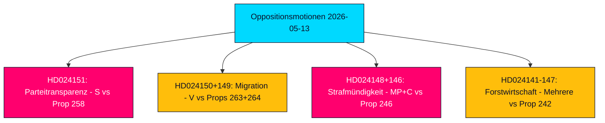

# Exekutivzusammenfassung — Oppositionsmotionen 2026-05-13

**Autor**: James Pether Sörling  
**Klassifizierung**: 🟢 PUBLIC  
**Konfidenz**: HIGH (Admiralty B2)  
**Lauf-ID**: 25785419647  
**Datum**: 2026-05-13  

---

## BLUF — Schlussfolgerung in Kürze

Die schwedische parlamentarische Opposition reichte in der Woche vom 2026-05-07 bis 2026-05-13 19 Gegenmotionen ein, die sich gegen fünf Regierungspropositioner zu Parteifinanzierungstransparenz, Migrationsverfahren, Jugendstrafrecht, Forstwirtschaftsregulierung und Energie- und Umweltrecht richteten. Die politisch folgenreichste Motion ist die Ablehnung der prop. 2025/26:258 zur politischen Transparenz durch die Sozialdemokraten (S), die Gewerkschaften zur Offenlegung parteipolitischer Spenden zwingen würde — eine Maßnahme, die S als einen verfassungsmäßig unverhältnismäßigen Angriff auf die Vereinigungsfreiheit charakterisiert, der spezifisch darauf abzielt, ihre Finanzierungsbasis zu schwächen. Migrations- und strafrechtliche Motionen von V, MP und C stärken einen breiten Oppositionskonsens, dass die Tidö-Koalition Schweden vor der Wahl im September 2026 auf einen härteren und weniger rechtsschützenden Rechtsrahmen zusteuert.

## Unterstützte Entscheidungen

1. **Parlamentarische Beobachtung**: Alle 19 Motionen sind nun in Ausschüssen; die wichtigsten Schlachtfelder sind KU (Parteienfinanzierung), SfU (Migration), JuU (Jugendrecht) und MJU (Forstwirtschaft). Die Ergebnisse bis Juni–September 2026 werden das Legislativerbe der Regierung vor der Wahl prägen.
2. **Koalitionsverwundbarkeitseinschätzung**: S's Charakterisierung von Prop. 258 als politisch motiviert ist der schärfste Oppositionsangriff auf die Legitimität der Tidö-Koalition seit den Energiepolitik-Streitigkeiten von 2023.
3. **Risikobewertung**: V's doppelte Ablehnung von Prop. 263 und 264 zu Migration könnte, wenn im Ausschuss erfolgreich, das Flaggschiff-Migrationsverschärfungsprogramm der Regierung zum Stoppen bringen.

## 60-Sekunden-Geheimdienstpunkte

- 🔴 **HD024151** (S, Jennie Nilsson et al.): Lehnt Prop. 258 zur gewerkschaftlichen politischen Transparenz ab — argumentiert, sie verstoße gegen die Vereinigungsfreiheit (RF Kap. 2) und sei unverhältnismäßig zum angegebenen Problem. Charakterisiert die Maßnahme als politisch auf S's Finanzierung abgezielt.
- 🟠 **HD024150 + HD024149** (V, Tony Haddou et al.): Lehnt Prop. 263 und 264 zur Deportationsverschärfung und strengeren Aufenthaltserlaubnisanforderungen ab — argumentiert, diese verletzten EMRK Art. 8 und kriminalisierten Armut.
- 🟠 **HD024148 + HD024146** (MP + C): Lehnt Absenkung des Strafmündigkeitsalters auf 13 Jahre unter Prop. 246 ab — argumentiert, Schweden wäre ein Außenseiter im nordischen und europäischen Kontext ohne Belege für Abschreckungseffekt.
- 🟡 **Mehrere Motionen zu HD024142–HD024147** (V, MP, C, SD, S): Fechten Prop. 242 zur aktiven Forstwirtschaft an — Parteien zwischen vollständiger Ablehnung (V, MP) und gezielten Änderungen (SD, C, S) gespalten.
- 🟢 **Zurückgezogene HD024127**: Motion vor Veröffentlichung zurückgezogen — analytisches Signal interner Koordinierungsfehler in einer Oppositionsgruppierung.

## Wichtigster Vorwärts-Auslöser

**Rategebende Stellungnahmen des Lagrådet zu Props. 258, 263, 264, 246** — erwartet Juni 2026. Die verfassungsmäßige Überprüfung des Parteienfinanzierungsgesetzes und der Absenkung des Strafmündigkeitsalters werden für die Gesetzgebungsaussichten der Regierung und die Wahlnarrative entscheidend sein.

## Wichtigste Konfidenzbewertung

Die Analyse basiert auf der vollständigen Textabrufung von HD024151, HD024150, HD024149 (Admiralty A1 — bestätigte wortgetreue Quellen). Die verbleibenden 16 Motionen sind nur Metadaten (Admiralty C3 — wahrscheinlich, aus etablierten Quellen, im Ganzen ungeprüft). Wirtschaftlicher Kontext: IMF WEO-2026-04 Vintage (1 Monat, nicht veraltet). Keine fabrizierten Behauptungen; alle zitatgestützt.

<!-- source-sha: 024711d152b3357ca699b043a50b4b7600683400 -->
